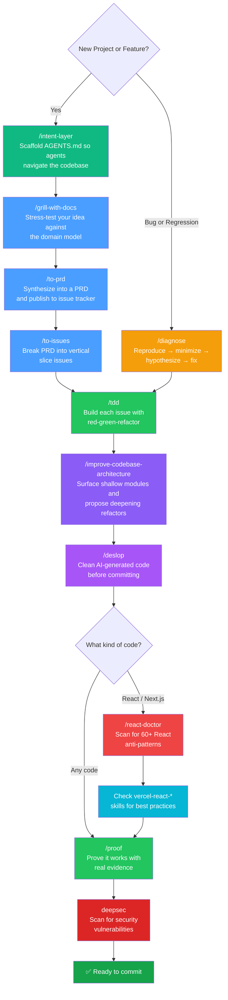

# My AI Global Skills

A collection of reusable AI agent skills for Claude Code. Drop them into any project's `.agents/skills/` directory to supercharge your workflow.

## Recommended Workflow



### Step-by-Step Guide

#### 🏗️ New Projects / New Features

| Step | Skill | What it does |
|------|-------|--------------|
| 1 | `/intent-layer` | Scaffold AGENTS.md hierarchy so agents navigate the codebase like senior engineers. Detects existing state, measures token counts, and generates context nodes for complex subsystems |
| 2 | `/grill-with-docs` | Interview you about every aspect of the plan. Challenges assumptions against the existing domain model, sharpens terminology, and captures decisions in brainstorm logs + CONTEXT.md |
| 3 | `/to-prd` | Synthesizes the conversation into a full PRD (problem, solution, user stories, test seams) and publishes it to your issue tracker |
| 4 | `/to-issues` | Breaks the PRD into independently-grabbable vertical slice issues — thin end-to-end tracer bullets, not horizontal layers |
| 5 | `/tdd` | Build each issue using red-green-refactor. One test → one implementation → repeat. No writing all tests first |
| 6 | `/improve-codebase-architecture` | Surface shallow modules and propose deepening refactors. Generates an HTML report with before/after diagrams, then explores alternative interfaces via parallel sub-agents |
| 7 | `/deslop` | Before committing: strip unnecessary comments, defensive checks, `any` casts, and other AI-generated slop |
| 8 | `/proof` | Prove the feature works with real observed evidence (screenshots, test output) — not just "it should work" |
| 9 | `deepsec` | Run a security scan to catch vulnerabilities before shipping (`npm exec -- deepsec scan && npm exec -- deepsec process`) |

#### 🐛 Debugging

| Step | Skill | What it does |
|------|-------|--------------|
| 1 | `/diagnose` | Disciplined diagnosis loop: build a feedback loop → reproduce → minimize → hypothesize → instrument → fix → regression-test |
| 2 | `/tdd` | Write a regression test that captures the bug, then fix it |
| 3 | `/deslop` | Clean up before committing |

#### ✅ Pre-Commit Checklist

| Step | Skill | When to use |
|------|-------|-------------|
| 1 | `/deslop` | Always — removes AI code slop from the diff |
| 2 | `/react-doctor` | React projects — scan for 60+ anti-patterns, get a 0-100 health score |
| 3 | `/proof` | Always — prove the change works with real evidence |
| 4 | `/fallow` | JS/TS projects — check for unused code, circular deps, complexity hotspots |
| 5 | `deepsec` | Always — scan for security vulnerabilities before shipping. Requires [per-project setup](#deepsec--setup--usage) |

---

## Skills

### Code Quality & Testing

| Skill | Description |
|-------|-------------|
| **deslop** | Remove AI-generated code slop and clean up code style |
| **diagnose** | Disciplined diagnosis loop for hard bugs and performance regressions |
| **fallow** | JS/TS codebase intelligence — unused code, duplicates, circular deps, complexity hotspots, architecture violations, and more |
| **impeccable** | Design, redesign, critique, audit, polish, and optimize frontend interfaces |
| **performance-audit** | Profile code, identify bottlenecks, tune databases, run load tests, deliver before/after metrics |
| **proof-with-playwright** *(optional)* | Prove features work by driving the real app in a browser via Playwright and capturing screenshots |
| **proof-with-electron** *(optional)* | Prove features work by driving Electron apps via Debug Electron MCP |
| **proof-with-mobile** *(optional)* | Prove features work on mobile via iOS simulators, Android emulators, or real devices |
| **tdd** | Test-driven development with red-green-refactor loop and tracer bullets |
| **zoom-out** | Get broader context or a higher-level perspective on unfamiliar code |

### Architecture & Planning

| Skill | Description |
|-------|-------------|
| **grill-with-docs** | Challenge your plan against the existing domain model and sharpen terminology |
| **improve-codebase-architecture** | Surface shallow modules and propose deepening refactors — generates an interactive HTML report with before/after diagrams, then explores alternative interfaces via parallel sub-agents ("Design It Twice") |
| **intent-layer** | Scaffold hierarchical AGENTS.md context files so AI agents navigate codebases like senior engineers — detects state, measures token counts, and generates nodes for complex subsystems (>20k tokens) |
| **skill-creator** | Create new skills, run evals, benchmark performance, and optimize skill descriptions |
| **to-issues** | Break a plan or PRD into independently-grabbable issues using vertical slices |
| **to-prd** | Turn conversation context into a PRD and publish to the issue tracker |
| **triage** | Triage issues through a state machine with triage roles |
| **ubiquitous-language** | Extract a DDD-style glossary from conversation, flag ambiguities, propose canonical terms |
| **setup-skills** | Set up Agent skills block in AGENTS.md/CLAUDE.md for repo-aware skills |

### Frontend & Design

| Skill | Description |
|-------|-------------|
| **frontend-design** | Create distinctive, production-grade frontend interfaces |
| **shadcn** *(optional)* | Manage shadcn/ui components — add, search, compose, style, and debug with project-aware context. Only needed for projects using [shadcn/ui](https://ui.shadcn.com/) |
| **ui-ux-pro-max** | UI/UX design intelligence — 50+ styles, 161 palettes, 57 font pairings, and more |
| **prototype** | Build throwaway prototypes to flesh out a design before committing |
| **web-design-guidelines** | Review UI code for Web Interface Guidelines compliance |

### React & Next.js (Vercel)

| Skill | Description |
|-------|-------------|
| **react-doctor** *(optional)* | Scan React codebases for 60+ anti-patterns, get a 0-100 health score, and teach your agent 47+ React best practices. Only needed for React projects |
| **vercel-react-best-practices** | 70 performance optimization rules across 8 categories from Vercel Engineering |
| **vercel-composition-patterns** | React composition patterns that scale, including React 19 API changes |
| **vercel-react-view-transitions** | Smooth animations using React's View Transition API |
| **vercel-react-native-skills** | React Native and Expo best practices for performant mobile apps |

### Browser & Automation

| Skill | Description |
|-------|-------------|
| **agent-browser** | Browser automation CLI for navigating pages, filling forms, extracting data |
| **playwright-cli** *(optional)* | Automate browser interactions and work with Playwright tests — requires [Playwright](https://playwright.dev/) to be installed in your project |

## Installation

Copy (or symlink) the skills you want into your project:

```bash
# Copy all skills
cp -r .agents/skills/* /path/to/your/project/.agents/skills/

# Or pick individual ones
cp -r .agents/skills/tdd /path/to/your/project/.agents/skills/
cp -r .agents/skills/diagnose /path/to/your/project/.agents/skills/
```

### Optional Dependencies

Some skills work out of the box, while others have external dependencies:

- **playwright-cli** and **proof-with-playwright** — Require [Playwright](https://playwright.dev/) installed in your project (`npm install -D playwright` or `npx playwright install`)
- **proof-with-electron** — Requires the [Debug Electron MCP](https://github.com/nichochar/debug-electron-mcp) server
- **proof-with-mobile** — Requires the [Mobile MCP](https://github.com/mobile-next/mobile-mcp) server
- **react-doctor** — Only relevant for React projects. Uses Rust-based [Oxlint](https://oxc.rs/) under the hood
- **shadcn** — Only relevant for projects using [shadcn/ui](https://ui.shadcn.com/). Requires a `components.json` in your project root

## React Doctor — Setup & Usage

[React Doctor](https://github.com/millionco/react-doctor) scans React codebases for 60+ anti-patterns using Rust-based Oxlint and produces a 0-100 health score.

### Install the CLI

```bash
npm install -g react-doctor
```

### Run a scan

```bash
# In your React project root
react-doctor scan

# Or target a specific directory
react-doctor scan ./src
```

This outputs a health score and a list of issues grouped by category (state & effects, performance, architecture, security, accessibility).

### Install the agent skill

The skill is already included in this collection. Copy it to your project:

```bash
cp -r .agents/skills/react-doctor /path/to/your/project/.agents/skills/
```

Once installed, your AI agent learns 47+ React best practices and will catch anti-patterns proactively while writing code. Use `/react-doctor` in Claude Code to trigger a scan.

### GitHub Actions

React Doctor also ships as a [GitHub Action](https://github.com/marketplace/actions/react-doctor) that reports only the issues your PR introduced — it diffs against the merge base so pre-existing findings stay quiet.

## Deepsec — Setup & Usage

[Deepsec](https://github.com/vercel-labs/deepsec) is an agent-powered vulnerability scanner from Vercel Labs. It uses AI coding agents at maximum thinking levels to find hard-to-detect security issues in large codebases.

### Install per-project

```bash
# Initialize in your project
npx deepsec init

# Install dependencies
cd .deepsec
npm install
```

Deepsec creates a `.deepsec/` directory with project-specific configuration. After init, prompt your coding agent to read `.deepsec/node_modules/deepsec/SKILL.md` and bootstrap context.

### Run a security scan

```bash
cd .deepsec

# Step 1: Fast regex scan to find candidate sites (no AI)
npm exec -- deepsec scan

# Step 2: AI investigates candidates and emits findings
npm exec -- deepsec process

# Step 3: Optional — reduce false positives
npm exec -- deepsec revalidate

# Step 4: Export findings
npm exec -- deepsec export --format md-dir --out ./findings
```

### Why it's not a skill in this collection

Deepsec has its own init/scan/process pipeline and creates per-project config (`.deepsec/`). It's designed to be installed directly in each project rather than copied as a standalone skill. Think of it as a project-level tool like ESLint, not a portable agent skill.

### AI Provider

Deepsec can use your local Claude/Codex subscription or the Vercel AI Gateway (`AI_GATEWAY_API_KEY`) for distributed execution across Vercel Sandbox microVMs.

## License

MIT
