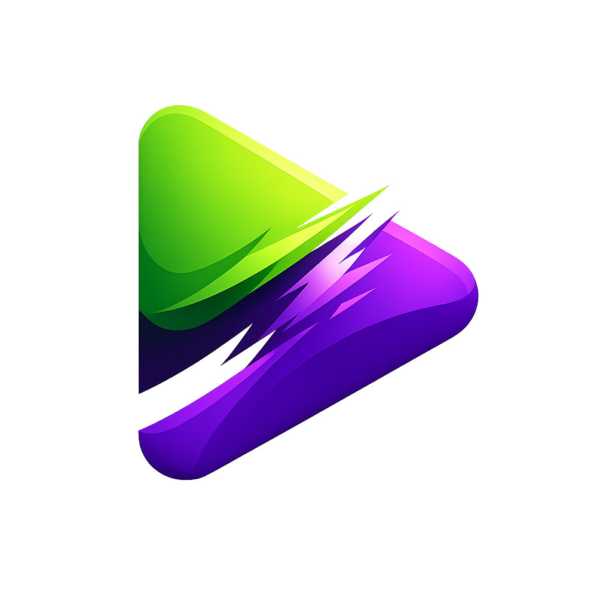

<p align="center">
  
</p>

<h1 align="center">StreamFusion</h1>

<p align="center">
  Twitch and Kick in one lightweight desktop app.
</p>

<p align="center">
  <a href="https://opensource.org/licenses/MIT"></a>
  <a href="https://github.com/TheDarkSkyXD/StreamFusion/releases"></a>
  
</p>

**StreamFusion** is a unified, cross-platform desktop application for watching **Twitch** and **Kick** in a single interface. It replaces the multi-tab browser workflow with a purpose-built Electron app: play streams, surface chat, and keep followed content organized across platforms.

## Features

- **Twitch + Kick in one place** — Browse and watch both platforms without switching sites or juggling browser tabs.
- **Unified dashboard** — Discover live content and move between streamers quickly from a single home.
- **Chat for both platforms** — Interact with Twitch and Kick chat inside the app.
- **Follows & quick access** — Keep followed streamers reachable without bouncing between websites.
- **Multistream layouts** — Watch more than one stream at a time with layouts built for power viewers.
- **Enhanced player** — HLS playback aimed at low latency and reliable quality, with auto-retry when a stream drops.
- **Cleaner Twitch viewing** — Built-in ad-blocking for Twitch streams.
- **Keyboard-friendly** — Shortcuts for fast switching and control without reaching for the mouse.
- **Desktop-first performance** — Lower resource use than a pile of browser tabs; builds for Windows, macOS (Intel & Apple Silicon), and Linux (AppImage).
- **Mobile workspace** — Android development client under `apps/mobile` for the same product direction on phone.

## Tech Stack

StreamFusion uses one root npm workspace and lockfile:

- **Core Framework**: [Electron](https://www.electronjs.org/) & [React](https://reactjs.org/)
- **Build Tooling**: [Vite](https://vitejs.dev/) & [Electron-Vite](https://electron-vite.org/)
- **Language**: [TypeScript](https://www.typescriptlang.org/)
- **Styling**: [Tailwind CSS](https://tailwindcss.com/)
- **State Management**: [Zustand](https://github.com/pmndrs/zustand)
- **Data Fetching**: [TanStack Query](https://tanstack.com/query/latest)
- **Routing**: [TanStack Router](https://tanstack.com/router/latest)
- **Database**: [Better-SQLite3](https://github.com/WiseLibs/better-sqlite3) (local persistence)
- **APIs**: Twitch (`tmi.js`), Kick (Pusher-js), and typed Electron IPC through the preload bridge

## Project Structure

```bash
StreamFusion/
├── apps/
│   ├── desktop/
│   ├── mobile/
│   ├── worker/
│   └── integration-relay/
├── packages/
│   └── core/
├── package-lock.json
└── package.json
```

## Getting Started

### Prerequisites

- **Node.js** (v22 or later)
- **npm 11.19.0**
- **Git**

### Installation

1. **Clone the repository**:
   ```bash
   git clone https://github.com/TheDarkSkyXD/StreamFusion.git
   cd StreamFusion
   ```

2. **Install dependencies**:
   ```bash
   npm install --global npm@11.19.0
   npm run install:dependencies
   ```

   The install command uses the root workspace lockfile. It installs with lifecycle scripts
   disabled, checks the seven-day release-age policy and registry signatures, then runs
   only the version-pinned scripts in `allowScripts`. Use `npm install <package>` for the
   root. Use `npm install --workspace streamfusion <package>` for the desktop app,
   `npm install --workspace @streamfusion/mobile <package>` for the Android app, and
   `npm install --workspace streamfusion-worker <package>` for the Worker. Mobile
   dependencies and tooling belong to `apps/mobile`. Shared-core tooling belongs to
   the `@streamfusion/core` workspace under `packages/core`.
   See the [npm security research](docs/brainstorms/2026-08-29-npm-supply-chain-security-research.md)
   for the policy and its limits.

### Running Locally

To choose Electron, Browser, Mobile, or an E2E Preview session:

```bash
npm start
```

Run `npm run desktop` to start Electron without the picker. Run `npm run mobile` to
build, install, and start the Android development client on a connected device or
emulator. Mobile source, Expo configuration, generated Android files, tests, assets,
and dependency declarations stay under `apps/mobile`.

Choose `4) E2E Preview` to build and run the compiled Electron artifact in an isolated
verification session. It is opt-in. Normal development proof remains the default. See
[the Electron E2E guide](apps/desktop/tests/e2e/README.md) for controller commands and
evidence rules.

## Contributing

Contributions are welcome. Check the [issues](https://github.com/TheDarkSkyXD/StreamFusion/issues) page if you want to help.

1. Fork the repository.
2. Create your feature branch (`git checkout -b feature/AmazingFeature`).
3. Commit your changes (`git commit -m 'Add some AmazingFeature'`).
4. Push to the branch (`git push origin feature/AmazingFeature`).
5. Open a Pull Request.

### Linting & Formatting

The desktop app uses **ESLint** for linting and **Prettier** for formatting.

- Check for errors: `npm run lint`
- Auto-fix errors: `npm --prefix apps/desktop run lint:fix`
- Format code: `npm --prefix apps/desktop run format`
- Check formatting: `npm --prefix apps/desktop run format:check`

## License

Distributed under the License. See `LICENSE` for more information.

## Contact

Project Link: [https://github.com/TheDarkSkyXD/StreamFusion](https://github.com/TheDarkSkyXD/StreamFusion)
