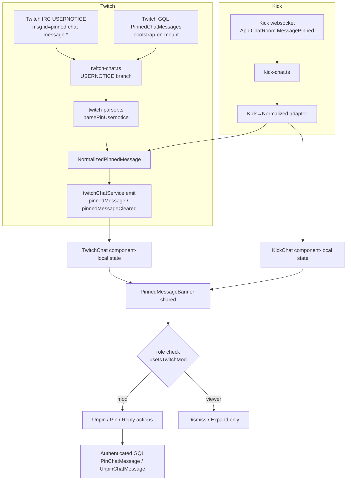

# feat: Add Twitch pinned messages, unify with Kick, support multistream

## Summary

Ship a Twitch pinned-message feature that mirrors Twitch.tv's native viewer card and adds a full moderator surface (pin / duration / unpin / reply) for signed-in mods and the broadcaster. One shared `PinnedMessageBanner` component replaces today's Kick-only banner and serves both platforms, so the app feels visually consistent across sides. Pin-receive lands on Twitch's IRC `USERNOTICE` stream by branching on `msg-id=pinned-chat-message-{created,updated,deleted}`; bootstrap-on-mount and pin/unpin mutations go through Twitch's undocumented GraphQL operations, following the hash-rotation guards established in `docs/solutions/integration-issues/twitch-gql-search-pagination-skeleton-flicker-loop-2026-05-17.md`. Mod-role detection is wholly new: a Helix `GET /moderation/channels` wrapper feeds a Zustand-backed `useModeratedChannelsStore` consulted by a `useIsTwitchMod(channelId)` hook. Two OAuth scopes (`user:read:moderated_channels`, `moderator:manage:chat_messages`) are added; existing connected users see a lazy "Reconnect for mod features" dialog the first time they try a mod action — not on launch. Multistream "per-slot isolation" already follows for free because `ChatPanel` mounts only one chat at a time keyed off `chatStreamId`; the brainstorm's R8/R17/R22 reduce to "remount cleanly on slot switch."

---

## Problem Frame

Twitch streamers and mods pin messages constantly — links, brackets, charity totals, schedule notes — and the surface is invisible in StreamForge today. Kick pinned messages already work but render as an edge-to-edge `border-b` strip with "Sent by X" labeling that diverges from Twitch's prominent inset "Pinned by X" card. Building the Twitch side is the right moment to unify on one shared banner rather than ship a second divergent one. The work cuts across IRC parsing, GraphQL, OAuth scope expansion, a new mod-role cache, a shared chat component, the dev simulator, and multistream verification. None of the open questions from the origin doc were product blockers; they are all technical (data source, OAuth scope, mod-channels cache existence) and are resolved below.

---

## Requirements Traceability

This plan covers every requirement in the origin document (R1–R22, AE1–AE9). Mapping:

| Requirement | Implementation Unit(s) |
|---|---|
| R1 shared banner visual | U2 |
| R2 normalized prop interface | U1, U2 |
| R3 ~280px narrow-width layout | U2, U12 |
| R4 Twitch viewer display | U5 |
| R5 bootstrap-on-mount | U5 |
| R6 honor lifecycle events | U4, U5 |
| R7 role-aware close button | U2, U9 |
| R8 per-slot dismiss state | U2, U5 |
| R9 pin from context menu | U8 |
| R10 duration picker (1h/12h/24h/no-expiry) | U8 |
| R11 reply action | U10 |
| R12 mod controls only on modded slots | U6, U8 |
| R13 single active pin, replace-in-place | U2, U4 |
| R14 no countdown UI | U2 |
| R15 Kick retrofit to shared banner | U3 |
| R16 preserve Kick behaviors | U3 |
| R17 per-slot pin display | covered by single-chat-per-`ChatPanel` invariant (see Key Technical Decisions) |
| R18 Playwright narrow-width verification | U12 |
| R19 mod controls hidden when not modded | U6, U8 |
| R20 mod-channels cache | U6 |
| R21 dev sim Twitch buttons | U11 |
| R22 sim slot-scoping | covered by single-chat-per-`ChatPanel` invariant (see Key Technical Decisions) |

Acceptance examples AE1–AE9 are honored by the test scenarios on the units they map to and are cited per-unit below.

---

## Key Technical Decisions

**D1. Pin-receive transport: Twitch IRC `USERNOTICE` with `msg-id` branching.** Twitch publishes pin lifecycle events as `USERNOTICE` lines with `msg-id` values `pinned-chat-message-created`, `pinned-chat-message-updated`, and `pinned-chat-message-deleted`. The existing `twitch-chat.ts` already maintains an authenticated tmi.js connection; we add a `client.on("raw_message", ...)` listener (or extend the existing `client.on("message", ...)` path if tmi.js fires usernotice for unknown subtypes) that parses these tags and emits normalized `pinnedMessage` / `pinnedMessageCleared` events. No PubSub, no polling. Verified during U4 with a live IRC capture.

**D2. Bootstrap-on-mount and pin/unpin mutations: Twitch undocumented GraphQL.** Mirrors what twitch.tv's own client does. Hashes can rotate (see `docs/solutions/integration-issues/twitch-gql-search-pagination-skeleton-flicker-loop-2026-05-17.md`) so each call carries (a) the captured persisted-query hash, (b) a raw-GQL fallback when persisted returns `PersistedQueryNotFound`, and (c) an `INTEGRITY`-error classifier matching the existing search code. Operations: `PinnedChatMessages` (bootstrap query), `PinChatMessage` (mutation), `UnpinChatMessage` (mutation). Actual hashes are captured from twitch.tv's network panel during U5/U8/U9 implementation — not pre-baked into the plan.

**D3. Pin/unpin auth path.** GQL mutations require a Bearer token. The existing `twitch-gql-client.ts` is anonymous-only (hardcoded Android-app Client-Id, no `Authorization` header). U7 introduces a small authenticated GQL helper (not a full client retrofit) used only for the three pin-related operations.

**D4. OAuth scope additions: `user:read:moderated_channels`, `moderator:manage:chat_messages`.** `channel:moderate` is NOT added because we use GQL mutations, not IRC `/pin`. `force_verify=true` is already set on the Twitch auth URL, so re-consent UX is a small delta on existing flow.

**D5. Re-consent flow is lazy.** When the user attempts a mod action without the required scopes, surface a focused "Reconnect for mod features" dialog with a Reconnect button. Non-mod users never see it.

**D6. Mod-channels cache shape.** New Zustand store `useModeratedChannelsStore` with `twitchModeratedChannelIds: Set<string>` and a `hydratedAt: number | null`. Hydrated post-login by `GET /moderation/channels?user_id={selfUserId}` (paginated, up to 100 per page; cursor handled). Re-hydrated when stale beyond 5 minutes on next mod-role check. Keyed by Twitch channel id (not slug) because Helix returns numeric ids. Twitch identity quirks (display-name casing, login changes) don't apply to numeric channel ids; the Kick `channelsMatch` pattern is not required here.

**D7. Sim slot-scoping is moot.** Per the repo research, `ChatPanel` mounts only one `KickChat`/`TwitchChat` at a time driven by `useMultiStreamStore.chatStreamId`. Module-singleton `*ChatService.emit("pinnedMessage", ...)` broadcasts but reaches exactly one subscriber in practice. R22's slot-scoping reduces to "no special handling needed today" — documented in U11 with a one-line note for the next person who touches it.

**D8. Default pin duration: 1 hour.** Matches Twitch's native UI default. Not load-bearing — easy to change later if usage data suggests otherwise.

**D9. Pin state lives in component-local React state, not the chat store.** Mirrors today's Kick pattern (`KickChat.tsx:65-69`). Component remount on `chatStreamId` flip is what gives R8/R17 per-slot isolation. No new store entry for pin state.

**D10. `ChatServiceEvents.pinnedMessage` typing flips from `KickPinnedMessage` to `NormalizedPinnedMessage`.** Adjacent refactor that R2 forces. Lands in U1 with a Kick-service-side adapter so the Kick code path is behavior-preserving across the type change.

---

## High-Level Technical Design

This diagram illustrates the intended approach and is directional guidance for review, not implementation specification. The implementing agent should treat it as context, not code to reproduce.



---

## Output Structure

New files added by this plan (existing files modified are listed per-unit):

```text
apps/desktop/src/components/chat/
  PinnedMessageBanner.tsx                            # U2
apps/desktop/src/backend/api/platforms/twitch/
  twitch-helix-moderation.ts                         # U6
  twitch-gql-pinned-message.ts                       # U5, U8, U9
apps/desktop/src/store/
  moderated-channels-store.ts                        # U6
apps/desktop/src/hooks/
  useIsTwitchMod.ts                                  # U6
  useRequireModScopes.ts                             # U7
apps/desktop/src/components/auth/
  ReconnectForModDialog.tsx                          # U7
apps/desktop/src/components/chat/twitch/
  TwitchPinMessageDialog.tsx                         # U8
apps/desktop/tests/components/chat/
  PinnedMessageBanner.test.tsx                       # U2
  TwitchPinMessageDialog.test.tsx                    # U8
apps/desktop/tests/backend/services/chat/
  twitch-parser-pin.test.ts                          # U4
apps/desktop/tests/store/
  moderated-channels-store.test.ts                   # U6
```

The implementer may adjust this structure if implementation reveals a better layout; per-unit `**Files:**` sections remain authoritative.

---

## Implementation Units

### U1. Introduce `NormalizedPinnedMessage` type and adapt Kick service

**Goal:** Land the type change first so every later unit consumes a stable shape. No user-visible behavior change.

**Requirements:** R2 (covers origin: docs/brainstorms/2026-05-17-twitch-pinned-messages-requirements.md).

**Dependencies:** none.

**Files:**
- `apps/desktop/src/shared/chat-types.ts` (modify: add `NormalizedPinnedMessage`; change `ChatServiceEvents.pinnedMessage` payload type)
- `apps/desktop/src/backend/services/chat/kick-chat.ts` (modify: add `kickPinToNormalized()` adapter; emit normalized shape)
- `apps/desktop/src/components/chat/kick/KickChat.tsx` (modify: update event-handler param type only; banner rendering stays as-is for this unit)
- `apps/desktop/src/components/dev/ChatSimTool.tsx` (modify: existing Kick sim emission converts to normalized before emit)
- `apps/desktop/tests/components/chat/KickChat.test.tsx` (modify: update mock event-handler shape if asserted)

**Approach:**
- `NormalizedPinnedMessage` carries: `platform: "twitch" | "kick"`, `messageId`, `author: { username, displayName, color }`, `content: ChatMessageContent[]` (reusing the existing rich-content type), `pinnedBy: { username, color } | null`, `pinnedAt: ISOString`, `expiresAt: ISOString | null`.
- Existing `KickPinnedMessage` is preserved (not removed) for raw payload typing inside `kick-chat.ts`; the adapter consumes raw and produces normalized before emit.
- The `pinnedMessageCleared` event stays argless.

**Patterns to follow:**
- Adapter co-located with service (mirrors `parseTwitchMessage` co-located with `twitch-chat.ts`).
- Type lives in `shared/chat-types.ts` next to `KickPinnedMessage` and `ChatServiceEvents`.

**Test scenarios:**
- Adapter happy path: a representative `KickPinnedMessage` payload converts to a `NormalizedPinnedMessage` with `platform: "kick"`, sender username and color carried over, `pinnedBy` populated, `expiresAt` derived from `finish_at` when present.
- Adapter handles missing `finish_at` → `expiresAt: null`.
- Adapter handles missing `pinned_by` → `pinnedBy: null`.
- `KickChat` test: the mocked `pinnedMessage` event fires with a `NormalizedPinnedMessage`; existing assertions about the banner showing still pass (no behavior change).

**Verification:** typecheck passes across all consumers; existing Kick chat tests pass unmodified except the type signature update on the mocked handler.

---

### U2. Build shared `PinnedMessageBanner` component

**Goal:** One inset-card banner with Twitch-faithful styling, expand/collapse, role-aware close control, narrow-width safe.

**Requirements:** R1, R2, R3, R7 (banner side), R13, R14.

**Dependencies:** U1.

**Files:**
- `apps/desktop/src/components/chat/PinnedMessageBanner.tsx` (new)
- `apps/desktop/tests/components/chat/PinnedMessageBanner.test.tsx` (new)

**Approach:**
- Component receives: `pin: NormalizedPinnedMessage`, `role: "mod" | "viewer"`, `onExpandToggle: () => void`, `isExpanded: boolean`, `onDismiss?: () => void` (viewer), `onUnpin?: () => void` (mod), `onReply?: () => void` (any role; only rendered when expanded per R11). State (`isExpanded`, dismiss flag) lives in the parent so multiple banners can coexist conceptually — though only one is mounted in practice (D7).
- Visual styling: inset card with ~6px radius, 1px subtle border using `var(--color-border)` token, 8–10px padding, transparent background that inherits the chat surface. "Pinned by [pinnedBy.username]" label (smaller) on top with the pinnedBy color, then the original message author row (colored username + rich content) underneath. Single Expand chevron always visible; the right-side action button is `<DismissButton>` for viewers and `<UnpinButton>` for mods.
- Collapsed state: message content truncates to one line with ellipsis. Expanded state: message wraps; "Reply" action appears as a small button to the right of the message.
- Unpin button shows a confirm step (R7): first click swaps the button label to "Confirm unpin" and arms a 5-second auto-revert; second click within the window invokes `onUnpin`. Lightweight confirm — no modal — matches Twitch's UX. Tested.
- Narrow-width: the component must lay out cleanly down to 280px. The expand chevron and close button shrink to 24×24 hit areas; the "Pinned by" label and message both use `min-width: 0` + `truncate` so the flex row collapses without horizontal overflow.

**Patterns to follow:**
- Use Tailwind with token classes (`var(--color-border)` style, matching the existing `KickPinnedMessageBanner`).
- Icons from `react-icons/bs` (`BsChevronDown`, `BsX`) — same as Kick today.
- AGENTS.md path aliases (`@/components/...`).

**Test scenarios:**
- Renders pinned-by name + author name + content in both states (collapsed + expanded).
- **Covers AE1.** Snapshot or computed-style test verifying the shared component renders the same DOM tree shape for a Twitch and a Kick `NormalizedPinnedMessage`.
- Collapsed: long content truncates with ellipsis; expanded: full content wraps.
- Role=viewer: dismiss button visible, unpin button absent.
- Role=mod: unpin button visible, dismiss button absent.
- **Covers AE3.** Role=mod: first click on unpin swaps label to "Confirm unpin", second click invokes `onUnpin`; auto-revert fires after 5s without a second click.
- Expand chevron toggles `isExpanded` callback; rotation indicator updates accordingly.
- Reply action visible only when expanded; click invokes `onReply`.
- **Covers AE7.** Re-render with a new pin (same component instance) updates content in place without unmount.
- **Covers AE8.** At 280px container width with long-text pin in collapsed state, the message truncates to one line and both controls remain visible (jsdom width assertion + Playwright snapshot deferred to U12).

**Verification:** unit tests pass; storybook or dev sim shows the banner rendering at default and narrow widths.

---

### U3. Retrofit Kick chat to use the shared banner

**Goal:** Behavior-preserving swap. Kick keeps dismiss + expand + sender + pinned-by attribution.

**Requirements:** R15, R16.

**Dependencies:** U1, U2.

**Files:**
- `apps/desktop/src/components/chat/kick/KickChat.tsx` (modify: remove `KickPinnedMessageBanner` sub-component lines ~510–579; replace render call with `<PinnedMessageBanner>` and `role="viewer"`)
- `apps/desktop/tests/components/chat/KickChat.test.tsx` (modify: assertions updated for new DOM shape)

**Approach:**
- The `pinnedMessage`, `showPinned`, `isPinExpanded` state slots stay in `KickChat`. Render path becomes `<PinnedMessageBanner pin={pinnedMessage} role="viewer" isExpanded={isPinExpanded} onExpandToggle={...} onDismiss={() => setShowPinned(false)} />`.
- Delete the now-unused `KickPinnedMessageBanner` component and its `KickPinnedMessageBannerProps` interface.
- Reply action is wired even on Kick — clicking inserts `@username` into the existing chat input (the same path U10 builds). If U10 has not landed yet at retrofit time, Kick `onReply` is omitted (the action button hides when undefined).

**Patterns to follow:**
- Preserve the per-platform event subscription pattern (`kickChatService.on("pinnedMessage", ...)`); only the event payload type changes (U1 already handled that).

**Test scenarios:**
- **Covers AE1 (Kick half).** Kick pin event renders the shared banner with the same content surface as before.
- Dismiss still hides the banner locally; a new pin event re-shows it.
- Expand/collapse still works through the new component.

**Verification:** Kick chat tests pass; visual diff vs. pre-retrofit screenshot of the Kick banner shows the intentional restyle, nothing else regressed.

---

### U4. Twitch pin-receive pipeline (IRC `USERNOTICE` handler + parser)

**Goal:** Twitch `pinned-chat-message-*` `USERNOTICE` events become normalized `pinnedMessage` / `pinnedMessageCleared` emissions.

**Requirements:** R4, R6, R13.

**Dependencies:** U1.

**Execution note:** Verify the exact tag shape with a live IRC capture before parsing. Twitch ships `msg-id=pinned-chat-message-created` with tags `pinned-chat-message-id`, `system-msg`, plus the embedded message tags; `pinned-chat-message-updated` carries an `expires-at` tag; `pinned-chat-message-deleted` carries only the id. Tmi.js's `client.on("message", ...)` does NOT reliably fire for unknown `USERNOTICE` subtypes — use `client.on("raw_message", ...)` or `client.on("notice", ...)` with explicit `msg-id` branching.

**Files:**
- `apps/desktop/src/backend/services/chat/twitch-chat.ts` (modify: add raw `USERNOTICE` listener; branch on `msg-id`; dispatch to parser; emit normalized event)
- `apps/desktop/src/backend/services/chat/twitch-parser.ts` (modify: add `parsePinUsernoticeTags(tags, channel) → NormalizedPinnedMessage` and `parsePinClearedUsernotice(tags) → { messageId: string }`)
- `apps/desktop/tests/backend/services/chat/twitch-parser-pin.test.ts` (new)

**Approach:**
- The listener inspects `msg-id`. `created` and `updated` both produce a `pinnedMessage` event with a fresh `NormalizedPinnedMessage`; the `updated` case is intentionally treated the same as `created` so banners refresh in place. `deleted` produces `pinnedMessageCleared`.
- The parser pulls `display-name`, `color`, `user-id`, `id` (msg id), embedded message body, `pinned-chat-message-id`, `system-msg` (for `pinnedBy` extraction), and `expires-at` (when present) from tags.
- The Twitch IRC message body for pinned messages does NOT include rich content from the original message tags directly; the embedded original is reconstructed from `display-name` + the visible body. Emote tags carry through where available. If parsing fails for an emoticon-heavy body the fallback is plain text.
- An optional `pinned-by` actor: Twitch surfaces it via `system-msg` text like `<modname> pinned a message`. If parse fails, `pinnedBy: null` and the banner falls back to omitting the "Pinned by" header line.

**Patterns to follow:**
- Match the structure of `handleUserNotice` in `twitch-chat.ts:618` for the listener.
- Tag access via the existing `TwitchTags` interface in `twitch-parser.ts:49` (extend with optional `pinned-chat-message-id`, `expires-at` keys).

**Test scenarios:**
- **Covers AE2 (live-emit half).** Given a `pinned-chat-message-created` `USERNOTICE`, the parser produces a `NormalizedPinnedMessage` with the correct `platform: "twitch"`, author identity, content, `pinnedBy` extracted from `system-msg`.
- Given a `pinned-chat-message-updated` `USERNOTICE` for an active pin, the parser produces a normalized payload identical in shape to `created`, refreshing the banner content.
- Given a `pinned-chat-message-deleted` `USERNOTICE`, the listener emits `pinnedMessageCleared` (no payload).
- Tag parsing handles missing `expires-at` → `expiresAt: null`.
- Tag parsing handles missing `pinned-by` actor → `pinnedBy: null`.
- Emoticon-heavy message body falls back to plain text without crashing.
- Listener does not double-fire when both tmi.js's synthetic event and the raw listener cover the same line (idempotence assertion via spy count).

**Verification:** parser tests pass; manual IRC capture against a live Twitch channel with an active pin produces the expected event sequence.

---

### U5. Twitch viewer-side banner + bootstrap-on-mount

**Goal:** `TwitchChat` shows the shared banner for pinned messages, populated from both live `USERNOTICE` events and a one-shot GQL bootstrap query on mount.

**Requirements:** R4, R5, R6, R8, R13.

**Dependencies:** U1, U2, U4.

**Files:**
- `apps/desktop/src/components/chat/twitch/TwitchChat.tsx` (modify: add `pinnedMessage`, `showPinned`, `isPinExpanded` state slots mirroring `KickChat`; subscribe to `twitchChatService` pin events; render `<PinnedMessageBanner role="viewer">`; trigger bootstrap on mount)
- `apps/desktop/src/backend/api/platforms/twitch/twitch-gql-pinned-message.ts` (new: `getCurrentPinnedMessage(channelId): Promise<NormalizedPinnedMessage | null>`)
- `apps/desktop/tests/components/chat/TwitchChat.test.tsx` (modify: cover pin event handling)

**Approach:**
- Component-local state mirrors Kick exactly. On mount: call `getCurrentPinnedMessage(channelId)` once via the new GQL helper; if it returns non-null, populate state. On unmount: clear.
- `twitch-gql-pinned-message.ts` uses Twitch's `PinnedChatMessages` (or current-rotated-name) persisted query against `gql.twitch.tv`. Hash is captured during implementation from twitch.tv DevTools. On `PersistedQueryNotFound` it falls back to a raw GQL query with the same selection set. Errors classified `INTEGRITY` are treated as "no current pin" (silent, matching the search code's pattern). The helper is **anonymous-OK** for read-side bootstrap — no auth required, no scope dependency.
- Pin-banner state is per-component-mount, so switching `chatStreamId` in multistream remounts `TwitchChat` for the new channel and the new channel's pin is bootstrapped fresh (R8/R17 satisfied via D9).

**Patterns to follow:**
- Bootstrap query structure mirrors `sendPersistedQuery` + raw-fallback in `twitch-gql-client.ts:108` and the integrity-classification pattern at `:849`.
- Component state shape mirrors `KickChat.tsx:65-69`.

**Test scenarios:**
- **Covers AE2.** Given the bootstrap query returns a pin for the channel, when `TwitchChat` mounts, then the banner renders without waiting for any IRC event.
- **Covers AE4 (Twitch half).** Switching `chatStreamId` from channel A to channel B remounts `TwitchChat`; channel A's pin state does not bleed into channel B's banner.
- A live `pinnedMessage` event replaces the bootstrap pin without remount.
- A live `pinnedMessageCleared` event hides the banner.
- Bootstrap query rejected with `INTEGRITY` error → no banner; no error surfaced.
- Bootstrap query returns `null` → no banner.
- Dismiss button hides the banner locally; a fresh `pinnedMessage` event re-shows it.

**Verification:** TwitchChat tests pass; manual probe against a live Twitch channel with an active pin shows the banner populated within the bootstrap window.

---

### U6. Mod-channels cache + `useIsTwitchMod` hook

**Goal:** Know which Twitch channels the signed-in user moderates, so mod controls can be gated per channel.

**Requirements:** R12, R19, R20.

**Dependencies:** none (the auth store already exists; this unit consumes it).

**Files:**
- `apps/desktop/src/backend/api/platforms/twitch/twitch-helix-moderation.ts` (new: `getModeratedChannels(userId, accessToken): Promise<{ broadcaster_id: string; broadcaster_login: string; broadcaster_name: string }[]>`)
- `apps/desktop/src/store/moderated-channels-store.ts` (new: Zustand store with `twitchModeratedChannelIds: Set<string>`, `hydratedAt: number | null`, actions `hydrate()`, `markStale()`, `clear()`)
- `apps/desktop/src/hooks/useIsTwitchMod.ts` (new: `(channelId?: string | null) => boolean` selector hook)
- `apps/desktop/src/components/auth/AuthProvider.tsx` (modify: call `hydrate()` on login; call `clear()` on logout)
- `apps/desktop/tests/store/moderated-channels-store.test.ts` (new)

**Approach:**
- Helix wrapper hits `GET https://api.twitch.tv/helix/moderation/channels?user_id={selfId}&first=100&after={cursor}` until the cursor is empty. Returns the flattened list.
- Required scope: `user:read:moderated_channels`. If the access token lacks it, the call short-circuits to an empty array (no error). The lazy re-consent dialog (U7) is the user-facing remediation.
- Store hydrate semantics: on login, fire-and-forget hydrate; on a mod-role check after `hydratedAt` is stale beyond 5 minutes, re-hydrate in the background but return the cached value immediately to avoid blocking renders.
- The `useIsTwitchMod` hook reads the store and returns `false` when not logged in, when the token lacks scopes, when the channel id is missing, or when the channel id is not in the cached set. The broadcaster's own channel is also a "mod-equivalent" surface — the hook returns `true` when `channelId === selfBroadcasterId`.

**Patterns to follow:**
- Zustand store layout matches `apps/desktop/src/store/multistream-store.ts` (persisted: false; module-singleton; actions on the store).
- Helix call shape can model on any existing Helix usage (search the repo at implementation time if a Helix client helper exists; otherwise this is a small standalone fetch wrapper with auth header).

**Test scenarios:**
- Hydrate populates the `Set` with all returned broadcaster ids; cursor pagination handled.
- 401 / scope-missing response → empty set; store does not throw.
- `useIsTwitchMod(channelId)` returns `true` when the id is in the set.
- `useIsTwitchMod(channelId)` returns `true` when `channelId === self.broadcasterId` (self-broadcast case).
- `useIsTwitchMod(channelId)` returns `false` when not logged in.
- `useIsTwitchMod(null)` returns `false`.
- After 5 minutes from `hydratedAt`, a mod-role read triggers a background re-hydrate but returns the cached value synchronously.

**Verification:** store tests pass; manual verification: log in as a known mod of channel X, open channel X in StreamForge, observe that `useIsTwitchMod(channelXId)` returns `true` in React DevTools.

---

### U7. Lazy re-consent flow + OAuth scope expansion

**Goal:** Existing Twitch users with old scopes are walked through a focused reconnect only when they try a mod action.

**Requirements:** R7 (scope side), R9, R12, R19, R20 (scope side).

**Dependencies:** none (auth flow already exists).

**Files:**
- `apps/desktop/src/backend/auth/oauth-config.ts` (modify: add `user:read:moderated_channels`, `moderator:manage:chat_messages` to the Twitch scope array)
- `apps/desktop/src/hooks/useRequireModScopes.ts` (new: returns `{ hasModScopes: boolean, promptReconnect: () => void }`)
- `apps/desktop/src/components/auth/ReconnectForModDialog.tsx` (new: dialog with explanation + Reconnect button that calls `logoutTwitch()` then `loginTwitch()`)
- `apps/desktop/src/components/auth/AuthProvider.tsx` (modify: register the dialog as a portal-mounted singleton)
- `apps/desktop/tests/hooks/useRequireModScopes.test.ts` (new)

**Approach:**
- `useRequireModScopes` reads the persisted Twitch token's `scope` array and returns `hasModScopes: true` only when both new scopes are present. `promptReconnect()` opens the singleton dialog.
- The dialog is intentionally non-blocking — it does not modal-block the rest of the UI. User clicks "Reconnect" → existing OAuth flow re-runs with the expanded scope set; `force_verify=true` already shows the consent screen.
- **Worker scope allow-list:** the Cloudflare Worker (`WORKER_BASE_URL = https://streamfusion.leveluptogetherbiz.workers.dev`) has an allow-list of permitted scopes. Adding new scopes here means **the Worker config must be updated in lockstep**. Document this in the unit's verification and surface it as a pre-merge check.
- On every mod-action entry point in U8/U9 the flow is: `if (!hasModScopes) { promptReconnect(); return }` before any GQL mutation fires.

**Patterns to follow:**
- Logout/login flow already exists in `useTwitchAuth()` at `apps/desktop/src/hooks/useAuth.ts:17`.
- Dialog can model on any existing modal-pattern component in `apps/desktop/src/components/ui/` (Radix-based primitives per AGENTS.md).

**Test scenarios:**
- `hasModScopes` returns `false` when token.scope is missing either new scope.
- `hasModScopes` returns `true` when both new scopes are present.
- `hasModScopes` returns `false` when no Twitch token exists.
- `promptReconnect()` opens the dialog; clicking Reconnect calls logout then login with the expanded scope set.
- After a successful reconnect with both scopes, `hasModScopes` returns `true` on the next render.

**Verification:** the Worker scope allow-list update is recorded in the unit's commit message (or a follow-up issue); unit tests pass; manual probe: existing user (token without scopes) clicks Pin on a chat message, sees the dialog, reconnects, can pin afterward.

---

### U8. Pin from message context menu + duration picker

**Goal:** Mods can right-click (or use a hover action) on a chat message to pin it, choosing a duration.

**Requirements:** R9, R10, R12, R19.

**Dependencies:** U2, U6, U7.

**Files:**
- `apps/desktop/src/components/chat/ChatMessage.tsx` (modify: add a "Pin message" entry to the message hover/context menu, visible only when `useIsTwitchMod(channelId)` for Twitch messages)
- `apps/desktop/src/components/chat/twitch/TwitchPinMessageDialog.tsx` (new: duration picker with 1h / 12h / 24h / No expiry options; default selected = 1h)
- `apps/desktop/src/backend/api/platforms/twitch/twitch-gql-pinned-message.ts` (modify: add `pinMessage(channelId, messageId, durationSeconds | null, accessToken): Promise<void>`)
- `apps/desktop/tests/components/chat/TwitchPinMessageDialog.test.tsx` (new)

**Approach:**
- Context menu entry only renders on Twitch messages when the hook returns `true`. Clicking it calls `useRequireModScopes().hasModScopes` — if false, opens the reconnect dialog and aborts. If true, opens `TwitchPinMessageDialog`.
- Dialog: radio group with the four duration options, default 1h; primary button "Pin message"; secondary "Cancel". On confirm, calls `pinMessage(...)` with `durationSeconds = { "1h": 3600, "12h": 43200, "24h": 86400, "no-expiry": null }[selection]`.
- `pinMessage(...)` is the authenticated GQL mutation (`PinChatMessage` operation). Uses persisted hash + raw fallback per D2. Carries Bearer token from the auth store.
- Optimistic update: the dialog closes immediately; the banner appears at the top of chat with the new pin **before** the real `pinned-chat-message-created` `USERNOTICE` arrives (reconciled when it does). If the mutation errors, the optimistic banner is rolled back and a toast surfaces.

**Patterns to follow:**
- Existing hover/context-menu pattern in `ChatMessage.tsx` (delete/timeout actions, if present — confirm at implementation time).
- Dialog primitives from `apps/desktop/src/components/ui/`.

**Test scenarios:**
- **Covers AE5.** Mod right-clicks a message → "Pin message" entry visible → click opens dialog → select "12h" → confirm → mutation called with `durationSeconds: 43200` → optimistic banner appears.
- **Covers AE6 (mod-slot half).** Non-mod (`useIsTwitchMod` returns `false`) sees no "Pin message" entry.
- Mod without required scopes clicks "Pin message" → reconnect dialog opens; pin mutation NOT called.
- Mutation returns success → optimistic banner reconciled (id matches) when the real `USERNOTICE` arrives.
- Mutation errors → optimistic banner removed; toast surfaced.
- Default duration on dialog open is "1h" (per D8).
- "No expiry" submits `null` as `durationSeconds`.

**Verification:** unit tests pass; manual probe: mod pins a message via the dialog; banner appears immediately and reconciles with the live event.

---

### U9. Unpin via banner with confirm

**Goal:** Mods see "Unpin" on the banner; confirmed click clears the pin server-side.

**Requirements:** R7 (mod side), R12.

**Dependencies:** U2, U6, U7.

**Files:**
- `apps/desktop/src/components/chat/twitch/TwitchChat.tsx` (modify: pass `role="mod"` + `onUnpin` handler when `useIsTwitchMod(channelId)` is true; viewer surface unchanged)
- `apps/desktop/src/backend/api/platforms/twitch/twitch-gql-pinned-message.ts` (modify: add `unpinMessage(channelId, pinId, accessToken): Promise<void>`)

**Approach:**
- The banner's own confirm step (U2) is reused; `TwitchChat` provides the `onUnpin` handler that calls `unpinMessage(...)` and optimistically clears the banner. On error, the banner is restored and a toast surfaces.
- Same scope-gate as U8: if `!hasModScopes`, surface the reconnect dialog instead of firing the mutation.

**Patterns to follow:**
- Same auth + GQL mutation shape as `pinMessage` (U8).

**Test scenarios:**
- **Covers AE3, AE6 (mod-slot Unpin half).** Mod sees Unpin button; viewer sees Dismiss button.
- Mod clicks Unpin → confirm step → second click fires mutation → optimistic clear.
- Mutation error → banner restored; toast surfaced.
- Mod without required scopes triggers reconnect flow, not mutation.

**Verification:** unit tests pass; manual probe: mod unpins a live pin; banner clears for the mod and (verified by a second viewer session) for other viewers within the IRC event window.

---

### U10. Reply-to-pinned action

**Goal:** Expanded banner shows a "Reply" action that drafts `@username` into the chat input.

**Requirements:** R11.

**Dependencies:** U2.

**Files:**
- `apps/desktop/src/components/chat/twitch/TwitchChat.tsx` (modify: provide `onReply` handler that calls into the chat-input store)
- `apps/desktop/src/components/chat/kick/KickChat.tsx` (modify: same shape on the Kick side)
- `apps/desktop/src/components/chat/ChatInput.tsx` (modify if needed: ensure there's a programmatic "prepend `@username ` to the input" action; if not present, add one)

**Approach:**
- `onReply` constructs `@{pin.author.username} ` and inserts it at the start of the chat input, focusing the input afterward. No threaded-reply infrastructure.
- Works identically on Twitch and Kick because `NormalizedPinnedMessage.author.username` is platform-agnostic.

**Patterns to follow:**
- If `ChatInput` exposes an imperative ref or a store-backed setter, use it; otherwise add a small store action.

**Test scenarios:**
- Expanded banner with `onReply` provided → clicking Reply inserts `@author ` into the chat input.
- Banner with no `onReply` provided → no Reply button rendered (graceful absence).
- Chat input retains user's existing input if any; the mention is prepended, not replacing.

**Verification:** unit tests pass; manual probe on both platforms.

---

### U11. Dev sim tool — Twitch pin buttons

**Goal:** `ChatSimTool` can drive a Twitch pin / clear pin via the same render path as production.

**Requirements:** R21, R22.

**Dependencies:** U1.

**Files:**
- `apps/desktop/src/components/dev/ChatSimTool.tsx` (modify: add a "Twitch-only" section with `pin message` and `clear pin` buttons mirroring Kick's pattern at `:399-411`)

**Approach:**
- Buttons emit synthetic `NormalizedPinnedMessage` directly via `twitchChatService.emit("pinnedMessage", normalized)` and `twitchChatService.emit("pinnedMessageCleared")`.
- Buttons disabled when `platform !== "twitch"` with tooltip `"Switch platform to Twitch"` (mirroring existing Kick gating).
- One-line code comment: "Single-chat-per-`ChatPanel` invariant — sim broadcasts but at most one consumer is mounted." (D7).

**Patterns to follow:**
- The existing Kick block at `ChatSimTool.tsx:396-412` is the direct template.

**Test scenarios:**
- (Manual.) With `platform="twitch"`, clicking "pin message" causes the live Twitch chat panel to render the banner.
- With `platform="kick"`, the Twitch buttons are disabled.
- Clicking "clear pin" hides the banner.

Test expectation: none — this is dev-only tooling and the existing Kick analogue has no automated tests. Manual verification only.

---

### U12. Multistream narrow-width verification

**Goal:** Prove the banner lays out cleanly at the multistream slot floor (~280px wide).

**Requirements:** R3, R18.

**Dependencies:** U2, U5, U3.

**Files:**
- None new in `src/`. Output is a verification artifact under `docs/verification/` or attached to the PR description.

**Approach:**
- Spin up the dev build, open multistream view with a chat slot resized to ~280px width. Use the dev sim tool (U11) to inject a long-text pin on Twitch and then on Kick. Capture Playwright screenshots of both at collapsed and expanded states.
- Assert visually: message truncates in collapsed; controls remain within the slot bounds; no horizontal scrollbar appears.

**Patterns to follow:**
- Playwright via the existing MCP setup. Reuse the `mcp__playwright__browser_take_screenshot` flow that succeeded for the Twitch fitzbro UI capture in the brainstorm.

**Test scenarios:**
- **Covers AE8.** Screenshot evidence committed (or PR-attached) showing the banner at 280px width in both states on both platforms, with no overflow.

Test expectation: none — verification artifact only; behavioral truncation is asserted in U2's jsdom tests.

**Verification:** screenshots reviewed and attached to the PR.

---

## Scope Boundaries

### Out of scope (in-scope for the brainstorm, not for this slice)

None. This plan covers all 22 origin requirements.

### Deferred for later (from origin)

- Editing an existing pin (the product follows Twitch — unpin + repin).
- Kick moderator surface (Kick remains view-only).
- Pin in any future "two chats mounted simultaneously" multistream view (today only one chat is mounted at a time).

### Outside this product's identity

- N/A (no such subsection in the origin document; the feature is squarely within StreamForge's chat-client identity).

### Deferred to Follow-Up Work

- A `docs/solutions/` entry capturing the implementation lessons (especially the exact GQL hashes captured for `PinnedChatMessages` / `PinChatMessage` / `UnpinChatMessage`, the `pinned-chat-message-*` `USERNOTICE` tag shape, and the mod-channels cache hydrate pattern). Triggered by `/ce-compound` after this lands. (Suggested by `ce-learnings-researcher`'s call for closing the docs/solutions/ asymmetry.)
- Telemetry on pin/unpin actions and re-consent dialog dismiss rates.
- A `chat:read` / `chat:edit` / `user:read:chat` / `user:write:chat` scope addition for sending chat messages as the authenticated user (separate from mod actions; not blocking this slice).

---

## System-Wide Impact

- **Chat event shape.** `ChatServiceEvents.pinnedMessage` payload type changes from Kick-specific to normalized. Every subscriber must update — there is one (KickChat) and U1 lands the adapter at the service boundary so the change is invisible to consumers semantically.
- **OAuth scope set.** Adding two scopes triggers re-consent for every currently-connected Twitch user. The lazy dialog (U7) bounds the UX impact to users who actually try mod features.
- **Worker allow-list.** The Cloudflare Worker that brokers Twitch token exchange has a scope allow-list; it must be updated in lockstep with `oauth-config.ts`. Flagged in U7's verification.
- **Auth store.** `useModeratedChannelsStore` is a new sibling to `useAuthStore`. Hydrate on login, clear on logout — both wired in `AuthProvider.tsx`.
- **Dev tool.** `ChatSimTool` grows by one section; no production code impact.

---

## Risk Analysis & Mitigation

| Risk | Likelihood | Impact | Mitigation |
|---|---|---|---|
| Twitch rotates the GQL hashes for `PinnedChatMessages` / `PinChatMessage` / `UnpinChatMessage` | Medium | Bootstrap and mod actions silently break | Per-operation persisted + raw-fallback structure (D2) mirroring the search-pagination fix. On `PersistedQueryNotFound`, raw fallback runs; on integrity rejection, classifier short-circuits cleanly. |
| `USERNOTICE` `msg-id` values for pinned messages differ from documented form (`pinned-chat-message-created` etc.) | Low | Pin events never fire | Live IRC capture in U4 before parser is finalized. Explicit `Execution note` on U4. |
| Existing Twitch users without expanded scopes try mod actions and get confused | Medium | Friction, support load | Lazy reconnect dialog (U7) explains the situation in one sentence; one click to fix. |
| Worker scope allow-list update is forgotten | Low | OAuth flow rejects new scopes; users can't reconnect | U7 verification calls it out explicitly and the deploy checklist for this feature must include it. |
| Helix `GET /moderation/channels` rate limits hit a streamer who mods 100+ channels | Very low | Stale mod-channel list | 5-min cache with background refresh (D6). Streamers modding 100+ channels are rare in StreamForge's user base. |
| Optimistic banner from U8 fires before the real `USERNOTICE` arrives, then the real event creates a flicker | Medium | Visible UI jitter | Reconcile by `pinned-chat-message-id`: if the optimistic id matches the real id, suppress the re-render; if they differ, the real one wins. Asserted in U8 test scenario. |
| R7 internal-tension flag from research: Twitch native has no viewer dismiss, but we ship one | Low | Slight divergence from Twitch UX | Intentional product decision in the brainstorm (User picked "Mods see Unpin, viewers see Dismiss" hybrid). Documented in D5 and surfaced in the README of the shared banner if/when written. |
| `force_verify=true` re-consent screen confuses users who weren't expecting it | Low | Short-term friction | Already in place today for the existing flow; adding scopes doesn't change this UX. |

---

## Dependencies / Prerequisites

- Existing Twitch IRC plumbing (`apps/desktop/src/backend/services/chat/twitch-chat.ts`, `twitch-irc-parser.ts`, `twitch-parser.ts`).
- Existing Twitch GraphQL client (`apps/desktop/src/backend/api/platforms/twitch/twitch-gql-client.ts`) — used as a template for the new authenticated helper; not modified by this plan.
- Existing OAuth flow (`apps/desktop/src/backend/auth/oauth-config.ts`, `token-exchange.ts`, `oauth-callback-server.ts`).
- Existing Kick pin pipeline (`kickChatService.emit("pinnedMessage" | "pinnedMessageCleared")`, `KickPinnedMessage` in `apps/desktop/src/shared/chat-types.ts`).
- Existing dev simulator (`apps/desktop/src/components/dev/ChatSimTool.tsx`).
- Cloudflare Worker scope allow-list (external; coordinated with U7).
- Playwright MCP setup used during brainstorm (verified working).

---

## Alternative Approaches Considered

- **IRC `/pin` chat command instead of GQL mutations.** Rejected — Twitch is deprecating chat-command moderation; per-message targeting is awkward; duration support via flags is undocumented and likely required a GQL fallback anyway.
- **PubSub or EventSub for pin receive instead of IRC `USERNOTICE`.** Rejected — adds a second real-time channel with its own auth requirements while IRC already carries pin events natively. PubSub is also being deprecated by Twitch in favor of EventSub, and the EventSub topic for chat is auth-heavier than `chat:read`.
- **Helix-only pin/unpin endpoint.** Twitch's public Helix API does not expose pin/unpin mutations (verified via `docs/api/twitch/implementation-notes.md`); GQL is the only practical path.
- **Proactive re-consent prompt on next launch.** Rejected via brainstorm/plan dialogue — lazy prompt only affects users who actually try mod features.
- **One unified chat-store pin slot instead of component-local state.** Rejected — component-local state is what gives R8/R17 per-slot isolation for free (D9). A store-level slot would require explicit per-slot keying that adds complexity for no benefit while `ChatPanel` mounts one chat at a time.

---

## Success Metrics

- A viewer in StreamForge sees the same pinned message as on twitch.tv for the same channel, with comparable visual styling.
- A mod can pin and unpin Twitch messages without leaving StreamForge.
- Both Twitch and Kick banners render through the shared component (visual identical).
- Multistream slot switching does not bleed pin state between slots (covered by AE4 + U5 test).
- The dev simulator can drive a Twitch pin/unpin through the production render path.
- No regressions in existing Kick chat functionality after the retrofit (Kick chat tests still pass).

---

## Operational Notes

- **Worker scope allow-list deploy ordering.** The Cloudflare Worker config update for the two new scopes must land **before** the client release that requests them; otherwise reconnect attempts will fail. Coordinate via the deploy checklist for this PR.
- **Hash capture documentation.** When the implementing agent captures the persisted-query hashes for `PinnedChatMessages` / `PinChatMessage` / `UnpinChatMessage` from twitch.tv's DevTools, record them in a comment alongside the constants in `twitch-gql-pinned-message.ts` with the date of capture and the original op name. This makes future rotation diagnosis a one-line lookup.
- **Re-consent for legacy users.** Once shipped, anticipate a wave of "I clicked Pin and got a dialog" support questions for the first week. The dialog copy itself should make the reason clear ("Pinning messages requires additional Twitch permissions. Click Reconnect to grant them.").
