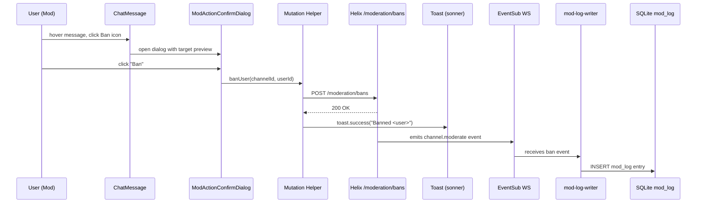
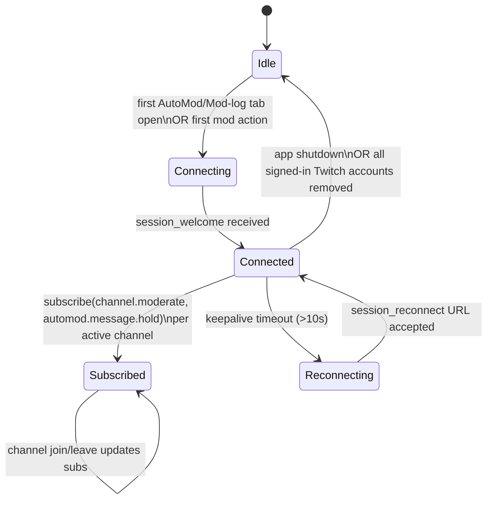

> **Scope cut (2026-05-18):** Mid-build the user dropped AutoMod (both
> platforms), Streamlabs OAuth, and the giveaway feature. U20, U21, U23,
> U27, U28 are removed; U30 ships as a thin per-channel retention editor;
> U32 ships predictions + polls only. See commit `b15bdec` for the cleanup
> pass and `docs/solutions/` (or memory) for the rationale.

# feat: Channel-Management Console — Multi-Surface Moderation + Broadcaster Tools

## Summary

This plan delivers the full channel-management console scoped by the origin brainstorm — five surfaces (per-message hover toolbar, inline chat-mode strip, username-click user popout, chat-panel tabs, `/mod` top-level route) plus a from-scratch Kick custom AutoMod and an Engagement tab (Predictions / Polls / Giveaways + Streamlabs) on Twitch broadcaster channels. Work is sequenced as seven phase-groups across 32 implementation units, infrastructure first (sonner, DB schema, OAuth scope batch, Twitch EventSub WebSocket, mutation helpers), then per-message UI, then the inline strip, popout, chat-panel tabs, Engagement, and finally the `/mod` route. The plan resolves all 10 deferred-to-planning questions from the brainstorm with concrete plan-time decisions.

---

## Problem Frame

Moderation and broadcaster-engagement actions today require leaving StreamForge for `twitch.tv` or `kick.com`. The existing pinned-messages work (commits `55f4cb8`, `75fca90`, `0ece25b`, `786f08d`) proved the app can host mod-tier UI and that the OAuth/scope plumbing works, but the user-facing surface stops at pin/unpin. The console expands that footprint to every routine mod and broadcaster action — timeout, ban, delete, raid, AutoMod review, predictions, polls, giveaways, and the `/mod` cross-channel surface — in one consistent visual language and with one batched OAuth re-consent flow.

The implementation reuses substantial existing scaffolding (`useIsTwitchMod` / `useIsKickMod`, `useModeratedChannels`, `useRequireModScopes`, `ReconnectForModDialog`, the pin-dialog confirm pattern at `apps/desktop/src/components/chat/twitch/TwitchPinMessageDialog.tsx`, the Helix moderation helper at `apps/desktop/src/backend/api/platforms/twitch/twitch-helix-moderation.ts`, and the `DatabaseService` + `safeStorage` token plumbing). The genuinely new substructure is a Twitch EventSub WebSocket subsystem (the app today is IRC-only) and a Streamlabs OAuth flow.

---

## Requirements Trace

Every implementation unit names the requirements it advances. The plan covers R1–R55 from the origin doc. Cross-cutting requirements (R49–R55) thread through multiple units rather than belonging to one — they are called out explicitly on each unit that satisfies a piece of them.

Origin Acceptance Examples AE1–AE12 are covered by test scenarios in the relevant units, marked with `Covers AE<N>.` per the plan-template convention.

---

## Key Technical Decisions

The brainstorm carried 10 deferred-to-planning questions. Each is resolved here.

1. **Kick AutoMod interception point: pre-emit in `kick-chat.ts`.** The custom AutoMod filter runs after the Pusher event is decoded but before the message is added to `chat-store`. Held messages never enter the live chat stream — instead they are forwarded to a separate `kick-automod-queue` Zustand store consumed by the AutoMod tab. This inverts Twitch's pattern (where Twitch holds upstream and we just read EventSub) but is the only correct shape for a client-side filter. Rationale: any post-emit approach would either flicker the message into chat before pulling it back (visible to viewers via the same `chat-store`) or require a separate per-message hidden state that the renderer would have to honor. Affects R30, R31.

2. **Persistence: extend `apps/desktop/src/backend/services/database-service.ts` with new tables, do not introduce a new layer.** Research confirmed `better-sqlite3` 11.8.1 is already a dependency with `key_value` + `local_follows` tables, WAL mode, NORMAL sync, an in-service migration pattern (column-check + `ALTER TABLE`), and `safeStorage`-encrypted token storage in `storage-service.ts`. The plan adds three new tables — `mod_log`, `kick_automod_config`, `retention_settings` — plus a Streamlabs-token entry under the existing encrypted-token path. Affects R34, R53.

3. **Helix `/moderation/bans` cross-channel search: concurrency=4 with exponential backoff.** The cross-channel banned-user search (R47) fans out per moderated channel. Twitch's global rate limit is 800 points / minute / token for app-rate-limit endpoints; ~30 points / Bearer / channel-scoped endpoint. With up to ~50 moderated channels per power user, sequential fetch is too slow and unbounded parallelism risks 429. Plan: parallel pool of 4 concurrent fetches with exponential backoff (250ms → 500ms → 1000ms → 2000ms) on 429, cap at 60s total wait. Surface a per-channel "not yet loaded" placeholder rather than blocking the UI. Affects R47.

4. **`user:manage:whispers` scope: include but feature-flag the Whisper button OFF by default.** Twitch heavily restricts whisper API access for new apps post-2022 — many devs report whisper attempts being silently rate-limited or rejected. Plan: include the scope in the OAuth batch so we have it if Twitch loosens, but the popout's Whisper button is gated behind a `devSettings.showWhisper` boolean (default false). If user opts in via the existing dev-mod-override store, Whisper renders; otherwise it stays hidden. Affects R18, R49.

5. **Twitch EventSub WebSocket topology: one shared WS per signed-in Twitch account.** EventSub's documented limit is 100 subscriptions per WebSocket. Multistream caps below 10 tiles → at most 20 subscriptions (channel.moderate + automod.message.hold × 10 channels), well under cap. One WS minimizes connection overhead; subscription manager (U8) adds/removes per channel as chats join/leave. Affects R54.

6. **Predictions / Polls live updates: 5-second Helix polling while the Engagement tab is active.** EventSub `channel.prediction.progress` / `channel.poll.progress` would be more efficient but adds another subscription type, another state machine, and a second event-routing path for the broadcaster identity case. Plan: poll Helix `GET /predictions` and `GET /polls` at 5s cadence while the Engagement tab is the active tab; stop polling when user switches tabs. Defer EventSub-driven polls/predictions to follow-up. Affects R38, R39.

7. **OS-notification rate-limit: coalesce at 1 per 30 seconds per channel.** AutoMod-heavy channels can hold many messages per minute. Plan: per-channel debounce — fire at most 1 OS notification every 30s; if more holds accumulate during the window, the next-fired notification reads "N held messages on `<channel>`" rather than the latest preview. Affects R29.

8. **`/mod` page refresh: manual button + auto-refresh on app-focus after >5min idle.** `useModeratedChannels` currently refreshes on auth-state change only. The `/mod` page renders the cached list initially, plus a "Refresh" icon button next to the page title, plus a focus-listener that triggers a refresh when the app regains focus after a >5-min idle period. Affects R45, R47.

9. **Streamlabs OAuth: extend the existing Cloudflare Worker to handle Streamlabs token exchange.** Verified during the pinned-message work that the Worker (`apps/worker/src/index.ts`) is a pure pass-through with no scope filtering. Plan: add a `/streamlabs/token` route to the Worker that mirrors the existing Twitch/Kick exchange pattern. Streamlabs tokens stored via the existing `safeStorage` path in `storage-service.ts`. Affects R51.

10. **EventSub mount: lazy on first AutoMod or Mod-log tab open per signed-in user.** Eager-mount would inflate cold-start chat-panel time for users who never open the mod surface. Plan: EventSub WebSocket connection starts when the user first opens the AutoMod or Mod-log tab in any chat session OR when the first mod action fires from the hover toolbar (whichever comes first). Subscription manager handles dynamic add/remove for active channels thereafter. Affects R54, R55.

Two additional plan-time decisions surfaced during research:

11. **Sonner Toaster mount in `App.tsx`, replaces the existing TODO at `apps/desktop/src/components/chat/twitch/TwitchChat.tsx:527`.** Single `<Toaster position="bottom-right" richColors />` mount near the top of the React tree, so every component can call `toast.error(...)` / `toast.success(...)`. The pin code's existing "leave dialog open on forbidden / network failures" path (TwitchChat.tsx:526-528) is retrofitted to fire a toast and close the dialog.

12. **Confirm dialog generalization.** Rather than duplicating Pin's dialog component, this plan introduces a single `ModActionConfirmDialog` (U9) that accepts an action type, a target preview, and an optional `extraSlot` for action-specific UI (the 6-chip timeout picker, the raid target picker, etc.). `TwitchPinMessageDialog` and `KickPinMessageDialog` stay in place — refactoring them to use the new generic dialog is **explicitly out of scope** (per Phase 3.7 anti-expansion) and goes under Deferred to Follow-Up Work.

---

## Output Structure

This plan creates many new files. The expected layout (per-unit `**Files:**` sections remain authoritative):

```text
apps/desktop/src/
├── backend/
│   ├── api/platforms/
│   │   ├── twitch/
│   │   │   ├── twitch-helix-moderation-mutations.ts   (U6: ban/timeout/unban/delete/shield/raid/clear/commercial/uniquechat/mod-add-remove/vip-add-remove)
│   │   │   ├── twitch-helix-predictions.ts            (U25)
│   │   │   ├── twitch-helix-polls.ts                  (U26)
│   │   │   ├── twitch-eventsub-client.ts              (U8: WebSocket + subscription manager)
│   │   │   └── twitch-eventsub-types.ts               (U8)
│   │   └── kick/
│   │       ├── kick-mod-mutations.ts                  (U7: ban/timeout/unban/delete/chat-modes)
│   │       └── kick-automod-filter.ts                 (U21: keyword + 4-tier interceptor)
│   ├── services/
│   │   ├── database-service.ts                       (U2: extend with mod_log + kick_automod_config + retention_settings)
│   │   ├── storage-service.ts                        (U3: extend with Streamlabs encrypted token)
│   │   ├── mod-log-writer.ts                         (U12)
│   │   └── chat/
│   │       └── kick-chat.ts                          (U21: add pre-emit AutoMod interception hook)
│   └── auth/
│       ├── oauth-config.ts                           (U4: scope batch)
│       └── streamlabs-oauth.ts                       (U28)
├── components/
│   ├── chat/
│   │   ├── ChatMessage.tsx                           (U10: hover toolbar)
│   │   ├── mod/
│   │   │   ├── ModActionConfirmDialog.tsx            (U9)
│   │   │   ├── TimeoutDurationPicker.tsx             (U9)
│   │   │   ├── InlineModStrip.tsx                    (U13)
│   │   │   ├── RaidTargetPicker.tsx                  (U15)
│   │   │   ├── ChatPanelTabs.tsx                     (U19: Chat / AutoMod / Mod log / Engagement)
│   │   │   ├── tabs/
│   │   │   │   ├── TwitchAutoModTab.tsx              (U20)
│   │   │   │   ├── KickAutoModTab.tsx                (U21)
│   │   │   │   ├── ModLogTab.tsx                     (U22)
│   │   │   │   └── EngagementTab.tsx                 (U24/U25/U26/U27)
│   │   │   └── UserPopout/
│   │   │       ├── UserPopout.tsx                    (U16)
│   │   │       ├── UserProfileHeader.tsx             (U16)
│   │   │       ├── UserModHistory.tsx                (U17)
│   │   │       └── UserPopoutFooter.tsx              (U17)
│   ├── auth/
│   │   └── ReconnectForModDialog.tsx                 (U5: extend to accept missing-scope list)
│   └── ToastRoot.tsx                                  (U1: sonner mount)
├── hooks/
│   ├── useModLog.ts                                  (U12 / consumer hook)
│   ├── useKickAutoModConfig.ts                       (U21 config)
│   ├── useTwitchEventSub.ts                          (U8 consumer hook)
│   └── useChatRoomState.ts                           (U14)
├── pages/
│   └── Mod/
│       ├── index.tsx                                 (U29)
│       ├── PerChannelSettings.tsx                    (U30)
│       ├── BannedUserSearch.tsx                      (U31)
│       └── EngagementAggregate.tsx                   (U32)
└── store/
    ├── kick-automod-queue.ts                         (U21)
    ├── mod-action-overrides-store.ts                 (existing, extended)
    └── streamlabs-auth-store.ts                      (U28)

apps/worker/src/index.ts                              (U28: add /streamlabs/token route)
```

Tests follow the existing convention at `apps/desktop/tests/<mirroring-path>/<name>.test.{ts,tsx}`.

---

## High-Level Technical Design

This illustrates the intended approach and is directional guidance for review, not implementation specification. The implementing agent should treat it as context, not code to reproduce.

### Action flow — hover toolbar to mod-log entry (Twitch ban example)



Auth-failure branch: if `M → H` returns 401 with missing-scope, `M` resolves a `{ kind: "missing-scopes", scopes: [...] }` error, the dialog catches it, fires the existing `ReconnectForModDialog` with the missing-scope list, the user re-consents, and `M` retries the original mutation on the new token. Toast surfaces only after retry succeeds.

### EventSub subscription lifecycle



### Surface-to-data-source map

| Surface | Read source | Write source |
|---|---|---|
| Hover toolbar (Timeout/Ban/Unban/Delete) | n/a (per-message UI) | Helix moderation endpoints (Twitch) / Kick v2 endpoints |
| Inline strip (chat-mode toggles) | Chat room-state (tmi.js USERSTATE, Kick room-update) | Helix moderation chat-settings / Kick v2 settings endpoints |
| User popout (profile) | Helix users + follows + subs, Kick user + follow endpoints | n/a |
| User popout (mod history) | SQLite `mod_log` table | n/a |
| Chat tab | Existing tmi.js + Pusher connection | n/a |
| Twitch AutoMod tab | EventSub `automod.message.hold` | Helix `/moderation/automod/message` + allow-list endpoint |
| Kick AutoMod tab | `kick-automod-queue` Zustand store (fed by interceptor) | Kick v2 + local store mutation |
| Mod log tab | SQLite `mod_log` table | Bootstrap: Helix `/moderation/bans` + EventSub stream |
| Engagement tab — Predictions | Helix `/predictions` (5s poll) | Helix `/predictions` POST/PATCH |
| Engagement tab — Polls | Helix `/polls` (5s poll) | Helix `/polls` POST/PATCH |
| Engagement tab — Giveaways (in-house) | `chat-store` keyword filter | n/a (local random selection) |
| Engagement tab — Giveaways (Streamlabs) | Streamlabs API | Streamlabs API |
| `/mod` per-channel settings | SQLite `kick_automod_config`, `retention_settings` | Same |
| `/mod` banned-user search | Helix `/moderation/bans` × N channels | n/a |

---

## Implementation Units

Units are grouped into seven phase-groups for clarity. **Phase boundaries are sequencing hints, not strict gates.** Each U-ID's `Dependencies:` field is authoritative.

### Phase Group 1 — Foundations

### U1. Sonner toast wiring

- **Goal:** Install `sonner`, mount one `<Toaster />` in `App.tsx`, retire the `TwitchChat.tsx:527` "toast/error surface is a future follow-up" TODO.
- **Requirements:** R52 (error surface).
- **Dependencies:** none.
- **Files:**
  - `apps/desktop/package.json` (add `sonner` dep)
  - Create `apps/desktop/src/components/ToastRoot.tsx`
  - Modify `apps/desktop/src/App.tsx` (mount `<ToastRoot />` near root)
  - Modify `apps/desktop/src/components/chat/twitch/TwitchChat.tsx` (replace the TODO comment + add `toast.error(...)` on forbidden / network failures in the pin path)
  - Create `apps/desktop/tests/components/ToastRoot.test.tsx`
- **Approach:** `<Toaster position="bottom-right" richColors closeButton />`. Toasts are imperative (`toast.error("...")`) — no React tree pollution. Type the wrapper so error toasts always include the action name in the title.
- **Patterns to follow:** Sonner's recommended Radix-friendly setup; existing dialog z-index conventions (Toaster should sit above standard dialogs).
- **Test scenarios:**
  - Mount renders without throwing in the app's standard ProviderTree.
  - `toast.error("Ban failed", { description: "Forbidden" })` produces a rendered toast with role="status" or "alert".
  - Existing Pin forbidden-path test (in `TwitchChat.test.tsx`) is updated to assert the toast fires.
- **Verification:** Visual: a manual pin attempt with revoked scope shows the toast and closes the dialog instead of leaving it stuck open.

### U2. Extend `DatabaseService` with mod-console tables

- **Goal:** Add three new tables to the existing SQLite store, with the same column-check migration pattern already used for `local_follows.source`.
- **Requirements:** R31, R34, R35, R53.
- **Dependencies:** none.
- **Files:**
  - Modify `apps/desktop/src/backend/services/database-service.ts`
  - Modify `apps/desktop/tests/backend/services/database-service.test.ts` (create if missing)
- **Approach:** Three new tables, all created in `private init()`:
  - `mod_log` (id INTEGER PRIMARY KEY, channel_id TEXT, channel_slug TEXT, action TEXT, target_user_id TEXT, target_username TEXT, moderator_user_id TEXT, moderator_username TEXT, duration_seconds INTEGER NULL, reason TEXT NULL, created_at INTEGER) + indexes on (channel_id, created_at DESC) and (channel_id, target_user_id)
  - `kick_automod_config` (channel_id TEXT PRIMARY KEY, keyword_blocklist TEXT, severity_identity TEXT, severity_sexual TEXT, severity_aggression TEXT, severity_bullying TEXT, allowlist_user_ids TEXT, updated_at INTEGER) — `*_blocklist` and `severity_*` columns store newline-delimited keyword lists
  - `retention_settings` (scope TEXT PRIMARY KEY, retention_days INTEGER) — scope is either `"global"` or `"channel:<id>"`, retention_days = NULL meaning "forever"
- **Patterns to follow:** Existing migration check at `database-service.ts:55-60` (column-check + ALTER). Add helpers `insertModLog(...)`, `queryModLog(...)`, `upsertKickAutomodConfig(...)`, `getRetentionSetting(...)` etc. — `dbService` is the singleton exported from this file; preserve that.
- **Test scenarios:**
  - Fresh init creates all three tables; second init is idempotent (no errors).
  - `insertModLog` + `queryModLog` round-trips a sample entry with correct ordering.
  - Retention-aware deletion: when `retention_settings` has `(scope="global", retention_days=30)`, calling the cleanup helper removes entries older than 30 days. **Covers AE10.**
  - Schema migration: when a prior-version DB exists with only `key_value` + `local_follows`, init adds the new tables without disturbing existing data.
- **Verification:** The new tables exist after first run; existing follows + key-value behavior is unchanged; `queryModLog({channelId, targetUserId})` returns deterministic ordered rows.

### U3. Extend `StorageService` with Streamlabs token storage

- **Goal:** Add encrypted Streamlabs OAuth token persistence using the existing `safeStorage` path used for Twitch/Kick tokens.
- **Requirements:** R51.
- **Dependencies:** U2 (only because it lives next to the DB layer; no direct dependency).
- **Files:**
  - Modify `apps/desktop/src/backend/services/storage-service.ts`
  - Modify `apps/desktop/src/shared/auth-types.ts` (extend `StorageSchema` with `streamlabsToken: EncryptedToken | null`)
  - Modify `apps/desktop/tests/backend/services/storage-service.test.ts`
- **Approach:** Add `getStreamlabsToken()` / `setStreamlabsToken(token)` / `clearStreamlabsToken()` to `StorageService`, mirroring the existing Twitch/Kick token helpers. The token's payload includes `accessToken`, `refreshToken`, `expiresAt`, `socketToken` (Streamlabs's WebSocket auth key).
- **Patterns to follow:** Existing token-encryption helpers in `storage-service.ts` that use `safeStorage.encryptString(...)` / `safeStorage.decryptString(...)`.
- **Test scenarios:**
  - Set/get round-trips an encrypted token.
  - Clear deletes the entry.
  - Returning before any set yields `null` (not throws).
  - Token persistence across app restart (simulated via fresh service instance).
- **Verification:** Streamlabs OAuth flow (U28) can persist + read tokens without leaking plaintext to disk.

### U4. Twitch OAuth scope batch + Worker passthrough confirmation

- **Goal:** Add the 12 new scopes to `oauth-config.ts` so the next OAuth round-trip requests them all. Verify (do not modify) Worker passthrough still works with the wider scope list.
- **Requirements:** R49.
- **Dependencies:** none.
- **Files:**
  - Modify `apps/desktop/src/backend/auth/oauth-config.ts`
  - Modify `apps/desktop/tests/backend/auth/oauth-config.test.ts`
- **Approach:** Add the following scopes to the Twitch scope array: `moderator:manage:banned_users`, `moderator:manage:shield_mode`, `moderator:manage:automod`, `moderator:manage:automod_settings`, `moderator:read:chat_messages`, `channel:manage:raids`, `channel:manage:moderators`, `channel:manage:vips`, `channel:manage:predictions`, `channel:manage:polls`, `channel:edit:commercial`, `user:manage:whispers`. Worker verification: trace a token-exchange request through `apps/worker/src/index.ts` to confirm no scope allow-list filtering exists. Document the verification in a code comment + test assertion that all 12 names are in the array.
- **Patterns to follow:** Existing scope list maintenance pattern (pinned-message work added `moderator:manage:chat_messages` here).
- **Test scenarios:**
  - All 12 new scope strings are present in the Twitch scope array.
  - The exported scope array's length equals the documented count.
  - No duplicate scopes (no scope appears twice).
- **Verification:** Trigger an OAuth re-consent flow against the dev Twitch app; the consent screen lists every scope; the returned token's `scope` field includes them.

### U5. `ReconnectForModDialog` extended for batched missing scopes

- **Goal:** Refactor the existing dialog to accept a `missingScopes: string[]` prop instead of a single fixed scope, so one consent round-trip covers all currently-missing scopes for the action(s) the user is attempting.
- **Requirements:** R50.
- **Dependencies:** U4.
- **Files:**
  - Modify `apps/desktop/src/components/auth/ReconnectForModDialog.tsx`
  - Modify `apps/desktop/src/store/reconnect-dialog-store.ts` (the store may need to carry the missing-scope list rather than a boolean)
  - Modify `apps/desktop/tests/components/auth/ReconnectForModDialog.test.tsx`
- **Approach:** Dialog content lists each missing scope on its own line with a human-readable description ("Manage timeouts and bans" for `moderator:manage:banned_users`, etc.). Single "Reconnect" CTA button triggers the same OAuth flow used by pin. After reconnect, the dialog closes and the action that triggered it retries automatically via a one-shot retry callback registered by the calling component.
- **Patterns to follow:** Existing dialog's current shape; existing OAuth retry pattern in `useRequireModScopes`.
- **Test scenarios:**
  - Dialog renders with 1 missing scope, 3 missing scopes, and 12 missing scopes — visual + a11y (each scope is its own focusable explanation if needed).
  - Reconnect callback fires once, not per-scope.
  - After successful reconnect, the dialog closes and the retry callback is invoked exactly once with the new access token.
  - **Covers AE12.** Given the user is missing `moderator:manage:banned_users` and `channel:manage:raids` and clicks Ban, the dialog opens listing both scopes.
- **Verification:** Manual: clear the user's `moderator:manage:banned_users` scope, click Ban — dialog opens with that scope listed; click Reconnect → re-consent → ban fires.

### U6. Twitch Helix moderation mutation helpers

- **Goal:** A single thin client module exposing the eleven Helix moderation calls used by the toolbar, inline strip, and user popout.
- **Requirements:** R1, R6, R9, R10, R11, R12, R17, R49.
- **Dependencies:** U4 (scopes), U5 (reconnect on 401).
- **Files:**
  - Create `apps/desktop/src/backend/api/platforms/twitch/twitch-helix-moderation-mutations.ts`
  - Create `apps/desktop/tests/backend/api/platforms/twitch/twitch-helix-moderation-mutations.test.ts`
- **Approach:** Export named async functions, each accepting `{accessToken, broadcasterId, moderatorId, ...args}` and returning a discriminated-union result: `{ok: true} | {ok: false, kind: "missing-scopes" | "forbidden" | "not-found" | "network", ...}`. Functions:
  - `banUser({accessToken, broadcasterId, moderatorId, userId, reason})`
  - `timeoutUser({..., userId, durationSeconds, reason})`
  - `unbanUser({..., userId})`
  - `deleteChatMessage({..., messageId})`
  - `setShieldMode({..., active})`
  - `startRaid({..., fromBroadcasterId, toBroadcasterId})`
  - `clearChat({..., broadcasterId, moderatorId})`
  - `runCommercial({..., length})`
  - `updateChatSettings({..., uniqueChatEnabled, slowMode, slowModeSeconds, followersOnly, followersDuration, subOnly, emoteOnly})`
  - `addModerator({..., userId})` / `removeModerator({..., userId})`
  - `addVip({..., userId})` / `removeVip({..., userId})`
- **Patterns to follow:** `apps/desktop/src/backend/api/platforms/twitch/twitch-gql-pin-mutations.ts` for the result-discriminated-union shape; `apps/desktop/src/backend/api/platforms/twitch/twitch-helix-moderation.ts` for Helix request plumbing (Client-ID header, Bearer, status-code classification).
- **Test scenarios:**
  - Each function builds the correct request URL + method (mocked fetch).
  - 401 returns `{ok: false, kind: "missing-scopes"}` with the scope name parsed from response body when present.
  - 403 returns `{ok: false, kind: "forbidden"}`.
  - 404 (for unbanUser / removeModerator / removeVip) returns `{ok: false, kind: "not-found"}`.
  - 429 returns `{ok: false, kind: "rate-limited"}` and exposes the retry-after header to the caller.
  - 5xx returns `{ok: false, kind: "network"}`.
  - Happy path: 200/204 returns `{ok: true}` with parsed payload where applicable.
- **Verification:** Each mutation hits the documented Helix endpoint with the documented payload shape; result classification matches the existing `twitch-gql-pin-mutations.ts` pattern.

### U7. Kick v2 mod-mutation helpers

- **Goal:** Same shape as U6, for Kick's v2 API.
- **Requirements:** R1, R8, R9, R11.
- **Dependencies:** U4 (no Kick scope expansion needed today, but the dialog flow is shared).
- **Files:**
  - Create `apps/desktop/src/backend/api/platforms/kick/kick-mod-mutations.ts`
  - Create `apps/desktop/tests/backend/api/platforms/kick/kick-mod-mutations.test.ts`
- **Approach:** Mirror the Twitch shape but use Kick's slug-based v2 endpoints. Functions: `banKickUser`, `timeoutKickUser`, `unbanKickUser`, `deleteKickMessage`, `setKickChatMode` (single function that takes a partial settings object: `{slowMode, followersOnly, subscribersOnly, emoteOnly}`). KickTalk's `utils/services/kick/kickAPI.js` (in the `reference/` folder) is the source for endpoint paths and payload shapes.
- **Patterns to follow:** `apps/desktop/src/backend/api/platforms/kick/kick-pin-mutations.ts` for the result-discriminated-union shape; existing Kick request plumbing (sessionCookie + sessionToken auth).
- **Test scenarios:**
  - Each function builds the correct URL using the channel slug.
  - 401 / 403 / 404 / 429 / 5xx classification matches the Twitch helper's behavior.
  - Slow-mode toggle with `seconds=0` calls the `/slow-off` shape rather than `/slow` with zero (KickTalk pattern).
- **Verification:** Manual: trigger each mutation against a test Kick channel via the dev panel.

### U8. Twitch EventSub WebSocket subsystem

- **Goal:** A single shared WebSocket connection per signed-in Twitch account that subscribes to `channel.moderate` and `automod.message.hold` for active moderated channels, dispatches events to consumers.
- **Requirements:** R27, R33, R54.
- **Dependencies:** U4 (scopes — `moderator:read:chat_messages` for automod subscription).
- **Files:**
  - Create `apps/desktop/src/backend/api/platforms/twitch/twitch-eventsub-client.ts`
  - Create `apps/desktop/src/backend/api/platforms/twitch/twitch-eventsub-types.ts`
  - Create `apps/desktop/src/hooks/useTwitchEventSub.ts` (renderer-side consumer hook)
  - Create `apps/desktop/tests/backend/api/platforms/twitch/twitch-eventsub-client.test.ts`
- **Approach:**
  - One WebSocket connection per signed-in Twitch account. Connection lifecycle: open on first consumer mount → reconnect on disconnect using `session_reconnect` URL when provided, otherwise fresh connect → close when no consumers remain.
  - Subscription manager: `subscribe(channelId, eventType)` and `unsubscribe(channelId, eventType)`. Uses Twitch's Helix `POST /eventsub/subscriptions` to register, `DELETE` to unregister.
  - Event routing: a `Map<channelId, Set<listener>>` per event type. Consumers register via the hook; cleanup on unmount.
  - Lazy mount: the client is not constructed until the first consumer attaches (U20 or U22).
  - Heartbeat / keepalive: if no `session_keepalive` received within 10s of the expected interval, force-reconnect.
- **Patterns to follow:** No prior WebSocket subsystem in this repo to mirror precisely. Twitch's reference docs at `dev.twitch.tv/docs/eventsub/websocket-reference/`. Keep the public API minimal: `subscribe`, `unsubscribe`, `connectionState` observable. Wrap browser `WebSocket`; tests stub it.
- **Test scenarios:**
  - First subscribe call opens the WebSocket and waits for `session_welcome` before posting the subscription request.
  - Multiple subscribes coalesce onto the same connection.
  - Last-unsubscribe (no consumers remaining) closes the connection.
  - Mid-session `session_reconnect` swaps URLs cleanly without losing subscriptions.
  - Keepalive timeout triggers reconnect within 1 second.
  - Connection error during initial handshake surfaces a `connectionState: "error"` observable change.
  - Subscription budget: 10 channel subscriptions + 10 automod subscriptions = 20 total, well below Twitch's 100 cap.
- **Verification:** Manual: open AutoMod tab on a Twitch channel that triggers AutoMod, observe `automod.message.hold` events arriving in the renderer.

### Phase Group 2 — Per-message UI

### U9. `ModActionConfirmDialog` + `TimeoutDurationPicker`

- **Goal:** A single generic confirm-dialog component reused by the hover toolbar, the inline strip, and the user popout. The timeout duration picker (6 preset chips) embeds inside it when the action is "timeout".
- **Requirements:** R4, R5, R11.
- **Dependencies:** none.
- **Files:**
  - Create `apps/desktop/src/components/chat/mod/ModActionConfirmDialog.tsx`
  - Create `apps/desktop/src/components/chat/mod/TimeoutDurationPicker.tsx`
  - Create `apps/desktop/tests/components/chat/mod/ModActionConfirmDialog.test.tsx`
  - Create `apps/desktop/tests/components/chat/mod/TimeoutDurationPicker.test.tsx`
- **Approach:**
  - `ModActionConfirmDialog` props: `{ open, onOpenChange, actionType: "ban" | "timeout" | "unban" | "delete" | "raid" | "clear" | "shield" | "commercial" | "uniqueChat", targetPreview: ReactNode (the message preview or user identity), onConfirm: (extraData?) => Promise<void>, busy, extraSlot?: ReactNode }`.
  - The dialog title, description, and primary-button label are derived from `actionType`. `extraSlot` is where action-specific UI plugs in (timeout picker, raid target picker, slow-mode duration input).
  - `TimeoutDurationPicker` renders six preset chips: 10s / 1m / 10m / 30m / 24h / 7d. Click selects; selection state is local; confirmed value lifts to the dialog's `onConfirm`.
  - Visual language: identical to `TwitchPinMessageDialog` / `KickPinMessageDialog` — dark background, branded color on the primary CTA, line-clamped preview.
- **Patterns to follow:** `apps/desktop/src/components/chat/twitch/TwitchPinMessageDialog.tsx` is the visual reference (origin Key Decision).
- **Test scenarios:**
  - Renders correctly for each `actionType`: title, description, primary CTA label.
  - **Covers AE3.** When `actionType="timeout"`, the picker renders exactly six chips and no custom-duration input.
  - Clicking a chip + Confirm fires `onConfirm` with `{durationSeconds: <chip value>}`.
  - Clicking Cancel fires `onOpenChange(false)` without calling `onConfirm`.
  - `busy=true` disables both buttons; the primary CTA shows a busy label.
  - Dialog closes on confirm-success but stays open on confirm-failure (parent handles).
- **Verification:** Visual: each action type opens a dialog visually consistent with the existing pin dialog; ban-confirm + timeout-confirm + delete-confirm flows fire the correct callback.

### U10. ChatMessage hover toolbar (Timeout / Ban / Unban / Delete)

- **Goal:** Replace the existing single Pin hover button in `ChatMessage.tsx` with a four-button mod toolbar, plus the existing Pin still present (5 total icons for mods).
- **Requirements:** R1, R2, R3.
- **Dependencies:** U9.
- **Files:**
  - Modify `apps/desktop/src/components/chat/ChatMessage.tsx`
  - Modify `apps/desktop/tests/components/chat/ChatMessage.test.tsx`
- **Approach:**
  - Replace `lines 151-163` (current Pin-only block) with a horizontal toolbar `<div>` containing 4 buttons + the existing Pin button. Each button is a `<button>` with a tooltip-on-hover. Icon sizes match existing 13px.
  - Toolbar visibility gated on `(onPin || onTimeout || onBan || onUnban || onDelete)` props being passed AND `message.type === "message"`. Parent `TwitchChat` / `KickChat` passes these props only when `useIsMod` returns true (per existing pattern from pin work).
  - Target-gating per R3: hide the entire toolbar when the message sender is the broadcaster, another moderator (any `mod` badge in `message.badges`), a Twitch staff/admin/global-mod badge holder. Own messages still render the toolbar.
- **Patterns to follow:** Existing Pin button block at `ChatMessage.tsx:151-163` for the absolute-positioned hover pattern; `react-icons/bs` for additional icons (BsTrashFill, BsHourglassSplit, BsHammer, BsCircle).
- **Test scenarios:**
  - Toolbar renders all 4 mod buttons when all callbacks are passed.
  - Toolbar renders only the Pin button when only `onPin` is passed (non-mod with Pin callback — shouldn't happen but defensive).
  - **Covers AE1.** Given the message has a `broadcaster` badge, when rendered with all callbacks, then no toolbar is shown.
  - **Covers AE2.** Given the message is from the signed-in user (own message), when rendered with all callbacks, then the full toolbar IS shown.
  - Toolbar hidden on messages with `moderator` badge (other mods).
  - Toolbar hidden on messages with `staff`, `admin`, or `global-mod` badge.
  - Click on each button fires the respective callback with the message as arg.
- **Verification:** Visual: hover a chat message as a mod, see 5 icons; hover a broadcaster's message, see none.

### U11. Mod-action mutation wiring (toolbar → Helix/Kick → toast)

- **Goal:** Connect the hover-toolbar callbacks in `TwitchChat` and `KickChat` to the U6 / U7 mutation helpers, with confirm-dialog + toast feedback.
- **Requirements:** R4, R6, R52.
- **Dependencies:** U6, U7, U9, U10.
- **Files:**
  - Modify `apps/desktop/src/components/chat/twitch/TwitchChat.tsx`
  - Modify `apps/desktop/src/components/chat/kick/KickChat.tsx`
  - Modify `apps/desktop/tests/components/chat/TwitchChat.test.tsx`
  - Modify `apps/desktop/tests/components/chat/KickChat.test.tsx`
- **Approach:**
  - Add `useState` for `pendingAction: { message, action } | null`. Set on toolbar click. Renders `<ModActionConfirmDialog ... />` when not null.
  - `onConfirm` calls the matching mutation helper; on success closes the dialog + fires success toast; on failure closes the dialog (after non-auth failures) or hands the missing-scope list to the existing reconnect-dialog flow.
  - Same component-local-state pattern the pin flow uses today.
- **Patterns to follow:** Existing pin handler block in `TwitchChat.tsx:480-540` and `KickChat.tsx` equivalent.
- **Test scenarios:**
  - Click Ban → confirm → success → toast.success fires + dialog closes + the message is no longer rendered (existing CLEARMSG handling).
  - Click Timeout → pick 10m chip → confirm → success → toast + dialog close.
  - Click Ban → confirm → 403 forbidden → toast.error fires + dialog stays open for one retry (KickTalk parity).
  - Click Ban → confirm → 401 missing-scope → reconnect dialog opens with the scope listed → after reconnect, ban auto-retries.
  - Click Delete → confirm → success → the deleted message renders as "Message deleted" (existing handling).
- **Verification:** Manual end-to-end: timeout, ban, unban, delete on a test channel; observe SQLite mod-log entries after U12 lands.

### U12. Mod-log writer service

- **Goal:** A service that consumes EventSub events + local mod-action mutations + Helix `/moderation/bans` bootstrap and writes entries to the `mod_log` SQLite table.
- **Requirements:** R32, R33, R34, R35.
- **Dependencies:** U2, U8.
- **Files:**
  - Create `apps/desktop/src/backend/services/mod-log-writer.ts`
  - Create `apps/desktop/src/hooks/useModLog.ts` (renderer consumer)
  - Create `apps/desktop/tests/backend/services/mod-log-writer.test.ts`
- **Approach:**
  - Inputs: EventSub `channel.moderate` events (subscribed via U8), local mutation success callbacks (from U11), IRC `CLEARCHAT` / `CLEARMSG` events (existing Twitch chat path), Kick chatroom events (Pusher equivalents), and an on-mount bootstrap Helix `GET /moderation/bans` for the current channel.
  - Output: rows inserted into `mod_log` via `dbService.insertModLog(...)`.
  - Deduplication: when both an EventSub event and a local mutation success callback describe the same action, dedupe by `(channel_id, action, target_user_id, ±2s window)`.
  - Retention sweeping: on app start, run the retention sweep using the `retention_settings` table (per AE10).
- **Patterns to follow:** Existing service-class pattern in `apps/desktop/src/backend/services/`.
- **Test scenarios:**
  - EventSub `channel.moderate` ban event creates a `mod_log` entry with the correct columns.
  - Local mutation success callback with same target inside the dedup window does NOT create a duplicate entry.
  - Local mutation outside the dedup window creates a separate entry.
  - Bootstrap on chat-connect inserts entries for each currently-banned user from Helix `/moderation/bans`.
  - **Covers AE10.** Retention sweep with `retention_days=30` removes entries older than 30 days at app start.
  - Kick action (no EventSub) written via local mutation callback only.
- **Verification:** A Twitch ban triggered from inside the app + a Twitch ban triggered from twitch.tv both appear in the local mod log; the in-app one shows up exactly once (no dupe).

### Phase Group 3 — Inline strip

### U13. `InlineModStrip` component

- **Goal:** Render the strip above chat tabs with chat-mode toggles + one-shot icons.
- **Requirements:** R7, R8, R9, R10, R13.
- **Dependencies:** U6, U7, U9.
- **Files:**
  - Create `apps/desktop/src/components/chat/mod/InlineModStrip.tsx`
  - Create `apps/desktop/tests/components/chat/mod/InlineModStrip.test.tsx`
- **Approach:**
  - Single horizontal row, ~32px tall. Left group: 4 toggle icons (slow / followers / subs / emote). Right group: 4-5 one-shot icons (clear / raid (broadcaster) / uniqueChat (Twitch) / commercial (Twitch broadcaster) / Shield (Twitch broadcaster + scoped mods)). Spacer between groups.
  - Visibility: rendered only when `useIsTwitchMod(channel) || useIsKickMod(channel)` returns true.
  - Per-action visibility: broadcaster-only items hidden for non-broadcaster mods; Twitch-only items hidden on Kick.
  - Click on any item: opens `ModActionConfirmDialog` with the appropriate `actionType` and (for toggles being activated) the duration/min-age `extraSlot`.
- **Patterns to follow:** Same horizontal-toolbar idiom as `ChatMessage` per-message toolbar. Tooltip wrappers from the pinned-message banner's tooltip system.
- **Test scenarios:**
  - Renders for a mod on Twitch with 8 items (slow/followers/subs/emote + clear/raid/uniqueChat/commercial — raid/commercial/uniqueChat hidden if not broadcaster).
  - Renders for a Kick mod with 5 items (slow/followers/subs/emote + clear).
  - Hidden entirely when `useIsMod` returns false.
  - Click slow-mode toggle while inactive opens dialog with duration picker; click toggle while active fires deactivation without dialog.
- **Verification:** Visual + mod-state matrix walk-through.

### U14. Chat-mode toggle state via room-state hook

- **Goal:** A hook that reads the live chat room-state (slow / followers / subs / emote modes) from the active chat connection so toggles reflect actual state.
- **Requirements:** R8.
- **Dependencies:** none.
- **Files:**
  - Create `apps/desktop/src/hooks/useChatRoomState.ts`
  - Create `apps/desktop/tests/hooks/useChatRoomState.test.tsx`
- **Approach:**
  - Subscribe to tmi.js `roomstate` event on Twitch (slow / followers-only / subs-only / emote-only / r9k flags); subscribe to Kick Pusher room-state messages.
  - Expose: `{slowMode: number | null, followersOnly: number | null, subscribersOnly: boolean, emoteOnly: boolean, uniqueChat: boolean, shieldMode: boolean}` per channel.
  - Live updates when the broadcaster (or another mod) changes the mode externally.
- **Patterns to follow:** Existing tmi.js event hooks in `apps/desktop/src/components/chat/twitch/`.
- **Test scenarios:**
  - Initial state matches the `roomstate` payload on chat-connect.
  - Mid-session `roomstate` update flips the corresponding flag.
  - Kick Pusher chatroom-update event flips Kick-side flags.
- **Verification:** Manual: from the dev panel toggle slow mode for the test channel; observe the strip toggle's state flips to active.

### U15. Raid target picker + Shield-mode toggle

- **Goal:** Two final inline-strip pieces — raid target search and Shield-mode toggle.
- **Requirements:** R10, R12.
- **Dependencies:** U6, U13.
- **Files:**
  - Create `apps/desktop/src/components/chat/mod/RaidTargetPicker.tsx`
  - Create `apps/desktop/tests/components/chat/mod/RaidTargetPicker.test.tsx`
- **Approach:**
  - Raid picker renders inside the raid action's `ModActionConfirmDialog` via `extraSlot`. Typeahead input with debounced search against the existing follows list + a "recent raids" array stored in `key_value` (key: `recent-raids-<broadcaster-id>`, max 10 entries).
  - Shield-mode is a simple toggle in the strip; click → `ModActionConfirmDialog` (action=`shield`, no extra slot) → confirm → `setShieldMode({active: !current})`.
- **Patterns to follow:** Existing typeahead components (search bar in TopNavBar).
- **Test scenarios:**
  - Typeahead filters follows on each keystroke.
  - Recent-raids list appears below typeahead results with a "Recent" header.
  - Selecting a raid target enables the dialog's primary CTA.
  - Shield toggle reflects current state from `useChatRoomState`; confirm flips it.
- **Verification:** Manual: trigger a raid from the strip; trigger Shield mode on/off.

### Phase Group 4 — User popout

### U16. `UserPopout` modal shell + profile fetcher

- **Goal:** Centered modal overlay opened by clicking a username anywhere in chat. Top section renders the user's profile basics + roles + badges.
- **Requirements:** R14, R15.
- **Dependencies:** none structural (auth-store + Helix client + Kick client already exist).
- **Files:**
  - Create `apps/desktop/src/components/chat/mod/UserPopout/UserPopout.tsx`
  - Create `apps/desktop/src/components/chat/mod/UserPopout/UserProfileHeader.tsx`
  - Create `apps/desktop/src/components/chat/mod/UserPopout/useUserProfile.ts`
  - Create `apps/desktop/tests/components/chat/mod/UserPopout/UserPopout.test.tsx`
- **Approach:**
  - Modal uses the existing Radix Dialog primitive. Width ~480px, centered.
  - `useUserProfile(userId, platform, channelId)` hook: fetches user via Helix `/users` + follow-since via `/channels/followed` + subscription status via `/subscriptions/user` for Twitch; corresponding Kick endpoints for Kick. Caches per-session in a Zustand store.
  - Header: avatar + display name + account-creation date + follower-since date + a small badge row (sub tier + months, founder, VIP, mod).
- **Patterns to follow:** Existing dialog z-index conventions; existing `Username` color logic.
- **Test scenarios:**
  - Renders with a stub profile payload.
  - Loading state shows a skeleton placeholder.
  - Failure to fetch (404) shows a "User not found" inline state.
  - Closes on Escape, click-outside, or close button.
- **Verification:** Visual: click a username in chat, popout opens with that user's profile.

### U17. UserPopout per-user mod-history + quick-action footer

- **Goal:** The popout's recent-messages list, mod-history list, and quick-action footer (Timeout / Ban / Unban / Delete + mod/VIP add-remove for broadcaster + Whisper feature-flagged + Open external).
- **Requirements:** R15, R16, R17, R18, R19, R20.
- **Dependencies:** U2, U6, U7, U9, U16.
- **Files:**
  - Create `apps/desktop/src/components/chat/mod/UserPopout/UserModHistory.tsx`
  - Create `apps/desktop/src/components/chat/mod/UserPopout/UserPopoutFooter.tsx`
  - Modify `apps/desktop/src/components/chat/mod/UserPopout/UserPopout.tsx` (compose pieces)
- **Approach:**
  - Recent-messages section: pull the last 5-10 messages by this user from `chat-store` for the current channel.
  - Mod-history section: `dbService.queryModLog({channelId, targetUserId, limit: 50})` — paginated if more than 50.
  - Footer: same `ModActionConfirmDialog` flow as the hover toolbar. After action success, the popout stays open (origin R20), the action lands in `mod_log` (U12), and the mod-history section refreshes.
  - Whisper button: rendered only when `useDevSettings.showWhisper === true` (gated per decision #4).
  - Open-external: a small `<button>` that calls `window.electronAPI.openExternal(profileUrl)`.
- **Patterns to follow:** Same mutation-helper + toast pattern as the hover toolbar (U11).
- **Test scenarios:**
  - Mod-history renders entries newest-first.
  - Recent-messages section renders up to 10 messages from `chat-store`.
  - Click Timeout in footer opens the same picker dialog as the hover toolbar.
  - Click Add Mod (broadcaster identity) fires `addModerator` mutation.
  - Whisper button is hidden by default; flipping `devSettings.showWhisper` true reveals it.
  - Open-external calls `window.electronAPI.openExternal` with the correct URL per platform.
- **Verification:** Manual: open popout for a user with prior mod actions; see the history; take a new action; see the new entry appear in the history without re-opening.

### U18. Username-click trigger wiring

- **Goal:** Wire username clicks across all surfaces to open the popout: ChatMessage, AutoMod queue, Mod log, UserPopout's own "recent messages".
- **Requirements:** R14.
- **Dependencies:** U16, U17.
- **Files:**
  - Modify `apps/desktop/src/components/chat/Username.tsx`
  - Modify other places that render a username (AutoMod queue + ModLog + UserPopout recent-messages — added in subsequent units, but the trigger logic is centralized here)
- **Approach:** Centralize via a `useOpenUserPopout` context provider mounted near the chat root. `Username` calls `openUserPopout({userId, username, platform, channelId})` on click.
- **Patterns to follow:** Existing context-provider patterns in `apps/desktop/src/components/`.
- **Test scenarios:**
  - Click on a `Username` in chat opens the popout with the correct user info.
  - Provider absence renders Username as plain text with no click-handler attached (defensive).
- **Verification:** Click usernames across all rendering surfaces, popout opens.

### Phase Group 5 — Chat-panel tabs

### U19. `ChatPanelTabs` shell

- **Goal:** Wrap the existing `ChatPanel` content in a tabbed container: Chat / AutoMod / Mod log + Engagement (conditional).
- **Requirements:** R21, R22, R23, R26.
- **Dependencies:** none.
- **Files:**
  - Create `apps/desktop/src/components/chat/mod/ChatPanelTabs.tsx`
  - Modify `apps/desktop/src/components/chat/ChatPanel.tsx`
  - Modify `apps/desktop/tests/components/chat/ChatPanel.test.tsx`
- **Approach:**
  - Tab strip at top of chat panel. Tabs: `Chat` (always), `AutoMod` + `Mod log` (mods only), `Engagement` (Twitch broadcaster only).
  - Tab state lives in component-local `useState`. Switching tabs does NOT remount the underlying chat connection — Chat tab content stays mounted with `hidden` className when off-screen so its message stream keeps accumulating.
  - Mod-only tabs determined by `useIsTwitchMod(channel) || useIsKickMod(channel)`.
  - Engagement determined by `isCurrentUserBroadcaster(channel)` AND `platform === "twitch"`.
- **Patterns to follow:** Radix Tabs primitive; existing `ChatPanel` mount logic.
- **Test scenarios:**
  - Non-mod viewer: renders no tab strip, just chat content.
  - Twitch mod (not broadcaster): renders 3 tabs (Chat / AutoMod / Mod log).
  - Twitch broadcaster: renders 4 tabs including Engagement. **Covers AE6.**
  - Kick broadcaster: renders 3 tabs, no Engagement. **Covers AE7.**
  - Non-mod viewer on Twitch: just chat (no tabs). **Covers AE5.**
  - Switching from AutoMod tab to Chat tab does not drop messages received while AutoMod was active.
- **Verification:** Visual: open a moderated Twitch channel as broadcaster, see 4 tabs; open as non-mod, see no tabs.

### U20. Twitch AutoMod tab + EventSub feed

- **Goal:** Subscribe to Twitch's `automod.message.hold` for the current channel and render held messages with 4 action buttons.
- **Requirements:** R24, R27, R28, R32.
- **Dependencies:** U6, U8, U9, U12, U19.
- **Files:**
  - Create `apps/desktop/src/components/chat/mod/tabs/TwitchAutoModTab.tsx`
  - Create `apps/desktop/src/store/automod-queue-store.ts`
  - Create `apps/desktop/tests/components/chat/mod/tabs/TwitchAutoModTab.test.tsx`
- **Approach:**
  - Tab consumes the EventSub client via `useTwitchEventSub(channelId, "automod.message.hold")`. Events push into the `automod-queue-store` Zustand store, keyed by `(channelId, messageId)`.
  - Each held message renders: author username (click → popout via U18), AutoMod category + severity, full message text, 4 action buttons (Approve / Deny / Allow + Allow-list / Approve-and-timeout).
  - Each action calls the matching Helix `/moderation/automod/message` endpoint (Approve / Deny variant) or the allow-list endpoint, then removes the entry from the queue. Approve-and-timeout opens the `ModActionConfirmDialog` with timeout picker first.
- **Patterns to follow:** Existing chat-list virtualization patterns where the queue gets long.
- **Test scenarios:**
  - Incoming `automod.message.hold` event adds to the queue store.
  - Tab badge in `ChatPanelTabs` increments when the queue is non-empty.
  - Approve button calls Helix with `status=ALLOWED`, removes from queue on success.
  - Deny button calls Helix with `status=DENIED`, removes from queue.
  - Allow + Allow-list fires two calls: status=ALLOWED + adds user to allow-list.
  - Approve-and-timeout opens the picker, then on confirm fires status=ALLOWED + timeoutUser.
  - Failed action surfaces a toast and leaves entry in the queue.
- **Verification:** Manual: a test channel with strict AutoMod settings has held messages; queue shows them; each action resolves correctly.

### U21. Kick custom AutoMod (interceptor + tab + config)

- **Goal:** Build the from-scratch Kick AutoMod: pre-emit interceptor in `kick-chat.ts` + a per-channel keyword + 4-tier config + the Kick AutoMod tab UI.
- **Requirements:** R30, R31, R32.
- **Dependencies:** U2, U9, U19.
- **Files:**
  - Create `apps/desktop/src/backend/api/platforms/kick/kick-automod-filter.ts`
  - Modify `apps/desktop/src/backend/services/chat/kick-chat.ts` (add pre-emit hook)
  - Create `apps/desktop/src/store/kick-automod-queue.ts`
  - Create `apps/desktop/src/hooks/useKickAutoModConfig.ts`
  - Create `apps/desktop/src/components/chat/mod/tabs/KickAutoModTab.tsx`
  - Create `apps/desktop/tests/backend/api/platforms/kick/kick-automod-filter.test.ts`
  - Create `apps/desktop/tests/components/chat/mod/tabs/KickAutoModTab.test.tsx`
- **Approach:**
  - `kick-automod-filter.ts` exposes `evaluate(message, config) → { held: true, category: "identity" | "sexual" | "aggression" | "bullying" | "blocklist" } | { held: false }`. Word-boundary match per keyword list per category. Case-insensitive.
  - `kick-chat.ts` calls `evaluate` after decoding the Pusher message but before adding to `chat-store`. Held messages bypass `chat-store` and instead push to `kick-automod-queue`.
  - `useKickAutoModConfig(channelId)` reads from `dbService.getKickAutomodConfig(channelId)` and watches for changes.
  - `KickAutoModTab` renders the same UI shape as the Twitch AutoMod tab but pulls from `kick-automod-queue`. Approve releases the message back into `chat-store` (so it appears in chat). Deny just drops. Allow + Allow-list adds the user-id to `allowlist_user_ids` in the config. Approve-and-timeout runs the timeout mutation (U7).
- **Patterns to follow:** Existing `kick-chat.ts` message-handling flow; `kick-pin-mutations.ts` for v2 endpoint patterns.
- **Test scenarios:**
  - `evaluate` returns `held` when the message contains a blocklist keyword.
  - **Covers AE9.** Given a per-channel keyword blocklist of `["spam"]`, when a chat message containing `"spam"` is received, then it does NOT appear in the Chat tab and IS in the AutoMod queue.
  - `evaluate` matches case-insensitively.
  - `evaluate` matches word-boundary correctly (`"ass"` does not match `"class"`).
  - Allowlisted user IDs bypass evaluation entirely.
  - Tab Approve releases message into `chat-store` with original timestamp + content.
  - Config edits persist to SQLite and trigger re-evaluation of incoming messages (not retroactive on already-held).
- **Verification:** Manual: configure a keyword for a test Kick channel; post the keyword in chat; observe message held in queue and absent from Chat tab.

### U22. Mod log tab

- **Goal:** Paginated, filterable list of mod-log entries for the current channel.
- **Requirements:** R25, R36.
- **Dependencies:** U2, U12, U18, U19.
- **Files:**
  - Create `apps/desktop/src/components/chat/mod/tabs/ModLogTab.tsx`
  - Create `apps/desktop/tests/components/chat/mod/tabs/ModLogTab.test.tsx`
- **Approach:**
  - Renders the channel's mod-log via `dbService.queryModLog({channelId, limit: 50, offset})`.
  - Filter dropdown by action type (timeout / ban / unban / delete / chat-mode / raid / automod-approve / automod-deny / all). Filter by acting moderator (free-text match against username).
  - Each row clickable → opens the target user's popout via U18.
  - Pagination: scroll-to-bottom-loads-more, with virtualization if the list grows.
- **Patterns to follow:** Existing list-virtualization in chat.
- **Test scenarios:**
  - Renders 50 newest entries on mount.
  - Filter by `action="ban"` shows only ban entries.
  - Filter by moderator username narrows results.
  - Click target-username row opens popout for that user.
  - Scroll to bottom triggers next-page fetch.
- **Verification:** Manual: take a few mod actions; switch to Mod log tab; see them listed; filter works.

### U23. AutoMod alert pipeline

- **Goal:** Wire the three concurrent alerts when a new AutoMod hold fires: tab badge increment, sonner toast (with inline Approve/Deny), OS notification (with debouncing per decision #7).
- **Requirements:** R24, R29.
- **Dependencies:** U1, U20, U21.
- **Files:**
  - Modify `apps/desktop/src/components/chat/mod/tabs/TwitchAutoModTab.tsx` (wire toast + OS notification on queue-add)
  - Modify `apps/desktop/src/components/chat/mod/tabs/KickAutoModTab.tsx` (same)
  - Create `apps/desktop/src/backend/services/os-notification-throttle.ts`
  - Create `apps/desktop/src/hooks/useAutoModAlerts.ts`
  - Create `apps/desktop/tests/backend/services/os-notification-throttle.test.ts`
- **Approach:**
  - Tab badge: derived from `automod-queue-store.size > 0` per channel.
  - Sonner toast: fires on queue-add via a queue subscription. Toast content includes the truncated message + Approve/Deny inline buttons that fire the same handlers as the tab.
  - OS notification: same trigger as toast, but routed through `os-notification-throttle.ts` which holds a `Map<channelId, lastFiredAt>` and coalesces firings within 30s. Overflow firings show "N held messages on `<channel>`" aggregate.
  - OS-notif preference: per-channel boolean stored in `key_value` table; default false.
- **Patterns to follow:** Existing electron Notification API usage in the app's notification paths (if any) — verify, otherwise wrap directly.
- **Test scenarios:**
  - First hold fires badge increment + toast + OS notification.
  - Second hold within 30s fires badge increment + toast but NOT a second OS notification (coalesced).
  - Third hold within 30s with 2 already-pending shows "3 held messages" aggregate when the 30s window expires.
  - OS-notif disabled for the channel: no OS notification fires.
  - **Covers AE8.**
- **Verification:** Manual: trigger a Kick AutoMod hold; observe badge + toast + OS notification.

### Phase Group 6 — Engagement tab (broadcaster-only)

### U24. Engagement tab shell + 5s polling infrastructure

- **Goal:** Add the Engagement tab and the polling infrastructure used by Predictions + Polls.
- **Requirements:** R23, R37, R38, R39.
- **Dependencies:** U19.
- **Files:**
  - Create `apps/desktop/src/components/chat/mod/tabs/EngagementTab.tsx`
  - Create `apps/desktop/src/hooks/useHelixPoll.ts`
  - Create `apps/desktop/tests/hooks/useHelixPoll.test.tsx`
- **Approach:**
  - `EngagementTab` renders three sections: Predictions, Polls, Giveaways. Sections collapse independently.
  - `useHelixPoll(fetcher, intervalMs)` hook: starts polling when `enabled` is true, stops when false (e.g., tab unmounts or user switches away). Visibility-aware: pauses when document is hidden.
- **Patterns to follow:** Existing data-fetch hooks in `apps/desktop/src/hooks/`.
- **Test scenarios:**
  - Hook polls at the specified interval while enabled.
  - Hook stops polling on `enabled=false`.
  - Hook pauses polling on `document.visibilityState === "hidden"` and resumes on visible.
- **Verification:** Manual: open Engagement tab on broadcaster channel; observe no network requests while tab is in background.

### U25. Predictions section

- **Goal:** Full Predictions lifecycle: create, monitor, lock, resolve, cancel.
- **Requirements:** R38, R44.
- **Dependencies:** U4, U9, U24.
- **Files:**
  - Create `apps/desktop/src/backend/api/platforms/twitch/twitch-helix-predictions.ts`
  - Create `apps/desktop/src/components/chat/mod/tabs/EngagementPredictions.tsx`
  - Create `apps/desktop/tests/backend/api/platforms/twitch/twitch-helix-predictions.test.ts`
  - Create `apps/desktop/tests/components/chat/mod/tabs/EngagementPredictions.test.tsx`
- **Approach:**
  - Helper module exports `getPredictions`, `createPrediction({title, outcomes, predictionWindow})`, `lockPrediction(id)`, `resolvePrediction(id, winningOutcomeId)`, `cancelPrediction(id)`.
  - UI: when active prediction exists, render live state with channel-points totals per outcome (polling every 5s). When none, render "Create prediction" form (title field + 2-10 outcome inputs + window-duration slider 1s-1800s).
  - Lock / Resolve / Cancel buttons open `ModActionConfirmDialog`.
  - Successful actions write to `mod_log` (R44) — `mod-log-writer.ts` extended to accept "prediction-start" / "prediction-resolve" / etc. action types.
- **Patterns to follow:** Helix mutation pattern from U6.
- **Test scenarios:**
  - GET when no active prediction returns empty; UI renders create form.
  - Create with valid form fires POST + on success the live state renders.
  - Lock during active window fires PATCH; UI flips to "Locked, awaiting resolution".
  - Resolve with winning outcome fires PATCH with `status=RESOLVED`; mod log records.
  - Cancel during active window fires PATCH with `status=CANCELED`; channel-points refunded server-side (Twitch handles).
- **Verification:** Manual on a broadcaster test channel: full create → lock → resolve flow.

### U26. Polls section

- **Goal:** Full Polls lifecycle: create, monitor, terminate, archive.
- **Requirements:** R39, R44.
- **Dependencies:** U4, U9, U24.
- **Files:**
  - Create `apps/desktop/src/backend/api/platforms/twitch/twitch-helix-polls.ts`
  - Create `apps/desktop/src/components/chat/mod/tabs/EngagementPolls.tsx`
  - Create `apps/desktop/tests/backend/api/platforms/twitch/twitch-helix-polls.test.ts`
  - Create `apps/desktop/tests/components/chat/mod/tabs/EngagementPolls.test.tsx`
- **Approach:** Mirrors U25 structure for polls. Helper: `getPolls`, `createPoll({title, choices, duration, channelPointsVotingEnabled, channelPointsPerVote, bitsVotingEnabled, bitsPerVote})`, `terminatePoll(id)`, `archivePoll(id)`.
- **Patterns to follow:** Same as U25.
- **Test scenarios:** Same shape as U25.
- **Verification:** Manual: full create → monitor → terminate flow.

### U27. In-house giveaway

- **Goal:** Client-side keyword-based random-winner picker that works on both Twitch and Kick.
- **Requirements:** R40, R41, R42, R44.
- **Dependencies:** U2, U9.
- **Files:**
  - Create `apps/desktop/src/backend/services/in-house-giveaway-service.ts`
  - Create `apps/desktop/src/components/chat/mod/tabs/EngagementGiveaways.tsx`
  - Create `apps/desktop/tests/backend/services/in-house-giveaway-service.test.ts`
- **Approach:**
  - Service exposes `startGiveaway({channelId, platform, keyword, durationSeconds, eligibility})` → returns a `Giveaway` handle.
  - Service listens to `chat-store` adds; when a new message arrives with content equal to the keyword (trimmed, case-insensitive) AND the sender meets eligibility (follower / sub / min-account-age), the sender's `(userId, username)` is added to a per-giveaway `Set`.
  - On countdown end, the service picks N random entries from the set, posts an announcement in chat via the existing send-message path, persists the giveaway record in SQLite (table: `giveaways`, added to U2 if not already), and writes a `mod_log` entry.
  - Re-roll: a button on the giveaway record removes the previous winner from the set and re-rolls.
  - UI in `EngagementGiveaways.tsx`: form for keyword / duration / eligibility, list of past giveaways, active-giveaway state with live entrant count + countdown.
- **Patterns to follow:** Existing chat-store subscription patterns; existing send-message IPC path.
- **Test scenarios:**
  - **Covers AE11.** Given a giveaway with keyword `!enter`, duration 60s, eligibility=followers-only; when a non-follower posts `!enter` and a follower posts `!enter`, then only the follower is in the entrant set when the countdown ends.
  - Duplicate posts from the same user count once.
  - Case-insensitive keyword match.
  - Random winner picker selects N distinct entries (no dupes).
  - Re-roll removes the prior winner and picks a fresh one.
  - Eligibility=min-account-age computes from Helix user creation date.
  - Giveaway result persisted across app restart.
- **Verification:** Manual end-to-end on a test channel with chat traffic.

### U28. Streamlabs OAuth + giveaway connector

- **Goal:** Connect to Streamlabs via OAuth, surface their giveaway tools inline when connected.
- **Requirements:** R40, R43, R51.
- **Dependencies:** U3, U27.
- **Files:**
  - Create `apps/desktop/src/backend/auth/streamlabs-oauth.ts`
  - Modify `apps/worker/src/index.ts` (add `/streamlabs/token` route)
  - Create `apps/desktop/src/store/streamlabs-auth-store.ts`
  - Create `apps/desktop/src/backend/api/streamlabs/streamlabs-client.ts`
  - Modify `apps/desktop/src/components/chat/mod/tabs/EngagementGiveaways.tsx` (add connector UI)
  - Create `apps/desktop/tests/backend/auth/streamlabs-oauth.test.ts`
- **Approach:**
  - Worker route `/streamlabs/token` mirrors existing Twitch/Kick pass-through: receives code, posts to Streamlabs's `/api/v2.0/token`, returns the response. Worker holds the Streamlabs client-secret; the desktop app holds the client-id.
  - Desktop OAuth flow opens Streamlabs's authorize URL in the system browser via `openExternal`, listens for the redirect via deep link, exchanges code through the Worker, persists token via U3.
  - `streamlabs-client.ts` exposes thin wrappers around Streamlabs's giveaway endpoints. On `EngagementGiveaways`, when connected, render a "Streamlabs" sub-section with their start/end/redraw controls inline.
- **Patterns to follow:** Existing Twitch/Kick OAuth flows + Worker structure.
- **Test scenarios:**
  - Worker `/streamlabs/token` route exchanges code for token correctly.
  - Token persistence + retrieval round-trip via U3.
  - Disconnect button clears the token.
  - Giveaway-list endpoint returns the broadcaster's recent giveaways.
- **Verification:** Manual: connect Streamlabs from the Engagement tab; observe their giveaways listed; trigger a Streamlabs giveaway.

### Phase Group 7 — `/mod` route

### U29. `/mod` top-level route + nav-link gating

- **Goal:** Add a new top-level route, gate the nav link on `useModeratedChannels`.
- **Requirements:** R45.
- **Dependencies:** none.
- **Files:**
  - Create `apps/desktop/src/pages/Mod/index.tsx`
  - Modify `apps/desktop/src/App.tsx` (route registration)
  - Modify `apps/desktop/src/components/TopNavBar/index.tsx` (conditional `/mod` link)
  - Create `apps/desktop/tests/pages/Mod/index.test.tsx`
- **Approach:**
  - Route renders three top-level sections: "Per-channel mod settings", "Cross-channel banned-user search", "Cross-channel engagement aggregate" (broadcaster-only).
  - Nav link visible only when `useModeratedChannels` returns >0 channels.
  - Refresh button + 5-min-idle auto-refresh (decision #8).
- **Patterns to follow:** Existing top-level page registration; existing TopNavBar conditional rendering.
- **Test scenarios:**
  - Non-mod user: no `/mod` nav link.
  - Mod-of-one user: link visible, route renders.
  - Refresh button triggers `useModeratedChannels.refresh()`.
- **Verification:** Manual: sign in as a moderator; see the `/mod` link; navigate.

### U30. `/mod` per-channel mod settings cards

- **Goal:** For each moderated channel, a card with the channel's mod settings (slow-mode defaults, AutoMod config, allow-list, banned-keyword editor).
- **Requirements:** R46.
- **Dependencies:** U2, U21, U29.
- **Files:**
  - Create `apps/desktop/src/pages/Mod/PerChannelSettings.tsx`
  - Create `apps/desktop/tests/pages/Mod/PerChannelSettings.test.tsx`
- **Approach:**
  - One card per moderated channel.
  - Twitch card: AutoMod severity sliders (from Helix `GET /moderation/automod/settings`), allow-list editor (Helix `GET /moderation/automod/permitted`).
  - Kick card: keyword + 4-tier editor for the local Kick AutoMod config (U21); per-tier textarea with keyword list, allow-list user-id input.
  - Save button per card calls the respective endpoint (Helix for Twitch, DB for Kick).
- **Patterns to follow:** Existing form components.
- **Test scenarios:**
  - Renders one card per moderated channel.
  - Twitch card edits round-trip to Helix.
  - Kick card edits persist to SQLite via U2 + trigger live re-evaluation per U21.
- **Verification:** Manual: edit a Kick channel's keyword list; observe held messages reflecting the new list immediately.

### U31. `/mod` cross-channel banned-user search

- **Goal:** Search a username across every moderated channel and return where they're currently banned.
- **Requirements:** R47.
- **Dependencies:** U6, U29.
- **Files:**
  - Create `apps/desktop/src/pages/Mod/BannedUserSearch.tsx`
  - Create `apps/desktop/src/backend/api/platforms/twitch/twitch-helix-bans-cross-channel.ts`
  - Create `apps/desktop/tests/backend/api/platforms/twitch/twitch-helix-bans-cross-channel.test.ts`
- **Approach:**
  - Search input + submit. On submit, fan out Helix `GET /moderation/bans?user_id=<id>` requests with concurrency=4 and exponential backoff on 429 (decision #3).
  - Results table: channel name, ban status (banned / timed-out), duration remaining (for timeouts), moderator who banned them (when present).
  - Per-channel loading + error states; channels that 429-out repeatedly show "rate-limited, retry" rather than blocking the whole search.
- **Patterns to follow:** Existing concurrency-limited fetch patterns if any; otherwise establish.
- **Test scenarios:**
  - Search across 10 channels makes 10 fetches with at most 4 concurrent.
  - 429 response triggers backoff and retry.
  - Channel-specific 404 (no ban for this user) renders as "not banned" rather than an error.
  - Results sort: banned > timed-out > not-banned.
- **Verification:** Manual: search a username known to be banned on one channel; observe correct result.

### U32. `/mod` cross-channel engagement aggregate

- **Goal:** For broadcasters who own ≥1 channel, surface active predictions / polls / giveaways across all owned channels.
- **Requirements:** R48.
- **Dependencies:** U25, U26, U27, U29.
- **Files:**
  - Create `apps/desktop/src/pages/Mod/EngagementAggregate.tsx`
  - Create `apps/desktop/tests/pages/Mod/EngagementAggregate.test.tsx`
- **Approach:**
  - Iterate owned-broadcaster channels (derived from auth-store).
  - For each, fetch active predictions + polls in parallel; render grouped by channel.
  - Active in-house giveaways pulled from SQLite (recent + active).
  - Each item links back to the channel page with Engagement tab focused.
- **Patterns to follow:** Existing multi-channel-aggregate patterns.
- **Test scenarios:**
  - Renders empty state when no active engagements.
  - Renders multiple channels' active items grouped.
  - Item-link navigates to the channel page.
- **Verification:** Manual: start a prediction on one test channel; switch to `/mod`; see it listed.

---

## Test Strategy

Every feature-bearing unit has explicit test scenarios above. Cross-cutting test concerns:

- **OAuth-scope retry path** is covered end-to-end in U5's tests with a stubbed scope set; individual mutation tests (U6, U7) verify the missing-scope kind in isolation.
- **Mod log dedup** is covered explicitly in U12's tests; downstream consumers (U17 user-popout history, U22 mod log tab) treat dedup as an invariant.
- **EventSub mock harness** lives in U8's test file; downstream tests (U20, U23) import it for AutoMod-hold simulations.
- **Visual / accessibility checks** for dialogs and toasts are limited to component-level rendering tests; full visual regression is deferred to manual verification per-unit.
- **Integration tests across surfaces** (toolbar → mod log → popout) are covered in a small E2E suite added under `apps/desktop/tests/e2e/mod-console.spec.ts` after Phase Group 5 completes — confirms a ban-in-toolbar shows up in mod log tab + user popout history within 2 seconds.

---

## Scope Boundaries

This plan implements the brainstorm in full. The following are explicit non-goals and deferred-to-follow-up items.

### Out of this product's scope (not deferred — rejected)

- Shared block lists across channels, ban-evasion / alt-account heuristics, ML / AI moderation suggestions, voice / audio moderation, chat-bot integration / custom commands, custom alerts (donations / follows / subs overlays), stream-deck hotkey panel.
- StreamElements integration (the service is winding down in 2026).

### Deferred to Follow-Up Work

These are items adjacent to the plan's scope that surfaced during planning but are intentionally NOT included:

- Refactoring `TwitchPinMessageDialog` / `KickPinMessageDialog` to use the new generic `ModActionConfirmDialog` (U9). The new dialog is designed to be a superset, but converting the existing pin dialogs is out of scope per Phase 3.7 anti-expansion. Tracked as follow-up.
- EventSub-based live updates for Predictions / Polls (decision #6 chose 5s Helix polling). Follow-up when the polling cadence proves insufficient.
- Mobile / responsive layout for `/mod` (desktop-window-only this pass).
- Per-mod feature-gating beyond Twitch's existing mod role (currently the app treats all mod-role tokens equally).
- Aggregate cross-channel mod log on `/mod` (user explicitly excluded this from `/mod` page contents during brainstorm; only banned-user search + per-channel settings + engagement aggregate are in scope for `/mod`).
- Mod-activity dashboard (counts / charts of bans-this-week, AutoMod hits, etc.). Brainstorm-time decision excluded this.

---

## System-Wide Impact

- **Chat panel**: gains tabs (visible to mods), inline strip (visible to mods), per-message toolbar (visible to mods). Non-mods see no chrome change.
- **Top nav**: gains a `/mod` link conditional on `useModeratedChannels`.
- **Auth flow**: OAuth re-consent screen lengthens (12 additional scopes). First-launch broadcaster experience is materially different — they will see the wider consent screen on first sign-in or first action requiring a new scope.
- **Worker (`apps/worker/`)**: gains a Streamlabs token-exchange route. Twitch + Kick passthrough behavior unchanged.
- **Persistence (`apps/desktop/src/backend/services/database-service.ts`)**: gains 3 tables (`mod_log`, `kick_automod_config`, `retention_settings`) + Streamlabs token storage. Existing `key_value` + `local_follows` schemas unchanged.
- **Performance**: chat-panel cold-start for non-mods is unchanged (R55). For mods opening AutoMod or Mod log tabs, an EventSub WebSocket connection initializes lazily (decision #10) and adds ~300-500ms one-time cost. Subsequent tab switches do not pay this cost.
- **Network**: new outbound connections to `eventsub.wss.twitch.tv` per signed-in mod account, new outbound HTTP to Streamlabs when connected.
- **Storage**: `streamfusion.db` grows by ~1KB per mod-log entry. Heavy-mod channel at 100 actions/day = ~100KB/day; 1 year = ~36MB. Retention sweep keeps this bounded.

---

## Risks

- **EventSub reconnect storms**: a Twitch-side EventSub outage could induce reconnect attempts across all open chats. Mitigation: exponential backoff in U8, capped at 60s, with a max-reconnect-attempts circuit-breaker.
- **OAuth-scope consent fatigue**: 12 new scopes on the consent screen may drive drop-off at re-auth. Mitigation: the lazy reconnect dialog only fires when an action requiring a missing scope is actually attempted; users who never touch mod surfaces never see the broader consent.
- **Whisper-scope inclusion**: shipping `user:manage:whispers` even with the button hidden could prompt Twitch app-review concerns for a feature we don't actively use. Mitigation: document the dev-flag gating in the app review submission notes; remove the scope if Twitch flags it.
- **Kick API instability**: the Kick v2 endpoints are undocumented and have shifted before. Mitigation: U7's mutation helpers wrap classification consistently, so a Kick-side breaking change surfaces in tests and as a toast rather than a crash. Capture findings as a `docs/solutions/` learning if a shape change is detected.
- **Cross-channel banned-user search rate-limiting**: 50+ moderated channels at concurrency=4 = ~13s for first paint of the result table. Acceptable; surface per-row loading state.
- **AutoMod queue at scale**: high-traffic channels can hold many messages in fast succession. Mitigation: queue store uses a `Map` keyed by `(channelId, messageId)`; UI is virtualization-ready in U22 / U20 / U21.
- **Streamlabs API deprecation**: a real risk for a side connector. Mitigation: the in-house giveaway (U27) is functionally independent; broadcasters retain a working giveaway tool if Streamlabs stops.

---

## Phased Delivery

The 32 units thread across seven phase-groups in dependency order. The brainstorm explicitly bundled all 5 surfaces against a recommendation to tier them, so the plan commits to delivering all phases — but the phase boundaries serve as natural PR/branch boundaries.

Suggested PR shape (not strict):

| Phase Group | Units | What lands |
|---|---|---|
| 1 | U1-U8 | Foundations: sonner, DB tables, OAuth scopes, reconnect dialog refactor, mutation helpers, EventSub subsystem |
| 2 | U9-U12 | Per-message hover toolbar end-to-end + mod-log writer |
| 3 | U13-U15 | Inline mod strip end-to-end |
| 4 | U16-U18 | User popout end-to-end |
| 5 | U19-U23 | Chat-panel tabs + AutoMod (Twitch + Kick) + Mod log tab |
| 6 | U24-U28 | Engagement tab + Streamlabs connector |
| 7 | U29-U32 | `/mod` top-level route |

**Recommended ship gate after Phase Group 2.** Phase 2 is the highest user-pain win (mods can timeout/ban/delete without leaving the app). Shipping at this gate to dogfood is a sensible pause before continuing to phases 3-7. If results are good, continue forward.

---

## Documentation Plan

- **`CLAUDE.md`** — no changes (existing behavioral guidelines apply).
- **`docs/api/twitch/`** — add `automod-eventsub.md` capturing the EventSub `automod.message.hold` payload shape after U8/U20 land.
- **`docs/api/twitch/`** — add `moderation-mutations.md` capturing the Helix moderation endpoint payloads used by U6.
- **`docs/api/kick/`** — extend the existing Kick endpoints doc with the v2 ban/timeout/unban/delete/chat-mode endpoints used by U7. Verify against KickTalk's reference.
- **`docs/solutions/`** — capture any non-obvious findings as learnings. Likely candidates: Helix `/moderation/bans` rate-limit behavior observed under real load, EventSub session-reconnect quirks, Kick v2 chat-mode payload shape.
- **In-code comments** — each new module gets a 4-8 line header describing its responsibility and the key decisions that shaped it.

---

## Operational / Rollout Notes

- **First-launch impact for existing users**: Existing users will hit the reconnect dialog on first mod-action attempt after this lands, because their tokens lack the 12 new scopes. Plan: include a one-time onboarding screen on first launch post-upgrade that explains the consent (similar to the Kick mod-channels onboarding from the pinned-message work).
- **Cloudflare Worker deploy**: U28's worker change requires a `wrangler deploy` after the change lands. Note in the unit's verification step.
- **EventSub subscription cleanup**: failure to unsubscribe leaves orphaned subscriptions on Twitch's side. Plan: on app shutdown, fire-and-forget `DELETE` calls for every active subscription; the next chat-open creates fresh ones if needed.
- **Database migration**: U2 adds tables idempotently. A user upgrading from a prior version sees no migration prompt — the column-check pattern handles it transparently.
- **Telemetry / metrics**: out of scope for this plan; the existing dev-panel `interval-tracker` + render-count instrumentation is sufficient for in-development debugging.

---

## Deferred to Implementation

The following are intentionally unresolved by this plan and left for the implementing agent to determine from the code at execution time:

- Exact icon choices for each toolbar / strip button (`react-icons/bs` vs `react-icons/lu` vs hand-rolled SVG). Should match the project's existing icon-language at execution time.
- Exact wording of confirm-dialog descriptions per `actionType` in U9. The shape is clear; the prose should match existing pin-dialog tone.
- Whether `apps/desktop/src/backend/services/mod-log-writer.ts` should live in `backend/services/` or under `backend/services/chat/`. Either fits; pick consistent with existing convention at the time.
- Whether the AutoMod queue store should be a single store keyed by `(channelId, messageId)` or one store per channel. Picked single-store above; revisit if perf shows scaling issues.
- Exact Streamlabs API endpoint paths for giveaway start/end/redraw — confirm against current Streamlabs API docs at U28 implementation time (API changed structure in late 2024 based on community reports).
- Whether `useTwitchEventSub` exposes raw events or pre-classified events. Pick at U8 implementation time based on call-site ergonomics.
