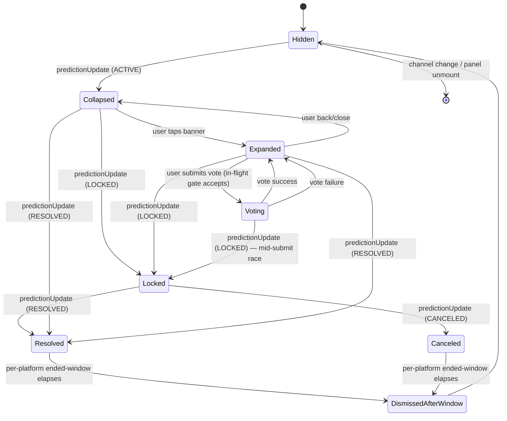
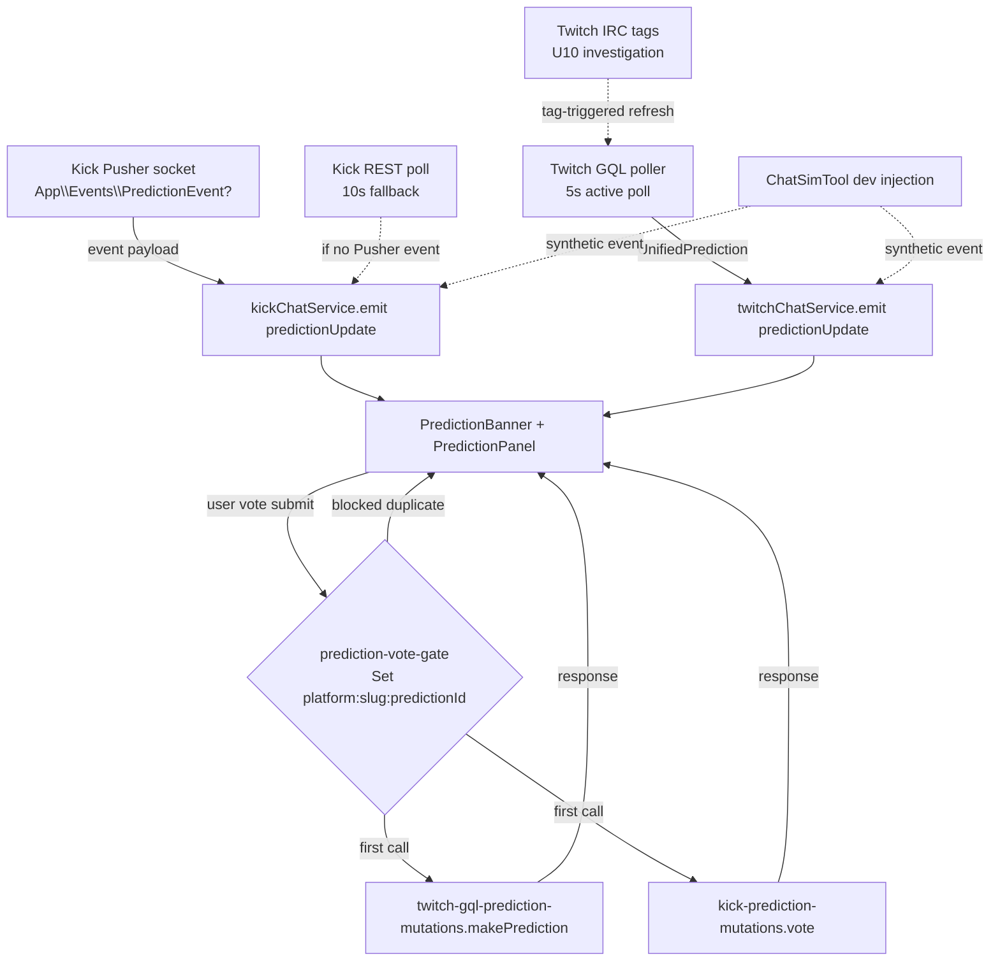

# Viewer Prediction Widget — Twitch and Kick Chat Predictions With Voting and Style Toggle

## Summary

Build a viewer-facing prediction widget in the chat panel of both Twitch and Kick channels — collapsed banner → expanded detail panel → ended-state recap — with start detection (5s GQL polling on Twitch following the 2026-04-14 PubSub shutdown; Kick Pusher event subscription with REST-polling fallback), voting from inside StreamForge (Twitch GQL `MakePrediction` mutation; Kick vote endpoint reverse-engineered during implementation with read-only fallback), three visual styles (Twitch-native, Kick-native, unified StreamForge) selectable from a new dedicated **Predictions** Settings section, and matching ChatSimTool dev-injection parity (predictions live + ended for both platforms, plus the missing Twitch poll-injection pair).

---

## Problem Frame

Viewer-side prediction surfaces are invisible in StreamForge today, while every native client and most competitors show them prominently above chat with live tallies and a vote affordance. Origin doc carries the full pain framing; this plan focuses on the **how**. The brainstorm assumed PubSub for Twitch real-time with GQL polling as fallback, but PubSub was fully shut down on 2026-04-14 (about a month before plan date), so the "fallback" path is now the primary and the IRC-tag investigation lands as a separate optional unit. (see origin: `docs/brainstorms/2026-05-18-viewer-prediction-widget-requirements.md`)

---

## Requirements

All 30 requirements from the origin requirements doc are addressed by this plan. Mapping is shown per implementation unit; the consolidated map:

- R1, R2 → U6 (banner)
- R3 (panel open/back/close UI) → U6
- R4 (panel content display, payout odds, viewer-vote highlight) → U6, U7
- R5 → U6 (Twitch bubble visualization)
- R6, R7 → U7 (voting flow + balance display)
- R8 (Twitch side) → U3; R8 (Kick side) → U5; wiring → U7
- R9 → U6, U7 (already-voted highlight)
- R10, R11 → U7 (vote error states + pending)
- R12 → U4 (Kick real-time)
- R13 → U2 (Twitch GQL polling). IRC tag near-real-time upgrade deferred to Follow-Up Work (see Scope Boundaries).
- R14 → U2, U4 (bootstrap on reconnect/mount)
- R15, R16, R17 → U6 (ended state)
- R18, R19, R20, R21 → U6 (visual styles), U1 (theme tokens)
- R22 → U1 (normalized model)
- R23 → U8 (Settings section)
- R24 → U6, U8 (live re-render on toggle)
- R25, R26, R27 → deferred until multistream chat is actually implemented. The current `apps/desktop/src/pages/MultiStream/index.tsx:125-131` chat panel is a placeholder stub (descriptive text + disabled chat input, not a real `KickChat`/`TwitchChat` mount). Per-slot prediction isolation is a no-op in v1 — these requirements reactivate when multistream chat ships. See Key Technical Decisions and Risk Analysis.
- R28, R29 → U9 (ChatSimTool dev injection)
- R30 → U2, U4, U6 (channel-change teardown)

**Origin actors:** A1 (viewer), A2 (broadcaster acting as viewer), A3 (moderator acting as viewer).
**Origin flows:** F1 (prediction starts), F2 (viewer expands), F3 (viewer casts vote), F4 (prediction resolves).
**Origin acceptance examples:** AE1-AE10 — each is honored by one or more units' test scenarios. AE-links appear inline on the relevant test scenarios.

---

## Scope Boundaries

- Historical/scrollback predictions: not in scope. Only the most recent active or just-ended prediction is shown.
- Broadcaster Engagement tab (`apps/desktop/src/components/chat/mod/tabs/EngagementPredictions.tsx`): unchanged. Helix-polled 5s broadcaster console keeps its current shape.
- System-level OS notifications when a prediction starts: not in scope.
- Multi-channel aggregate prediction view: not in scope.
- Prediction creation from the viewer widget: not in scope (broadcaster-only via existing Engagement tab).
- Mobile / responsive layout: desktop Electron only.
- AutoMod, Streamlabs, and giveaway-adjacent features: remain out per the 2026-05-18 channel-mgmt scope change.

### Deferred to Follow-Up Work

- **Twitch IRC tag investigation for near-real-time prediction signals**: investigate whether Twitch sends prediction-related tags on IRC PRIVMSG / USERNOTICE messages (e.g., `prediction-id`, `outcome` markers) that the existing tmi.js client could surface as a refresh trigger supplementing the 5s GQL polling. Originally scoped as a numbered unit (U10); collapsed to follow-up because it is investigation-first, zero-code if no tags surface, and the polling baseline already satisfies R13. If the investigation finds useful tags, capture in a `docs/solutions/` artifact and open a follow-up plan to wire them.
- **R25-R27 multistream slot isolation**: reactivate when multistream chat gains a real mount. Currently a stub in `MultiStream/index.tsx:125-131`.
- **PubSub-equivalent EventSub viewer path on own channel only**: if user demand surfaces for real-time prediction events when watching one's *own* channel, the asymmetric EventSub-on-own-channel path (option 4 in the planning question) becomes a follow-up. Not included in this plan.
- **Brand-drift cleanup** (code references "StreamFusion" while user-facing name is StreamForge): noticed during research but explicitly out of scope per surgical-changes guidance in `CLAUDE.md`.
- **`docs/solutions/` learning capture** for the new PubSub-replacement real-time pattern: candidate for `/ce-compound` after this work ships (no current learning entry exists for real-time event flow on either platform).

---

## Context & Research

### Relevant Code and Patterns

- `apps/desktop/src/shared/chat-types.ts` (lines 289-314) — `KickPoll` shape and `ChatServiceEvents` interface; both `twitchChatService` and `kickChatService` extend this single interface. New `predictionUpdate` event lands here.
- `apps/desktop/src/backend/services/chat/kick-chat.ts` (lines 790-796) — Pusher binding pattern: `pusherChannel.bind("App\\Events\\PollUpdateEvent", data => this.emit("pollUpdate", poll))`. Prediction binding mirrors this.
- `apps/desktop/src/backend/services/chat/twitch-chat.ts` — IRC service for Twitch; shares `ChatServiceEvents` shape.
- `apps/desktop/src/backend/services/chat/twitch-pin-poller.ts` — pattern template for `twitch-prediction-poller.ts` (10s polling loop + emit-on-change).
- `apps/desktop/src/backend/api/platforms/twitch/twitch-gql-pin-mutations.ts` — template for `twitch-gql-prediction-mutations.ts`. Anonymous Android Client-Id `kd1unb4b3q4t58fwlpcbzcbnm76a8fp` works for authenticated mutations when paired with `Authorization: Bearer ${oauth_token}`; 10s `AbortSignal.timeout`; discriminated-union result `{ ok: true } | { ok: false; kind; message }`. **Note:** for `MakePrediction` specifically, external research suggests the web Client-Id `kimne78kx3ncx6brgo4mv6wki5h1ko` is the documented pattern in active third-party clients — Android Client-Id bypass is not confirmed for this mutation. Verify during implementation.
- `apps/desktop/src/backend/api/platforms/twitch/twitch-gql-client.ts` (lines 58-65) — comment block explaining Client-Id and integrity-bypass behavior.
- `apps/desktop/src/backend/api/platforms/twitch/twitch-helix-predictions.ts` (lines 34-62) — `PredictionPayload`, `PredictionOutcome`, `PredictionOutcomePredictor` types. Reusable as shape reference for `UnifiedPrediction`.
- `apps/desktop/src/backend/api/platforms/kick/kick-pin-mutations.ts` — template for `kick-prediction-mutations.ts`. `https://kick.com/api/v2`, Bearer OAuth, JSON body, `classify(status, body)` for discriminated error result.
- `apps/desktop/src/backend/api/platforms/twitch/twitch-eventsub-client.ts` — pattern for a new `twitch-pubsub-client.ts` if PubSub-equivalent path is later needed (currently out of scope per Deferred Follow-Up Work).
- `apps/desktop/src/components/chat/twitch/TwitchChat.tsx` — chat host; builds `chatBody` JSX with fixed slot ordering (pinned → poll → modstrip → message list → input). Prediction banner slots between pinned and poll.
- `apps/desktop/src/components/chat/kick/KickChat.tsx` — same shape; also defines `KickPollWidget` inline (lines 985-1074) with `useState` + `kickChatService.on("pollUpdate", ...)` + auto-dismiss timer. Pattern template for the prediction banner's local state.
- `apps/desktop/src/components/chat/PinnedMessageBanner.tsx` — narrow-width banner reference, documented as safe down to ~280px (multistream slot floor). Same constraint applies to prediction banner.
- `apps/desktop/src/components/multistream/stream-slot.tsx` (line 101 area) and `apps/desktop/src/pages/MultiStream/index.tsx` — multistream is single-panel-chat: `useMultiStreamStore.chatStreamId` picks ONE slot for chat. Per-channel isolation is free.
- `apps/desktop/src/components/dev/ChatSimTool.tsx` (lines 336-364 for `injectPollKick`/`injectPollEndedKick`, 542-547 for pill buttons) — pattern to mirror for prediction injections on both platforms.
- `apps/desktop/src/pages/Settings/index.tsx` (lines 100-140) — hardcoded sidebar `useState("playback")` with `{activeTab === "xxx" && <content/>}` blocks. New Predictions tab = new SidebarItem + new content block.
- `apps/desktop/src/store/auth-store.ts` — `preferences` field round-trips through IPC via `updatePreferences()`. Add `preferences.predictions.style` here.
- `apps/desktop/src/lib/id-utils.ts` — `channelsMatch(a, b)` helper for Kick dual-ID safety. Any prediction-state map keyed by Kick channel must use this or key by slug.
- `apps/desktop/tailwind.config.mjs` — confirmed `storm-accent: #dc143c`, `twitch: #9146ff`, `kick: #53fc18`. Plan adds `twitch.pink: #ff4f8c` and `twitch.blue: #387aff` for Twitch outcome colors.
- `reference/Xtra For-Twitch-Better-Functions-etc-master/app/src/main/java/com/github/andreyasadchy/xtra/util/chat/PubSubWebSocket.kt` (lines 59-88) and `PubSubUtils.kt` (lines 115-147) — historical reference for the PubSub topic `predictions-channel-v1.${channelId}` and event JSON shape. Not used at runtime since PubSub is shut down, but useful for confirming the prediction event JSON shape Twitch sends today (likely identical via GQL `Prediction` queries).

### Institutional Learnings

- `docs/solutions/integration-issues/twitch-gql-search-pagination-skeleton-flicker-loop-2026-05-17.md` — informs `MakePrediction` mutation and any GQL-polling fallback. Three key takeaways:
  - **Persisted-query variables drop silently if not in the typed interface.** Every variable (`eventID`, `outcomeID`, `points`, `transactionID`) MUST be in the typed interface.
  - **Integrity rejection has a specific shape** — `extensions.code` containing `INTEGRITY`, or message lower-cased containing `integrity` + (`check`/`failed`/`rejected`). Don't conflate with generic schema errors mentioning `clientIntegrity` fields.
  - **`AbortSignal.timeout(10_000)` on every GQL POST.** Calibrated for Twitch p99.
- `docs/solutions/logic-errors/kick-guest-follows-dual-id-bridge-2026-05-15.md` — informs Kick prediction state and event correlation:
  - **Kick has two numeric IDs per channel** (`user_id` vs `channel.id`); only the slug is stable.
  - **Use `channelsMatch(a, b)` from `apps/desktop/src/lib/id-utils.ts` or key by slug.** Prediction event correlation MUST NOT rely on raw `channel.id`.
  - **Multi-row backend ops use `filter`, not `find`.** Predictions don't persist to SQLite, so this is informational only.
  - **In-flight gate keyed by `${platform}:${slug}:${predictionId}`** defends against rapid-click double-vote and against optimistic-update + socket-echo collisions during reconnect.

### External References

- **Twitch PubSub shutdown timeline:** [legacy PubSub deprecation forum post](https://discuss.dev.twitch.com/t/legacy-pubsub-deprecation-and-shutdown-timeline/58043) confirms 2026-04-14 18:00 UTC shutdown. EventSub `channel.prediction.*` requires `channel:read:predictions` or `channel:manage:predictions` (broadcaster-scoped — not available to viewers on other channels).
- **MakePrediction GQL hash and variables:** [Tkd-Alex/Twitch-Channel-Points-Miner-v2 constants.py](https://github.com/Tkd-Alex/Twitch-Channel-Points-Miner-v2/blob/master/TwitchChannelPointsMiner/constants.py) lists the hash `b44682ecc88358817009f20e69d75081b1e58825bb40aa53d5dbadcc17c881d8`. Variables shape from `Twitch.py`: `{ input: { eventID, outcomeID, points, transactionID } }` where `transactionID` is a 16-byte random hex. **Twitch rotated GQL hashes on 2025-11-11** ([streamlink discussion](https://github.com/streamlink/streamlink/discussions/6789)) — hash MUST be re-verified against twitch.tv network traffic before shipping.
- **Kick API status:** no documented prediction read or vote endpoint in [Kick's public API docs](https://docs.kick.com) or in any third-party library found ([KickLib](https://github.com/Bukk94/KickLib), [kick-api Rust crate](https://lib.rs/crates/kick-api), KickTalk). [fb-sean/kick-website-endpoints](https://github.com/fb-sean/kick-website-endpoints) documents `/api/v2/channels/{channel}/polls/vote` for polls — predictions equivalent not listed. Pusher event names: undocumented. Reverse-engineering during U4 and U5 implementation is the path.

---

## Key Technical Decisions

- **Single shared `UnifiedPrediction` shape lives in `shared/chat-types.ts`, alongside `KickPoll`.** Mirrors the existing convention: chat-event payload types live in `shared/chat-types.ts`; both `twitchChatService` and `kickChatService` consume them via the shared `ChatServiceEvents` interface. Alternative considered: separate `Prediction` types per platform with a normalization adapter at the widget boundary. Rejected — the brainstorm's R22 specifically calls out that normalization happens at the chat-service / platform boundary, not the widget, so the shared shape belongs at the service-event seam.
- **5s GQL polling on Twitch for read; no PubSub WebSocket client.** PubSub is shut down. Building a `twitch-pubsub-client.ts` would be dead code. EventSub viewer-on-own-channel is deferred (see Scope Boundaries). U10 investigates IRC tags as a no-WebSocket near-real-time upgrade.
- **IRC tag investigation lives as a standalone unit (U10), gated by what the investigation finds.** If tags carry prediction-related signals (e.g., `prediction-*` tags on PRIVMSG or USERNOTICE), wire them as a refresh trigger that supplements the 5s polling — gives sub-second start detection without a new WebSocket. If no tags carry useful signals, the unit closes without code.
- **Kick prediction APIs are reverse-engineered during implementation (U4, U5) — not before.** Two ways to find: (a) open kick.com in a prediction-active stream and inspect Network tab + Pusher socket traffic in DevTools; (b) decompile the kick.com web bundle for endpoint URLs and Pusher event names. Plan U4/U5 with REST polling fallback (Kick) and read-only fallback (Kick vote) so the build doesn't block if endpoints can't be found.
- **In-flight vote gate is module-scoped `Set<string>` keyed by `${platform}:${slug}:${predictionId}`** in a new `apps/desktop/src/lib/prediction-vote-gate.ts`. Matches the in-flight-gate pattern called out in the Kick dual-ID learning. Defends against double-vote from rapid clicks AND from optimistic-update + socket-echo collisions during reconnect bootstrap.
- **Per-channel isolation is deferred until multistream chat is built.** The multistream chat panel at `apps/desktop/src/pages/MultiStream/index.tsx:125-131` is currently a placeholder stub (descriptive text + disabled chat input, not a real `KickChat`/`TwitchChat` instance). Both `kickChatService.acquire()` (`kick-chat.ts:341`) and `twitchChatService.acquire()` (`twitch-chat.ts:274`) take no arguments — ref-counting is a single global counter, not per-channel. R25-R27 from the brainstorm cannot be satisfied "for free" by the current architecture as the brainstorm assumed; they carry forward as deferred until multistream chat ships with a real chat mount. v1 mounts the prediction widget exclusively from the single-stream `Stream/index.tsx` path; one channel at a time, channel-change teardown (R30) handles the transition.
- **`UnifiedPrediction.viewerOutcomeId` and `viewerStake`** as part of the normalized shape (not a separate "self-state" object). Both platforms expose viewer's own vote via their read responses; folding it into the main payload keeps the widget's render path simple.
- **Per-platform ended-state display windows are constants in `prediction-display-windows.ts`** (or inline at the widget), looked up by platform. Defer the exact second counts to implementation (origin's only Deferred-to-Planning item) — observe twitch.tv and kick.com directly during the build.
- **Use Android Client-Id `kd1unb4b3q4t58fwlpcbzcbnm76a8fp` for both U2 read query and U3 `MakePrediction` mutation** — matching the existing pin mutations and the codebase's documented strategy. `apps/desktop/src/backend/api/platforms/twitch/twitch-gql-client.ts:58-65` explicitly states: web Client-Id (`kimne78…`) pairs with Client-Integrity headers in real browser traffic and trips integrity without them; Android Client-Id bypasses that pairing. Third-party miner code that uses web Client-Id runs in automation contexts where integrity is inherited from other paths — this app's auth model is closer to Xtra's Android pattern. If U3's spike (see U3 Approach) reveals `MakePrediction` specifically rejects Android Client-Id where pins do not, U3 documents the divergence and the integrity-fallback path activates.
- **Tailwind tokens `twitch.pink` and `twitch.blue`** added for Twitch outcome colors. Verified against current twitch.tv values during U1 implementation. Pink `#ff4f8c` and blue `#387aff` are the starting guesses from prior third-party clients — re-check during impl.

---

## Open Questions

### Resolved During Planning

- **Where does `UnifiedPrediction` live?** → `apps/desktop/src/shared/chat-types.ts`, alongside `KickPoll`. Both chat services consume it via the existing `ChatServiceEvents` interface.
- **Twitch real-time path post-PubSub-shutdown?** → 5s GQL polling for v1 (U2). U10 investigates IRC tags as a near-real-time upgrade.
- **Multistream isolation strategy?** → Deferred. The multistream chat panel is a placeholder stub today (`MultiStream/index.tsx:125-131`); per-slot prediction isolation cannot be tested or satisfied until a real chat mount lands. R25-R27 reactivate at that point.
- **What does the widget show in LOCKED state?** → Same expanded panel as ACTIVE, with the vote control hidden/disabled and a "Voting locked" badge near the title. Tallies continue to update if any late server updates arrive. Matches both platforms' native behavior.
- **Mid-submit race with prediction lock event?** → If the lock event arrives between submit-fired and ack-received, the resulting server error is shown with distinct copy ("Prediction locked before your vote registered — KCP/points refunded if applicable"). No auto-retry; the window is gone.
- **Channel switch while expanded panel is open?** → Teardown resets to collapsed banner on the new channel (if the new channel has an active prediction). Expanded state never carries across channel switches.
- **Style toggle mid-pending-vote?** → React component re-renders preserve transient state (pending submits, selected stake) because they live in component-local `useState`. No special handling needed.
- **Broadcaster running viewer widget alongside their own Engagement tab?** → Viewer widget subscribes only to `predictionUpdate` events from the chat service. The broadcaster's mod-console Helix poll is a separate data source. The two will converge after server round-trip; brief divergence (5-10s) is acceptable.
- **Balance display refresh after successful vote?** → Show post-debit snapshot (local computation: `displayedBalance - stake`). Refresh on next prediction or on next panel reopen.

### Deferred to Implementation

- **Exact `MakePrediction` GQL hash (re-verify before ship).** Hash `b44682ec...` is the latest known public value; Twitch rotated hashes on 2025-11-11 and may rotate again. Capture twitch.tv DevTools network traffic during U3 and update if needed.
- **Exact Kick prediction read endpoint URL.** Reverse-engineer via kick.com DevTools (Network tab on an active-prediction channel) during U4.
- **Exact Kick prediction Pusher event name.** Reverse-engineer via Pusher socket inspection during U4. If no event exists, fall back to REST polling.
- **Exact Kick vote endpoint URL.** Reverse-engineer during U5. If none found, ship Kick widget read-only with deeplink to kick.com.
- **Exact channel-points balance fetch endpoint (Twitch GQL).** Likely `ChannelPointsContext` query or similar; verify during U7.
- **Exact KCP balance fetch endpoint (Kick).** Verify during U7.
- **Exact ended-state display windows in seconds for each platform.** Observe twitch.tv and kick.com on a resolved prediction during U6.
- **Whether Client-Integrity is enforced on `MakePrediction`.** Test during U3; if integrity is enforced, surface as a discrete "rate-limited / integrity-rejected" error state in the vote UI (don't conflate with generic network failure).
- **Whether Twitch sends prediction-related IRC tags during active predictions.** Investigate during U10 with a packet sniffer or by logging incoming tmi.js message tags on a known-prediction-active channel.

---

## High-Level Technical Design

> *This illustrates the intended approach and is directional guidance for review, not implementation specification. The implementing agent should treat it as context, not code to reproduce.*

**Spec-flow notation used in unit test scenarios:** Findings from the ce-spec-flow-analyzer pass are referenced inline by short codes — C1/C2/C3 (concurrency / state-transition gaps the plan addresses with planning decisions: LOCKED-state visuals, mid-submit lock race, in-flight gate), I1/I3/I4 (integration / lifecycle gaps: silent reconnect bootstrap, mid-window mount, channel switch with expanded panel). These codes are internal to this plan; resolution behavior is folded into the corresponding Approach and Test scenarios sections.

### Widget state machine



### Data flow



### Normalized payload shape (directional sketch)

```text
UnifiedPrediction {
  id, platform: "twitch" | "kick", title,
  status: ACTIVE | LOCKED | RESOLVED | CANCELED,
  outcomes: [
    {
      id, title,
      color: "blue" | "pink" | "green" | "magenta" | null,
      totalAmount, userCount,
      topPredictors?: [{ userId, userName, amount }],
    }
  ],
  winningOutcomeId,
  predictionWindowSeconds,
  endedAt,
  viewerOutcomeId,  // null until viewer votes
  viewerStake,      // null until viewer votes
}
```

---

## Implementation Units

### U1. Foundation: shared types, theme tokens, settings preferences

**Goal:** Land the type contract (`UnifiedPrediction`, `UnifiedPredictionOutcome`, extend `ChatServiceEvents` with `predictionUpdate`), the Tailwind theme additions (`twitch.pink`, `twitch.blue`), and the new `preferences.predictions` shape on the auth store. Everything downstream depends on this unit.

**Requirements:** R20, R21, R22 (foundation for visual styling, settings persistence, normalized model)

**Dependencies:** none

**Files:**
- Modify: `apps/desktop/src/shared/chat-types.ts` — add `UnifiedPrediction` and `UnifiedPredictionOutcome` interfaces; extend `ChatServiceEvents` with `predictionUpdate: (p: UnifiedPrediction) => void`
- Modify: `apps/desktop/tailwind.config.mjs` — add `twitch.pink: '#ff4f8c'` and `twitch.blue: '#387aff'` (verify against current twitch.tv values during implementation)
- Modify: `apps/desktop/src/shared/auth-types.ts` — add `PredictionPreferences` interface (`{ style: "native" | "unified" }`); add `predictions: PredictionPreferences` to the `UserPreferences` interface; add `DEFAULT_PREDICTION_PREFERENCES` constant; include in `DEFAULT_USER_PREFERENCES`
- Modify: `apps/desktop/src/store/auth-store.ts` — only adjust if local default logic needs touching (the shared-types change covers the field shape and default)
- Audit: any main-process IPC schema or handler that round-trips `UserPreferences` for shape consistency (no behavior change expected; field is additive)
- Test: `apps/desktop/tests/shared/chat-types.test.ts` (if not present, create) — type-level test that `UnifiedPrediction` matches the shape both services emit
- Test: `apps/desktop/tests/store/auth-store.test.ts` — exists already; add cases for predictions-preferences persistence

**Approach:**
- Keep `UnifiedPrediction` minimal — fields both platforms can plausibly fill. Optional `topPredictors` for Twitch-native bubble chart.
- `viewerOutcomeId` and `viewerStake` live on `UnifiedPrediction` directly (not a separate "self-state" object) since both platforms expose viewer's own vote in their read responses.
- Preferences default to `native`; existing `preferences` IPC round-trip handles persistence automatically.

**Patterns to follow:**
- `KickPoll` shape (`apps/desktop/src/shared/chat-types.ts:295-300`) — simple, flat, no nested optional containers beyond the outcome list.
- `useAuthStore.preferences.playback.defaultQuality` (`apps/desktop/src/store/auth-store.ts`, around lines 67-82) — pattern for adding a new persisted preference key.

**Test scenarios:**
- Happy path: type test — `UnifiedPrediction` can be constructed for both `platform: "twitch"` and `platform: "kick"` with no missing fields.
- Happy path: `preferences.predictions.style` defaults to `"native"` when a fresh `useAuthStore` is initialized.
- Edge case: `updatePreferences({ predictions: { style: "unified" } })` persists across an IPC round-trip and is readable after store rehydration.

**Verification:**
- `npm run typecheck` passes with new types in place.
- Tailwind `twitch.pink` and `twitch.blue` are usable as `bg-twitch-pink` / `text-twitch-blue` in JSX (smoke-test in a throwaway component if needed during U6).
- A unit test confirms `preferences.predictions.style` defaults to `"native"` and round-trips through `updatePreferences`.

---

### U2. Twitch viewer-side prediction read path (5s GQL polling)

**Goal:** Read active Twitch predictions as a viewer (NOT via Helix, which requires broadcaster scope). Implement a GQL viewer-side query + 5s poller modeled on `twitch-pin-poller.ts`, emitting `predictionUpdate` through `twitchChatService`. Bootstrap on connect/reconnect/mount (R14). Stop polling when no prediction is known active.

**Requirements:** R12 (real-time event flow — Twitch side), R13 (Twitch path), R14 (bootstrap), R30 (channel-change teardown)

**Dependencies:** U1

**Files:**
- Create: `apps/desktop/src/backend/api/platforms/twitch/twitch-gql-predictions.ts` — GQL query for active prediction(s) on a channel (viewer-side, web Client-Id, OAuth user token). Returns `UnifiedPrediction | null`.
- Create: `apps/desktop/src/backend/services/chat/twitch-prediction-poller.ts` — 5s `setInterval` polling loop; emits `predictionUpdate` when state changes; stops when null returned twice in a row (no active prediction).
- Modify: `apps/desktop/src/backend/services/chat/twitch-chat.ts` — wire poller start/stop into the chat service lifecycle (`acquire`/`release`); fire bootstrap query on connect and on `connectionStateChange` events.
- Test: `apps/desktop/tests/backend/api/platforms/twitch/twitch-gql-predictions.test.ts` — query shape, parsing, error classification
- Test: `apps/desktop/tests/backend/services/chat/twitch-prediction-poller.test.ts` — polling interval, stop-after-null, emit-on-state-change
- Test: `apps/desktop/tests/backend/services/chat/twitch-chat.test.ts` — bootstrap-on-connect, teardown-on-release

**Approach:**
- **Investigation-first execution.** Before writing any polling code, capture twitch.tv DevTools traffic on a known active-prediction channel and confirm the viewer-side GQL operation that reads active predictions: operation name, persistedQuery hash (if used), variables interface, response shape. **Go/no-go gate:** if no viewer-readable prediction read query surfaces in twitch.tv's actual network traffic (or every read path requires broadcaster-only scopes that the viewer cannot grant), U2 cannot ship as planned. In that case: (a) escalate to the Twitch IRC tag investigation (in Scope Boundaries → Deferred to Follow-Up Work) as a potential near-real-time supplement, OR (b) document that Twitch viewer-side reads are unfeasible in this app's auth context and update Success Criteria. Do not write polling code against an unverified assumed-existing query.
- The Twitch web client's viewer-side prediction read is likely `Channel.predictionEvent` (or similar single-active-prediction shape) via GQL — based on the read query shape used by reference clients pre-PubSub-shutdown. Confirm via the DevTools capture above. Until verified, use the document-string GQL path (`twitch-gql-client.ts:gqlRequest`) rather than persisted-query path — slower but visible in query body, makes debugging easier.
- Android Client-Id `kd1unb4b3q4t58fwlpcbzcbnm76a8fp` + OAuth user token from `await window.electronAPI.auth.getToken("twitch")`. Matches the existing pin mutations and the codebase's documented strategy at `twitch-gql-client.ts:58-65`.
- 5s polling cadence matches the existing broadcaster Engagement tab (`useHelixPoll` at `POLL_INTERVAL_MS = 5_000`). Visibility-aware polling: pause when document is hidden (mirror `useHelixPoll`'s visibility check at `apps/desktop/src/hooks/useHelixPoll.ts`).
- `predictionUpdate` emit fires only when the prediction state has *changed* (new ID, status transition, or material tally change) — not on every poll tick, to keep render churn down.
- Bootstrap query fires on (a) `chatService.acquire(channelId)`, (b) `connectionStateChange` to `connected` after a disconnect, (c) page visibility returning to visible.
- Teardown on `chatService.release(channelId)` clears the interval and emits a final `predictionUpdate` with `status: HIDDEN`-equivalent (or relies on the channel-change to unmount the widget).

**Execution note:** Start with a failing test that asserts `twitchChatService.emit("predictionUpdate", ...)` fires on the first successful poll. Build out from there.

**Patterns to follow:**
- `apps/desktop/src/backend/services/chat/twitch-pin-poller.ts` — full template for polling loop, mount/unmount lifecycle, emit-on-change.
- `apps/desktop/src/backend/api/platforms/twitch/twitch-gql-pin-mutations.ts` — auth header construction, `AbortSignal.timeout(10_000)`, error classification.
- `apps/desktop/src/hooks/useHelixPoll.ts` — visibility-aware polling pattern.
- Integrity rejection classification per `docs/solutions/integration-issues/twitch-gql-search-pagination-skeleton-flicker-loop-2026-05-17.md`.

**Test scenarios:**
- **Covers F1.** Happy path: GQL query returns an active prediction; the poller emits exactly one `predictionUpdate` event with the parsed `UnifiedPrediction`; subsequent identical-state polls do not re-emit.
- **Covers AE5.** Happy path (bootstrap): `chatService.acquire("channelid")` fires an immediate GQL query (before the first 5s tick) and emits `predictionUpdate` if a prediction is mid-window. Mid-prediction join produces a populated banner without waiting for the next regular poll tick.
- Happy path (status transition): poller observes ACTIVE → LOCKED transition; emits `predictionUpdate` with new status.
- Edge case (no active prediction): poll returns null twice in a row; poller stops polling (resumes on next bootstrap trigger).
- Edge case (page hidden): `document.visibilityState === "hidden"` during a scheduled poll tick — skip the GQL request; resume on visibility-change.
- Error path (HTTP 401): auth token expired mid-poll. Retry once via `twitchAuthService.refreshToken()` (mirror `apps/desktop/src/backend/api/platforms/twitch/twitch-requestor.ts:206-215`); if refresh fails, emit a distinct "Reconnect Twitch" chat-error and pause the poller until next bootstrap trigger. Do not crash the poller.
- Error path (HTTP 503): transient failure; backoff to next scheduled tick rather than tight-looping.
- Error path (integrity rejection): response matches the integrity-error shape; classify as a distinct error type (not generic network failure) so the widget can show "Twitch is rate-limiting / bot-checking" copy.
- Integration: `kickChatService.release()` after acquire stops the poller within the next tick interval; no orphaned timers.

**Verification:**
- A live channel with an active prediction shows the banner within 5s of mounting `TwitchChat`.
- Channel switch (acquire new channel) immediately tears down the prior poller; bootstrap query for the new channel fires.
- `twitchChatService.emit("predictionUpdate", ...)` is the single seam — confirmed by grep that no other call site emits this event in production code.

---

### U3. Twitch vote mutation: `MakePrediction` GQL

**Goal:** Implement the Twitch viewer-side vote mutation. Match the pin-mutations file shape: discriminated `{ ok: true, payload } | { ok: false, kind, message }` result, 10s `AbortSignal.timeout`, error classification covering integrity rejection, insufficient channel points, locked outcome, prediction not found, and generic network failure.

**Requirements:** R6 (vote outcome — Twitch side), R8 (Twitch internal API), R10 (error states)

**Dependencies:** U1

**Files:**
- Create: `apps/desktop/src/backend/api/platforms/twitch/twitch-gql-prediction-mutations.ts` — exports `makePrediction({ accessToken, eventID, outcomeID, points }): Promise<MakePredictionResult>`. Generates a fresh 16-byte hex `transactionID` per call (per the third-party reference) using `crypto.getRandomValues(new Uint8Array(16))` then hex-encoding — NOT `Math.random` (insufficient entropy, predictable from any observed prior output; relevant given the renderer runs with `webSecurity: false` per `apps/desktop/src/backend/window-manager.ts:132`).
- Test: `apps/desktop/tests/backend/api/platforms/twitch/twitch-gql-prediction-mutations.test.ts` — mock GQL responses; verify all error classifications

**Approach:**
- **Spike before scaling.** First iteration of U3 captures live `MakePrediction` traffic from twitch.tv (DevTools Network on a live prediction) and attempts to reproduce from the app context using Android Client-Id + Bearer OAuth + the captured operation. If reproduction succeeds without integrity rejection, proceed with full discriminated-result implementation as planned. **If integrity is enforced and unbeatable from this app's auth context:** document the branch — Twitch widget ships read-only with a deeplink to twitch.tv (parallel to Kick's `notSupported` branch in U5), Success Criteria updates to acknowledge "Twitch voting depends on Client-Integrity outcome," and U7 wires the read-only fallback similarly to its Kick `notSupported` handling. The spike outcome is captured in the discovery doc (`docs/solutions/integration-issues/twitch-makeprediction-integrity-discovery-2026-05-NN.md`).
- Use the persistedQuery path with hash `b44682ecc88358817009f20e69d75081b1e58825bb40aa53d5dbadcc17c881d8` AND include the full document string as fallback (Twitch sometimes returns "PersistedQueryNotFound" forcing a follow-up request with the document body). Mirror the fallback pattern used in existing GQL mutations if present, otherwise use document-string only for v1.
- **Variables typed interface MUST include all four fields** (`eventID`, `outcomeID`, `points`, `transactionID`) per the persisted-query learning. Unlisted variables vanish silently and the mutation will fail in a hard-to-debug way.
- Error code mapping: response shape is `{ data: { makePrediction: { error: { code } } } }`. Map known codes:
  - `INSUFFICIENT_CHANNEL_POINTS` → `kind: "insufficientBalance"`
  - `EVENT_LOCKED` / `OUTCOME_LOCKED` → `kind: "outcomeLocked"`
  - `EVENT_NOT_FOUND` / `PREDICTION_NOT_FOUND` → `kind: "predictionGone"`
  - HTTP-level integrity rejection → `kind: "integrity"`
  - Other → `kind: "unknown"` with raw code in `message`
- Use Android Client-Id `kd1unb4b3q4t58fwlpcbzcbnm76a8fp` matching the existing pin mutations and the codebase's documented strategy (per Key Technical Decisions). The U3 spike above will surface if `MakePrediction` specifically requires a different Client-Id, in which case the integrity fallback branch activates.

**Patterns to follow:**
- `apps/desktop/src/backend/api/platforms/twitch/twitch-gql-pin-mutations.ts` — discriminated result, error classification, timeout, retry posture.
- Integrity-rejection classification per `docs/solutions/integration-issues/twitch-gql-search-pagination-skeleton-flicker-loop-2026-05-17.md`.

**Test scenarios:**
- **Covers AE3.** Happy path: mutation with valid `{ eventID, outcomeID, points, transactionID }` returns `{ ok: true, payload: <updated prediction> }`. Returned payload is normalizable into `UnifiedPrediction`.
- Error path: response includes `error: { code: "INSUFFICIENT_CHANNEL_POINTS" }` → result is `{ ok: false, kind: "insufficientBalance" }`.
- Error path: response includes `error: { code: "EVENT_LOCKED" }` → result is `{ ok: false, kind: "outcomeLocked" }` (covers C2 from spec-flow analyzer — mid-submit lock race).
- Error path: HTTP 403 + body matches integrity-error shape → result is `{ ok: false, kind: "integrity" }`.
- Error path: network timeout (10s `AbortSignal.timeout`) → result is `{ ok: false, kind: "network", message: "timeout" }`.
- Edge case: `points: 0` → input validation rejects before HTTP fires; result is `{ ok: false, kind: "invalidInput" }`.
- Edge case: `transactionID` is auto-generated when not provided; two consecutive calls produce distinct transaction IDs.

**Verification:**
- A successful vote in U7's wired UI produces an `ok: true` result and the displayed balance ticks down by the staked amount.
- Each known error code produces distinct UI copy in U7 (no generic "something went wrong").

---

### U4. Kick viewer-side prediction read path + Pusher subscription

**Goal:** Read active Kick predictions and receive real-time updates. Primary path: Kick Pusher event (event name unverified — reverse-engineer during implementation). Fallback path: 10s REST polling against the Kick prediction-read endpoint (URL also unverified — reverse-engineer). Emit `predictionUpdate` through `kickChatService`. Bootstrap on connect/mount.

**Requirements:** R12 (Kick real-time), R14 (bootstrap), R30 (teardown)

**Dependencies:** U1

**Files:**
- Create: `apps/desktop/src/backend/api/platforms/kick/kick-predictions.ts` — REST read of active prediction for a channel slug; returns `UnifiedPrediction | null`
- Modify: `apps/desktop/src/backend/services/chat/kick-chat.ts` — add Pusher event binding (`pusherChannel.bind("App\\Events\\<EventName>", ...)`) once event name is identified; if no event found, schedule 10s REST poll via `setInterval`. Emit `predictionUpdate` through `kickChatService`.
- Test: `apps/desktop/tests/backend/api/platforms/kick/kick-predictions.test.ts` — REST endpoint shape, parsing
- Test: `apps/desktop/tests/backend/services/chat/kick-chat.test.ts` — Pusher event handling OR poll-fallback timing; bootstrap on acquire

**Approach:**
- **Reverse-engineering steps (before writing code):**
  1. Open kick.com in a channel with an active prediction.
  2. In DevTools Network tab, filter for `predictions` / `prediction` / `wager` paths. Capture the read endpoint URL and response shape.
  3. In DevTools Console, watch the Pusher socket (`window.Echo` or direct `pusher-js` instance). When the broadcaster starts/locks/resolves a prediction, capture the channel name and event name (likely `App\Events\...`).
  4. Capture the JSON payload shape of both the REST response and the Pusher event.
- **Implementation paths based on findings:**
  - If Pusher event exists: bind it in `kick-chat.ts` alongside the existing `App\Events\PollUpdateEvent` binding (line 790-796); emit `predictionUpdate` on event arrival.
  - If only REST endpoint exists (no Pusher event): 10s polling loop modeled on the Twitch poller (U2), but emitting through `kickChatService`.
  - If neither exists: document as "Kick predictions not feasible at all" — fall back to widget hidden on Kick channels and surface in plan summary.
- Always run the REST bootstrap query on `chatService.acquire(channelSlug)` regardless of Pusher availability — handles mid-window mount (AE5).
- Key prediction state by channel slug, NOT by `channel.id` (per Kick dual-ID learning). Use `channelsMatch()` from `apps/desktop/src/lib/id-utils.ts` for any comparison.

**Execution note:** This unit is investigation-first. Spend the first iteration confirming the API shape via DevTools BEFORE writing any code. Capture findings in `docs/solutions/integration-issues/kick-predictions-api-discovery-2026-05-NN.md` for future reference. **Investigation budget:** one full session of DevTools inspection on a known-active Kick prediction stream, plus a 1-hour spot-check decompile of kick.com's main JS bundle for endpoint and Pusher event names. If no read endpoint or event surfaces after that budget, declare absent in the discovery doc and trigger U6's Kick-branch contingency (see U6 Dependencies). Do not extend indefinitely.

**Patterns to follow:**
- `apps/desktop/src/backend/services/chat/kick-chat.ts:790-796` — existing Pusher bind for `PollUpdateEvent`.
- `apps/desktop/src/backend/api/platforms/kick/kick-pin-mutations.ts` — Kick REST request shape (Bearer OAuth, JSON body, `classify(status, body)` error handling).
- `apps/desktop/src/lib/id-utils.ts` — `channelsMatch` for slug-safe correlation.
- `apps/desktop/src/backend/services/chat/twitch-prediction-poller.ts` (from U2) — REST polling pattern (if Kick has to fall back).

**Test scenarios:**
- **Covers F1, AE1 (Kick side).** Happy path (Pusher): bind handler fires on synthetic event; `kickChatService.emit("predictionUpdate", ...)` fires once with the parsed `UnifiedPrediction`.
- **Covers AE5 (Kick side).** Happy path (bootstrap): `acquire(slug)` fires REST query; if a prediction is active, emit immediately.
- Happy path (status transition via Pusher): ACTIVE → RESOLVED event emits with `status: "RESOLVED"` and `winningOutcomeId` populated.
- Edge case (REST endpoint returns 404): treat as "no active prediction" — no emit; continue listening for Pusher events.
- Edge case (channel slug with mixed case): `channelsMatch` normalizes; correlation against existing state works.
- Edge case (channel re-acquire after release-acquire cycle): no duplicate Pusher binding (existing service correctly unbinds on release).
- Error path (Pusher disconnect mid-prediction): on reconnect, REST bootstrap fires; banner state catches up. (Covers spec-flow I1.)
- Integration: dev-injection via `ChatSimTool.injectPredictionKick` (U9) fires `kickChatService.emit("predictionUpdate", ...)` through the same code path real events use.

**Verification:**
- A live Kick channel with an active prediction shows the banner within ≤2s of `acquire()` (whether via Pusher or via REST bootstrap).
- Pusher reconnect mid-prediction triggers a fresh REST bootstrap that catches up the banner without remounting the widget.
- The discovery artifact (Kick endpoint URL, Pusher event name, payload shapes) is captured in a new `docs/solutions/` file for future reference.

---

### U5. Kick vote mutation

**Goal:** Implement Kick viewer vote mutation. Endpoint URL is unverified — reverse-engineer during implementation. If no vote endpoint exists, document and ship Kick read-only with a deeplink to kick.com (per brainstorm's "voting if we can, else read-only" rule).

**Requirements:** R6 (Kick side), R8 (Kick internal API), R10 (error states)

**Dependencies:** U1

**Files:**
- Create: `apps/desktop/src/backend/api/platforms/kick/kick-prediction-mutations.ts` — exports `voteOnPrediction({ accessToken, channelSlug, predictionId, optionId, amount }): Promise<KickPredictionVoteResult>` with discriminated result shape
- Test: `apps/desktop/tests/backend/api/platforms/kick/kick-prediction-mutations.test.ts`

**Approach:**
- **Reverse-engineering steps:**
  1. On kick.com, with channel-points enabled in a prediction-active channel, place a vote and capture the request in DevTools Network tab.
  2. Capture URL pattern (likely `POST https://kick.com/api/v2/channels/{slug}/predictions/{id}/vote` or similar — confirm against `fb-sean/kick-website-endpoints` polls vote pattern `/api/v2/channels/{channel}/polls/vote`).
  3. Capture request body shape, response body shape on success, response body shape on each error case.
- **If vote endpoint is found:** mirror `kick-pin-mutations.ts` discriminated result. Error code mapping (best-guess until verified):
  - `INSUFFICIENT_KCP` / `NOT_ENOUGH_KCP` → `kind: "insufficientBalance"`
  - `PREDICTION_LOCKED` / `VOTING_CLOSED` → `kind: "outcomeLocked"`
  - `PREDICTION_NOT_FOUND` / 404 → `kind: "predictionGone"`
  - Network/timeout → `kind: "network"`
  - Other → `kind: "unknown"` with raw response body
- **If no vote endpoint is found:** export `voteOnPrediction` that returns `{ ok: false, kind: "notSupported" }`. U7 detects this and shows a "Vote on kick.com" deeplink instead of the stake control. Document the decision in this plan's Deferred to Follow-Up Work section.

**Patterns to follow:**
- `apps/desktop/src/backend/api/platforms/kick/kick-pin-mutations.ts` — full template.
- Discriminated result + `classify(status, body)` pattern from the same file.

**Test scenarios:**
- **Covers AE3 (Kick side).** Happy path: vote with valid `{ channelSlug, predictionId, optionId, amount }` returns `{ ok: true, payload }`.
- Error path: response code matching `INSUFFICIENT_KCP` shape → `kind: "insufficientBalance"`.
- Error path: response code matching prediction-locked shape → `kind: "outcomeLocked"`.
- Edge case (`notSupported` fallback): if endpoint truly doesn't exist, calls return `{ ok: false, kind: "notSupported" }` and U7 renders the deeplink path. Tested by mocking the endpoint to 404.
- Edge case: `amount: 0` → input validation rejects before HTTP fires.

**Verification:**
- If the vote endpoint exists: a successful vote produces `ok: true` and the displayed KCP balance ticks down.
- If the vote endpoint does NOT exist (the `notSupported` path): the Kick widget shows a deeplink instead of a stake control, and the user can complete the vote on kick.com via that deeplink.

---

### U6. Viewer widget components: `PredictionBanner` + `PredictionPanel`

**Goal:** Build the collapsed banner, expanded detail panel, and ended-state recap. Implement the full state machine from High-Level Technical Design. Render three visual styles (Twitch-native, Kick-native, unified) per the user's settings choice. Hook into both `TwitchChat.tsx` and `KickChat.tsx` chat panels above the existing poll widget.

**Requirements:** R1, R2, R3, R4, R5 (bubble chart), R9 (already-voted highlight), R15, R16, R17 (per-platform ended-state windows), R18, R19, R20, R21, R24 (live re-render on toggle), R30 (channel-change teardown)

**Dependencies:** U1, U2, U4

**Kick branch contingency.** If U4 declares no Kick read path exists (after its time-boxed investigation budget), U6's Kick branch ships as "widget hidden on Kick with deeplink to kick.com" — do NOT write phantom Kick render code against absent data. The contingency is observable from U4's discovery doc; U6 implementation begins only after U4's go/no-go is documented.

**Files:**
- Create: `apps/desktop/src/components/chat/PredictionBanner.tsx` — collapsed banner (renders above chat input, narrow-width safe ≥280px)
- Create: `apps/desktop/src/components/chat/PredictionPanel.tsx` — expanded detail panel (overlays chat content within the slot)
- Create: `apps/desktop/src/components/chat/PredictionBubbleChart.tsx` — Twitch-native bubble visualization (used only in `style: "native" && platform: "twitch"`; static cluster acceptable per origin's `[Needs research]` flag on R5 — full bubble physics deferred)
- Create: `apps/desktop/src/lib/prediction-display-windows.ts` — per-platform ended-state display windows in seconds (Twitch and Kick constants; exact values from twitch.tv/kick.com observation during implementation)
- Modify: `apps/desktop/src/components/chat/twitch/TwitchChat.tsx` — slot `PredictionBanner` into `chatBody` between `PinnedMessageBanner` and the existing poll slot; subscribe to `twitchChatService.on("predictionUpdate", ...)`; local `useState` for collapsed/expanded; channel-change teardown
- Modify: `apps/desktop/src/components/chat/kick/KickChat.tsx` — same insertion, subscribing to `kickChatService.on("predictionUpdate", ...)`. Mirror the existing `KickPollWidget` inline-component pattern (lines 985-1074) for the local-state structure.
- Test: `apps/desktop/tests/components/chat/PredictionBanner.test.tsx`
- Test: `apps/desktop/tests/components/chat/PredictionPanel.test.tsx`
- Test: `apps/desktop/tests/components/chat/twitch/TwitchChat.test.tsx` — exists; extend with prediction-banner mount/unmount + style-toggle re-render
- Test: `apps/desktop/tests/components/chat/kick/KickChat.test.tsx` — same

**Approach:**
- **Banner shape:** title (truncated with ellipsis at narrow widths), compact two-outcome tally summary (large outcomes get truncated tally bar), primary affordance with platform-native wording (`See Details` on Twitch, `Predict` on Kick, `View Prediction` on unified).
- **Expanded panel layout:** title + total points/KCP contributed + per-outcome rows (rank badge, title, total amount, voter count, payout odds). For Twitch-native, add the `PredictionBubbleChart` above the outcomes list (leader-outcome focus). For Kick-native and unified, omit the bubble chart and use a simple horizontal-bar tally per outcome.
- **State machine** per the mermaid diagram in High-Level Technical Design. State is held in component-local `useState`. The `predictionUpdate` event handler is the single dispatcher; status transitions (ACTIVE → LOCKED, LOCKED → RESOLVED, etc.) flow through the same state update.
- **LOCKED state visuals:** identical to ACTIVE layout but with vote control hidden/disabled and a small "Voting locked" badge near the title. (Resolves spec-flow C1.)
- **Ended-state auto-dismiss:** per-platform window from `prediction-display-windows.ts` constants. `setTimeout` fires the `Hidden` transition; cleared on unmount.
- **Style branching:** a prop or context value `style: "twitch-native" | "kick-native" | "unified"` resolved from `useAuthStore.preferences.predictions.style` × `platform`. Component-level branch picks the styling token set (color, typography, shape).
- **Channel-change teardown (R30):** banner unmounts when its parent (`TwitchChat` / `KickChat`) unmounts on channel change. Expanded state never carries across channel switches (it's component-local, gone on unmount). (Resolves spec-flow I4.)
- **Already-voted highlight (R9):** `UnifiedPrediction.viewerOutcomeId` drives a `bg-twitch-purple/20` (Twitch) / `bg-kick/20` (Kick) / `bg-storm-accent/20` (unified) overlay on the matching outcome row.
- **Co-active poll + prediction stack order in `chatBody`:** when both a poll and a prediction are active simultaneously (broadcasters frequently run both), the slot ordering is fixed: `PinnedMessageBanner` → `PredictionBanner` → `PollWidget` → `InlineModStrip` → `ChatMessageList` → `ChatInput`. Newest engagement banner (prediction) sits above older one (poll) — matches the "newest engagement on top" convention. No vertical stacking conflict — both are inset, narrow-width safe.
- **Narrow-width layout (≥280px):** at widths <340px, the banner switches to a two-row layout: row 1 = title (truncated with ellipsis) + chart icon; row 2 = abbreviated tally (`53% / 47%` — outcome names dropped) + primary affordance (`See Details` / `Predict`). The straight-line single-row tally + CTA layout shown in the sketch is for widths ≥340px only. Add a responsive test scenario at 280px.
- **Multi-outcome styling (3-10 outcomes):** Twitch supports up to 10 outcomes; both Twitch-native and unified styles must handle this:
  - **Twitch-native:** uses Twitch's sequential outcome palette — blue, pink, yellow, green, orange, purple, red, cyan, brown, gray (mapped to outcomes 1-10). The expanded panel renders outcomes vertically (rank badge + color block + title + amount + percentage). The bubble chart focuses on the leader; for 3+ outcomes, an aggregated "Others (N%)" wedge represents the long tail.
  - **Kick-native:** native Kick predictions are typically 2-outcome (green/pink). For 3+ outcomes, fall back to a numbered list with no color pairing past outcome 2 — Kick's UI doesn't define this surface clearly.
  - **Unified:** sequential storm-accent tints from `storm-accent` (#dc143c) through neutral grays for outcomes 1-10. No bubble chart.
- **Payout odds format (per style):** Twitch-native displays ratio format `1:1.9` (matches twitch.tv). Kick-native displays percentage + KCP totals (e.g., `53% — 1.2M KCP`) matching kick.com. Unified displays percentage only.
- **Twitch-native ended-state top-predictor block (R16):** one row per outcome rendered as `username (X pts)` followed by `and N others` suffix when applicable. Layout: directly below the percentage in each outcome's column of the ended-state panel. Kick-native and unified ended states omit the top-predictor block (Kick doesn't display this natively; unified follows native fidelity for its non-platform-specific design).
- **Rank badge styling (per style):**
  - **Twitch-native:** color-keyed left-side block (4px wide, full row height) matching the outcome's palette color. No numbered badge.
  - **Kick-native:** no rank badge or side block. Outcomes 1 and 2 use the green/pink dot pair inline with the title. Outcomes 3+ (if present) use a small neutral numeric tag.
  - **Unified:** small neutral numbered tag (`1`, `2`, `3`) styled with storm-accent border. No color blocks.
- **`localVoteSubmittedAt` tracking for viewer-self-state staleness defense (Finding 8):** when a vote mutation succeeds (U7 wires this), U6 records `localVoteSubmittedAt: Date.now()` per prediction in component state. Subsequent `predictionUpdate` events whose payload carries `viewerOutcomeId === null` are suppressed (the `viewerOutcomeId` field specifically — other fields update normally) for 10 seconds after `localVoteSubmittedAt`. Prevents the poll-tick echo from re-showing the vote control after a successful submission. Add a test scenario covering the race: vote at T=0 with ack at T=1.5, poll response at T=1.6 carries stale `viewerOutcomeId: null`, widget continues showing voted-state until T=10.
- **In-flight gate clear-on-status-change (Finding 5):** in the `predictionUpdate` handler, when status transitions to `RESOLVED` or `CANCELED`, invoke `predictionVoteGate.clearForPrediction(predictionId)` to drop matching keys. Prevents stale gate accumulation across long sessions. Also call `predictionVoteGate.clearForChannel(slug)` when the chat service emits its channel-release event (channel switch / unmount).
- **Multistream:** v1 mounts the prediction widget only from single-stream `Stream/index.tsx`. Multistream chat is currently a stub (`MultiStream/index.tsx:125-131`) and predictions do not extend there. R25-R27 are deferred to follow-up work (see Scope Boundaries + Risk Analysis).
- **Focus management (expanded panel overlay):** when the panel opens (via "See Details" / "Predict" tap or keyboard activation), focus moves to the close (`✕`) control. Focus is trapped within the panel while open (Tab/Shift-Tab cycles inside; clicking outside does not steal focus). On close (✕ click, Escape, or back affordance), focus returns to the banner's primary affordance. Add an a11y test scenario covering keyboard-only navigation through open → close → reopen.

**Technical design:** *(directional)*

```text
<PredictionBanner platform={p} style={style}>          ← always in chatBody when prediction known
  ┌────────────────────────────────────────┐
  │ "<title — truncated>"      [📊 1.8M]  │
  │ outcome1 53% / outcome2 47%   [See Details ▸] │
  └────────────────────────────────────────┘

<PredictionPanel platform={p} style={style}>           ← overlays on user tap
  ┌────────────────────────────────────────┐
  │ ← Back     "Predictions"           ✕  │
  │                                        │
  │ <title>                                │
  │ <total points contributed>             │
  │                                        │
  │ [PredictionBubbleChart] (Twitch native │
  │   only — leader outcome + bubbles)     │
  │                                        │
  │ Options                                │
  │ ┌────────────────────────────────┐   │
  │ │ ▌ outcome1   979.1K   1:1.9    │   │ ← Twitch-native: color-keyed side block, no numbered badge.
  │ │ ▌ outcome2   848.9K   1:2.2    │   │   Highlighted (bg overlay) if viewerOutcomeId matches.
  │ └────────────────────────────────┘   │   Kick-native: green/pink dot pairs inline, no side block.
  │                                        │   Unified: small numeric tag (1, 2) with storm-accent border.
  │                                        │
  │ [Vote stake control] (U7 wires in)    │ ← hidden if LOCKED, RESOLVED, CANCELED, or already-voted
  │                                        │
  │ Locked badge / Winner badge (when      │
  │ status != ACTIVE)                      │
  └────────────────────────────────────────┘
```

**Patterns to follow:**
- `KickPollWidget` inline at `apps/desktop/src/components/chat/kick/KickChat.tsx:985-1074` — local-state + service subscription + auto-dismiss timer + collapsed/expanded toggle.
- `PinnedMessageBanner` at `apps/desktop/src/components/chat/PinnedMessageBanner.tsx` — narrow-width-safe (≥280px) banner pattern; chevron expand/collapse.
- Existing broadcaster `EngagementPredictions.tsx` (lines 350-407) — outcome list rendering pattern, percent calculation off `totalPoints`.

**Test scenarios:**
- **Covers AE1.** Happy path: `predictionUpdate` event with `status: "ACTIVE"`, platform `"twitch"`, style `"native"` renders a `bg-twitch` (#9146ff) banner with title, tally summary, and `See Details` button.
- **Covers AE1.** Happy path (Kick): same event for `platform: "kick"`, style `"native"` renders with Kick green/pink dots and `Predict` button.
- **Covers AE2.** Happy path (Twitch native expanded): tapping the banner mounts `PredictionPanel` with bubble chart showing leader-outcome percentage and the outcomes list.
- **Covers AE4.** Happy path (already voted): `viewerOutcomeId` is non-null → the matching outcome row is highlighted; the vote-submit area (U7) is hidden.
- **Covers AE6.** Happy path (resolved): `status: "RESOLVED"` event → ended view renders with Winner badge on `winningOutcomeId`, per-outcome final percentages, payout line. After per-platform window elapses, banner is removed from DOM.
- **Covers AE7.** Integration (style toggle): with banner mounted in collapsed state, toggling `preferences.predictions.style` from `"native"` to `"unified"` and back re-renders the banner with new styling and does NOT unmount/remount the underlying state. Pending submit (if any from U7) is preserved.
- Edge case (LOCKED state visuals): `status: "LOCKED"` event renders the expanded panel with a "Voting locked" badge and the vote-submit area hidden. Outcomes list and tally remain visible. (Resolves spec-flow C1.)
- Edge case (CANCELED state): banner shows "Prediction canceled — points refunded" copy, auto-dismisses on the per-platform window.
- Edge case (mid-window mount of RESOLVED prediction): `acquire` bootstrap returns a RESOLVED prediction with `endedAt` 30s ago and platform window of 60s — banner mounts in resolved state, auto-dismisses 30s later. (Resolves spec-flow I3.)
- Edge case (channel switch with expanded panel open): `TwitchChat` unmounts mid-expanded; new channel mounts with banner in collapsed state if a prediction is active there. Expanded state does NOT carry. (Resolves spec-flow I4.)
- Edge case (narrow width ≥280px): `PredictionBanner` renders without horizontal overflow; long titles truncate to ellipsis in the banner and wrap in the panel.

**Verification:**
- A live channel on each platform (Twitch, Kick) shows the right native styling.
- Toggling settings live (U8) re-renders the active banner without flicker.
- All AE1-AE7 scenarios verified in tests; manual verification on a live prediction confirms visual fidelity to the screenshots in origin doc.

---

### U7. Voting flow inside expanded panel

**Goal:** Wire the vote submission flow: outcome-select → stake input with balance display → submit → in-flight gate → mutation call (U3 for Twitch, U5 for Kick) → success/failure UI. Handles all error states from R10 with distinct copy. Defends against double-vote via the module-scoped in-flight gate.

**Requirements:** R6, R7 (balance), R8 (wiring), R10 (error states), R11 (pending state)

**Dependencies:** U3, U5, U6

**Files:**
- Create: `apps/desktop/src/components/chat/PredictionVoteForm.tsx` — outcome-select buttons + stake input + balance display + submit button + error message area
- Create: `apps/desktop/src/lib/prediction-vote-gate.ts` — module-scoped `Set<string>` keyed by `${platform}:${slug}:${predictionId}`; exports `acquire(key)` / `release(key)` / `isInFlight(key)` helpers
- Create (conditional): `apps/desktop/src/backend/api/platforms/twitch/twitch-gql-channel-points-balance.ts` — viewer's current channel-points balance. **Only create if** U2's prediction read response does NOT already include balance. Likely `ChannelPointsContext` query; verify during implementation.
- Create (conditional): `apps/desktop/src/backend/api/platforms/kick/kick-kcp-balance.ts` — viewer's current KCP balance. **Only create if** U4's prediction read response does NOT already include balance. Verify during implementation.
- Modify: `apps/desktop/src/components/chat/PredictionPanel.tsx` (from U6) — embed `PredictionVoteForm` when status is ACTIVE and viewer has not voted; handle Kick `notSupported` fallback (render deeplink)
- Test: `apps/desktop/tests/components/chat/PredictionVoteForm.test.tsx`
- Test: `apps/desktop/tests/lib/prediction-vote-gate.test.ts`
- Test: `apps/desktop/tests/backend/api/platforms/twitch/twitch-gql-channel-points-balance.test.ts`
- Test: `apps/desktop/tests/backend/api/platforms/kick/kick-kcp-balance.test.ts`

**Approach:**
- Auth token retrieval: every mutation call MUST retrieve the access token via `await window.electronAPI.auth.getToken("twitch" | "kick")` inside the submit handler — same pattern used at `apps/desktop/src/components/chat/twitch/TwitchChat.tsx:988-994` and `apps/desktop/src/components/chat/kick/KickChat.tsx:772-773`. Do NOT read a raw token from Zustand state or cache it in component state (renderer runs with `webSecurity: false`, and a Zustand-persisted token would land in localStorage where any renderer-loaded content could exfiltrate it).
- **Verify balance fetch necessity before creating new files (Finding 10):** before creating `twitch-gql-channel-points-balance.ts` or `kick-kcp-balance.ts`, confirm whether U2's prediction read response (and U4's Kick equivalent) already includes viewer balance. Twitch's `ChannelPointsContext` query commonly returns the balance alongside active-prediction data. If balance is in the prediction payload, the separate balance modules are dead infrastructure — drop them from U7 Files and read balance from the existing payload. If not, create them as planned.
- **Three balance states (Finding 9):** the vote form tracks `balance: { state: "loaded", value } | { state: "loading" } | { state: "failed", reason }`. UI behavior:
  - `loading`: show stake input but disable the submit button until fetch resolves (or after a 5s timeout, transition to `failed`). Show a subtle "Loading balance…" indicator.
  - `failed`: render "Balance unavailable" in place of the numeric balance. Allow submit anyway — let the mutation fail with `insufficientBalance` server-side if so. The server is the source of truth.
  - `loaded`: full local validation (must be > 0, must be ≤ balance, must be ≤ platform max where known).
- **In-flight gate uses `try { acquire } finally { release }` (Finding 5):** wrap the vote submission in `try { gate.acquire(key); /* mutation */ } finally { gate.release(key) }` to guarantee release on any throw path. The gate's API in `prediction-vote-gate.ts` exposes `acquire`, `release`, `isInFlight`, plus new `clearForPrediction(predictionId)` and `clearForChannel(slug)` (called from U6 on status transitions and channel switches).
- Balance fetch fires when the expanded panel mounts (lazy — not fetched in the collapsed banner). Cache balance in component-local state; refresh on next prediction-update or panel reopen.
- Outcome-select: clicking an outcome row in the panel selects it for voting; stake input field appears below with current balance shown as "Available: <X> points" or "Available: <X> KCP".
- Stake input validates locally: must be > 0, must be ≤ balance, must be ≤ platform max (Twitch caps at 250,000 points per prediction; Kick max unverified). Local validation produces inline error before submit fires.
- Submit handler:
  1. Acquire in-flight gate `acquire("${platform}:${slug}:${predictionId}")`. If already in-flight, return early (button is already disabled, but this is a belt-and-suspenders defense).
  2. Set local pending state → submit button shows spinner.
  3. Call the appropriate mutation (U3 or U5).
  4. On success: update local state with the new viewer self-state; tick balance down; release gate; show success briefly then collapse the form.
  5. On failure: surface error copy per `kind` (`insufficientBalance` → "Not enough points"; `outcomeLocked` → "Voting closed before your vote registered"; `network` → "Network error — try again"; `integrity` → "Twitch is rate-limiting; try again in a moment"; `predictionGone` → "Prediction ended"; `notSupported` → render Kick deeplink instead of form); release gate; user can retry without re-entering the panel.
- Kick `notSupported` path: `PredictionVoteForm` detects U5's `notSupported` result (returned eagerly without firing HTTP) and renders a "Vote on kick.com" link instead of the stake input. Link target: `https://kick.com/<slug>` (or deeplink to a more specific URL if found).

**Patterns to follow:**
- `apps/desktop/src/components/chat/mod/tabs/EngagementPredictions.tsx:339-346` — pending/disabled-busy button pattern.
- `ModActionConfirmDialog` pattern at `apps/desktop/src/components/chat/mod/ModActionConfirmDialog.tsx` — for the success/failure toast UX consistency.
- Module-scoped in-flight gate pattern per `docs/solutions/logic-errors/kick-guest-follows-dual-id-bridge-2026-05-15.md`.

**Test scenarios:**
- **Covers AE3.** Happy path (Twitch): balance 500, stake 250, submit → mutation fires with correct variables → `ok: true` → balance shows 250, outcome highlighted as viewer's pick, form collapses.
- **Covers AE3.** Error path (insufficient balance): balance 500, stake 1000, submit button is disabled (pre-flight validation) and inline copy says "Not enough points — your balance is 500".
- Error path (outcome locked): submit fires, mutation returns `outcomeLocked` → copy "Voting closed before your vote registered" appears; no retry button (window is gone). (Resolves spec-flow C2.)
- Error path (network timeout): submit fires, mutation times out → copy "Network error — try again" with a retry button.
- Error path (integrity rejected): mutation returns `integrity` → copy "Twitch is rate-limiting — try again in a moment". Distinct from generic network error.
- Edge case (double-click submit): two rapid submits within 100ms → second call is no-op (in-flight gate blocks); only one mutation fires. (Resolves spec-flow C3.)
- Edge case (vote during status transition): submit fires at T=0, prediction LOCKS at T=20ms (via `predictionUpdate` event), mutation returns `outcomeLocked` at T=200ms → "Voting closed before your vote registered" copy shows. (Resolves spec-flow C2.)
- Edge case (Kick `notSupported`): U5 returns `notSupported` → form renders deeplink to kick.com instead of stake control. No mutation fires.
- Integration (balance refresh): after successful vote, displayed balance is local-decremented; reopening the panel later fetches a fresh balance via the balance endpoint.

**Verification:**
- Live submit on Twitch with valid balance produces a successful vote; balance ticks down; outcome highlighted.
- Live submit on Kick (if endpoint exists) produces same flow.
- Each error code shows distinct copy — no generic "something went wrong" string.
- Rapid double-click does not fire two mutations.

---

### U8. Predictions section in Settings

**Goal:** Add a new **Predictions** sidebar item to the Settings page with a single toggle: `Style: Native | Unified`. Persists via `useAuthStore.preferences.predictions.style`. Live-updates any mounted prediction widget on toggle.

**Requirements:** R20, R23 (Predictions section), R24 (live re-render)

**Dependencies:** U1

**Files:**
- Modify: `apps/desktop/src/pages/Settings/index.tsx` — add `SidebarItem` entry for "Predictions" (around lines 105-139); add `{activeTab === "predictions" && <content>}` content block
- Test: `apps/desktop/tests/pages/Settings/Settings.test.tsx` (exists or create) — sidebar item presence, content rendering, toggle persistence

**Approach:**
- Mirror the existing playback-section pattern. SidebarItem labeled "Predictions" with whatever icon convention the Settings page uses (likely a small SVG; pick one consistent with other sidebar items).
- Content block: section header "Predictions", subheader "Visual style", two radio options or a segmented control:
  - **Native (default)** — "Match each platform's native style: Twitch purple/bubbles, Kick green/pink dots."
  - **Unified StreamForge** — "Same look on both platforms using StreamForge's accent color."
- On change: `updatePreferences({ predictions: { style: <newValue> } })`. The mounted prediction widget(s) re-render automatically via the Zustand subscription.

**Patterns to follow:**
- `apps/desktop/src/pages/Settings/index.tsx` lines 100-140 area (sidebar) and corresponding content block for the playback section.
- `useAuthStore` selector pattern from `apps/desktop/src/store/AGENTS.md` — return primitives, not objects, to avoid re-render churn.

**Test scenarios:**
- Happy path: Settings page renders a "Predictions" sidebar item; clicking it shows the style toggle with "Native" selected by default.
- Happy path: selecting "Unified" calls `updatePreferences` with the right shape; reloading the page shows "Unified" still selected.
- **Covers AE7.** Integration: a mounted `PredictionBanner` (U6) with style `"native"` re-renders to `"unified"` styling when the toggle changes; no remount/flicker.

**Verification:**
- Manual: change the toggle while a prediction is active on the visible chat — banner restyles in place.
- Persistence test passes: app restart preserves the choice.

---

### U9. ChatSimTool dev-injection parity

**Goal:** Close the dev-tool injection gap. Add four prediction-injection helpers (Twitch live, Twitch ended, Kick live, Kick ended) and two missing Twitch poll-injection helpers (live, ended) to match the existing Kick poll-injection pair.

**Requirements:** R28 (prediction injection both platforms), R29 (missing Twitch poll injection)

**Dependencies:** U1, U2, U4

**Files:**
- Modify: `apps/desktop/src/components/dev/ChatSimTool.tsx` — add `injectPredictionTwitch`, `injectPredictionEndedTwitch`, `injectPredictionKick`, `injectPredictionEndedKick`, `injectPollTwitch`, `injectPollEndedTwitch`. Wire pill buttons into the appropriate platform sections (Twitch-only section at lines ~444-458; Kick-only section at lines ~539-547).
- Modify: `apps/desktop/src/backend/services/chat/twitch-chat.ts` — if needed, ensure synthetic event emit (`twitchChatService.emit("predictionUpdate", ...)`) is accessible from renderer. Already accessible per the singleton pattern; verify.
- Test: `apps/desktop/tests/components/dev/ChatSimTool.test.tsx` (exists or create) — clicking each new button emits the expected event with synthetic data

**Approach:**
- Each helper builds a synthetic `UnifiedPrediction` matching the platform's expected shape (Twitch-style outcomes with `color: "blue"` / `"pink"`; Kick-style outcomes with the default green/pink pairing). Live state uses ACTIVE; ended state uses RESOLVED with a `winningOutcomeId`.
- Emit through the same chat-service seam the production path uses (`twitchChatService.emit("predictionUpdate", payload)` and `kickChatService.emit("predictionUpdate", payload)`). This is what makes dev-injection a true production-path test.
- Buttons follow the existing PillButton pattern (`disabled={!isTwitch}` / `disabled={!isKick}` based on the active chat's platform). Use same `title` attribute style as the existing helpers.

**Patterns to follow:**
- `apps/desktop/src/components/dev/ChatSimTool.tsx:336-364` — `injectPollKick` and `injectPollEndedKick` (live + ended pattern for polls; mirror exactly).
- `apps/desktop/src/components/dev/ChatSimTool.tsx:542-547` — pill button JSX shape, disabled states, title attributes.

**Test scenarios:**
- **Covers AE9.** Happy path (Twitch live): clicking the "prediction (live)" button in the Twitch row calls `twitchChatService.emit("predictionUpdate", synthetic)` exactly once with a populated active prediction; downstream widget renders.
- **Covers AE10.** Happy path (Twitch poll): clicking "poll (live)" in the Twitch row emits a `pollUpdate` event through `twitchChatService`; downstream poll widget renders. Closes the dev-tool asymmetry.
- Happy path (Kick live, Kick ended, Twitch ended, Twitch poll ended): each button fires one event of the correct shape. (Kick prediction injection completes AE9's "for both platforms" coverage; Twitch poll-ended completes the AE10 pair. Buttons beyond AE9/AE10 are developer-only feature coverage with no origin AE citation.)
- Edge case: buttons in the Twitch-only section are disabled when the active chat is a Kick chat (and vice versa). Tooltip explains.

**Verification:**
- All six new buttons present; correct platform gating; clicking each renders the production banner / panel without a live broadcaster.

---

## System-Wide Impact

- **Interaction graph:** New seams in `ChatServiceEvents` (`predictionUpdate`) consumed by both `TwitchChat.tsx` and `KickChat.tsx`. Same event consumed by `ChatSimTool` dev-injection. The chat-service singleton ref-counting (`acquire`/`release`) governs poller and Pusher-binding lifecycle. No new IPC channels — renderer calls GQL / Kick mutations directly via existing auth-token retrieval pattern.
- **Error propagation:** Mutation errors return as discriminated unions (`{ ok: false, kind, message }`) — never throw. UI surfaces distinct copy per `kind`. Polling errors surface through the chat error channel without crashing the poller. Pusher disconnect mid-prediction triggers REST bootstrap on reconnect.
- **State lifecycle risks:** Channel-change must tear down the prediction poller and any pending in-flight gates. Per Kick dual-ID learning, any prediction state map keyed by Kick channel must use slug or `channelsMatch()`. Style toggle mid-pending-submit preserves component-local state via React's normal re-render semantics.
- **API surface parity:** New `predictionUpdate` event added to shared `ChatServiceEvents` — both `twitchChatService` and `kickChatService` MUST emit it consistently. New `preferences.predictions.style` field added to `useAuthStore` — IPC round-trip already handles persistence.
- **Integration coverage:** Dev-injection via `ChatSimTool` (U9) is the primary integration path — every prediction widget state must be reachable via dev-injection without needing a live broadcaster. Real-time event arrival flows through the same chat-service emit point as dev-injection, so the production data path is exercised in dev as well.
- **Unchanged invariants:** `apps/desktop/src/components/chat/mod/tabs/EngagementPredictions.tsx` (broadcaster mod console) is not modified. `apps/desktop/src/backend/api/platforms/twitch/twitch-helix-predictions.ts` types are not modified (the new `UnifiedPrediction` shape is additive). Existing pin / poll banner ordering in `chatBody` is preserved; prediction banner slots between them.

---

## Risk Analysis & Mitigation

| Risk | Likelihood | Impact | Mitigation |
|------|-----------|--------|------------|
| Kick has no public prediction read endpoint or Pusher event, blocking Kick widget entirely | Med | High | U4 starts with DevTools investigation BEFORE code. If neither REST nor Pusher event exists, document and ship widget hidden on Kick with a "Vote on kick.com" deeplink. |
| Kick has no public vote endpoint, forcing Kick widget read-only | Med | Med | U5 starts with DevTools investigation. `notSupported` fallback in `kick-prediction-mutations.ts` cleanly degrades to deeplink in U7. Matches brainstorm's "voting if we can, else read-only" rule. |
| Twitch rotates `MakePrediction` GQL hash before/after ship | Med | Med | Hash is captured but flagged for re-verification in U3 implementation step 1. If rotated, capture new hash via twitch.tv DevTools, update constant. Document-string GQL fallback works without the hash. |
| Client-Integrity is enforced on `MakePrediction` and the app gets blocked | Low-Med | High | U3 spike (first iteration) captures live traffic and confirms whether integrity blocks the Android-Client-Id + Bearer path this app uses. **If unblocked:** path proceeds as planned. **If blocked:** Twitch widget ships read-only with deeplink (parallel to Kick `notSupported` branch in U5); Success Criteria updates to acknowledge "Twitch voting depends on Client-Integrity outcome"; U7 wires read-only fallback in the same shape as the Kick path. The spike outcome is documented in a `docs/solutions/` artifact for future reference. |
| R25-R27 cannot be satisfied until multistream chat is built | Future / Med | Low (today) | The brainstorm assumed R25-R27 came "for free" but the current `MultiStream/index.tsx:125-131` chat panel is a placeholder stub, not a real chat mount. v1 mounts the prediction widget only from single-stream views. When multistream chat is built, R25-R27 reactivate as deliverables for that work — predictions will need per-channel state stores or chat-service-keyed isolation at that point. Captured in Scope Boundaries → Deferred to Follow-Up Work. |
| 5s polling on Twitch is too slow — viewers complain about delayed banner | Low | Med | U10 IRC-tag investigation upgrades to near-real-time if tags exist. If not, document that PubSub shutdown leaves 5s as the floor; users wanting real-time on their own channel can use the EventSub-on-own-channel path (out-of-scope follow-up). |
| Twitch viewer-side prediction GQL query (read) has integrity gating that broadcaster-scoped Helix doesn't | Low | Med | Same mitigation as the mutation-side integrity risk — distinct error kind, retry posture, document at U2 implementation time. |
| Style toggle re-renders cause flicker or lose pending vote state | Low | Low | Component-local state (`useState`) survives prop changes — verified in AE7 test scenario. Documented in Key Technical Decisions. |
| Kick dual-ID causes prediction state to leak across user_id vs channel.id lookups | Med | Med | Plan mandates `channelsMatch()` or slug-keying throughout (`docs/solutions/logic-errors/kick-guest-follows-dual-id-bridge-2026-05-15.md`). |
| New `UnifiedPrediction` shape diverges from real platform shapes during reverse-engineering | Med | Low | Shape is additive — extending or revising it is cheap, and only the chat-service-boundary normalization code consumes the platform-specific shapes. |
| Multistream regression — prediction state from prior channel persists when user switches | Low | High | R30 enforces teardown on channel change. AE-equivalent test scenario in U6 (channel switch with expanded panel open) covers this. |
| `webSecurity: false` (per `apps/desktop/src/backend/window-manager.ts:132`) lets any renderer content make credentialed cross-origin requests — new vote mutations broaden the attack surface | Inherited / Med | High | Pre-existing architectural posture, not introduced by this plan. Defenses for the new surface: `prediction-vote-gate.ts` blocks double-submission; `transactionID` (R3 of U3, generated via `crypto.getRandomValues`) acts as per-request idempotency key; tokens retrieved via IPC at submit time only (U7 Approach) — never cached in renderer state. |
| Token expiry mid-session breaks 5s polling loop and vote mutations | Med | High | U2 and U3 wire 401-handling through `twitchAuthService.refreshToken()` with one retry (mirror `apps/desktop/src/backend/api/platforms/twitch/twitch-requestor.ts:206-215` Helix pattern). On refresh failure, surface a distinct "Reconnect Twitch" error to the widget rather than silently going dead. Applies to Kick equivalently via existing Kick token refresh. |

---

## Documentation / Operational Notes

- Update `apps/desktop/documentation/` (if a feature catalog exists) with the new viewer-side prediction widget. Note the user-visible Settings → Predictions section.
- If U4/U5 reverse-engineering surfaces actionable Kick API findings, capture in `docs/solutions/integration-issues/kick-predictions-api-discovery-2026-05-NN.md` for future reference and for follow-up plans that touch Kick predictions.
- If U10 surfaces IRC-tag findings (positive or negative), capture in `docs/solutions/integration-issues/twitch-irc-tags-prediction-discovery-2026-05-NN.md`.
- Post-ship: run `/ce-compound` on the new real-time event-flow pattern (PubSub-replacement GQL polling + Pusher fallback) — currently no `docs/solutions/` entry exists for real-time event flow on either platform; this is a strong candidate for institutional capture.
- No rollout flag needed. Settings toggle defaults to native; users opt into unified.

---

## Sources & References

- **Origin document:** [docs/brainstorms/2026-05-18-viewer-prediction-widget-requirements.md](docs/brainstorms/2026-05-18-viewer-prediction-widget-requirements.md)
- **Repo-research synthesis:** captured inline in Context & Research above.
- **Institutional learnings:**
  - `docs/solutions/integration-issues/twitch-gql-search-pagination-skeleton-flicker-loop-2026-05-17.md`
  - `docs/solutions/logic-errors/kick-guest-follows-dual-id-bridge-2026-05-15.md`
- **External references:**
  - Twitch PubSub shutdown: https://discuss.dev.twitch.com/t/legacy-pubsub-deprecation-and-shutdown-timeline/58043
  - MakePrediction GQL constants: https://github.com/Tkd-Alex/Twitch-Channel-Points-Miner-v2/blob/master/TwitchChannelPointsMiner/constants.py
  - GQL hash rotation discussion: https://github.com/streamlink/streamlink/discussions/6789
  - Kick API endpoints (community-maintained): https://github.com/fb-sean/kick-website-endpoints
  - Kick public API docs: https://docs.kick.com
- **Related code (in-repo):**
  - `reference/Xtra For-Twitch-Better-Functions-etc-master/app/src/main/java/com/github/andreyasadchy/xtra/util/chat/PubSubWebSocket.kt` (historical PubSub topic confirmation)
  - `reference/Xtra For-Twitch-Better-Functions-etc-master/app/src/main/java/com/github/andreyasadchy/xtra/model/chat/Prediction.kt` (event shape reference)
- **Existing in-repo precedents reused:**
  - `apps/desktop/src/components/chat/PinnedMessageBanner.tsx` (narrow-width banner)
  - `apps/desktop/src/backend/services/chat/twitch-pin-poller.ts` (polling template)
  - `apps/desktop/src/backend/api/platforms/twitch/twitch-gql-pin-mutations.ts` (GQL mutation template)
  - `apps/desktop/src/backend/api/platforms/kick/kick-pin-mutations.ts` (Kick mutation template)
