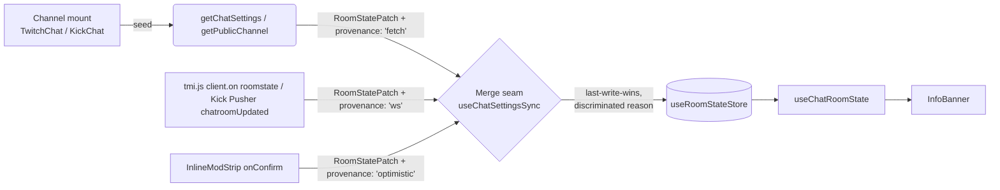

# KickTalk-Style Chat Input — Two-Button Emote Picker, Multi-Mode Info Banner, Live Chat-Settings Plumbing

## Summary

Rewrite `apps/desktop/src/components/chat/ChatInput.tsx` to match KickTalk's chat-input UX on both Twitch and Kick: a multi-mode info banner above the input (followers-only, subscribers-only, slow, emote-only, account-age, Twitch unique-chat / shield), two distinct emote buttons (native + third-party) each opening its own anchored popover dialog with search, sub-section icon row, pinned Recent + Favorites sections, collapsible provider sections, infinite-scroll, and (Kick) subscriber-only lock overlays. Drop the explicit send button — Enter-to-send only. Close the `TODO(U14.1)` in `useRoomStateStore` by wiring real chat-settings data on both platforms: extend `getPublicChannel` to stop dropping the Kick chatroom mode fields it already fetches, add the missing `GET /chat/settings` companion to Twitch's existing PATCH wrapper, subscribe to tmi.js's native `roomstate` event on Twitch, and bind the Kick chatroom-update Pusher event (name verified against KickTalk's connector during implementation). (see origin: `docs/brainstorms/2026-05-18-kicktalk-style-chat-input-requirements.md`)

---

## Problem Frame

The current chat input uses one `BsEmojiSmile` button → one `EmotePicker` with a horizontal tab strip across all providers. It works, but it isn't the Kick-tab UX a Kick-native audience recognizes. KickTalk's two-button, two-dialog layout — with provider-themed avatars, channel/global/personal sub-sections, collapsible bodies, infinite-scroll, and a subscriber-lock overlay — is the recognizable pattern, and adopting it lifts the Twitch side at the same time by giving BTTV / FFZ / 7TV a dedicated surface separate from native Twitch emotes. The info banner closes a real visibility gap: today, a viewer entering a follower-only or slow-mode channel sees nothing until a send attempt fails. `useRoomStateStore` already has the right shape but only updates when the local user toggles a mode from the mod strip; building the banner without closing the data-source gap would mean the banner barely fires for viewers and lies for moderators who join after a peer mod toggled a mode externally.

The repo research confirmed the work is mostly seam-extension rather than greenfield: `tmi.js` exposes a native `roomstate` event (no manual IRC tag parsing required); the Twitch PATCH `updateChatSettings` is already wired in `twitch-helix-moderation-mutations.ts` with the response type ready; the Kick v2 channel payload fetched on every channel resolve already carries `chatroom.slow_mode / followers_mode / subscribers_mode / emotes_mode` — `getPublicChannel` just discards them. The biggest unknown sits on the Kick WS side (chatroom-update event name), and that's verifiable against KickTalk's connector code at implementation time.

---

## Requirements

All 31 requirements from `docs/brainstorms/2026-05-18-kicktalk-style-chat-input-requirements.md` are addressed by this plan. Consolidated R-to-U mapping (full traceability lives in each unit's `**Requirements:**` field):

- R1, R3, R4 → U9 (ChatInput layout, drop send button)
- R2, R5 → U8, U9 (two emote buttons + brand icons in PlatformIcons)
- R6, R7 → U8 (dialog primitive: anchored popover, search, sub-section row, infinite-scroll)
- R8 → U8, U10 (pinned Recent + Favorites; persist middleware in U10)
- R9 → U1, U8 (`subscribersOnly` field; lock overlay)
- R10, R11, R12, R13, R14, R15, R16 → U7 (InfoBanner component)
- R17 → U3 (Twitch `getChatSettings` GET helper)
- R18 → U3 (extend `getPublicChannel` with Kick chatroom mode fields)
- R19 → U6 (seed-failure tolerance in the merge seam)
- R20 → U6 (re-fetch on channel re-mount)
- R21 → U4 (tmi.js `roomstate` binding)
- R22 → U5 (Kick chatroom-update Pusher binding)
- R23 → U6 (merge seam; optimistic-and-live converge to same store keys, last-write-wins)
- R24 → U6 (shield-mode stays optimistic-only — acceptable per origin)
- R25 → U2, U7; R26 → U7 (platform asymmetries: `accountAge` Kick-only field added in U2; `uniqueChat`/`shieldMode` Twitch-only enforcement handled by InfoBanner)
- R27 → carry-forward (no reply-protocol changes ship)
- R28, R29, R30, R31 → U9 (autocomplete / commands / character counter / `mentionUser` imperative handle preserved)

---

## High-Level Technical Design

This illustrates the intended approach and is directional guidance for review, not implementation specification. The implementing agent should treat it as context, not code to reproduce.

**Data flow — chat-settings**



**Component shape — two-dialog ChatInput**

```
ChatInput
├── ReplyPreviewBanner       (existing, preserved)
├── InfoBanner                (NEW — reads useChatRoomState)
└── InputRow
    ├── textarea + autocomplete (preserved)
    ├── NativeEmoteDialog button   → EmoteDialog scope="native"
    └── ThirdPartyEmoteDialog button → EmoteDialog scope="thirdParty"

EmoteDialog (one primitive, two instances)
├── HeaderRow: search input + sub-section icon row (Channel/Global/Personal for native;
│              7TV/BTTV/FFZ filter for thirdParty on Twitch; 7TV-only on Kick)
└── Body
    ├── RecentSection         (filtered by scope: provider ∈ scope)
    ├── FavoritesSection      (filtered by scope: provider ∈ scope)
    └── ProviderSections[]    (collapsible, IntersectionObserver-driven infinite-scroll,
                               sub-only lock overlay where applicable)
```

The merge seam (`useChatSettingsSync` hook in U6) is the single write path to `useRoomStateStore` for new external sources. The existing `InlineModStrip` optimistic write path is preserved unchanged; both paths converge on the same store keys with last-write-wins semantics, but every write carries a discriminated provenance tag (`'fetch' | 'ws' | 'optimistic'`) recorded in dev-only debug state so test assertions can distinguish *why* a state landed (pattern from `docs/solutions/integration-issues/twitch-gql-search-pagination-skeleton-flicker-loop-2026-05-17.md`).

---

## Output Structure

New files this plan creates:

```
apps/desktop/
├── src/
│   ├── backend/
│   │   └── api/platforms/twitch/twitch-helix-chat-settings.ts        (NEW — GET wrapper)
│   ├── components/
│   │   └── chat/
│   │       ├── InfoBanner.tsx                                        (NEW; inlines duration formatter)
│   │       ├── EmoteDialog.tsx                                       (NEW — two-dialog primitive)
│   │       └── input/
│   │           ├── NativeEmoteButton.tsx                             (NEW)
│   │           └── ThirdPartyEmoteButton.tsx                         (NEW)
│   └── hooks/
│       └── useChatSettingsSync.ts                                    (NEW — merge-seam hook + inlined translator + in-flight Set)
└── tests/
    ├── backend/
    │   └── api/platforms/twitch/twitch-helix-chat-settings.test.ts   (NEW)
    ├── components/chat/
    │   ├── InfoBanner.test.tsx                                       (NEW)
    │   └── EmoteDialog.test.tsx                                      (NEW)
    └── hooks/
        └── useChatSettingsSync.test.tsx                              (NEW)
```

Files modified (no new directories):

```
apps/desktop/src/backend/services/emotes/emote-types.ts               (+ subscribersOnly?)
apps/desktop/src/backend/services/emotes/kick-emotes.ts               (transformEmote threads field)
apps/desktop/src/store/room-state-store.ts                            (+ accountAge)
apps/desktop/src/store/emote-store.ts                                 (persist middleware for recent + favorites)
apps/desktop/src/backend/api/platforms/kick/endpoints/channel-endpoints.ts  (carry chatroom mode fields)
apps/desktop/src/backend/services/chat/twitch-chat.ts                 (bind roomstate)
apps/desktop/src/backend/services/chat/kick-chat.ts                   (bind chatroom-update)
apps/desktop/src/shared/chat-types.ts                                 (+ roomState event)
apps/desktop/src/components/chat/ChatInput.tsx                        (rewrite)
apps/desktop/src/components/chat/twitch/TwitchChat.tsx                (channelId prop + sync hook)
apps/desktop/src/components/chat/kick/KickChat.tsx                    (channelId prop + sync hook)
apps/desktop/src/components/icons/PlatformIcons.tsx                   (+ 7TV / Kick brand icons)
apps/desktop/src/components/chat/EmotePicker.tsx                      (deleted in U10)
```

The tree is a scope declaration. The implementer may adjust filenames or directory layout if implementation reveals a better shape; per-unit `**Files:**` sections are authoritative.

---

## Implementation Units

### U1. Extend `Emote` type with `subscribersOnly`; thread through Kick transformer

**Goal:** Make the subscriber-locked-emote signal reachable in the renderer so R9's lock overlay can render correctly. Today Kick's API returns `subscribers_only: boolean` per emote, but `transformEmote` drops the field at the type boundary.

**Requirements:** R9 (data-source half).

**Dependencies:** none — foundation unit.

**Files:**
- `apps/desktop/src/backend/services/emotes/emote-types.ts`
- `apps/desktop/src/backend/services/emotes/kick-emotes.ts`
- `apps/desktop/tests/backend/services/emotes/kick-emotes.test.ts` (extend or create)

**Approach:**
- Add an optional `subscribersOnly?: boolean` to the shared `Emote` interface. Optional so non-Kick providers don't need to set it.
- In `transformEmote`, propagate `subscribers_only` from the Kick API response onto the transformed emote. Default `false` only when explicitly present-and-false in the source; otherwise leave undefined.
- No call-site updates required for read-side; consumers that don't care simply ignore the field.

**Patterns to follow:**
- Existing `Emote` shape and transformer style in `apps/desktop/src/backend/services/emotes/kick-emotes.ts` lines 174–195.

**Test scenarios:**
- Kick subscriber-tier emote with `subscribers_only: true` → transformed `Emote.subscribersOnly === true`.
- Kick global emote with `subscribers_only: false` → transformed `Emote.subscribersOnly === false`.
- Kick emote response missing `subscribers_only` (defensive) → transformed `Emote.subscribersOnly === undefined`, transform does not throw.
- Twitch / 7TV / BTTV / FFZ transformer call sites do not regress — emote objects shape-compare unchanged.

**Verification:** Type-check passes; `kick-emotes.test.ts` passes; consumers compile without changes.

---

### U2. Add `accountAge` to `RoomState`; update default + selector test

**Goal:** Foundation for R18 (Kick chatroom-info seeding) and R10/R25 (banner). KickTalk's InfoBar handles account-age mode but StreamForge's `RoomState` does not yet model it.

**Requirements:** R10 (partial), R18 (partial), R25.

**Dependencies:** none.

**Files:**
- `apps/desktop/src/store/room-state-store.ts`
- `apps/desktop/src/hooks/useChatRoomState.ts` (verify it still passes through cleanly)
- `apps/desktop/tests/hooks/useChatRoomState.test.tsx`
- `apps/desktop/tests/store/room-state-store.test.ts` (extend or create)

**Approach:**
- Extend `RoomState` with `accountAge: number | null` (minutes; Kick-only). Add to `DEFAULT_ROOM_STATE` as `null`.
- Update docstring noting Kick-only semantics and that the unit on the wire is minutes (matching `followersOnly` normalization).
- No `updateRoomState` / `resetRoomState` signature change — the field is just part of the partial patch surface.
- Existing call sites in `TwitchChat.tsx` and `KickChat.tsx` continue to compile (partial patches).

**Patterns to follow:**
- Existing `followersOnly` field shape (number-or-null, minutes) — mirror exactly.

**Test scenarios:**
- `useChatRoomState` for an unknown channel returns the new `DEFAULT_ROOM_STATE` with `accountAge: null`.
- `updateRoomState(platform, channelId, { accountAge: 5 })` writes through; subsequent `useChatRoomState` returns `accountAge: 5`.
- Patch with only `accountAge` does not clobber prior `slowMode` / `followersOnly` values (partial-merge contract).
- `resetRoomState` clears `accountAge` (and all other fields).

**Verification:** Type-check passes; both store and hook tests pass; existing mod-strip optimistic writes in `TwitchChat.tsx` and `KickChat.tsx` continue to compile and behave unchanged.

---

### U3. Add Twitch `getChatSettings` (GET) helper; extend Kick `getPublicChannel` to carry chatroom mode fields

**Goal:** Provide the initial-state data source for R17 and R18. Both halves are net-new code but trivial: Twitch's PATCH companion is already wired and the response type already exists; Kick's payload already arrives — `getPublicChannel` just drops the relevant fields today.

**Requirements:** R17, R18.

**Dependencies:** none.

**Files:**
- `apps/desktop/src/backend/api/platforms/twitch/twitch-helix-chat-settings.ts` (NEW)
- `apps/desktop/src/backend/api/platforms/twitch/twitch-helix-moderation-mutations.ts` (reference for `ChatSettingsPayload` type; may export it from there or move to a shared location)
- `apps/desktop/src/backend/api/platforms/kick/endpoints/channel-endpoints.ts` (extend `getPublicChannel` response carrier)
- `apps/desktop/tests/backend/api/platforms/twitch/twitch-helix-chat-settings.test.ts` (NEW)
- `apps/desktop/tests/backend/api/platforms/kick/endpoints/channel-endpoints.test.ts` (extend or create — verify new fields surface; verify Cloudflare-bypass path unchanged)

**Approach:**
- **Twitch (`getChatSettings`)**: `GET https://api.twitch.tv/helix/chat/settings?broadcaster_id={id}`. Use the existing anonymous `HELIX_CLIENT_ID` constant. Wrap with `AbortSignal.timeout(10_000)` per repo convention (`docs/solutions/integration-issues/twitch-gql-search-pagination-skeleton-flicker-loop-2026-05-17.md`). Return type reuses `ChatSettingsPayload` from `twitch-helix-moderation-mutations.ts` (export from there or extract to a shared `twitch-helix-types.ts` — implementer's call). Note: viewer-context responses omit `moderator_chat_delay*` fields; type them as optional. Discriminated `HelixResult` shape consistent with the PATCH helper.
- **Kick (`getPublicChannel` extension)**: Add `chatroomSettings?: KickChatroomSettings` directly to `UnifiedChannel` in `apps/desktop/src/backend/api/unified/platform-types.ts`, alongside the existing Kick-specific optional fields (`chatroomId`, `subscriberBadges`) that already establish the precedent. Shape: `{ slowMode: { enabled, interval }, followersMode: { enabled, minDuration }, subscribersMode: { enabled }, emoteOnlyMode: { enabled }, accountAge: { enabled, minDuration } }`. **Note**: the v2 channel-resolve payload's `data.chatroom` block uses flat fields (`followers_mode: bool, subscribers_mode: bool, emotes_mode: bool, slow_mode: bool, message_interval, following_min_duration`) rather than nested `{enabled, min_duration}` blocks — confirmed by KickTalk's `initialChatroomInfo.chatroom` destructure in `InfoBar.jsx` line 27. Map flat-to-nested in this extension so downstream code sees one shape. Cloudflare-bypass infrastructure stays unchanged.
- Both helpers return shape compatible with translating to `RoomState` patches in U6.

**Execution note:** Test-first for `getChatSettings` — happy path, viewer-context (no mod fields), upstream 401/404, timeout. Characterization-first for the `getPublicChannel` extension — write tests that assert the new fields surface from a captured real-payload fixture before changing the mapper, so any regression to existing `chatroom.id` / `subscriber_badges` reads is immediately caught.

**Patterns to follow:**
- `updateChatSettings` in `twitch-helix-moderation-mutations.ts` lines 472–514: header shape, error handling, `HelixModResult` discriminated return.
- Existing `getPublicChannel` Cloudflare-bypass pattern (lines 202–264 of `channel-endpoints.ts`).
- `AbortSignal.timeout(10_000)` per the GQL-fix learning.

**Test scenarios:**
- **Twitch GET happy path** (moderator context): full payload with `slow_mode`, `follower_mode_duration`, etc. mapped through.
- **Twitch GET viewer context**: `moderator_chat_delay*` fields absent; helper returns successfully with those fields `undefined`.
- **Twitch GET 401 (token expired)**: returns discriminated failure result; does not throw.
- **Twitch GET 404 (unknown broadcaster_id)**: returns discriminated failure result.
- **Twitch GET timeout**: 10s `AbortSignal.timeout` fires; returns discriminated failure result with a timeout `reason` tag.
- **Kick `getPublicChannel`**: legacy v2 payload with all mode fields → returned `chatroomSettings` block contains all fields with correct numeric units.
- **Kick payload missing `account_age` block** (defensive): `chatroomSettings.accountAge` defaults to `{ enabled: false }`.
- **Kick existing `chatroom.id` and `subscriber_badges` reads continue to work** — characterization assertion that the extension did not regress.
- **Kick Cloudflare-bypass path** still acquires and releases its BrowserWindow slot for the extended call (mock the slot acquire/release).

**Verification:** Helix GET helper available for import in U6; Kick `getPublicChannel` callers that consume `chatroomSettings` (added in U6) compile.

---

### U4. Subscribe `twitchChatService` to tmi.js native `roomstate` event

**Goal:** R21 — pipe Twitch IRC ROOMSTATE updates from tmi.js into a new `roomState` service event the renderer can subscribe to.

**Requirements:** R21.

**Dependencies:** U2 (`accountAge` exists in the patch shape so the event payload type can include it as `null` for Twitch).

**Files:**
- `apps/desktop/src/backend/services/chat/twitch-chat.ts`
- `apps/desktop/src/shared/chat-types.ts` (extend `ChatServiceEvents` with `roomState`)
- `apps/desktop/tests/backend/services/chat/twitch-chat-roomstate.test.ts` (NEW; pure-function tag-to-patch translation)

**Approach:**
- Inside `setupEventHandlers` (~line 599-715), add `client.on("roomstate", (channel, state) => { ... })`.
- Translate the tmi.js `RoomState` object — `{ "emote-only", "followers-only", "r9k", "slow", "subs-only", "room-id" }` — into a `RoomStatePatch`. Notes on translation:
  - `"followers-only"` is `string | boolean`: `"-1"` or `false` → off (`null`); `"0"` or `true` → on with no minimum (0 minutes); otherwise parse as number-of-minutes.
  - `"slow"` is `string | boolean`: `"0"` or `false` → off (`null`); otherwise parse as number-of-seconds.
  - `"r9k"` boolean → `uniqueChat`.
  - `"emote-only"` boolean → `emoteOnly`.
  - `"subs-only"` boolean → `subscribersOnly`.
  - tmi.js stripping `#` from `channel` is implicit — pass through.
- Extract the translation as a pure function `roomStateTagsToPatch(state)` exported from the same file (or a sibling helper) so it can be unit-tested without spinning up tmi.js.
- Emit a `roomState` event on the singleton: `{ platform: "twitch", channel, patch, reason: "ws" }`. Add to `ChatServiceEvents` type in `chat-types.ts`.
- No write to `useRoomStateStore` here — that happens in U6 via the renderer-side effect.

**Patterns to follow:**
- Existing event handlers in `setupEventHandlers` (e.g., the `message` handler at the same site).
- `twitch-irc-parser.ts` test style — pure-function tests over fixture inputs.

**Test scenarios:**
- `roomStateTagsToPatch({ "followers-only": "-1" })` → `{ followersOnly: null }`.
- `roomStateTagsToPatch({ "followers-only": "0" })` → `{ followersOnly: 0 }`.
- `roomStateTagsToPatch({ "followers-only": "10" })` → `{ followersOnly: 10 }`.
- `roomStateTagsToPatch({ "slow": "0" })` → `{ slowMode: null }`.
- `roomStateTagsToPatch({ "slow": "120" })` → `{ slowMode: 120 }`.
- `roomStateTagsToPatch({ "r9k": true, "emote-only": false })` → `{ uniqueChat: true, emoteOnly: false }`.
- `roomStateTagsToPatch({ "subs-only": true })` → `{ subscribersOnly: true }`.
- All-empty tags object → empty patch (no fields set; useful for the initial-state event tmi.js fires on join).
- Service emits `roomState` event with `platform: "twitch"` and `reason: "ws"` (mock listener; assert payload shape).

**Verification:** Pure-function tests pass; `ChatServiceEvents` typed; no existing event-handler tests regress.

---

### U5. Subscribe `kickChatService` to chatroom-update Pusher event

**Goal:** R22 — pipe Kick chatroom mode updates from the Pusher socket into a symmetric `roomState` service event.

**Requirements:** R22.

**Dependencies:** U2, U4 (mirror the type and event shape used on the Twitch side; both should emit `RoomStatePatch + provenance: "ws"`).

**Files:**
- `apps/desktop/src/backend/services/chat/kick-chat.ts`
- `apps/desktop/src/shared/chat-types.ts` (already updated in U4; this unit just emits the same event shape)
- `apps/desktop/tests/backend/services/chat/kick-chat-roomstate.test.ts` (NEW; pure-function event-to-patch translation)
- `reference/KickTalk-main/utils/services/kick/sharedKickPusher.js` (READ ONLY — reference for the verified event name `App\Events\ChatroomUpdatedEvent`)

**Approach:**
- **Event name**: `App\Events\ChatroomUpdatedEvent` (verified against `reference/KickTalk-main/utils/services/kick/sharedKickPusher.js:180` and `kickPusher.js:192`, also referenced in `src/renderer/src/providers/ChatProvider.jsx:307,947`). Bind on the `chatrooms.{chatroomId}.v2` channel.
- In `setupChannelEventHandlers` (~line 730), bind the verified event on the `chatrooms.{chatroomId}.v2` channel.
- Extract pure helper `chatroomUpdatedEventToPatch(eventPayload)`. Event payload shape matches `chatroomInfo` from KickTalk's InfoBar: `{ slow_mode: { enabled, message_interval }, followers_mode: { enabled, min_duration }, subscribers_mode: { enabled }, emotes_mode: { enabled }, account_age: { enabled, min_duration } }`.
- Translation notes:
  - `followers_mode.min_duration` is in **minutes** in the Kick WS payload (verified against `reference/KickTalk-main/src/renderer/src/components/Chat/Input/InfoBar.jsx` line 14, which passes `min_duration * 60` to `convertSecondsToHumanReadable`; the initial-fetch `initialChatroomInfo.chatroom.following_min_duration` at line 32 is also minutes). Both paths pass through to the store unchanged.
  - `slow_mode.message_interval` is in **seconds**; pass through as-is (the store stores `slowMode` in seconds).
  - `enabled: false` for a mode → corresponding field set to `null` (slow / followers / accountAge) or `false` (subs / emote-only).
  - `account_age.min_duration` → `accountAge` (minutes; same unit normalization as followers).
- Emit `roomState` event on the singleton: `{ platform: "kick", channel, patch, reason: "ws" }`.
- Resubscribe-on-reconnect path: Pusher's `reconnecting-websocket` resubscribes automatically; the chatroom-update event re-fires with current state. Confirm idempotency in the handler — no problem because the patch shape is purely declarative.

**Execution note:** Verify the Pusher event name from KickTalk's source as the first concrete action in this unit. Document the verified name in the binding-call comment.

**Patterns to follow:**
- Existing chatroom event bindings in `setupChannelEventHandlers` (e.g., `ChatMessageEvent`, `PinnedMessageCreatedEvent`).
- The Pusher subscription/event-handler shape used elsewhere in the same file.

**Test scenarios:**
- `chatroomUpdatedEventToPatch({ followers_mode: { enabled: true, min_duration: 10 } })` → `{ followersOnly: 10 }`.
- `chatroomUpdatedEventToPatch({ followers_mode: { enabled: false } })` → `{ followersOnly: null }`.
- `chatroomUpdatedEventToPatch({ slow_mode: { enabled: true, message_interval: 30 } })` → `{ slowMode: 30 }`.
- `chatroomUpdatedEventToPatch({ subscribers_mode: { enabled: true } })` → `{ subscribersOnly: true }`.
- `chatroomUpdatedEventToPatch({ emotes_mode: { enabled: true } })` → `{ emoteOnly: true }`.
- `chatroomUpdatedEventToPatch({ account_age: { enabled: true, min_duration: 5 } })` → `{ accountAge: 5 }`.
- Combined payload with multiple modes → patch contains all fields.
- Service emits `roomState` event with `platform: "kick"` and `reason: "ws"`.

**Verification:** Pure-function tests pass; event name comment in `kick-chat.ts` documents the verified source.

---

### U6. Merge seam: `useChatSettingsSync` hook + initial-fetch + WS-event wiring + reconnect re-fetch in TwitchChat / KickChat

**Goal:** Single seam that converges all three RoomState sources (initial fetch, WS event, optimistic mod-strip writes) onto `useRoomStateStore` with discriminated provenance. Encodes the precedence rule (last-write-wins, tagged), protects channel-mount races (per-mount AbortController + in-flight Set), and closes the WS-reconnect staleness window by re-triggering initial fetch on reconnect.

**Requirements:** R17, R18, R19, R20, R21 (renderer half), R22 (renderer half), R23, R24.

**Dependencies:** U2, U3, U4, U5.

**Files:**
- `apps/desktop/src/hooks/useChatSettingsSync.ts` (NEW — React hook that owns the lifecycle: mount → initial fetch → subscribe → reconnect re-fetch → unmount. Pure translator `chatSettingsToPatch` is co-located here and exported as a named export for testing.)
- `apps/desktop/src/components/chat/twitch/TwitchChat.tsx` (call the hook; add `channelId` to ChatInput props)
- `apps/desktop/src/components/chat/kick/KickChat.tsx` (call the hook; add `channelId` to ChatInput props using the existing `channelId ?? String(chatroomId)` fallback at line 130)
- `apps/desktop/tests/hooks/useChatSettingsSync.test.tsx` (NEW)

**Approach:**
- **`useChatSettingsSync` hook**:
  - Inputs: `{ platform, channel, channelId }`.
  - Co-located in this file (no separate `chat-settings-sync.ts` module — one consumer doesn't earn split):
    - Pure helper `chatSettingsToPatch(platform, payload)` — exported as a named export. Translates Twitch `ChatSettingsPayload` or Kick `chatroomSettings` block (U3) into `Partial<RoomState>`. **MUST read each `*_mode` boolean flag before reading the corresponding duration field** — `follower_mode_duration` / `slow_mode_wait_time` may be leftover stale values when the mode is off.
    - Module-scoped `Set<string>` keyed by `${platform}:${channelKey}` for in-flight fetches. Discard stale completions (channel switched while in-flight). Pattern from `docs/solutions/logic-errors/kick-guest-follows-dual-id-bridge-2026-05-15.md`.
  - Per-mount race protection: a `useRef<AbortController | null>(null)` stores the current mount's controller. Every fetch passes `controller.signal` (composed with `AbortSignal.timeout(10_000)` via `AbortSignal.any`). Cleanup calls `controller.abort()`. Aborted-rejection short-circuits before `updateRoomState`. This protects against the cleanup-then-remount race that the in-flight Set alone doesn't cover (same-key A→A remount in React StrictMode or rapid toggle).
  - On mount and when inputs change:
    1. Create new `AbortController`; assign to ref. Compute store key via `roomStateKey(platform, channelId)`.
    2. If already in-flight for this key, skip; else add to in-flight Set.
    3. Wrap fetch signal with `AbortSignal.timeout(10_000)`. Dispatch the correct fetch (Twitch `getChatSettings`; Kick reads `chatroomSettings` block off the existing channel-resolve flow — already cached, so this is read-from-cache rather than a new round-trip in the common case).
    4. On success: `updateRoomState(platform, channelId, patch)`. Tag dev-only provenance state.
    5. On failure (network error, not abort): do nothing (R19 — banner stays hidden); log via existing chat-join failure surface (verified during implementation).
    6. On abort: short-circuit; do not write to store. Remove from in-flight Set in `finally`.
    7. Subscribe to the appropriate chat service's `roomState` event; on event for matching `platform + channel`, `updateRoomState(platform, channelId, patch)` and tag `reason: "ws"`.
    8. **Reconnect re-fetch (D1)**: subscribe to the chat service's `connected` event (both Twitch tmi.js and Kick Pusher emit one). On a `connected` event AFTER an initial connection (i.e., a reconnect, not the first connect), re-trigger steps 1-6 against the same channel: this re-seeds RoomState from the authoritative initial fetch, closing the staleness window for events dropped during the disconnect. The in-flight Set guard must allow reconnect-driven re-fetch to bypass — clear the key from the Set as part of the reconnect handler before the new fetch starts.
    9. Cleanup: `controller.abort()`; unsubscribe; remove key from in-flight Set.
- **TwitchChat.tsx / KickChat.tsx** integration:
  - Call `useChatSettingsSync({ platform, channel, channelId })` near the top of the component.
  - Pass `channelId` to ChatInput (new prop). Existing optimistic mod-strip writes stay untouched — they continue to write `reason: "optimistic"` provenance.
- **Last-write-wins**: `updateRoomState` itself doesn't need to change. All three sources write to the same key, and Zustand's set-merge gives the right semantics. Provenance is tracked in dev state only — production behavior is identical to today's optimistic-only path on the converge.

**Execution note:** Test-first for `chatSettingsToPatch` — write the patch-translation tests against payload fixtures, then implement. The hook tests come second and lean on React Testing Library's `renderHook` with `userEvent` setup unnecessary (timer-based flow).

**Technical design — in-flight race:**

```
Channel A mount → fetch in-flight (key=twitch:A)
User switches to channel B → A unmounts → cleanup removes A from in-flight
B mount → fetch in-flight (key=twitch:B)
A's fetch finally resolves → key A NOT in in-flight Set → DISCARD result
```

This illustrates the intended race-protection model and is directional guidance for review, not implementation specification.

**Patterns to follow:**
- In-flight Set pattern in `apps/desktop/src/store/follow-store.ts` (per the dual-id learning).
- `AbortSignal.timeout(10_000)` per the GQL-fix learning.
- Existing `updateRoomState` call sites in `TwitchChat.tsx` and `KickChat.tsx` for the prop-drilling shape.

**Test scenarios:**
- **chatSettingsToPatch (Twitch)**: payload with `follower_mode: true, follower_mode_duration: 10` → patch `{ followersOnly: 10 }`. **Translator MUST read the `*_mode` boolean flag before the duration field** — `follower_mode_duration` may be a leftover value when `follower_mode: false`. Same enabled-flag-precedence rule applies to `slow_mode` / `slow_mode_wait_time`.
- **chatSettingsToPatch (Twitch)**: payload with `follower_mode: false, follower_mode_duration: 10` (stale leftover) → `{ followersOnly: null }`.
- **chatSettingsToPatch (Twitch)**: payload with `follower_mode: false` → `{ followersOnly: null }`.
- **chatSettingsToPatch (Twitch)**: payload with `slow_mode: true, slow_mode_wait_time: 30` → `{ slowMode: 30 }`.
- **chatSettingsToPatch (Twitch)**: payload with `unique_chat_mode: true` → `{ uniqueChat: true }`.
- **chatSettingsToPatch (Kick)**: chatroomSettings block with all modes → patch carries `slowMode`, `followersOnly`, `subscribersOnly`, `emoteOnly`, `accountAge` with correct units.
- **chatSettingsToPatch (Kick)**: chatroomSettings with `followers_mode.enabled: false` → `{ followersOnly: null }`.
- **In-flight Set**: same key called twice → second call short-circuits; only one fetch fires.
- **In-flight Set**: channel switch during in-flight → first completion is discarded (key removed before resolve).
- **Hook initial fetch happy path**: on mount with valid channelId, fetch fires; on success, `updateRoomState` called with translated patch.
- **Hook initial fetch failure**: fetch rejects; no `updateRoomState` call; no thrown error; cleanup completes.
- **Hook re-mount on channel change**: switch from channel A to B triggers fresh fetch for B; A's pending request is abandoned.
- **Hook same-key remount (StrictMode / rapid toggle)**: mount A → unmount → mount A again. The unmounted controller aborts; even if its fetch resolves first, the aborted-rejection short-circuits before `updateRoomState`. Mount-2's fetch resolves to a clean store write.
- **Hook WS event**: chat service emits `roomState` event for the active channel → `updateRoomState` called with the event's patch.
- **Hook WS event for different channel**: event for channel C while mounted on A → no `updateRoomState` call.
- **Hook reconnect re-fetch**: chat service emits `connected` AFTER initial connection → `getChatSettings` (or Kick channel-resolve re-read) fires; store is re-seeded with authoritative state.
- **Hook reconnect does NOT fire on first connect**: chat service emits initial `connected` → no extra fetch (the mount path already covered it).
- **Mod-strip optimistic-then-WS converge**: optimistic patch fires, then WS event arrives with same fields → final store value is the WS value (last-write-wins); provenance tag in dev state is `"ws"`.

**Verification:** Existing mod-strip optimistic paths continue to work; new initial-state and WS paths fire on join and update; `useRoomStateStore` reflects truth.

---

### U7. Build `InfoBanner.tsx`

**Goal:** Render the multi-mode banner above the chat input, reading from `useChatRoomState`. KickTalk-style: precedence-based single-line label + right-aligned info icon with tooltip listing all active modes.

**Requirements:** R10, R11, R12, R13, R14, R15, R16, R25, R26.

**Dependencies:** U2 (RoomState carries `accountAge`).

**Files:**
- `apps/desktop/src/components/chat/InfoBanner.tsx` (NEW)
- `apps/desktop/tests/components/chat/InfoBanner.test.tsx` (NEW)

`convertSecondsToHumanReadable` is inlined as a small module-scoped helper in `InfoBanner.tsx` (per PF13 — single-consumer formatter doesn't earn its own module today; revisit if a second consumer emerges).

**Approach:**
- Props: `{ platform, channelId }`. Reads via `useChatRoomState(platform, channelId)`.
- Compute primary mode via KickTalk's precedence: `followers → subscribers → accountAge → emoteOnly → slow`. Higher-precedence wins for the visible label. `uniqueChat` and `shieldMode` are Twitch-only and do not displace the followers-or-below label; they appear in the tooltip list only (visible if active) — unless every other field is inactive, in which case they may appear in the label. Final mapping decision noted in the comment at the top of `InfoBanner.tsx`. (Origin R14 names the precedence chain for the five primary modes; Twitch-only modes are extras handled in the tooltip.)
- Label formatting:
  - `Followers Only Mode [Nm]` where N is `followersOnly`. When N is 0, label is `Followers Only Mode` (no bracket).
  - `Subscribers Only Mode`
  - `Account Age Mode [Nm]`
  - `Emote Only Mode`
  - `Slow Mode [interval]` — formatter renders `30s` / `1m` / `2m 30s` via `convertSecondsToHumanReadable`.
- Info icon (right-aligned): hover or focus shows tooltip enumerating every active mode as separate rows. Reuses existing `Tooltip` primitive if one exists in the components library (check `apps/desktop/src/components/ui/` and `Shared/`); if not, simple absolute-positioned div like KickTalk's `chatInfoBarIconTooltipContent`.
- Render nothing (return `null`) when no mode is active.
- Tailwind classes only — no SCSS import. Component-level dark background (matching the screenshot: dark gray strip with subtle border-bottom into the input row).
- Platform asymmetry encoded: `accountAge` field is read but only contributes when platform === "kick"; `uniqueChat` / `shieldMode` only when platform === "twitch". This is belt-and-suspenders — the store fields will be `null` / `false` on the wrong platform anyway because the fetchers won't write them, but the asymmetry check makes the rule legible in the component.

**Patterns to follow:**
- `reference/KickTalk-main/src/renderer/src/components/Chat/Input/InfoBar.jsx` lines 10–43 (precedence chain + label formatting) and lines 45–91 (tooltip with active-mode list).
- StreamForge tooltip / popover primitives — check `apps/desktop/src/components/ui/` for existing patterns (likely a Tooltip component to mirror).

**Test scenarios:**
- No active mode → returns `null` (renders nothing).
- Only `followersOnly: 5` active → label `Followers Only Mode [5m]`; tooltip lists "Followers Only Mode Enabled".
- `followersOnly: 5` + `slowMode: 30` active → label is the followers line (higher precedence); tooltip lists both.
- `subscribersOnly: true` + `emoteOnly: true` → label is subscribers; tooltip lists both.
- `accountAge: 3` on Kick → label `Account Age Mode [3m]`; tooltip lists "Account Age Restriction Enabled [3m]".
- `accountAge: 3` on Twitch (shouldn't happen, defensive) → not rendered as label; not in tooltip; rule visible in component code.
- `slowMode: 90` → label `Slow Mode [1m 30s]` (formatter verified).
- `uniqueChat: true` on Twitch with no other modes → label `Unique Chat Mode`; tooltip lists it.
- `shieldMode: true` on Twitch with no other modes → label `Shield Mode`; tooltip lists it.
- Info icon focus shows tooltip (keyboard accessibility).
- Hover-out hides tooltip.
- All `null`/`false` state → component returns `null`.
- `Covers AE for R14`: precedence is `followers → subscribers → accountAge → emoteOnly → slow` — assert via a tabular test fixture.

**Verification:** All tests pass; component renders correctly in Storybook-or-equivalent if one exists (verify during implementation; not required for plan).

---

### U8. Build `EmoteDialog.tsx` — the two-dialog primitive

**Goal:** One reusable dialog component used by both the native and third-party emote buttons. Anchored popover positioned above its anchor button. Internal search, sub-section icon row, pinned Recent + Favorites + provider sections, collapsible bodies, IntersectionObserver-driven infinite scroll, and Kick subscriber-only lock overlays.

**Requirements:** R6, R7, R8, R9 (render half).

**Dependencies:** U1 (Emote type carries `subscribersOnly`).

**Files:**
- `apps/desktop/src/components/chat/EmoteDialog.tsx` (NEW — the primitive)
- `apps/desktop/src/components/chat/EmoteImage.tsx` (reused, no change)
- `apps/desktop/tests/components/chat/EmoteDialog.test.tsx` (NEW)

**Approach:**
- **Props**: `{ isOpen, onClose, onSelect, anchorRef, scope, platform, channelId, viewerIsSubscribed? }`.
  - `scope: "native" | "thirdParty"` — selects which providers this dialog covers and which sub-section icons appear in the header.
  - `anchorRef` — the button's ref for popover positioning.
  - `viewerIsSubscribed?: boolean` — **optional**, defaults to `undefined`. Only the Kick-native dialog uses it for the lock overlay. Twitch dialogs and Kick third-party dialogs do not need to supply it. `undefined` = "unknown, render without lock" per D2 resolution.
- **Positioning**: anchored popover. Position above the anchor button, right-aligned to it. Use viewport-edge collision detection (clamp to viewport). If a positioning primitive exists in `apps/desktop/src/components/ui/` (Radix Popover, Floating UI, or custom), reuse; otherwise hand-rolled absolute positioning with `getBoundingClientRect()` of the anchor. Verify during implementation.
- **Provider mapping by scope and platform**:
  - `scope: "native"`, `platform: "twitch"` → providers: `["twitch"]`. Sub-section icons: Channel (broadcaster avatar; needs source — defer if unavailable, render generic globe), Global (globe).
  - `scope: "native"`, `platform: "kick"` → providers: `["kick"]`. Sub-section icons: Channel (broadcaster avatar from `subscriberBadges` or channel info if available), Global (globe), Emojis (Kick logo).
  - `scope: "thirdParty"`, `platform: "twitch"` → providers: `["7tv", "bttv", "ffz"]`. Sub-section icons in header: 7TV / BTTV / FFZ — clicking any filters the dialog body sections to that provider only. None selected = all three providers' sections stacked.
  - `scope: "thirdParty"`, `platform: "kick"` → providers: `["7tv"]`. Sub-section icons: Channel (7TV channel avatar if available), Global (globe). (No BTTV/FFZ on Kick.)
- **Recent + Favorites pinned**: at the top of the body, above provider sections. Filtered by `emote.provider ∈ providers` for this scope. Both are sections of the same collapsible style as provider sections.
- **Sub-section filter**: clicking a sub-section icon filters the lower (provider) sections to that sub-section (Channel / Global / Personal for native; per-provider for third-party on Twitch). Recent and Favorites stay visible regardless (per the decision in the brainstorm answer: "pinned at top, persist across sub-section selection"). Selected state highlights the icon. Clicking the same icon again clears the filter.
- **Body sections**: each section is a `<details>`-like collapsible (caret on right, mirror KickTalk's `dialogRowHead` / `dialogBodySection`). Initially expanded. Each emote rendered with `EmoteImage`.
- **Infinite scroll**: `IntersectionObserver` on a sentinel `<div>` at the end of each section's emote list. Initial visible count 20; loads +20 on intersect. Mirror KickTalk's `EmoteSection` pattern (lines 17–100 of `EmoteDialogs.jsx`).
- **Lock overlay (R9)**: Kick-native dialog only. **Render lock only when `viewerIsSubscribed === false` AND `emote.subscribersOnly === true`** — if `viewerIsSubscribed === undefined` (data source unknown / unreachable), render the emote WITHOUT the lock overlay. This is the resolution for D2 from doc-review: shipping with `false` would lock paid subscribers' own emotes; shipping with "unknown → no lock" degrades gracefully — free-tier viewers click and get the server-side reject (same as today, no regression), and subscribed viewers never see a confusing lock on emotes they paid for. The underlying button when locked SHALL carry `aria-disabled="true"` and `aria-label="{emoteName} — subscriber-only emote"` so screen-reader users get the state distinction sighted users get from the lock icon. Click is a no-op (`onClick` short-circuits early). For Twitch native emotes, no overlay — un-entitled emotes are simply not in the store's emote set.
- **Search**: an input at the top filters the body to emotes whose name matches (case-insensitive substring). Filter is scoped to this dialog's providers only — post-filter `searchEmotes` results client-side, or compute directly from the dialog's already-loaded set. Pinned sections during search collapse to match-count-only headers.
- **Outside-click + Escape close**: same pattern as today's `EmotePicker.tsx` lines 110–142.
- **Tailwind only** — translate KickTalk SCSS class names to utility classes. Reuse CSS custom properties (`var(--color-background-secondary)`, etc.) consistent with the current EmotePicker.

**Patterns to follow:**
- KickTalk reference: `reference/KickTalk-main/src/renderer/src/components/Chat/Input/EmoteDialogs.jsx`.
- StreamForge current popover-positioning convention (verify during implementation in `apps/desktop/src/components/ui/`).
- `EmotePicker.tsx` lines 110–142 for outside-click + Escape patterns.
- `useShallow` from `zustand/react/shallow` for multi-field store selection (used in current EmotePicker lines 86–96).

**Test scenarios:**
- **Renders provider sections by scope + platform**: `scope="native" platform="kick"` renders Kick section; does not render 7TV section. `scope="thirdParty" platform="twitch"` renders 7TV, BTTV, FFZ sections.
- **Recent / Favorites pinned at top**: when Recent contains a Kick emote and `scope="native" platform="kick"`, Recent section is visible above Kick section.
- **Recent filter by scope**: Recent contains both a Kick emote and a 7TV emote; `scope="native" platform="kick"` shows only the Kick emote in Recent.
- **Search filters within scope**: `scope="thirdParty" platform="twitch"` + search "pog" → shows matches from 7TV/BTTV/FFZ only; no Twitch native emotes.
- **Sub-section filter (Twitch third-party)**: clicking the 7TV icon hides BTTV/FFZ sections; Recent/Favorites stay visible.
- **Sub-section filter (Kick native)**: clicking the Global icon hides the channel-set section; Recent/Favorites stay visible.
- **Sub-section toggle off**: clicking the active sub-section icon clears the filter.
- **Collapsible section**: clicking the section head toggles expanded/collapsed.
- **Infinite scroll**: section with 50 emotes shows 20 initially; scrolling the sentinel into view reveals +20.
- **Lock overlay (Kick native, not subscribed)**: subscriber-only Kick emote rendered with overlay; click does NOT call `onSelect`.
- **No lock overlay (Kick native, subscribed)**: subscriber-only emote rendered without overlay; click calls `onSelect`.
- **No lock overlay (Twitch native)**: emote with `subscribersOnly: true` (defensive — shouldn't happen on Twitch but tests defensively) does NOT render lock overlay.
- **Outside click closes** the dialog (calls `onClose`).
- **Escape key closes** the dialog.
- **Favorite toggle**: hover over an emote → favorite star button appears; clicking the star calls `useEmoteStore.toggleFavorite`; subsequent renders show the emote in Favorites section.

**Verification:** All tests pass; manual smoke in dev mode confirms the dialog opens, search works, infinite-scroll triggers, lock overlay renders for non-subscribers.

---

### U9. Rewrite `ChatInput.tsx`: drop send button, host InfoBanner + two emote buttons + two EmoteDialogs

**Goal:** Wire all the new components into `ChatInput`, preserve all carry-over behavior, and remove the now-unused single-picker and send button.

**Requirements:** R1, R2, R3, R4, R5, R28, R29, R30, R31.

**Dependencies:** U7 (InfoBanner), U8 (EmoteDialog), U2 (channelId-typed store), U6 (`channelId` prop wired in parents).

**Files:**
- `apps/desktop/src/components/chat/ChatInput.tsx` (rewrite)
- `apps/desktop/src/components/chat/input/NativeEmoteButton.tsx` (NEW — small button + dialog pair)
- `apps/desktop/src/components/chat/input/ThirdPartyEmoteButton.tsx` (NEW — small button + dialog pair)
- `apps/desktop/src/components/icons/PlatformIcons.tsx` (extend — Kick brand mark, 7TV brand mark)
- `apps/desktop/tests/components/chat/ChatInput.test.tsx` (rewrite)
- `apps/desktop/tests/components/icons/PlatformIcons.test.tsx` (extend)
- `resources/` (NEW SVG assets for Kick + 7TV marks, or pull from `reference/KickTalk-main/src/renderer/src/assets/logos/`)

**Approach:**
- **New ChatInput props**: add `channelId: string`. Existing props (`channel`, `platform`, `chatroomId`, `maxLength`, `placeholder`, `canSend`, `disabled`, `className`) preserved unchanged.
- **Layout** (top to bottom):
  1. Reply preview banner (existing, preserved)
  2. `<InfoBanner platform={platform} channelId={channelId} />` (NEW row)
  3. Input row: textarea + two emote buttons on the right; **no send button**
- **Two emote buttons**:
  - `<NativeEmoteButton platform={platform} channelId={channelId} viewerIsSubscribed={...} isOpen={activeDialog === "native"} onOpenRequest={() => setActiveDialog(activeDialog === "native" ? null : "native")} onEmoteSelect={handleEmoteSelect} />`
  - `<ThirdPartyEmoteButton platform={platform} channelId={channelId} isOpen={activeDialog === "thirdParty"} onOpenRequest={() => setActiveDialog(activeDialog === "thirdParty" ? null : "thirdParty")} onEmoteSelect={handleEmoteSelect} />`
  - `ChatInput` owns a single `activeDialog: "native" | "thirdParty" | null` state. Both buttons read it for their `isOpen` prop; opening one implicitly closes the other. No event bus, no shared store — parent-local concern stays in the parent.
- **`viewerIsSubscribed` source**: read viewer's subscriber badge for the active Kick channel from existing chat state. Verify during implementation by reading `KickChat.tsx`'s badge handling — `subscriberBadges` is already passed down (line 86); we need *viewer's own* subscription state, which differs. Likely source: the viewer's own badge list in their chat presence (`ChatMessageEvent.sender.identity.badges` on echoed messages). If genuinely unreachable in this pass, pass `undefined` (the optional default per U8 — no lock rendered when status is unknown). This is per D2 resolution: subscribers never see locks on emotes they paid for; free-tier viewers click and get the server-side reject (same as today, no regression). Decision logged in code comment.
- **Drop send button**: remove `BsSend` import and the `<button onClick={handleSend}>` block (lines 460–468). `handleKeyDown` Enter behavior at line 335 already covers send-on-Enter; nothing to add.
- **Outside-click effect**: extend the existing handler (lines 350–361) to close both new dialogs.
- **Preserve**:
  - `forwardRef` + `useImperativeHandle` exposing `ChatInputHandle = { replyTo, mentionUser }` — needed by `PinnedMessageBanner` in `TwitchChat.tsx` line 567.
  - Emote autocomplete (`:` trigger) — when an emote is selected from autocomplete, `handleEmoteSelect` is called the same way.
  - Mention autocomplete (`@` trigger).
  - Reply preview + reply-send.
  - Slash commands.
  - Character counter.
  - Error display.
- **PlatformIcons extension**: add `<SevenTVIcon />` and `<KickEmoteIcon />` (or `<KickLogoIcon />`) components. Pull SVGs from `reference/KickTalk-main/src/renderer/src/assets/logos/` if licensing allows (check `LICENSE` first — fallback: minimal hand-drawn marks or react-icons substitutes).
- **Test mock fix**: update `tests/components/chat/ChatInput.test.tsx` zustand mock to the selector-capable pattern from `EmotePicker.test.tsx` (lines 19–22):
  ```
  useEmoteStore: (selector?) => selector ? selector(state) : state
  ```
  Otherwise selector-style `useEmoteStore((s) => s.foo)` calls in the new code break under the test mock.

**Patterns to follow:**
- Existing `forwardRef` / `useImperativeHandle` shape at lines 92–246.
- Existing autocomplete deactivation in `handleEmoteSelect` (lines 142–184).
- Existing outside-click handler (lines 350–361).
- `EmotePicker.test.tsx` zustand-mock pattern.

**Test scenarios:**
- **InfoBanner renders above input** when `useChatRoomState` returns active modes; absent otherwise.
- **Reply preview stacks above InfoBanner** when both are active.
- **Native button opens NativeEmoteDialog** anchored to it; ThirdPartyEmoteDialog stays closed.
- **Third-party button opens ThirdPartyEmoteDialog**; clicking the native button closes the third-party dialog and opens the native dialog (mutual exclusion).
- **Outside-click closes both dialogs**.
- **No send button is rendered** — query for `aria-label="Send message"` returns null.
- **Enter sends** (existing test preserved).
- **Shift+Enter inserts newline** (existing behavior preserved; add test if absent).
- **Emote selection from a dialog** calls the same `handleEmoteSelect` path that updates message + cursor.
- **Emote autocomplete still works** (`:` trigger → selection inserts emote name; existing test preserved).
- **Mention autocomplete still works**.
- **Slash command `/me`** still routes through the correct service call (existing test pattern).
- **Character counter** still appears and styles correctly under / over limit (existing test preserved).
- **`mentionUser` imperative handle** still prepends `@username` and focuses input.
- **`replyTo` imperative handle** still sets reply state.
- **Disabled state** disables both emote buttons.
- **Not-logged-in (`canSend: false`)** disables both emote buttons and shows "Log in to chat" placeholder.

**Verification:** Tests pass; manual smoke: open dev build, switch between Twitch and Kick channels, see correct provider buttons; type `:po` to trigger emote autocomplete; type `/me hello` to trigger /me path; verify InfoBanner appears when entering a slow-mode channel.

---

### U10. Cleanup: delete old `EmotePicker.tsx`, prune broken tests, finalize PlatformIcons

**Goal:** Remove dead code, ensure no straggler imports remain. Persist middleware for Recent/Favorites was deferred per D3 doc-review resolution (origin out-of-scope; serialization risks around `loadedChannels: Set<string>` and stale URLs in persisted snapshots) — to be tracked as a follow-up.

**Requirements:** none new — pure cleanup.

**Dependencies:** U9.

**Files:**
- `apps/desktop/src/components/chat/EmotePicker.tsx` (DELETE)
- `apps/desktop/tests/components/chat/EmotePicker.test.tsx` (DELETE)
- Grep for remaining `EmotePicker` imports across the repo; remove any.

**Approach:**
- After U9's rewrite ships and no consumer references `EmotePicker.tsx`, delete both files.
- Run typecheck + grep to confirm no broken imports.
- Verify `PlatformIcons.tsx` extensions from U9 (7TV / Kick brand marks) are exported correctly and consumed only by the new emote-button components.

**Test scenarios:**
- `Test expectation: none -- pure deletion + import-cleanup unit; no behavioral change.`

**Verification:** `EmotePicker.tsx` removed; no broken imports (grep `from.*EmotePicker` returns zero hits); `npm run typecheck` passes; `npm run test` passes.

**Deferred (tracked as follow-up):**
- Zustand `persist` middleware for `useEmoteStore` Recent/Favorites whitelist. When picking this up: persist `{provider, id, name}` references (not full `Emote` objects) and re-resolve from the live catalog at read-time to avoid stale-URL drift across versions. Include explicit `partialize` exclusion for `loadedChannels: Set<string>` (not JSON-serializable).

---

## Scope Boundaries

### In Scope (this plan)

All 31 brainstorm requirements (see Requirements section above).

### Deferred to Follow-Up Work

- **7TV personal emote sets** — origin out-of-scope. Requires fetching personal-set membership for the viewer's 7TV user. No prep work in this plan; a follow-up plan can add the data source + a Personal sub-section icon in the third-party dialog.
- **Twitch native dialog "Channel" sub-section avatar** — KickTalk renders the channel's avatar in the sub-section row. Twitch broadcaster avatar URL is not currently in scope on `ChatInput`'s prop chain. Acceptable substitute: a globe icon. Real avatar wiring is a follow-up.
- **Kick native dialog rotating channel-emote button-icon** — KickTalk's Kick button shows a random channel emote that rotates on hover. We ship with a static Kick logo. Rotating variant is a polish follow-up.
- **`useAccessibleKickEmotes` parity** — KickTalk has a tier-aware filter hook for Kick emotes (e.g., tier-1/2/3 visibility). Out of scope here; ship with simple subscribers-or-not lock per R9. Tier-aware filtering is a follow-up.

### Outside this Product's Identity

- N/A — brainstorm did not name product-identity exclusions.

---

## Key Technical Decisions

- **Single `EmoteDialog` primitive instead of two custom components.** KickTalk has `SevenTVEmoteDialog` and `KickEmoteDialog` as distinct components. Our two-button design with anchored popovers is identical in shape — one primitive parameterized by `scope` + `platform` is simpler to test and maintain than two ~600-line dialog components diverging over time.
- **Merge seam in a hook (`useChatSettingsSync`), not in `useRoomStateStore`.** Store stays declarative and minimal. The hook owns the lifecycle (mount, subscribe, in-flight protection, cleanup). This keeps the store dependency-free of fetcher logic and makes the merge seam unit-testable in isolation.
- **Discriminated provenance tags are dev-only.** Production behavior is identical to today's optimistic-only converge. Tags exist so the test suite can assert *why* a state landed (mirroring the GQL skeleton-flicker fix learning). No production storage cost.
- **Tailwind for the new components** — no SCSS imports. Reference KickTalk SCSS for layout intent only.
- **Anchored popovers, not input-width sheets.** Two simultaneous popovers don't fit input-width; KickTalk's pattern requires anchored. Use existing popover primitive in `apps/desktop/src/components/ui/` if available; otherwise minimal hand-rolled positioning with viewport collision clamp.
- **Per-provider sub-section icons in the Twitch third-party dialog** (confirmed at plan-time): one click filters the dialog body to 7TV / BTTV / FFZ. Mirrors KickTalk's sub-section pattern.
- **Filter Recent / Favorites at the dialog by provider class** (confirmed at plan-time): no store restructure. The two-dialog model reads the same shared arrays and slices client-side.
- **Stop dropping Kick chatroom mode fields in `getPublicChannel`** (confirmed at plan-time): no second Cloudflare-bypass round-trip; cheapest path.
- **`accountAge` added to `RoomState` as `number | null` minutes** — mirrors `followersOnly` exactly. Kick-only field, but lives on the shared shape (optional fields keep the type uniform; the InfoBanner enforces the platform asymmetry).
- **Pure-function translation helpers extracted (`roomStateTagsToPatch`, `chatroomUpdatedEventToPatch`, `chatSettingsToPatch`)** — keeps the bulk of the test coverage off the singleton, off the WS client, and off React. Mirrors `twitch-irc-parser.ts` test style.
- **`AbortSignal.timeout(10_000)`** on every new upstream call (per repo convention from the GQL-fix learning).
- **Module-scoped in-flight `Set<string>`** for channel-mount fetch race protection (per the dual-id follow learning). Keyed by `${platform}:${channelKey}`.

---

## System-Wide Impact

- **Chat services** (Twitch + Kick): one new event each (`roomState`). Existing event consumers unaffected.
- **`useRoomStateStore`**: one new field (`accountAge`). Existing call sites continue to compile because every write is a partial patch.
- **`Emote` type**: one new optional field (`subscribersOnly`). Non-Kick transformers unchanged; consumers that don't care ignore the field.
- **Twitch Helix wrapper module**: one new exported helper (`getChatSettings`). Bonus: callable from any future surface that wants chat-settings (a chat-settings settings panel, debug overlay, etc.).
- **`UnifiedChannel`-adjacent return type** for Kick channel resolve: widened with `chatroomSettings`. Existing consumers ignore the new field.
- **`emote-store` persistence**: `localStorage` write on every recent / favorite change. Low frequency; bounded list sizes. No DB / IPC implications.
- **ChatInput parent prop chain**: `channelId` added to ChatInput's required props. Both `TwitchChat.tsx` and `KickChat.tsx` already have `channelId` in scope (TwitchChat from broadcaster id; KickChat from `channelId ?? String(chatroomId)` fallback at line 130) — pass-through is purely mechanical.
- **No new IPC channels**. Chat-state lives renderer-side as today.
- **No new database tables / migrations**.
- **Bundle size**: minor — KickTalk SVG marks (~2 KB each), no new heavy deps.

---

## Alternative Approaches Considered

- **Two distinct dialog components (one per scope)** — rejected. Reduces shared-primitive reuse and doubles the test surface for behavior that is structurally identical.
- **Store the chat-settings state in a new dedicated store** (e.g., `useChatSettingsStore`) — rejected. `useRoomStateStore` already models exactly these fields and has a standing TODO to be fed by external sources. Adding a second store would split the source of truth.
- **Add chat-settings fetches as an IPC call to the main process** — rejected. Chat services already run renderer-side; no security / token-storage reason to move chat-settings fetches across the IPC boundary. Adds latency, adds plumbing.
- **Keep the old single-pane EmotePicker behind a feature flag** — rejected. Brainstorm explicitly chose the KickTalk pattern; no audience for the old one. Feature-flagging adds maintenance cost for code that won't run.
- **Make `accountAge` Kick-specific via a discriminated `RoomState` union** (`TwitchRoomState | KickRoomState`) — rejected. Store consumers would need narrowing everywhere. Optional field on a shared shape is simpler and matches how `uniqueChat` / `shieldMode` (Twitch-only) already coexist on the same type.
- **Use Radix UI Popover for dialog positioning** — deferred to implementation. If the codebase already uses Radix elsewhere, reuse; otherwise hand-rolled positioning is fine for this surface.

---

## Risk Analysis & Mitigation

- **Risk: Kick `data.chatroom` initial-fetch shape differs from the WS event shape.**
  - The WS `ChatroomUpdatedEvent` payload nests modes as `{ slow_mode: { enabled, message_interval }, followers_mode: { enabled, min_duration }, ... }`. The v2 channel-resolve payload (`getPublicChannel`) carries a flatter shape per KickTalk's `initialChatroomInfo.chatroom`: `{ followers_mode: bool, subscribers_mode: bool, emotes_mode: bool, slow_mode: bool, message_interval, following_min_duration }`.
  - Mitigation: U3's characterization-first instruction captures the real `getPublicChannel` payload before writing the mapper; U6's `chatSettingsToPatch` handles both shapes with provenance-tagged branches (Twitch flat, Kick-initial flat, Kick-WS nested). Test fixtures from real captures pin the translator behavior.

- **Risk: viewer's Kick subscription status not reachable in this pass.**
  - Mitigation (per D2 resolution): when status is unknown (`viewerIsSubscribed === undefined`), the lock overlay does NOT render. Free-tier viewers click and get the server-side reject (same as today, no regression). Subscribers never see locks on emotes they paid for. The lock is a UX hint, not a security boundary — Kick's send-emote API enforces entitlement server-side.

- **Risk: ChatInput.test.tsx zustand mock pattern is broken for selector-style calls.**
  - Mitigation: U9 explicitly upgrades the mock pattern to the selector-capable form before relying on it. This is a test-infrastructure fix, not a runtime risk.

- **Risk: persisted Recent / Favorites schema drift in future versions.**
  - Mitigation: U10 includes `version: 1` in the persist config. Future migrations have a clean version handle.

- **Risk: removing the send button is a UX regression for new / accessibility users who don't realize Enter sends.**
  - Mitigation: explicit brainstorm decision; placeholder text "Send a message..." (existing) is the visual affordance. If user feedback after ship indicates the regression matters, the send button is trivial to re-add behind a setting. Not solved here.

- **Risk: Cloudflare-bypass path for Kick channel resolve is already a bottleneck; widening `getPublicChannel` adds nothing measurable but should be confirmed.**
  - Mitigation: U3 extends an existing response — no new round-trip; no measurable impact.

- **Risk: tmi.js fires `roomstate` on initial channel join with possibly-empty tags.**
  - Mitigation: U4 includes a test scenario for the all-empty case (empty patch, harmless update).

- **Risk: WS reconnection / Pusher resubscription can deliver duplicate events.**
  - Mitigation: handlers are idempotent by design — patches are declarative state, applying the same patch twice is harmless. The U6 merge seam plus the existing `updateRoomState`'s set-merge gives the correct converge.

---

## Phased Delivery

The plan can ship in three logical phases. Each phase produces working, mergeable software.

- **Phase 1 — Foundation (U1, U2, U3, U4, U5)**: types, helpers, and WS bindings. No user-visible UI change. All units have full test coverage. Merging this phase early de-risks the rest.
- **Phase 2 — Renderer wiring + InfoBanner (U6, U7)**: the banner becomes live and reflects real chat-settings state on both platforms. Existing emote picker still in place; ChatInput layout slightly taller (banner row appears when modes active).
- **Phase 3 — UI overhaul + cleanup (U8, U9, U10)**: the KickTalk-style picker lands; send button drops; old `EmotePicker` deleted; persistence added.

Phases are sequencing guidance, not strict gates. Single PR per implementation unit is also acceptable (`ce-work` will determine).

---

## Open Questions Resolved at Plan Time

All seven origin "Open Questions for /ce-plan" are resolved here:

1. **Dialog positioning** — anchored popover (U8 approach), not input-width sheet.
2. **Third-party dialog on Twitch** — per-provider sub-section icons (7TV / BTTV / FFZ) in header (U8 approach).
3. **Twitch `ROOMSTATE` subscription location** — inside `twitch-chat.ts` `setupEventHandlers`, binding tmi.js's native `roomstate` event (U4).
4. **`useEmoteStore.getEmotesByProvider` restructure** — no restructure. Filter at the dialog by provider class (U8 approach).
5. **Recent/Favorites + sub-section row interaction** — Recent/Favorites pinned at top, persist across sub-section filter changes (U8 approach).
6. **SCSS vs Tailwind** — Tailwind for all new components.
7. **Test composition** — separate `InfoBanner.test.tsx` (U7); ChatInput tests stay scoped to ChatInput behavior (U9 rewrite).

---

## Deferred to Implementation

Items that depend on reading specific code at implementation time:

- **Viewer-subscription source** for the Kick lock overlay (verify reachability during U9; fallback documented). See "Open Decisions From Review" below for the elevated treatment of this gap.
- **Existing popover primitive** in `apps/desktop/src/components/ui/` — reuse if present, hand-roll otherwise (U8).
- **Existing `Tooltip` primitive** for InfoBanner info-icon tooltip — reuse if present (U7).
- **Failure surface for chat-join errors** — identify the existing logging surface during U6; use it instead of inventing a new one.
- **License check** on copying SVG marks from `reference/KickTalk-main/src/renderer/src/assets/logos/` — read `reference/KickTalk-main/LICENSE` during U9; if restrictive, hand-roll minimal marks.

---

## References

- **Origin requirements**: `docs/brainstorms/2026-05-18-kicktalk-style-chat-input-requirements.md`
- **KickTalk reference (read-only)**:
  - `reference/KickTalk-main/src/renderer/src/components/Chat/Input/InfoBar.jsx`
  - `reference/KickTalk-main/src/renderer/src/components/Chat/Input/EmoteDialogs.jsx`
  - `reference/KickTalk-main/utils/services/kick/sharedKickPusher.js`, `kickPusher.js` (verified Pusher event name: `App\Events\ChatroomUpdatedEvent`)
- **Visual reference**: `C:\Users\Admin\Documents\ShareX\Screenshots\2026-05\electron_PmeWG3edIL.png`
- **Institutional learnings applied**:
  - `docs/solutions/logic-errors/kick-guest-follows-dual-id-bridge-2026-05-15.md` — channel-object id-bridge, in-flight Set, filter-not-find
  - `docs/solutions/integration-issues/twitch-gql-search-pagination-skeleton-flicker-loop-2026-05-17.md` — centralized merge seam with discriminated provenance, `AbortSignal.timeout(10s)`
- **Key existing files**:
  - `apps/desktop/src/components/chat/ChatInput.tsx`
  - `apps/desktop/src/components/chat/EmotePicker.tsx`
  - `apps/desktop/src/store/room-state-store.ts`
  - `apps/desktop/src/store/emote-store.ts`
  - `apps/desktop/src/backend/services/chat/twitch-chat.ts`
  - `apps/desktop/src/backend/services/chat/kick-chat.ts`
  - `apps/desktop/src/backend/api/platforms/twitch/twitch-helix-moderation-mutations.ts`
  - `apps/desktop/src/backend/api/platforms/kick/endpoints/channel-endpoints.ts`
  - `apps/desktop/src/backend/api/platforms/kick/kick-mod-mutations.ts`
  - `apps/desktop/src/backend/services/emotes/emote-types.ts`
  - `apps/desktop/src/backend/services/emotes/kick-emotes.ts`
  - `apps/desktop/src/shared/chat-types.ts`
  - `apps/desktop/src/components/chat/twitch/TwitchChat.tsx`
  - `apps/desktop/src/components/chat/kick/KickChat.tsx`
  - `apps/desktop/src/hooks/useChatRoomState.ts`
