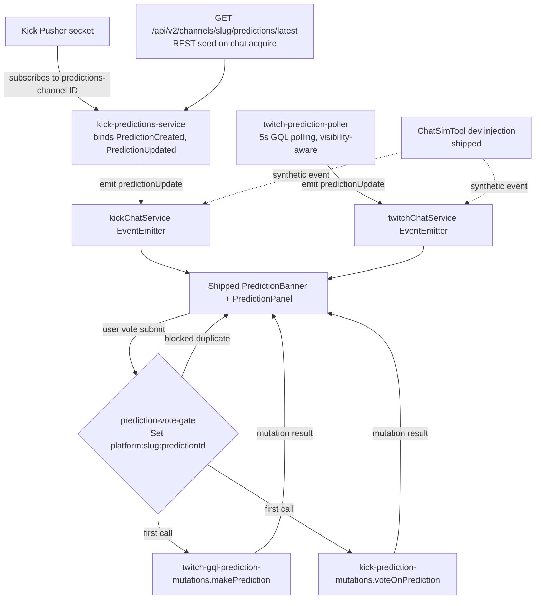

# Predictions Backend — Real-Time Events, REST Seed, and Voting on Twitch and Kick

## Summary

Wire the prediction widget's backend so the shipped UI (banner + panel) fires on real broadcasts. Adds a new sibling `kick-predictions-service` that subscribes to Kick's dedicated `predictions-channel-{channelId}` Pusher channel (bound to `PredictionCreated` + `PredictionUpdated` per the 2026-05-22 discovery), seeds via `GET /api/v2/channels/{slug}/predictions/latest`, and emits `predictionUpdate` through the existing `kickChatService` seam. A new `twitch-prediction-poller` runs the 5s viewer-side GQL polling that replaces shut-down PubSub. Two vote mutations (`twitch-gql-prediction-mutations.makePrediction`, `kick-prediction-mutations.voteOnPrediction`) plus a module-scoped in-flight gate keyed by `${platform}:${slug}:${predictionId}` close the voting flow. Balance fetches feed the stake input; per-`kind` error copy covers integrity / insufficient-balance / outcome-locked / network paths.

---

## Problem Frame

The widget UI shipped on 2026-05-18 and listens on `kickChatService.on("predictionUpdate")` and `twitchChatService.on("predictionUpdate")` — but no production code path emits those events on either platform. The only emitter today is `ChatSimTool` dev injection (`apps/desktop/src/components/dev/ChatSimTool.tsx:451-475`). Viewers see no prediction banner regardless of channel activity. This was the symptom that surfaced the gap (user report 2026-05-22: "I don't see Kick predictions when signed in"). See origin requirements at `docs/brainstorms/2026-05-18-viewer-prediction-widget-requirements.md` for the full feature framing; this plan covers the **how** for the backend slice. (see origin: `docs/brainstorms/2026-05-18-viewer-prediction-widget-requirements.md`, see discovery: `docs/brainstorms/2026-05-22-kick-predictions-discovery-notes.md`)

---

## Current State (Already Shipped)

The 2026-05-18 plan shipped four of its nine units between 2026-05-18 and 2026-05-22 — verified in tree at plan date:

- **Foundation (originally U1 in superseded plan):** `UnifiedPrediction` + `UnifiedPredictionOutcome` interfaces and the `predictionUpdate` event live in `apps/desktop/src/shared/chat-types.ts:308-411`. `preferences.predictions.style` persists through the auth store.
- **Widget UI (originally U6):** `apps/desktop/src/components/chat/PredictionBanner.tsx` (~820 lines) contains banner + panel + ended-state recap + three style variants. `PredictionPanel.tsx` and `PredictionBubbleChart.tsx` were collapsed into the same file during implementation — the new plan respects that and does not re-split.
- **Settings predictions section (originally U8):** `apps/desktop/src/pages/Settings/index.tsx` renders a `"predictions"` sidebar tab with the native/unified toggle (verified at lines 139-141 + 259-287).
- **Dev injection parity (originally U9):** `ChatSimTool.tsx:451-475` exports `injectPredictionTwitch`, `injectPredictionEndedTwitch`, `injectPredictionKick`, `injectPredictionEndedKick`.

What is **not** shipped — and is the scope of this plan:

- Kick `predictions-channel-{channelId}` Pusher subscription, REST seed, normalization to `UnifiedPrediction`, emit through `kickChatService`. (Originally U4 — but the discovery materially changed what U4 looks like.)
- Twitch viewer-side prediction read query + 5s polling loop. (Originally U2.)
- Twitch `MakePrediction` GQL mutation. (Originally U3.)
- Kick prediction-vote mutation. (Originally U5 — endpoint now confirmed via discovery.)
- Vote form + in-flight gate + balance fetches. (Originally U7.)

The originally-planned IRC-tag investigation and per-slot multistream isolation remain deferred to follow-up — see Scope Boundaries.

---

## Requirements

All origin requirements R1-R30 remain in scope at the feature level; this plan addresses only the requirements the shipped work did not already close. The shipped requirement set is preserved by the existing components and is not re-implemented here.

### Auth-state coverage (clarification, all three states are first-class)

Origin actor A1 ("Viewer: signed-in StreamFusion user... sees the prediction banner... may cast a vote") implies read-for-everyone + vote-when-authed but doesn't carve out the auth states explicitly. This plan covers all three:

| StreamFusion + platform auth state | Sees banner / panel | Sees tally / outcomes | Can vote in-app | Sees deeplink fallback |
|---|---|---|---|---|
| Signed in to StreamFusion + Twitch/Kick OAuth connected | Yes | Yes (incl. self-state highlight) | Yes | Hidden |
| Signed in to StreamFusion, no platform OAuth | Yes | Yes (no self-state — never voted) | No | Yes (in lieu of form) |
| StreamFusion guest mode | Yes | Yes (no self-state) | No | Yes |

Implication for the units:
- **U1 (Kick subscription)** must work without a Kick OAuth token (anonymous Pusher + anonymous REST seed). The auth-gated fallback only activates when subscription fails — never as a hard requirement.
- **U3 (Twitch read)** must work without a Twitch OAuth token (Client-Id only; Bearer added when token present, used for self-state fields).
- **U5 (vote form)** renders the existing shipped deeplink CTA (Vote on twitch.tv / kick.com) when no platform OAuth token exists, and the in-app vote form when token is present. The form-vs-deeplink branch is based on token availability, not on whether the user is a StreamFusion guest.
- **U2, U4 (vote mutations)** are auth-required by platform; called only when token present. No change.

Active requirements in this plan:

- R6, R7 → U5 (voting flow + balance display)
- R8 (Twitch) → U4. R8 (Kick) → U2. UI wiring → U5.
- R9 (already-voted highlight) → relies on `viewerOutcomeId` populated by U1 (Kick) / U3 (Twitch) on the `UnifiedPrediction` payload; widget consumes it via existing render path.
- R10 (error copy by kind) → U5
- R11 (pending state) → U5
- R12 (Kick real-time) → U1
- R13 (Twitch path post-PubSub) → U3
- R14 (bootstrap on connect / channel switch / mount) → U1, U3
- R30 (channel-change teardown) → U1, U3

Shipped-and-honored requirements (not re-stated as units in this plan; verify against committed code):

- R1, R2, R3, R4, R5, R15, R16, R17, R18, R19, R20, R21, R22 — widget UI and visual styles in `PredictionBanner.tsx`.
- R23, R24 — Settings predictions section.
- R25, R26, R27 — deferred until multistream chat is built (the `apps/desktop/src/pages/MultiStream/index.tsx` chat panel is still a stub). See Scope Boundaries.
- R28, R29 — dev injection in `ChatSimTool.tsx`.

**Origin actors:** A1 (viewer), A2 (broadcaster acting as viewer), A3 (moderator acting as viewer). All three see identical viewer-widget behavior in this plan; moderator broadcaster console is unchanged.

**Origin flows:** F1 (prediction starts), F2 (viewer expands), F3 (viewer casts vote), F4 (prediction resolves).

**Origin acceptance examples:** AE1, AE3, AE4, AE5, AE6, AE8 are in scope for this plan. AE2, AE7 (widget UI) and AE9, AE10 (dev injection) were closed by shipped work and are not re-asserted here. AE-links appear inline on the relevant test scenarios.

---

## Scope Boundaries

Carried verbatim from origin:

- Historical / scrollback predictions: out of scope. Only the most recent active or just-ended prediction is shown.
- Broadcaster Engagement tab (`apps/desktop/src/components/chat/mod/tabs/EngagementPredictions.tsx`): unchanged.
- System-level OS notifications when a prediction starts: out of scope.
- Multi-channel aggregate prediction view: out of scope.
- Prediction creation from the viewer widget: out of scope.
- Mobile / responsive layout: desktop Electron only.
- AutoMod, Streamlabs, and giveaway-adjacent features: remain out per the 2026-05-18 channel-mgmt scope change.

### Deferred to Follow-Up Work

- **Twitch IRC tag investigation for near-real-time prediction signals.** Carried forward from the superseded plan. Originally scoped as a unit (U10), collapsed to follow-up because polling already satisfies R13 and the investigation is zero-code if no tags surface. Capture findings in a `docs/solutions/` artifact if they materialize.
- **R25-R27 multistream slot isolation.** Reactivates when multistream chat lands a real `KickChat` / `TwitchChat` mount at `apps/desktop/src/pages/MultiStream/index.tsx`. Today it is a placeholder stub.
- **PubSub-equivalent EventSub viewer path on own channel only.** If demand surfaces for real-time prediction events while a streamer watches their own channel, the asymmetric EventSub-on-own-channel path becomes a follow-up.
- **`docs/solutions/` learning capture** for the cross-platform real-time event-flow pattern (Kick Pusher + REST seed on a dedicated channel; Twitch GQL polling as PubSub replacement). Strong candidate for `/ce-compound` after this work ships.
- **Auth-gated subscription fallback** for Kick if anonymous Pusher subscription fails (see Key Technical Decisions). If U1's anonymous subscription works, this is never needed.

---

## Context & Research

### Relevant Code and Patterns

- `apps/desktop/src/shared/chat-types.ts:308-411` — `UnifiedPrediction`, `UnifiedPredictionOutcome`, `ChatServiceEvents.predictionUpdate`. Source of truth for the normalized shape — both new services emit through this seam.
- `apps/desktop/src/backend/services/chat/kick-chat.ts:780-958` — Pusher singleton creation (cluster `us2` per `PUSHER_CLUSTER` constant, `pusher-js` instance) and channel-bind pattern. The new `kick-predictions-service` reuses the same Pusher instance (does not open a second WebSocket) by exposing it via a module-level getter or by parameterizing the new service's constructor.
- `apps/desktop/src/backend/services/chat/kick-chat.ts:864-958` — existing event-binding pattern (`pusherChannel.bind("App\\Events\\PollUpdateEvent", ...)`). The new service uses the SAME `.bind()` mechanism on a DIFFERENT channel; event names are plain (no `App\\Events\\` namespace) per discovery.
- `apps/desktop/src/backend/services/chat/twitch-pin-poller.ts` — template for `twitch-prediction-poller.ts`. 5s polling loop, mount/unmount lifecycle, emit-on-change.
- `apps/desktop/src/hooks/useHelixPoll.ts` — visibility-aware polling pattern; pause polling when `document.visibilityState === "hidden"`.
- `apps/desktop/src/backend/api/platforms/twitch/twitch-gql-pin-mutations.ts` — template for `twitch-gql-prediction-mutations.ts`. Auth header construction, `AbortSignal.timeout(10_000)`, discriminated-union result `{ ok: true, payload } | { ok: false, kind, message }`, integrity-rejection classification.
- `apps/desktop/src/backend/api/platforms/twitch/twitch-gql-client.ts:58-65` — Client-Id strategy (Android Client-Id `kd1unb4b3q4t58fwlpcbzcbnm76a8fp` bypasses Client-Integrity pairing).
- `apps/desktop/src/backend/api/platforms/twitch/twitch-requestor.ts:206-215` — Helix 401 → `twitchAuthService.refreshToken()` retry pattern. Same posture applies to GQL polling.
- `apps/desktop/src/backend/api/platforms/kick/kick-pin-mutations.ts` — template for `kick-prediction-mutations.ts`. Kick REST base (`https://kick.com/api/v2`), Bearer OAuth, JSON body, `classify(status, body)` discriminated error result.
- `apps/desktop/src/lib/id-utils.ts` — `channelsMatch(a, b)` for Kick dual-ID safety. Any prediction state keyed by Kick channel uses slug or `channelsMatch()`.
- `apps/desktop/src/components/chat/PredictionBanner.tsx` (shipped) — listens for `predictionUpdate`. New `viewerOutcomeId` flows from the normalized payload; no UI changes needed.
- `apps/desktop/src/components/chat/kick/KickChat.tsx:562-585` (shipped) — handler that already filters by `kickRoomKey`. The new Kick service must populate `prediction.channelId` correctly (see U1 Approach).
- `apps/desktop/src/components/chat/twitch/TwitchChat.tsx:561-598` (shipped) — same shape on Twitch side.

### Institutional Learnings

- `docs/solutions/integration-issues/twitch-gql-search-pagination-skeleton-flicker-loop-2026-05-17.md` — informs U3 and U4:
  - Persisted-query variables drop silently if not in the typed interface. Every `MakePrediction` variable (`eventID`, `outcomeID`, `points`, `transactionID`) must be in the typed interface.
  - Integrity rejection has a specific shape — `extensions.code` containing `INTEGRITY`, or message lower-cased containing `integrity` + (`check` / `failed` / `rejected`). Distinct from generic schema errors mentioning `clientIntegrity` fields.
  - `AbortSignal.timeout(10_000)` on every GQL POST.
- `docs/solutions/logic-errors/kick-guest-follows-dual-id-bridge-2026-05-15.md` — informs U1:
  - Kick has two numeric IDs per channel (`user_id` vs `channel.id`); only the slug is stable.
  - Key prediction state by slug or use `channelsMatch(a, b)`.
  - In-flight gate keyed by `${platform}:${slug}:${predictionId}` defends against rapid-click double-vote and against optimistic-update + socket-echo collisions during reconnect.

### External References

- **2026-05-22 Kick discovery notes (`docs/brainstorms/2026-05-22-kick-predictions-discovery-notes.md`)** — primary input for U1 and U2. Resolves event names, Pusher channel pattern, REST endpoints, payload shape.
- **Twitch PubSub shutdown timeline:** [legacy PubSub deprecation forum post](https://discuss.dev.twitch.com/t/legacy-pubsub-deprecation-and-shutdown-timeline/58043). 2026-04-14 18:00 UTC shutdown. EventSub `channel.prediction.*` requires broadcaster scope — not viewable on others' channels.
- **`MakePrediction` GQL hash and variables:** [Tkd-Alex/Twitch-Channel-Points-Miner-v2 constants.py](https://github.com/Tkd-Alex/Twitch-Channel-Points-Miner-v2/blob/master/TwitchChannelPointsMiner/constants.py). Hash `b44682ecc88358817009f20e69d75081b1e58825bb40aa53d5dbadcc17c881d8`; variables `{ input: { eventID, outcomeID, points, transactionID } }`. Twitch rotated hashes on 2025-11-11 ([streamlink discussion](https://github.com/streamlink/streamlink/discussions/6789)) — verify against twitch.tv network traffic before ship.

---

## Key Technical Decisions

- **Kick predictions ride a sibling service, not an extension to `kick-chat.ts`.** Discovery showed `predictions-channel-{channelId}` is a separate Pusher channel from `chatrooms.{chatroomId}.v2`. A new `kick-predictions-service` owns that subscription, REST seed, and `predictionUpdate` emit — but reuses the existing Pusher instance from `kick-chat.ts` via a module-level getter rather than opening a second WebSocket. Rationale: clean separation of concerns (chat consumers shouldn't import prediction code), independent lifecycle (predictions can subscribe / unsubscribe without affecting chat), and one less WebSocket. The trade-off — a small coupling at the Pusher-instance level — is acceptable.
- **Both Kick services emit through `kickChatService` for `predictionUpdate`.** The widget listens on a single `kickChatService.on("predictionUpdate")` seam; the new service emits through that same EventEmitter rather than introducing a second one. Keeps the consumer side unchanged and matches the existing `pollUpdate` shape.
- **Anonymous Pusher subscription attempted first; auth-gated fallback only if it fails.** kick.com's UI gates the subscription on `session.status === "authenticated"`, but the discovery notes flag this as plausibly a UX choice rather than a hard requirement. U1 subscribes anonymously on channel mount; if the subscription receives a `pusher:subscription_error` event, it logs the error shape, retries auth-gated (only when a Kick OAuth token is present), and records the result in the discovery doc. If neither works, the feature degrades to a REST poll fallback. The expected case is "anonymous works." **Critical for auth-state coverage: guests and not-authed-to-Kick users must see the banner via this anonymous path, so the auth-gated fallback exists only as a graceful degradation, not as the default.**
- **REST seed fires on every chat acquire**, regardless of Pusher state. `GET /api/v2/channels/{slug}/predictions/latest` populates the banner for viewers who join mid-prediction (AE5). No-op if response is null (no active prediction).
- **5s GQL polling on Twitch for read; no new WebSocket client.** Carried forward from the superseded plan. PubSub is shut down. EventSub viewer-on-own-channel is deferred.
- **Twitch read GQL uses Client-Id only by default; Bearer OAuth token is added only when present** (for `viewerOutcomeId` / `viewerStake` self-state). twitch.tv's anonymous viewer can see active predictions without a logged-in session — the read query is publicly callable. Bearer adds the viewer's own self-state fields when available but is not required to populate the rest of the payload. This is what makes StreamFusion guests and not-authed-to-Twitch StreamFusion users see the banner.
- **Twitch viewer-side prediction read query is a `MakePredictionEvent` / `ChannelPrediction`-type GQL operation — exact operation name discovered via DevTools spike in U3 before any polling code is written.** U3 has a go/no-go gate; if no viewer-readable query exists in twitch.tv traffic, the unit closes and the Twitch path documents "viewer prediction read is not feasible in this auth context."
- **`MakePrediction` spike runs before scaling.** First iteration of U4 captures twitch.tv `MakePrediction` traffic, attempts reproduction with Android Client-Id + Bearer OAuth, and decides between full vote implementation vs. Twitch-read-only-fallback. The outcome is captured in `docs/solutions/integration-issues/twitch-makeprediction-integrity-discovery-2026-05-NN.md` regardless of which branch fires.
- **In-flight vote gate is module-scoped `Set<string>` keyed by `${platform}:${slug}:${predictionId}`** in `apps/desktop/src/lib/prediction-vote-gate.ts`. Same pattern called out in the Kick dual-ID learning. Wrapped with `try { gate.acquire(key); /* mutation */ } finally { gate.release(key) }` to guarantee release on every throw path. Exposes `clearForPrediction(predictionId)` and `clearForChannel(slug)` so U5 can clean up stale keys on status transitions (RESOLVED, CANCELED) and channel switches.
- **`viewerOutcomeId` / `viewerStake` live on `UnifiedPrediction` directly** (not in a separate "self-state" object). Kick's `user_vote` field maps to these. Twitch's `selfPrediction` (or equivalent) maps the same way.
- **`localVoteSubmittedAt` staleness defense** lives in the widget component, not in the service. After a successful vote, the widget records `Date.now()` per prediction. Subsequent `predictionUpdate` events whose payload carries `viewerOutcomeId === null` are suppressed (the `viewerOutcomeId` field specifically — other fields update normally) for 10 s after submission. Prevents the post-vote poll-tick echo from re-showing the vote control.
- **Android Client-Id `kd1unb4b3q4t58fwlpcbzcbnm76a8fp` for U3 read query AND U4 `MakePrediction` mutation,** matching the codebase strategy at `twitch-gql-client.ts:58-65`. If U4's spike reveals `MakePrediction` specifically rejects Android Client-Id where pins do not, U4 documents the divergence and the read-only fallback branch activates.
- **Verify balance fetch necessity before creating new modules.** Kick's prediction payload already contains `user_vote.total_vote_amount`; Twitch's `ChannelPointsContext` query commonly returns balance alongside active-prediction data. U5 first checks whether U1's and U3's payloads already carry balance information; only creates `kick-kcp-balance.ts` / `twitch-gql-channel-points-balance.ts` if missing.

---

## Open Questions

### Resolved During Planning

- **Where does the Kick Pusher subscription live?** → New sibling service `kick-predictions-service`. Reuses the `kick-chat.ts` Pusher instance via getter.
- **Twitch real-time path post-PubSub shutdown?** → 5s GQL polling (U3). IRC tag investigation remains deferred follow-up.
- **What does the widget show in LOCKED state?** → Resolved in shipped widget. Same expanded panel as ACTIVE; vote control hidden/disabled; "Voting locked" badge near title. Tallies continue to update.
- **Mid-submit race with prediction lock event?** → Resolved in U5. Mutation returns `{ ok: false, kind: "outcomeLocked" }`; UI shows "Voting closed before your vote registered". No auto-retry.
- **Channel switch while expanded panel is open?** → Teardown resets to collapsed banner on the new channel. Expanded state never carries.
- **Style toggle mid-pending-vote?** → React component re-renders preserve transient state because they live in component-local `useState`. No special handling.
- **Balance refresh after successful vote?** → Show post-debit snapshot (local computation: `displayedBalance - stake`). Refresh on next prediction-update or panel reopen.
- **How does U1's `kick-predictions-service` get the Pusher instance?** → A module-level `getKickPusher(): Pusher | null` getter is added to `kick-chat.ts` (or a small shared module if needed) that returns the same singleton the chat service uses. The new service holds a reference, subscribes its own channels, but does not own the connection lifecycle. If chat connects/disconnects, prediction subscription rides on it. Service start is idempotent — if Pusher isn't connected yet, the service queues subscription requests for the next connection event.

### Deferred to Implementation

- **Exact Twitch viewer-side prediction read GQL operation name + variables shape.** Capture via twitch.tv DevTools during U3 spike. If no viewer-readable operation exists, U3 documents the gap and Twitch path ships read-only (mirroring the U4 integrity-fallback shape).
- **Exact `MakePrediction` GQL hash (re-verify before ship).** Twitch rotates hashes; the public reference hash from Twitch-Channel-Points-Miner-v2 is a starting point only.
- **Whether `MakePrediction` integrity-rejects Android Client-Id from this app's auth context.** Test during U4 spike.
- **Whether Kick `predictions-channel-{channelId}` accepts anonymous subscription.** Test during U1 implementation. Fallback: subscribe authed when a Kick token exists; degrade to REST polling otherwise.
- **Exact channel-points balance fetch endpoint (Twitch GQL).** Likely already in `ChannelPointsContext` query alongside predictions. Verify during U5.
- **KCP balance source on Kick.** Likely embedded in `/api/v2/channels/{slug}/predictions/latest` response (`user_vote.total_vote_amount` + a separate balance field, or via the channel-points endpoint kick.com's bundle references). Verify during U5.
- **Exact error code strings from `POST /predictions/vote`.** Capture during U2 implementation by attempting invalid vote requests against a sandbox / dev channel.
- **Twitch prediction `state` string set beyond ACTIVE.** Likely `LOCKED`, `RESOLVED`, `CANCELED` (matches Kick). Verify during U3.

---

## High-Level Technical Design

> *This illustrates the intended approach and is directional guidance for review, not implementation specification. The implementing agent should treat it as context, not code to reproduce.*

**Spec-flow notation used in unit test scenarios:** Findings carried from prior `ce-spec-flow-analyzer` analysis are referenced inline by short codes — C1/C2/C3 (concurrency / state-transition gaps: LOCKED-state visuals, mid-submit lock race, in-flight gate) and I1/I3/I4 (integration / lifecycle gaps: silent reconnect bootstrap, mid-window mount, channel switch with expanded panel). These address distinct failure modes in the prediction state machine; carried forward from the superseded plan's analysis pass.

### Data flow



### Kick subscription lifecycle

```mermaid
sequenceDiagram
    participant KC as kickChatService
    participant KPS as kick-predictions-service
    participant Pusher as Pusher (shared)
    participant REST as Kick REST
    participant Widget as PredictionBanner

    KC->>Pusher: connect (existing chat flow)
    Note over KC,KPS: kickChatService.joinChannel(...) triggers<br/>predictionsService.acquire(channelInfo) — the<br/>predictions service takes the channel arg, not<br/>kickChatService.acquire() which is parameterless.
    KC->>KPS: predictionsService.acquire(channelInfo)
    KPS->>REST: GET /api/v2/channels/{slug}/predictions/latest
    REST-->>KPS: { prediction } | null
    alt prediction is active
        KPS->>KC: emit predictionUpdate (seeded)
        KC->>Widget: predictionUpdate handler fires
    end
    KPS->>Pusher: subscribe predictions-channel-{channelId}
    Pusher-->>KPS: pusher:subscription_succeeded (anonymous attempt)
    Note over KPS,Pusher: if subscription_error fires,<br/>retry authed; degrade to REST poll if both fail
    Pusher->>KPS: PredictionCreated event
    KPS->>KC: emit predictionUpdate (normalized)
    Pusher->>KPS: PredictionUpdated event (state=LOCKED)
    KPS->>KC: emit predictionUpdate
    Pusher->>KPS: PredictionUpdated event (state=RESOLVED)
    KPS->>KC: emit predictionUpdate
    KC->>KPS: chatService.release()
    KPS->>Pusher: unsubscribe predictions-channel-{channelId}
```

### Normalized payload (Kick mapping)

```text
Kick `predictions-channel-{id}` event payload         UnifiedPrediction
  { prediction: {                                  →   {
    id,                                                 id,
    title,                                              platform: "kick",
    state,                                              title,
    outcomes: [a, b],                                   status: state.toUpperCase(),
    winning_outcome_id?,                                outcomes: [
    duration,                                             { id: a.id, title: a.title,
    created_at,                                             totalAmount: a.total_vote_amount, ... },
    user_vote?: {                                         { id: b.id, title: b.title, ... }
      outcome_id,                                       ],
      total_vote_amount }                               winningOutcomeId: winning_outcome_id ?? null,
  }}                                                    predictionWindowSeconds: duration,
                                                        endedAt: derived from created_at + duration when status != ACTIVE,
                                                        viewerOutcomeId: user_vote?.outcome_id ?? null,
                                                        viewerStake: user_vote?.total_vote_amount ?? null,
                                                        channelId: <numeric kick channel id>,
                                                      }
```

`channelId` source: U1 passes the numeric channel id (used in the Pusher channel name `predictions-channel-{channelId}`) through to the normalized payload. This satisfies the multiview filter at `KickChat.tsx:569` that already checks `prediction.channelId !== kickRoomKey`.

---

## Implementation Units

### U1. Kick predictions service — Pusher subscription + REST seed

**Goal:** Real-time Kick prediction events reach the existing widget. Create a sibling service that owns the `predictions-channel-{channelId}` subscription (using the existing Pusher singleton from `kick-chat.ts`), seeds via `GET /api/v2/channels/{slug}/predictions/latest` on chat acquire, normalizes payload to `UnifiedPrediction`, and emits `predictionUpdate` through `kickChatService`.

**Requirements:** R12 (Kick real-time), R14 (bootstrap), R30 (channel-change teardown)

**Dependencies:** none (foundation already shipped)

**Files:**

- Create: `apps/desktop/src/backend/services/chat/kick-predictions-service.ts` — service module. Exports `acquire(channelInfo)` / `release(channelInfo)` lifecycle mirroring `kickChatService`. Subscribes to `predictions-channel-{channelId}`, binds `PredictionCreated` + `PredictionUpdated`, calls REST seed, normalizes payloads, emits `predictionUpdate` through `kickChatService.emit("predictionUpdate", ...)`.
- Create: `apps/desktop/src/backend/api/platforms/kick/kick-predictions.ts` — `getLatestPrediction(channelSlug): Promise<UnifiedPrediction | null>`. `GET /api/v2/channels/{slug}/predictions/latest`. Anonymous (no auth header) by default; falls back to authed if 401. Returns `null` on 404.
- Modify: `apps/desktop/src/backend/services/chat/kick-chat.ts` — expose the Pusher instance via a module-level getter (`getKickPusher`) so `kick-predictions-service` can reuse it. Hook predictions service into the chat acquire/release lifecycle.
- Modify: `apps/desktop/src/backend/api/platforms/kick/kick-types.ts` — add raw Kick prediction payload types (`KickPredictionEvent`, `KickPredictionOutcome`, etc.) matching the discovery doc's `Prediction` shape.
- Create: `apps/desktop/src/backend/services/chat/kick-prediction-normalizer.ts` (or co-located in the service) — `normalizeKickPrediction(raw, channelId): UnifiedPrediction` mapping.
- Test: `apps/desktop/tests/backend/services/chat/kick-predictions-service.test.ts`
- Test: `apps/desktop/tests/backend/api/platforms/kick/kick-predictions.test.ts`
- Test: `apps/desktop/tests/backend/services/chat/kick-prediction-normalizer.test.ts`

**Approach:**

- Service exports its own `acquire(channelInfo)` / `release(channelInfo)` taking channel data. The existing `kickChatService.acquire()` is parameterless (ref-counts only) and `joinChannel(channel, chatroomId, broadcasterUserId)` is the channel-bind seam — the new predictions service hooks into `joinChannel`'s flow, not into the parameterless `acquire`. On `acquire`:
  1. Fire the REST seed query immediately (no waiting for Pusher). If it returns an active prediction, normalize and emit `predictionUpdate` right away — this is what makes mid-prediction joiners see the banner (AE5).
  2. Subscribe to `predictions-channel-{channelId}` anonymously via the shared Pusher instance. Bind `PredictionCreated` and `PredictionUpdated` handlers.
  3. If `pusher:subscription_error` fires, log the error shape and retry the subscribe with a `Pusher.config.auth` header containing the Kick OAuth token (if a Kick session exists). If THAT also fails, log a one-time warning and fall back to a 10 s REST poll loop for this channel.
- Event handlers normalize the raw payload through `normalizeKickPrediction(...)` and emit `kickChatService.emit("predictionUpdate", normalized)`. The widget's existing handler at `KickChat.tsx:562` consumes the event.
- `channelId` on the normalized payload is the numeric Kick channel id (the same id used in the Pusher channel name). The widget already filters by `prediction.channelId === kickRoomKey` (`KickChat.tsx:569`), so populating this field correctly closes the multiview filter.
- `release()` unsubscribes from the Pusher channel and removes the binding. It does NOT close the Pusher instance — that's still owned by `kick-chat.ts`.
- Visibility: the service does not run a polling loop in the steady-state path (Pusher is push-based), so no `document.visibilityState` check needed. The REST-poll fallback (only fires when both anonymous and authed Pusher subscription fail) inherits visibility behavior from the shared poller utility.

**Execution note:** Start with a failing test that asserts `kickChatService.emit("predictionUpdate", ...)` fires once when the REST seed returns an active prediction. Build out from there.

**Patterns to follow:**

- `apps/desktop/src/backend/services/chat/kick-chat.ts:341-451` — `acquire` / `release` ref-counted lifecycle.
- `apps/desktop/src/backend/services/chat/kick-chat.ts:864-958` — Pusher `.bind()` / `.unsubscribe()` shape.
- `apps/desktop/src/backend/api/platforms/kick/kick-pin-mutations.ts` — Kick REST request shape (Bearer OAuth optional, JSON parsing, error classification).
- `apps/desktop/src/lib/id-utils.ts` — `channelsMatch` for slug-safe correlation if any state lookups happen.

**Test scenarios:**

- **Covers F1 + AE1 (Kick side).** Happy path (Pusher): bind handler fires on synthetic `PredictionCreated` event with payload `{ prediction: { id, state: "ACTIVE", outcomes: [...], ... } }`; `kickChatService.emit("predictionUpdate", normalized)` is called once with a `UnifiedPrediction` carrying `platform: "kick"` and `status: "ACTIVE"`.
- **Covers AE5 (Kick side).** Happy path (REST seed): `acquire(channelInfo)` triggers an immediate REST call to `/api/v2/channels/{slug}/predictions/latest`. If a prediction is active, `predictionUpdate` is emitted before any Pusher event arrives. The widget renders the banner on mid-prediction-join.
- Happy path (status transition): `PredictionUpdated` event with `state: "RESOLVED"` and `winning_outcome_id` populated → emits `UnifiedPrediction` with `status: "RESOLVED"` and `winningOutcomeId` set.
- Happy path (channelId population): the emitted `UnifiedPrediction.channelId` is the numeric channel id, not the slug. Assertion: the value passes the `prediction.channelId === kickRoomKey` filter at `KickChat.tsx:569`.
- Edge case (REST seed returns 404): no-op; service does not emit; widget shows no banner. No error logged.
- Edge case (REST seed returns null but is otherwise 200): same as 404.
- Edge case (Pusher subscription_error on anonymous attempt): service logs the error shape (for the auth-gating discovery question), retries authed if a Kick token is available, emits `predictionUpdate` on the first successful event afterwards.
- Edge case (both anonymous AND authed subscription fail): service starts a 10 s REST poll loop and emits `predictionUpdate` when the polled `latest` payload changes.
- Edge case (channel re-acquire after release-acquire cycle): no duplicate Pusher binding on the same channel.
- Error path (REST seed times out, 10 s `AbortSignal.timeout`): service does not crash; Pusher subscription still proceeds; future events still emit.
- Integration: dev-injection via `ChatSimTool.injectPredictionKick` (shipped) continues to fire `kickChatService.emit("predictionUpdate", ...)` directly. The new service does not intercept; the widget renders dev-injected predictions as before.
- Integration: `kickChatService.acquire(...)` followed by `kickChatService.release(...)` cleanly tears down the prediction subscription (no orphaned `bind` handlers).
- **Three-auth-state matrix (covers the auth-state coverage clarification in Requirements):**
  - StreamFusion guest + Kick OAuth absent: anonymous Pusher subscription succeeds → events arrive → banner renders. REST seed fires anonymously and returns prediction data without auth header.
  - StreamFusion signed in + Kick OAuth absent: same path as guest. Banner renders.
  - StreamFusion signed in + Kick OAuth present: anonymous Pusher still succeeds (no auth needed for read); `user_vote` field may be present in payload, populating `viewerOutcomeId`. Banner renders with self-state.

**Verification:**

- On a live Kick channel running an active prediction, the widget banner appears within ≤2s of `acquire()` (REST seed path) or on the next prediction event (Pusher path).
- A streamer starting a prediction mid-session triggers the banner within ~1 s (Pusher latency).
- A streamer locking and resolving fires distinct `PredictionUpdated` events that flow through the widget's state machine.
- The auth-gating outcome (anonymous succeeded / anonymous failed → authed succeeded / both failed) is captured in `docs/solutions/integration-issues/kick-predictions-subscription-auth-2026-05-NN.md` for future reference.

---

### U2. Kick prediction vote mutation

**Goal:** Cast a viewer vote on a Kick prediction. `POST /api/v2/channels/{slug}/predictions/vote` with body `{ outcomeId, amount }`, Bearer OAuth, discriminated `{ ok: true } | { ok: false, kind, message }` result.

**Requirements:** R6 (Kick side), R8 (Kick internal API), R10 (error kinds)

**Dependencies:** none (mutation can be built independently of U1; U5 ties it to the UI)

**Files:**

- Create: `apps/desktop/src/backend/api/platforms/kick/kick-prediction-mutations.ts` — exports `voteOnPrediction({ accessToken, channelSlug, outcomeId, amount }): Promise<KickVoteResult>`. `POST https://kick.com/api/v2/channels/{channelSlug}/predictions/vote`, Bearer auth, JSON body, 10 s `AbortSignal.timeout`, discriminated result.
- Test: `apps/desktop/tests/backend/api/platforms/kick/kick-prediction-mutations.test.ts`

**Approach:**

- Mirror `apps/desktop/src/backend/api/platforms/kick/kick-pin-mutations.ts` for structure. The endpoint and body shape are known from the discovery doc — no reverse-engineering needed.
- Error classification (verify exact codes during implementation by submitting invalid votes):
  - HTTP 422 / response body mentioning insufficient channel points → `kind: "insufficientBalance"`
  - HTTP 422 / response body mentioning locked → `kind: "outcomeLocked"`
  - HTTP 404 / response body mentioning prediction not found → `kind: "predictionGone"`
  - HTTP 401 → `kind: "auth"` (token expired or missing)
  - Network timeout / fetch error → `kind: "network"`
  - Other → `kind: "unknown"` with response body **truncated to 200 chars and stripped of any token-shaped substrings** before placing in `message`. U5 should render `kind: "unknown"` as a generic "Unexpected error — please try again" in production rather than echoing the raw `message` field; the raw `message` is only useful at debug log level for diagnosis.
- Input validation: reject `amount <= 0` or `amount > 250000` (Kick's documented max per help center) before HTTP fires; return `kind: "invalidInput"`.

**Patterns to follow:**

- `apps/desktop/src/backend/api/platforms/kick/kick-pin-mutations.ts` — full template (Bearer auth, JSON body, classify-on-status, discriminated result).

**Test scenarios:**

- **Covers AE3 (Kick side).** Happy path: vote with valid `{ channelSlug, outcomeId, amount }` and a valid token → result is `{ ok: true, payload }`.
- Error path: response shape matches insufficient-balance → `kind: "insufficientBalance"`.
- Error path: response shape matches locked → `kind: "outcomeLocked"` (covers spec-flow C2 — mid-submit lock race).
- Error path: HTTP 401 with valid-looking token → `kind: "auth"`.
- Error path: network timeout (10 s `AbortSignal.timeout`) → `kind: "network", message: "timeout"`.
- Edge case: `amount: 0` → input validation rejects pre-HTTP; result is `kind: "invalidInput"`.
- Edge case: `amount: 250001` → input validation rejects pre-HTTP; result is `kind: "invalidInput"`.

**Verification:**

- A successful vote in U5's wired UI produces `ok: true`, the displayed KCP balance ticks down, and the panel highlights the picked outcome.
- Each error kind produces distinct UI copy in U5.

---

### U3. Twitch viewer-side prediction read + 5 s GQL polling

**Goal:** Read active Twitch predictions as a viewer (no broadcaster scope), via a 5s GQL polling loop. Bootstrap on connect / channel switch / mount. Emit `predictionUpdate` through `twitchChatService`. Visibility-aware (pause when document hidden). Stop polling when no prediction is active.

**Requirements:** R12 (Twitch real-time), R13 (Twitch path), R14 (bootstrap), R30 (channel-change teardown)

**Dependencies:** none (foundation already shipped). U3 has a go/no-go spike — see Approach.

**Files:**

- Create: `apps/desktop/src/backend/api/platforms/twitch/twitch-gql-predictions.ts` — GQL query for active prediction on a channel (viewer-side, Android Client-Id, OAuth user token). Returns `UnifiedPrediction | null`. Includes normalization from Twitch GQL shape to `UnifiedPrediction`.
- Create: `apps/desktop/src/backend/services/chat/twitch-prediction-poller.ts` — 5s `setInterval` polling loop; emits `predictionUpdate` when state changes; pauses on `document.visibilityState === "hidden"`; stops polling after two consecutive null responses.
- Modify: `apps/desktop/src/backend/services/chat/twitch-chat.ts` — wire poller start/stop into `acquire` / `release`; fire bootstrap query on `connectionStateChange` to `connected`.
- Test: `apps/desktop/tests/backend/api/platforms/twitch/twitch-gql-predictions.test.ts`
- Test: `apps/desktop/tests/backend/services/chat/twitch-prediction-poller.test.ts`
- Test: `apps/desktop/tests/backend/services/chat/twitch-chat.test.ts` — extend with bootstrap + teardown coverage

**Approach:**

- **Spike before scaling.** First iteration captures twitch.tv DevTools traffic on a known active-prediction channel:
  - Operation name (likely `ChannelPredictionContext` or similar — verify).
  - Persisted-query hash if used.
  - Variables interface (likely `{ channelLogin }` or `{ channelID }`).
  - Response shape (event id, title, status, outcomes, winning_outcome_id, viewer's self-prediction).
- **Go/no-go gate.** If no viewer-readable prediction read query surfaces in twitch.tv's actual network traffic, U3 closes with "Twitch viewer-side reads infeasible in this auth context." Twitch path then ships read-only with a deeplink fallback (parallel to U4's potential integrity-fallback branch). Document the outcome in `docs/solutions/integration-issues/twitch-prediction-read-discovery-2026-05-NN.md`.
- Until the spike confirms persisted-query parameters, use the document-string GQL path (`twitch-gql-client.ts:gqlRequest`) — slower but visible in query body for debugging.
- **Auth-state coverage:** Android Client-Id `kd1unb4b3q4t58fwlpcbzcbnm76a8fp` is always sent. Bearer OAuth token via `await window.electronAPI.auth.getToken("twitch")` is sent **only when the token exists** (signed-in-to-Twitch case). Without a token, the request goes Client-Id-only — same shape twitch.tv uses when a logged-out viewer loads a channel page. The spike must verify both call shapes return prediction data; if the Client-Id-only path returns no prediction data for anonymous callers, document the gap and fall back to "read-only with deeplink" for guests / not-authed-to-Twitch states (banner still hides; user still sees the deeplink chip the shipped widget already renders for engagement).
- 5s polling cadence matches existing broadcaster Engagement tab. Pause when `document.visibilityState === "hidden"` (mirror `useHelixPoll.ts` visibility check).
- Emit `predictionUpdate` only when state has materially changed (new id, new status, new winning_outcome_id, or material tally delta). Keeps render churn low.
- Bootstrap query fires on: (a) `chatService.acquire(channelId)`, (b) `connectionStateChange` to `connected` after a disconnect, (c) page visibility returning to visible.
- Teardown on `chatService.release(channelId)` clears the interval and stops polling.

**Execution note:** Start with a failing test that asserts `twitchChatService.emit("predictionUpdate", ...)` fires on the first successful poll. Build from there.

**Patterns to follow:**

- `apps/desktop/src/backend/services/chat/twitch-pin-poller.ts` — full template for polling loop and emit-on-change.
- `apps/desktop/src/backend/api/platforms/twitch/twitch-gql-pin-mutations.ts` — auth header construction, `AbortSignal.timeout(10_000)`, error classification.
- `apps/desktop/src/hooks/useHelixPoll.ts` — visibility-aware polling pattern.
- `apps/desktop/src/backend/api/platforms/twitch/twitch-requestor.ts:206-215` — 401 → refresh-token + retry pattern.
- Integrity-rejection classification per `docs/solutions/integration-issues/twitch-gql-search-pagination-skeleton-flicker-loop-2026-05-17.md`.

**Test scenarios:**

- **Covers F1 + AE1 (Twitch side).** Happy path: GQL returns an active prediction → poller emits exactly one `predictionUpdate`; subsequent identical polls do not re-emit.
- **Covers AE5 (Twitch side).** Happy path (bootstrap): `acquire(channelId)` fires an immediate query before the first 5s tick; mid-prediction join produces a populated banner.
- Happy path (status transition): poll observes ACTIVE → LOCKED → RESOLVED; each transition emits.
- Edge case (no active prediction): two consecutive null responses → poller stops; resumes on next bootstrap trigger.
- Edge case (page hidden): `document.visibilityState === "hidden"` skips the scheduled poll tick; resumes on `visibilitychange`.
- Error path (HTTP 401): retry once via `twitchAuthService.refreshToken()`; if refresh fails, emit a distinct "Reconnect Twitch" error and pause poller.
- Error path (HTTP 503 / transient): backoff to next tick rather than tight-loop.
- Error path (integrity rejection): classify as `kind: "integrity"`; widget shows "Twitch is rate-limiting" copy.
- Integration: `twitchChatService.release()` after acquire stops the poller within one tick interval. No orphaned timers.
- Integration: dev injection via `ChatSimTool.injectPredictionTwitch` (shipped) continues to fire directly on `twitchChatService`. The poller does not interfere.
- **Three-auth-state matrix (covers the auth-state coverage clarification in Requirements):**
  - StreamFusion guest + Twitch OAuth absent: query fires with Client-Id only (no Authorization header) → returns prediction data (matches twitch.tv anonymous viewer behavior) → banner renders without `viewerOutcomeId`.
  - StreamFusion signed in + Twitch OAuth absent: same path. Banner renders.
  - StreamFusion signed in + Twitch OAuth present: query fires with Client-Id + Bearer → `viewerOutcomeId` and `viewerStake` populated when the user has voted. Banner renders with self-state highlight.

**Verification:**

- Live Twitch channel with an active prediction shows the banner within 5 s of mounting `TwitchChat`.
- Channel switch immediately tears down the prior poller; bootstrap query for the new channel fires.
- The viewer-side query discovery (operation name, variables, response shape) lands in the discovery doc.

---

### U4. Twitch `MakePrediction` GQL mutation

**Goal:** Cast a viewer vote on a Twitch prediction via `MakePrediction` GQL mutation. Match the pin-mutations file shape: discriminated `{ ok: true, payload } | { ok: false, kind, message }`, 10 s `AbortSignal.timeout`, classify integrity / insufficient balance / outcome locked / prediction gone / network.

**Requirements:** R6 (Twitch side), R8 (Twitch internal API), R10 (error states)

**Dependencies:** none. U4 has a spike-first execution — see Approach.

**Files:**

- Create: `apps/desktop/src/backend/api/platforms/twitch/twitch-gql-prediction-mutations.ts` — exports `makePrediction({ accessToken, eventID, outcomeID, points }): Promise<MakePredictionResult>`. Generates fresh 16-byte hex `transactionID` per call via `crypto.getRandomValues(new Uint8Array(16))` then hex-encoding.
- Test: `apps/desktop/tests/backend/api/platforms/twitch/twitch-gql-prediction-mutations.test.ts`

**Approach:**

- **Spike before scaling.** First iteration of U4 captures live `MakePrediction` traffic from twitch.tv (DevTools Network on an active prediction) and attempts to reproduce from the app context with Android Client-Id + Bearer OAuth + the captured operation. Outcomes:
  - **Reproduction succeeds without integrity rejection:** proceed with full discriminated-result implementation.
  - **Integrity is enforced and unbeatable from this app's auth context:** document the branch — Twitch widget ships read-only with a deeplink to twitch.tv (parallel to any Kick `notSupported` fallback if needed). Success Criteria updates to acknowledge "Twitch voting depends on Client-Integrity outcome." U5 wires the read-only fallback the same way it would wire a Kick `notSupported` fallback.
- Spike outcome captured in `docs/solutions/integration-issues/twitch-makeprediction-integrity-discovery-2026-05-NN.md`.
- Persisted-query path with hash `b44682ecc88358817009f20e69d75081b1e58825bb40aa53d5dbadcc17c881d8` AND document-string fallback (Twitch sometimes returns `PersistedQueryNotFound`, forcing a follow-up with the document body).
- **All four variables MUST appear in the typed interface** (`eventID`, `outcomeID`, `points`, `transactionID`) per the persisted-query learning. Unlisted variables vanish silently.
- Error code mapping (response shape `{ data: { makePrediction: { error: { code } } } }`):
  - `INSUFFICIENT_CHANNEL_POINTS` → `kind: "insufficientBalance"`
  - `EVENT_LOCKED` / `OUTCOME_LOCKED` → `kind: "outcomeLocked"`
  - `EVENT_NOT_FOUND` / `PREDICTION_NOT_FOUND` → `kind: "predictionGone"`
  - HTTP-level integrity rejection → `kind: "integrity"`
  - Other → `kind: "unknown"` with raw code **truncated to 200 chars and stripped of any token-shaped substrings** in `message`. Same sanitization rule as U2; U5 renders generic copy in production.
- Android Client-Id `kd1unb4b3q4t58fwlpcbzcbnm76a8fp` matching the codebase strategy. If the spike reveals `MakePrediction` rejects Android Client-Id specifically, document the divergence; the integrity-fallback branch activates.

**Patterns to follow:**

- `apps/desktop/src/backend/api/platforms/twitch/twitch-gql-pin-mutations.ts` — full template (discriminated result, error classification, timeout, retry posture).
- Integrity-rejection classification per `docs/solutions/integration-issues/twitch-gql-search-pagination-skeleton-flicker-loop-2026-05-17.md`.

**Test scenarios:**

- **Covers AE3 (Twitch side).** Happy path: mutation with valid `{ eventID, outcomeID, points, transactionID }` returns `{ ok: true, payload: <updated prediction> }`.
- Error path: response includes `error: { code: "INSUFFICIENT_CHANNEL_POINTS" }` → `kind: "insufficientBalance"`.
- Error path: response includes `error: { code: "EVENT_LOCKED" }` → `kind: "outcomeLocked"` (covers spec-flow C2 — mid-submit lock race).
- Error path: HTTP 403 + body matches integrity shape → `kind: "integrity"`.
- Error path: network timeout → `kind: "network", message: "timeout"`.
- Edge case: `points: 0` → input validation rejects pre-HTTP; `kind: "invalidInput"`.
- Edge case: `points: 250001` (above Twitch's 250 k max) → input validation rejects pre-HTTP; `kind: "invalidInput"`.
- Edge case: `transactionID` auto-generated when not provided; two consecutive calls produce distinct transaction IDs.
- Edge case: `crypto.getRandomValues` used (not `Math.random`) — verifiable by spying on `crypto.getRandomValues` in the test.

**Verification:**

- A successful vote in U5's wired UI produces `ok: true` and the displayed balance ticks down by the staked amount.
- Each known error code produces distinct UI copy in U5 — no generic "something went wrong".

---

### U5. Vote form + in-flight gate + balance fetches

**Goal:** Wire the vote flow inside the existing `PredictionBanner` panel. Add a new `PredictionVoteForm` component embedded when status is ACTIVE and viewer has not voted. Implement the module-scoped in-flight gate. Surface per-`kind` error copy. Add balance display.

**Requirements:** R6, R7 (balance display), R8 (mutation wiring), R10 (error kinds), R11 (pending state)

**Dependencies:** U2, U4, plus the shipped widget

**Files:**

- Create: `apps/desktop/src/components/chat/PredictionVoteForm.tsx` — outcome-select buttons + stake input + balance display + submit + error message area + `localVoteSubmittedAt` defense.
- Create: `apps/desktop/src/lib/prediction-vote-gate.ts` — module-scoped `Set<string>` keyed by `${platform}:${slug}:${predictionId}`. Exports `acquire(key)` / `release(key)` / `isInFlight(key)` / `clearForPrediction(predictionId)` / `clearForChannel(slug)`.
- Modify: `apps/desktop/src/components/chat/PredictionBanner.tsx` — embed `PredictionVoteForm` when `status: "ACTIVE"` and `viewerOutcomeId == null`. Add `localVoteSubmittedAt` Map per prediction id. Call `predictionVoteGate.clearForPrediction(predictionId)` on status transitions to RESOLVED / CANCELED.
- Create (conditional): `apps/desktop/src/backend/api/platforms/twitch/twitch-gql-channel-points-balance.ts` — only if U3's response does not already include balance.
- Create (conditional): `apps/desktop/src/backend/api/platforms/kick/kick-kcp-balance.ts` — only if U1's response does not already include balance.
- Test: `apps/desktop/tests/components/chat/PredictionVoteForm.test.tsx`
- Test: `apps/desktop/tests/lib/prediction-vote-gate.test.ts`
- Test: `apps/desktop/tests/backend/api/platforms/twitch/twitch-gql-channel-points-balance.test.ts` (if file created)
- Test: `apps/desktop/tests/backend/api/platforms/kick/kick-kcp-balance.test.ts` (if file created)

**Approach:**

- **Auth token retrieval at submit time only.** Every mutation call retrieves the access token via `await window.electronAPI.auth.getToken("twitch" | "kick")` inside the submit handler — never read raw token from Zustand or cache in component state (renderer runs with `webSecurity: false`).
- **Form-vs-deeplink branch based on platform token availability** (not on StreamFusion auth state). At panel-open time, `PredictionVoteForm` checks whether a platform OAuth token is available for the current chat's platform. Branch:
  - **Token present** (user is signed in to Twitch/Kick via OAuth): render the in-app `PredictionVoteForm` with stake input, balance display, submit. Use the existing shipped deeplink chip ONLY as a secondary "open in browser" affordance (out of scope for v1 — just remove it from the active path when the form is rendered).
  - **Token absent** (StreamFusion guest, or signed-in StreamFusion user who hasn't connected a platform OAuth): hide the in-app form entirely; let the shipped deeplink CTA in `PredictionBanner.tsx` (the `Vote on twitch.tv ↗` / `Vote on kick.com ↗` chip) handle the engagement affordance as it does today. This is the same code path U4's integrity-fallback branch produces, just triggered by a different precondition.
  - U5 must explicitly displace the always-on deeplink in the shipped widget — replace it with conditional logic that renders the form for the token-present case and keeps the deeplink for the token-absent case. Without this displacement, signed-in users see BOTH a form and a "Vote on twitch.tv" link, which contradicts the UX intent.
- **Verify balance fetch necessity before creating new modules.** Before creating `twitch-gql-channel-points-balance.ts` or `kick-kcp-balance.ts`, confirm whether U3's prediction read response (and U1's Kick equivalent) already includes viewer balance. Drop the modules if redundant.
- **Three balance states** in the vote form:
  - `loading` — show stake input but disable submit; subtle "Loading balance…" indicator; 5 s timeout transitions to `failed`.
  - `failed` — render "Balance unavailable" in place of the numeric balance; allow submit anyway; server is source of truth.
  - `loaded` — full local validation (`amount > 0`, `amount <= balance`, `amount <= 250000`).
- **`try { acquire } finally { release }` for the gate**:
  - On submit: `gate.acquire("${platform}:${slug}:${predictionId}")`. If already in-flight, no-op.
  - Set local pending state → button shows spinner.
  - Call appropriate mutation (`makePrediction` for Twitch, `voteOnPrediction` for Kick).
  - On success: update local state with new viewer self-state; local-decrement balance; release gate; collapse the form briefly with success indicator.
  - On failure: surface error copy per `kind`:
    - `insufficientBalance` → "Not enough points / KCP"
    - `outcomeLocked` → "Voting closed before your vote registered"
    - `network` → "Network error — try again"
    - `integrity` → "Twitch is rate-limiting — try again in a moment"
    - `predictionGone` → "Prediction ended"
    - `auth` → "Reconnect Twitch/Kick to vote"
    - `notSupported` → render deeplink to platform website (Twitch-read-only branch from U4 or hypothetical Kick read-only branch)
  - Release gate in `finally`. User can retry without re-entering the panel.
- **`localVoteSubmittedAt` defense** in `PredictionBanner`: after successful vote at T=0, record `Date.now()` per prediction. Suppress subsequent `viewerOutcomeId === null` updates from `predictionUpdate` payloads for 10 s. Other fields (tallies, status) update normally.

**Patterns to follow:**

- `apps/desktop/src/components/chat/mod/tabs/EngagementPredictions.tsx:339-346` — pending/disabled-busy button pattern.
- Module-scoped in-flight gate per `docs/solutions/logic-errors/kick-guest-follows-dual-id-bridge-2026-05-15.md`.
- `apps/desktop/src/components/chat/twitch/TwitchChat.tsx:988-994` and `apps/desktop/src/components/chat/kick/KickChat.tsx:772-773` — `await window.electronAPI.auth.getToken(...)` at submit time pattern.

**Test scenarios:**

- **Covers AE3.** Happy path (Twitch): balance 500, stake 250, submit → mutation fires with correct variables → `ok: true` → balance shows 250, outcome highlighted as viewer's pick, form collapses.
- **Covers AE3.** Error path (insufficient balance, pre-flight): balance 500, stake 1000 → submit button disabled; inline copy "Not enough points — your balance is 500".
- Error path (outcome locked, post-submit): submit fires, mutation returns `outcomeLocked` → copy "Voting closed before your vote registered"; no retry button.
- Error path (network timeout): mutation times out → copy "Network error — try again" with retry button.
- Error path (integrity rejected, Twitch): copy "Twitch is rate-limiting — try again in a moment". Distinct from generic network error.
- Edge case (double-click submit): two rapid submits within 100 ms → second call no-op (gate blocks); only one mutation fires. (Covers spec-flow C3.)
- Edge case (vote during status transition): submit at T=0, prediction LOCKS at T=20 ms via `predictionUpdate`, mutation returns `outcomeLocked` at T=200 ms → "Voting closed before your vote registered" copy. (Covers spec-flow C2.)
- Edge case (`localVoteSubmittedAt` defense): vote ack at T=1.5 s, poll-tick `predictionUpdate` at T=1.6 s carries `viewerOutcomeId: null` → widget continues showing voted-state until T=10 s.
- Edge case (Twitch read-only fallback — only if U4 spike triggers this branch): `PredictionVoteForm` detects U4's `notSupported`-equivalent result and renders deeplink instead of stake input.
- Edge case (balance loading state): expanded panel opens before balance fetch resolves → "Loading balance…" indicator shown; submit disabled.
- Edge case (balance failed state): balance fetch errors → "Balance unavailable" shown; submit enabled; mutation fires; server returns insufficient-balance if so.
- Integration (`clearForPrediction` on RESOLVED): widget receives `predictionUpdate` with `status: "RESOLVED"` → `predictionVoteGate.clearForPrediction(predictionId)` is called.
- Integration (`clearForChannel` on channel switch): widget unmounts → `predictionVoteGate.clearForChannel(slug)` is called.
- **Three-auth-state matrix (form vs deeplink branch):**
  - StreamFusion guest + Twitch OAuth absent (Twitch channel): banner + panel render; in-app vote form is NOT rendered; the shipped `Vote on twitch.tv ↗` deeplink chip remains visible. Same for Kick guest.
  - StreamFusion signed in + Twitch OAuth absent (Twitch channel): same as guest — deeplink chip visible, form hidden.
  - StreamFusion signed in + Twitch OAuth present (Twitch channel): in-app vote form renders; shipped deeplink chip is hidden (or de-emphasized to "open in browser"). Same for Kick signed-in.
  - Edge case: user has Twitch OAuth but not Kick OAuth. On a Twitch channel, form renders. On a Kick channel, deeplink renders. Each platform's branch is independent.

**Verification:**

- Live submit on Twitch with valid balance: successful vote; balance ticks down; outcome highlighted.
- Live submit on Kick: same flow.
- Each error code shows distinct copy — no generic "something went wrong".
- Rapid double-click does not fire two mutations.

---

## System-Wide Impact

- **Interaction graph:** No new shared event types. The existing `ChatServiceEvents.predictionUpdate` seam (shipped in U1 foundation) is the single integration point. New emitters: `kick-predictions-service` (via `kickChatService.emit`), `twitch-prediction-poller` (via `twitchChatService.emit`). Existing dev injection in `ChatSimTool` continues to work unchanged.
- **Pusher singleton coupling:** `kick-predictions-service` reuses the Pusher instance created by `kick-chat.ts`. A new module-level getter is added there; both services share the same WebSocket but subscribe different channels. If chat is not yet connected when predictions service `acquire`s, the predictions service queues subscription until the chat service triggers connection.
- **Error propagation:** Mutation errors return as discriminated unions (`{ ok: false, kind, message }`) — never throw. UI surfaces distinct copy per `kind`. Polling errors surface through the chat error channel without crashing the poller. Pusher disconnect mid-prediction triggers REST seed on reconnect (handled by chat service's existing reconnect path; predictions service rides on it).
- **State lifecycle:** `acquire` / `release` calls are ref-counted. Channel switches trigger `release` on the prior channel and `acquire` on the new — both predictions service and poller participate. In-flight gate clears stale keys on RESOLVED / CANCELED / channel-switch. No state leaks across channels.
- **API surface parity:** `UnifiedPrediction` shape and `predictionUpdate` event were shipped in the prior plan's U1; nothing new lands on the shared surface.
- **Unchanged invariants:** `apps/desktop/src/components/chat/PredictionBanner.tsx` does not change its event subscription. `apps/desktop/src/components/chat/mod/tabs/EngagementPredictions.tsx` (broadcaster console) is not modified. Existing Helix-based broadcaster path is untouched.

---

## Risk Analysis & Mitigation

| Risk | Likelihood | Impact | Mitigation |
|------|-----------|--------|------------|
| Kick `predictions-channel-{id}` rejects anonymous Pusher subscription (kick.com auth-gates the subscription) | Med | Low | U1's Approach: try anonymous first; on `subscription_error`, retry authed if a Kick token exists; fall back to 10 s REST poll if both fail. Capture outcome in discovery doc. The expected case is anonymous works — the auth-gating in kick.com's UI is likely a UX choice. |
| Kick's frontend bundle changes the event names or REST paths without notice | Low-Med | Med | Defensive parsing: every field destructure tolerates missing keys; logger warns when the payload shape doesn't match expected. Re-run the bundle-discovery process (per the 2026-05-22 discovery doc) if events stop arriving. |
| Twitch viewer-side prediction read query does not exist in user OAuth context | Low-Med | High | U3 go/no-go spike. If query is missing or every read path requires broadcaster scope, document the gap and ship Twitch widget read-only with deeplink. |
| Twitch rotates `MakePrediction` GQL hash | Med | Med | Hash is flagged for re-verification before U4 ships. Document-string GQL fallback works without the hash. |
| Client-Integrity is enforced on `MakePrediction` from this app | Low-Med | High | U4 spike captures live traffic and tests reproduction. If blocked, Twitch widget ships read-only with deeplink (mirroring the U3 fallback shape). Success Criteria updates accordingly. |
| Kick `POST /predictions/vote` rejects writes from third-party clients | Low | High | U2's spike (first call in implementation) attempts a real vote against a sandbox / dev channel. If rejected, document the gap; Kick widget ships read-only with deeplink to kick.com (matching the `notSupported` pattern shape from the superseded plan). |
| 5 s polling on Twitch feels too slow on a fast-moving prediction | Low | Med | IRC tag investigation (deferred follow-up) upgrades to near-real-time if tags carry useful signals. If not, the polling baseline matches the broadcaster Engagement tab pace; users wanting real-time on their own channel can use the deferred EventSub-on-own-channel path. |
| `webSecurity: false` lets any renderer-loaded content reach the new mutation endpoints | Inherited / Med | High | Pre-existing architectural posture, not introduced by this plan. Defenses for the new surface: `prediction-vote-gate.ts` blocks double-submission; `transactionID` (U4) acts as per-request idempotency key; tokens retrieved via IPC at submit time only — never cached in renderer state. |
| Token expiry mid-session breaks polling and vote mutations | Med | High | U3 wires 401 handling through `twitchAuthService.refreshToken()` with one retry. U2 / U4 return `kind: "auth"` on 401 so the widget can prompt "Reconnect Twitch/Kick to vote". |
| Pusher singleton ownership confusion — predictions service subscribes before chat service connects | Low | Med | U1 service is idempotent on subscription requests: it queues channel names if Pusher is `disconnected` and applies them on the next `connected` event. Test scenario covers this. |
| In-flight gate accumulates stale keys across long sessions | Low | Low | `clearForPrediction(predictionId)` called on RESOLVED / CANCELED; `clearForChannel(slug)` called on channel switch. Test scenarios cover both. |
| Kick dual-ID causes prediction state to leak across `user_id` vs `channel.id` lookups | Med | Med | U1's normalized payload populates `channelId` with the numeric channel id (Pusher channel id), matching the multiview filter at `KickChat.tsx:569`. State maps keyed by Kick channel use slug or `channelsMatch()`. |
| Spec-flow C2 (mid-submit lock race) surfaces a confusing error to the user | Low | Low | U4 / U2 map `outcomeLocked` to specific copy: "Voting closed before your vote registered". Test scenario in U5 covers the exact 20 ms-lock race. |
| Twitch Client-Id-only path returns no prediction data for unauthenticated callers (auth-state coverage breaks for guest / not-authed-to-Twitch StreamFusion users) | Low-Med | Med | U3 spike must verify the Client-Id-only call shape returns prediction data. If it doesn't (Twitch requires Bearer for all read paths), document the gap in the discovery doc and surface to user — guests/no-Twitch-auth users would see no Twitch banner. Mitigation: switch Twitch banner to "available when you connect Twitch" CTA in that scenario; Kick path unaffected. |
| Kick anonymous Pusher subscription works but the `user_vote` field is omitted from anonymous payloads (no platform-side surprise but the plan assumes it could appear) | Med | Low | U1 normalizer treats `user_vote` as optional. Test scenario verifies both presence and absence cases. No code path crashes on missing field. |
| User toggles platform auth mid-prediction (connects Twitch while banner is showing) — form should appear without channel rejoin | Med | Low | Vote-form's auth-state check subscribes to `useAuthStore` so changes re-render the branch. Existing Zustand subscription pattern handles this; add a test scenario that simulates token-present-after-mount. |

---

## Documentation / Operational Notes

- Capture the U1 anonymous-vs-authed Pusher subscription outcome in `docs/solutions/integration-issues/kick-predictions-subscription-auth-2026-05-NN.md`.
- Capture the U3 Twitch viewer-side query discovery in `docs/solutions/integration-issues/twitch-prediction-read-discovery-2026-05-NN.md`.
- Capture the U4 `MakePrediction` integrity outcome (whichever branch fires) in `docs/solutions/integration-issues/twitch-makeprediction-integrity-discovery-2026-05-NN.md`.
- Post-ship: run `/ce-compound` on the cross-platform real-time event-flow pattern. No `docs/solutions/` entry exists for this yet; strong candidate for institutional capture.
- No rollout flag needed. The existing widget UI consumes events from any emitter; the new services emit through the same seam. Users see predictions appear once the implementation lands.

---

## Sources & References

- **Origin requirements:** `docs/brainstorms/2026-05-18-viewer-prediction-widget-requirements.md`
- **Discovery notes (primary input for U1, U2):** `docs/brainstorms/2026-05-22-kick-predictions-discovery-notes.md`
- **Superseded plan:** `docs/plans/2026-05-18-002-feat-viewer-prediction-widget-plan.md`
- **Institutional learnings:**
  - `docs/solutions/integration-issues/twitch-gql-search-pagination-skeleton-flicker-loop-2026-05-17.md`
  - `docs/solutions/logic-errors/kick-guest-follows-dual-id-bridge-2026-05-15.md`
- **External references:**
  - Twitch PubSub shutdown: https://discuss.dev.twitch.com/t/legacy-pubsub-deprecation-and-shutdown-timeline/58043
  - MakePrediction GQL constants: https://github.com/Tkd-Alex/Twitch-Channel-Points-Miner-v2/blob/master/TwitchChannelPointsMiner/constants.py
  - GQL hash rotation: https://github.com/streamlink/streamlink/discussions/6789
  - Kick predictions feature (viewer guide): https://help.kick.com/en/articles/11043577-guide-to-predictions-for-viewers
  - Kick predictions feature (streamer guide): https://help.kick.com/en/articles/11182854-guide-to-predictions-for-streamers
- **Existing in-repo precedents reused:**
  - `apps/desktop/src/components/chat/PredictionBanner.tsx` (shipped widget — listens for the new emitters)
  - `apps/desktop/src/backend/services/chat/twitch-pin-poller.ts` (polling template)
  - `apps/desktop/src/backend/api/platforms/twitch/twitch-gql-pin-mutations.ts` (GQL mutation template)
  - `apps/desktop/src/backend/api/platforms/kick/kick-pin-mutations.ts` (Kick mutation template)
  - `apps/desktop/src/backend/services/chat/kick-chat.ts` (Pusher singleton, ref-counted lifecycle)
