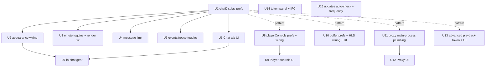

# feat: Additive Settings Expansion — Port Xtra Chat + Player/Stream Settings

## Summary

Add seven settings areas to the existing Settings page, each wired to real behavior: a Chat tab + in-chat gear (wired into the unified Twitch+Kick renderer and emote system), player control-button visibility, HLS.js buffer tuning, a Twitch outbound HTTP proxy, advanced Twitch stream-token controls (driven through the existing ad-block pipeline), a read-only API-token/session panel, and auto-check + frequency on the Updates tab. Delivered as independently-shippable phases, Chat first. Existing tabs are untouched (additive only).

---

## Problem Frame

StreamForge exposes almost no user configuration today, and the one chat-preference type that exists (`ChatPreferences`) is never read by the renderer. Everything about chat appearance, player chrome, and stream fetching is hardcoded. See origin for the full motivation: [2026-05-24-settings-expansion-xtra-port-requirements.md](../brainstorms/2026-05-24-settings-expansion-xtra-port-requirements.md).

Plan-specific framing: Phase-1 research found the codebase reality diverges from several origin assumptions (message-limit RAM cap, non-existent 7TV cosmetics, mostly-absent player buttons, the gear being a "clear chat" bar not a settings popover, the updater storing its flags outside `UserPreferences`). This plan reconciles each divergence explicitly rather than carrying the origin's assumptions forward.

---

## Requirements

This plan implements origin requirements R1–R30. Plan-time reconciliations against codebase reality are noted inline and in Key Technical Decisions.

**Foundation & integration** — R1 (additive only), R2 (own preference group per cluster), R3 (live-apply where feasible), R4 (sidebar pattern).
**Chat** — R5–R12 (tab grouping, appearance, emote/badge toggles, events, behavior, live-apply, gear quick-subset, "More settings").
**Player buttons** — R13 (visibility toggles, narrowed to controls that exist), R15 (hide chrome ≠ disable capability). R14 (configurable seek amounts) is deferred — no seek control exists to configure.
**Buffer** — R16–R18 (HLS.js latency/stability controls, reset-to-defaults, applies on next load).
**Proxy** — R19–R21 (outbound proxy + request-class selection, main-process application, safe-no-op when empty).
**Playback/stream-token advanced** — R22–R25 (advanced controls reconciled with ad-block, `hide_during_ads` excluded, advanced/danger framing).
**API tokens** — R26–R28 (read-only status/scopes, validate-now, never expose token values).
**Updates** — R29–R30 (auto-check + frequency, update URL stays fixed).

**Origin actors:** A1 (everyday viewer — gear + Chat tab), A2 (power user — buffer/proxy/token/advanced), A3 (Electron main process — applies proxy + token requests).
**Origin flows:** F1 (adjust chat appearance from gear → live), F2 (toggle emote provider → next-load), F3 (configure + enable proxy), F4 (validate token).
**Origin acceptance examples:** AE1 (timestamps live), AE2 (disable 7TV → text), AE3 (message-limit prune), AE4 (gear↔tab same global value), AE5 (hide control, capability intact), AE6 (proxy routes/disable), AE7 (validate expired token), AE8 (auto-check daily), AE9 (buffer applies on next load).

---

## Scope Boundaries

- Existing Settings tabs (Playback, Ad-Block, Predictions, Integrations, Updates, About) and their behavior are untouched — new sections are added, and Playback + Updates are extended only.
- Chat settings are global only — no per-channel overrides.
- Buffer applies to live playback on both platforms; proxy, playback-token, and codec controls are Twitch-only.
- Dropped (origin scope cuts): Android-isms (PiP-as-feature/minimize, sleep timer, device-admin, double-tap, background audio), on-device chat translation, raw protocol toggles (WebSocket/SSL/PubSub), channel-points auto-collect/notify, raid auto-switch, editable client-IDs/tokens, editable update URL.
- API-token panel is strictly read-only (status/expiry/scopes), never token values.

### Deferred to Follow-Up Work

- **Four 7TV cosmetic toggles** (name paints, cosmetic badges, personal emotes, live cosmetic updates): the underlying features do not exist in the renderer (no paint/cosmetic/7TV-EventAPI code). Each requires building the feature (7TV EventAPI WebSocket + cosmetic rendering) before a toggle is meaningful — separate future work.
- **Non-existent player controls** (restart, seek-to-live, aspect-ratio toggle, rewind/forward buttons, audio-only, subtitles/CC, audio compressor, in-player channel/title/category/uptime/viewer-count overlays): each is a net-new player feature, not a visibility toggle. R14 (configurable seek amounts) deferred with them.
- **Buffer tuning for VOD** and Kick non-live paths: this plan scopes buffer to live playback.

---

## Context & Research

### Relevant Code and Patterns

- **Settings page** `apps/desktop/src/pages/Settings/index.tsx` — `SidebarItem` + `activeTab` conditional-block pattern; write idiom `updatePreferences({ group: { ...(preferences?.group || DEFAULT_GROUP), field } })`; transient `saved` indicator. Extend the Playback block (currently only Default Quality) and the Updates block.
- **Preferences chain** — `apps/desktop/src/shared/auth-types.ts` (`UserPreferences`, `DEFAULT_USER_PREFERENCES`, `ChatPreferences`), `apps/desktop/src/store/auth-store.ts` (`updatePreferences`), `apps/desktop/src/backend/services/storage-service.ts` (`getPreferences`/`updatePreferences`, shallow top-level merge), `apps/desktop/src/shared/ipc-channels.ts`, `apps/desktop/src/preload/index.ts`, `apps/desktop/src/backend/ipc/handlers/storage-handlers.ts`. Adding a **new** top-level group needs only auth-types changes — IPC/preload/handler pass `Partial<UserPreferences>` generically.
- **Chat renderer (hardcoded today)** — `apps/desktop/src/components/chat/ChatMessage.tsx` (`text-sm`, `px-4 py-1 leading-[1.4]`, unconditional `<Timestamp>` + badges), `Username.tsx` (always `font-bold`, default colors `#9146ff`/`#53fc18`, no readable/contrast logic), `ChatBadge.tsx` (`h-4`), `ChatEmote.tsx` (`h-6`, hardcodes `isZeroWidth:false`, ignores animation), `ChatMessageList.tsx`, `ChatPanelTabs.tsx`.
- **Chat store** `apps/desktop/src/store/chat-store.ts` — `MESSAGE_LIMIT_NORMAL=100`, `MESSAGE_LIMIT_PAUSED=400`, `TRIM_BUFFER=10` (deliberately lowered to fix 5 GB RAM spikes); trim at `addMessage`, `flushBatch`, `prependMessages`.
- **Emote system** `apps/desktop/src/backend/services/emotes/emote-manager.ts` — `config.enabledProviders`, `isProviderEnabled`, `setProviderEnabled`; `loadGlobalEmotes`/`loadChannelEmotes` filter by provider; `apps/desktop/src/store/emote-store.ts` gates reloads via `loadedGlobalPlatforms`/`loadedChannels` Sets. `Emote` type carries real `isAnimated`/`isZeroWidth` (honored only by the picker's `EmoteImage.tsx`, not chat's `ChatEmote.tsx`).
- **Player + buffer** — `apps/desktop/src/components/player/twitch/twitch-hls-player.tsx` and shared `apps/desktop/src/components/player/hls-player.tsx`: both build `new Hls({ lowLatencyMode, liveSyncDurationCount:2, maxBufferLength:15, maxMaxBufferLength:30, backBufferLength:30, ... })`, and both run a periodic cleanup that mutates `backBufferLength` to 10 and restores it. Controls that exist: `player/settings-menu.tsx` (quality, speed, PiP, video-stats, disabled subtitles placeholder), `player/volume-control.tsx`, per-platform `*-player-controls.tsx` (fullscreen, theater).
- **Ad-block / token** — `apps/desktop/src/components/player/twitch/twitch-adblock-service.ts` (`getAccessToken`, `gqlRequest` headers incl. `X-Device-Id`, `buildUsherUrl`, HEVC→AVC), `apps/desktop/src/shared/adblock-types.ts` (`AdBlockConfig`, `DEFAULT_ADBLOCK_CONFIG`, `backupPlayerTypes`, `clientId`), `apps/desktop/src/store/adblock-store.ts` (on/off only; rich config via `updateAdBlockConfig`). Non-adblock path: `apps/desktop/src/backend/api/platforms/twitch/twitch-stream-resolver.ts` + `twitch-gql-client.ts` (`gqlGetPlaybackAccessToken`, `playerType:"site"`). Device-id also persisted in `twitch-hls-player.tsx` via `localStorage "twitch_adblock_device_id"`.
- **Proxy precedent** — `apps/desktop/src/backend/api/platforms/kick/kick-client.ts` `getCdnSession()` uses `session.fromPartition(...).setProxy(...)`. Main-process request hooks in `apps/desktop/src/backend/main.ts` (`webRequest`), `apps/desktop/src/backend/services/twitch-manifest-proxy.ts`, `apps/desktop/src/backend/services/third-party-cookie-stripper.ts` (CDN + OAuth/WAF carve-outs).
- **Updater** — `apps/desktop/src/hooks/useUpdater.ts`, `apps/desktop/src/store/update-store.ts`, `apps/desktop/src/backend/services/update-service.ts` (electron-updater; one-time 5s startup check; `allowPrerelease` persisted in a separate `update-settings` electron-store, not `UserPreferences`). Build is electron-builder; update feed = GitHub releases default (not user-editable).
- **Token validation** — `apps/desktop/src/backend/auth/token-exchange.ts` `validateTwitchToken` (`id.twitch.tv/oauth2/validate`) + `validateKickToken` (`api.kick.com/public/v1/token/introspect`), both `private`; `twitch-auth.ts`/`kick-auth.ts` `fetchCurrentUser`; `storageService.hasToken`/`isTokenExpired`; reconnect via `twitchReconnectRequired` + `loginTwitch`/`loginKick`.
- **Tests** — `apps/desktop/vitest.config.ts` (jsdom, `better-sqlite3`→`tests/helpers/better-sqlite3-shim.ts`), `apps/desktop/tests/test-utils.tsx` (`renderWithProviders`, `installElectronAPIMock`), tests mirror source paths. `apps/desktop/tests/AGENTS.md` for conventions.

### Institutional Learnings

- `docs/solutions/integration-issues/twitch-client-id-oauth-token-pairing-2026-05-23.md` — the token panel's validate/status MUST use the matching Client-Id (`VITE_TWITCH_CLIENT_ID` / `process.env.TWITCH_CLIENT_ID`), or a valid token reports as invalid. Don't copy `twitch-gql-pin-mutations.ts`'s bad pairing.
- `docs/solutions/architecture-patterns/kick-auth-surface-oauth-vs-session-cookies-2026-05-22.md` — Kick has no `/validate` analogue; validate by re-calling `fetchCurrentUser` on the OAuth surface; gate "signed in" on `hasToken("kick")`.
- `docs/solutions/integration-issues/twitch-irc-missing-chat-scopes-2026-05-19.md` + `.../kick-chat-401-missing-scope-and-broadcaster-id-2026-05-21.md` — a 200 from validate ≠ sufficient scopes; show the `scopes` array honestly; reconnect (not refresh) adds scopes.
- `docs/solutions/ui-bugs/chat-header-banner-lost-in-tab-shell-refactor-2026-05-18.md` — place the in-chat gear OUTSIDE `ChatPanelTabs` (its single-tab path strips chrome) so viewers see it; lock with a positive render test.
- `docs/solutions/design-patterns/websocket-connecting-state-safe-close-pattern-2026-05-20.md` — settings-driven chat remounts (hide-panel, provider reload) are new teardown triggers; route socket close through `closeWebSocketSafe`.
- `docs/solutions/conventions/tailwind-flex-truncation-trio-2026-05-18.md` — variable font/emote/width settings reflow chat rows; keep `min-w-0` + `flex-shrink-0` + `truncate min-w-0`; re-verify at the small end of ranges.
- `docs/solutions/integration-issues/kick-image-protocol-network-gate-latches-broken-images-2026-05-20.md` — don't gate emote-image fetches behind the network circuit breaker on provider-toggle reloads.
- `docs/solutions/conventions/electron-webrequest-callback-contract-2026-05-19.md` — proxy/header work must use `callback({})` on all non-mutating/catch paths.
- `docs/solutions/integration-issues/preload-auth-gettoken-no-sender-origin-check-2026-05-22.md` — keep proxy credentials + token values in main; the renderer panel sees status only.
- `docs/solutions/tooling-decisions/better-sqlite3-node-sqlite-shim-for-vitest-2026-05-19.md` — extend the shim before depending on an uncovered better-sqlite3 API.

### External References

- None required — local patterns are sufficient; HLS.js buffer keys are already used in-repo.

---

## Key Technical Decisions

- **One new top-level preference group per cluster** (`chatDisplay`, `playerControls`, `buffer`, `proxy`, `playbackAdvanced`), never new fields on existing groups. Rationale: the storage merge is shallow at the top level only — old installs that already persist an existing group would not pick up a newly-added field's default, but an absent whole-group falls back cleanly. (R2; see origin.)
- **Message limit stays memory-conscious.** Configurable with default **100** (matching the current shipped cap) and max **400**, plus a UI memory note. 100 is the deliberately-hardened value after 5 GB RAM spikes (200→150→100); defaulting to 150 would regress it, and in multiview the resident message array is shared across panels. (Reconciles R8/AE3 — origin's 500 default is not adopted.)
- **Animated + overlay emote toggles require a one-time renderer fix folded into the Chat phase** — chat messages render via `ChatEmote.tsx`, which ignores `isAnimated`/`isZeroWidth` today; the toggles are wired only after that fix so they actually change behavior. (R7.)
- **Per-provider 7TV/BTTV/FFZ toggles ride the existing `setProviderEnabled` seam** + a reload (clear `loadedChannels`/`loadedGlobalPlatforms`). Four 7TV *cosmetic* toggles are dropped (features don't exist). (R7.)
- **Player-button visibility covers only existing controls** (Quality, Speed, Volume, Fullscreen, Theater, PiP, Video-Stats). The rest are deferred (each is a net-new feature). (R13; R14 deferred.)
- **Advanced playback-token controls are scoped to the ad-block path only.** The ad-block and resolver paths use deliberately different Client-Ids (`kimne…` web vs `kd1unb…` Android), so a single shared override would 401 one path; overrides flow via `updateAdBlockConfig`, and the resolver keeps its working defaults when ad-block is off. Device-id is a localStorage-seeded module value (not an `AdBlockConfig` field), applied on next stream load. (R22/R23.)
- **Proxy egress needs a spike before its UI.** The target requests are renderer-issued, so a new proxied partition (the `kick-client.ts` shape) is a silent no-op — U11 must first prove the egress path (proxy the renderer's real session, or route classes through a main-process proxied fetch). Proxy credentials use `safeStorage`, not plain `UserPreferences`, and the new IPC validates sender origin. (R19/R20.)
- **Update auto-check + frequency live in the existing `update-settings` electron-store** (where `allowPrerelease` already is), not a new `UserPreferences` group — consistent with current code. (R29; documented exception to the per-group rule.)
- **Token validate/status crosses to main via a new read-only IPC** that returns status/expiry/scopes only; token values never reach the renderer (preserves R28 and avoids widening the known `AUTH_GET_TOKEN` exposure).
- **Gates are `tsc --noEmit` + `vitest run`** — biome is baseline-red repo-wide. Tests mirror source paths and use the better-sqlite3 shim.

---

## Open Questions

### Resolved During Planning

- *Which player buttons exist?* — Only Quality/Speed/Volume/Fullscreen/Theater/PiP/Video-Stats; rest deferred.
- *Does the in-chat gear host settings today?* — No; it's a "clear local chat" bar. Quick-subset UI is net-new, placed outside `ChatPanelTabs`.
- *Kick token validation endpoint?* — No clean `/validate`; re-call `fetchCurrentUser` on the OAuth surface and treat non-200 as invalid.
- *Where do updater settings live?* — Existing `update-settings` electron-store; extend it.
- *Buffer wiring sites?* — Both `twitch-hls-player.tsx` and shared `hls-player.tsx`, coexisting with the periodic `backBufferLength` mutation.

### Deferred to Implementation

- Exact HLS.js key mapping for "target live latency" (likely `liveSyncDurationCount` vs `liveSyncDuration`) — confirm against HLS.js 1.6 behavior during U10.
- Whether proxying renderer-side playlist/segment fetches needs a partitioned proxied session vs. routing through the main-process manifest proxy — resolve in U11 (highest-risk unknown).
- Precise reconciliation when ad-block is toggled while advanced overrides are set (re-apply order) — resolve in U13.

---

## High-Level Technical Design

> *This illustrates the intended approach and is directional guidance for review, not implementation specification. The implementing agent should treat it as context, not code to reproduce.*

Phase/unit dependency graph (phases are independently shippable; arrows are hard code dependencies, dotted are "follow the pattern from"):

---

## Implementation Units

### U1. `chatDisplay` preferences group + defaults

**Goal:** Add a new `chatDisplay` top-level group to `UserPreferences` (appearance + emote/event toggles + message limit) with defaults, establishing the additive-group pattern every later phase reuses. This unit owns the additive-only invariant (R1) and the live-apply convention (R3) that the prose claims but no unit previously carried.

**Requirements:** R1, R2, R3, R4

**Dependencies:** None

**Files:**
- Modify: `apps/desktop/src/shared/auth-types.ts` (add `ChatDisplayPreferences` + `DEFAULT_CHAT_DISPLAY_PREFERENCES`; add `chatDisplay` to `UserPreferences` + `DEFAULT_USER_PREFERENCES`)
- Test: `apps/desktop/tests/backend/services/storage-service.test.ts` (extend) or `apps/desktop/tests/shared/preferences-defaults.test.ts` (new)

**Approach:**
- Fields: `boldUsernames`, `readableColorForUncolored`, `themeAdaptUsernameColor`, `timestamps`, `timestampFormat`, `fontSizePx`, `emoteSizePx`, `density` (`"cozy"|"compact"`), `chatWidthPct`, emote toggles (`enable7tv`/`enableBttv`/`enableFfz`, `animatedEmotes`, `overlayEmotes`, `systemMessageEmotes`), event toggles (`showUserNotices`, `showClearMsg`, `showClearChat`, `firstMsgHighlight`, `recentMessagesOnJoin`, `recentMessagesLimit`, `showPolls`, `showPredictions`), `messageLimit`.
- `showPolls`/`showPredictions` come from origin R8 and gate the poll/prediction banners in U5. `chatWidthPct` persists here, but its read-on-mount + persist-on-drag-end wiring lives in the Stream/MultiStream pages (see U2) — it is not consumed by the message components.
- Defaults per origin R6–R8 with the message-limit reconciliation (default 100 = shipped cap, documented max 400).

**Patterns to follow:** existing `PredictionPreferences` group in `auth-types.ts` (smallest precedent for a new group + default const).

**Test scenarios:**
- Happy path: `getPreferences()` on an empty store returns `chatDisplay` equal to `DEFAULT_CHAT_DISPLAY_PREFERENCES`.
- Edge case: a stored prefs object predating `chatDisplay` (group absent) hydrates the full default group (shallow-merge forward-compat).
- Edge case: `updatePreferences({ chatDisplay: {...partial} })` persists and round-trips without dropping sibling groups.

**Verification:** `tsc` clean; new prefs visible via `preferences.get()`; no change to existing groups' defaults.

---

### U2. Wire chat appearance into the renderer

**Goal:** Make the chat renderer read `chatDisplay` for font size, density, timestamps (on/off + format), bold usernames, readable/theme-adapted username colors, badge visibility, and emote size — applied live to visible and incoming messages on both platforms.

**Requirements:** R5, R6, R10; F1; AE1

**Dependencies:** U1

**Files:**
- Modify: `apps/desktop/src/components/chat/ChatMessage.tsx`, `apps/desktop/src/components/chat/Username.tsx`, `apps/desktop/src/components/chat/ChatBadge.tsx`, `apps/desktop/src/components/chat/ChatEmote.tsx` — each reads `useAuthStore(s => s.preferences?.chatDisplay)` directly (the existing inline-selector pattern; do NOT introduce a `useChatDisplayPrefs` hook for 1–2 consumers)
- Modify: `apps/desktop/src/pages/Stream/index.tsx` and `apps/desktop/src/pages/MultiStream/index.tsx` — `chatWidthPct` only: initialize the local `chatWidth` `useState` from the pref and persist on drag-end (today both are unpersisted local state; MultiStream must not be missed)
- Test: `apps/desktop/tests/components/chat/ChatMessage.test.tsx`, `apps/desktop/tests/components/chat/Username.test.tsx`

**Approach:**
- Replace hardcoded `text-sm` / `leading-[1.4]` / `h-4` / `h-6` with values derived from prefs (font px, density spacing, badge/emote size); gate `<Timestamp>` and badges on prefs; apply chosen timestamp format.
- Username: gate `font-bold` on `boldUsernames`; add deterministic readable-color assignment for uncolored users and a dark-theme contrast lift, gated on their prefs.
- Live-apply: prefs come from the store so re-render is automatic; verify no remount.

**Patterns to follow:** existing store-selector usage in chat components; `tailwind-flex-truncation-trio` learning for any row reflow (keep `min-w-0`/`flex-shrink-0`/`truncate`).

**Test scenarios:**
- Covers AE1. Happy path: with `timestamps:true`, a rendered message shows the time in the configured format; with `false`, no timestamp node.
- Happy path: `fontSizePx`/`emoteSizePx`/`density` changes are reflected in rendered styles without remount.
- Edge case: `boldUsernames:false` removes bold; uncolored user gets a stable readable color across renders.
- Edge case (regression guard): at minimum font size + min chat width, a long username + message still truncates (no overflow).

**Verification:** Toggling each appearance pref in-app updates already-rendered chat; tests assert conditional rendering + styles.

---

### U3. Emote provider toggles + animated/overlay rendering fix

**Goal:** Honor `isAnimated`/`isZeroWidth` in chat-message emote rendering, gate animated + overlay behavior on prefs, and wire per-provider 7TV/BTTV/FFZ enable/disable with a reload.

**Requirements:** R7, R10; F2; AE2

**Dependencies:** U1

**Files:**
- Modify: `apps/desktop/src/shared/chat-types.ts` (add `isZeroWidth?: boolean` to the `emote` variant of `ContentFragment` — it carries only `{id,name,url,isAnimated?}` today)
- Modify: `apps/desktop/src/backend/services/chat/twitch-parser.ts` and `apps/desktop/src/backend/services/chat/kick-parser.ts` (populate `isZeroWidth` from the matched `Emote` record when building emote fragments)
- Modify: `apps/desktop/src/components/chat/ChatMessage.tsx` (`MessageFragment` passes `isZeroWidth`/`isAnimated` into `ChatEmote`)
- Modify: `apps/desktop/src/components/chat/ChatEmote.tsx` (honor real `isZeroWidth`/`isAnimated`, gate on `overlayEmotes`/`animatedEmotes`)
- Modify: `apps/desktop/src/store/emote-store.ts` and/or `apps/desktop/src/backend/services/emotes/emote-manager.ts` (apply `enabledProviders` from prefs; expose a reload that clears `loadedChannels`/`loadedGlobalPlatforms`)
- Test: `apps/desktop/tests/components/chat/ChatEmote.test.tsx`, `apps/desktop/tests/store/emote-store.test.ts`

**Approach:**
- The chat message renderer uses `ChatEmote`, which receives a flattened `ContentFragment` (NOT the full `Emote` record the picker's `EmoteImage` gets) — and that fragment has no `isZeroWidth` field. So honoring overlay/animated is a pipeline change, not a one-component fix: add the flag to the fragment type, populate it in both parsers from the `Emote` record, thread it through `MessageFragment`, then gate rendering in `ChatEmote`.
- Provider enable/disable and overlay/animated changes apply on the next channel load (per R10), not retroactively to already-parsed buffered messages — the Chat tab/gear rows for these must say so (see U6).
- Provider toggle: set `enabledProviders` via `setProviderEnabled`, then trigger a reload of global + current-channel emotes so disabled providers stop rendering (next-load semantics per R10).
- Do NOT gate emote-image fetches behind the network circuit breaker (`kick-image-protocol` learning).

**Patterns to follow:** `EmoteImage.tsx` `SIZE_CONFIG`/zero-width handling; `emote-manager.ts` `setProviderEnabled`.

**Test scenarios:**
- Covers AE2. Happy path: disabling 7TV then reloading a channel removes 7TV emotes (render as text) while BTTV/FFZ/native remain.
- Happy path: an overlay (`isZeroWidth`) emote stacks on the previous emote when `overlayEmotes:true`, renders inline when `false`.
- Edge case: `animatedEmotes:false` renders a static frame for animated emotes.
- Edge case: re-enabling a provider reloads and re-renders its emotes.

**Verification:** Provider toggles change rendered emotes after reload; overlay/animated flags respected; no broken-image latch on toggle.

---

### U4. Configurable message limit

**Goal:** Make the chat message buffer cap a `chatDisplay.messageLimit` preference, threaded into all trim sites, with a memory-conscious default and cap.

**Requirements:** R8; AE3

**Dependencies:** U1

**Files:**
- Modify: `apps/desktop/src/store/chat-store.ts` (read the pref in `addMessage`, `flushBatch`, `prependMessages` instead of the module constants)
- Test: `apps/desktop/tests/store/chat-store.test.ts`

**Approach:**
- Replace `MESSAGE_LIMIT_NORMAL` usage with the configured value (clamped to ≤ max 400), preserving `MESSAGE_LIMIT_PAUSED`/`TRIM_BUFFER` semantics and the paused-buffer behavior.
- Default 100 (the current shipped value — do NOT raise to 150); surface the RAM rationale + the multiview shared-array note in the Chat tab (U6). Origin AE3 uses 500 as an illustration; the reconciled cap is what the test exercises.

**Patterns to follow:** existing trim logic in `chat-store.ts`.

**Test scenarios:**
- Covers AE3. Happy path: with limit N, adding N+1 messages prunes the oldest to N.
- Edge case: a value above the max clamps to 400; a value below the min clamps to the floor.
- Edge case: paused state still uses the paused buffer and doesn't lose messages on resume/trim.

**Verification:** Buffer length tracks the configured limit across all three trim paths.

---

### U5. Event/notice visibility + recent-messages-on-join

**Goal:** Gate sub/raid/user-notice lines, message-deletion and chat-clear notices, first-time-chatter highlight, system-message emotes, and recent-messages-on-join (+limit) on `chatDisplay`; wire "hide chat panel" to the existing `ChatPreferences.position:"hidden"`.

**Requirements:** R8, R9, R10

**Dependencies:** U1

**Files:**
- Modify: `apps/desktop/src/components/chat/ChatMessageList.tsx`, `apps/desktop/src/components/chat/ChatMessage.tsx` (notice/highlight gating), the recent-history seeding path (`apps/desktop/src/components/chat/twitch/twitch-chat-history.ts`, `apps/desktop/src/components/chat/kick/kick-chat-history.ts`)
- Modify: chat layout consumer of `ChatPreferences.position` for hide-panel
- Test: `apps/desktop/tests/components/chat/ChatMessageList.test.tsx`

**Approach:**
- Conditional rendering by message type gated on the relevant toggle; recent-messages-on-join controls whether/how many history messages seed on join.
- Hide-chat reuses the existing `position:"hidden"` field (safe — existing field), no new flag.
- Any toggle that remounts chat must route socket teardown through `closeWebSocketSafe` (`websocket-connecting-state` learning).

**Patterns to follow:** existing message-type branching in `ChatMessageList`/`ChatMessage`; `isHistorical` dimming for seeded messages.

**Test scenarios:**
- Happy path: disabling clearchat notices hides the chat-clear line; disabling user-notices hides sub/raid lines.
- Happy path: `recentMessagesOnJoin:false` seeds no history; with a limit, seeds at most that many.
- Edge case: first-msg highlight off removes the highlight styling.
- Integration: toggling hide-panel collapses chat without tearing down a CONNECTING socket uncaught.

**Verification:** Each event toggle changes what renders; hide-panel collapses chat cleanly.

---

### U6. Chat tab in the Settings page

**Goal:** Add a "Chat" sidebar tab presenting all chat settings grouped (Appearance, Emotes & badges, Messages & events, Behavior), reading/writing `chatDisplay`.

**Requirements:** R5, R6, R7, R8, R9; A1

**Dependencies:** U1

**Files:**
- Modify: `apps/desktop/src/pages/Settings/index.tsx` (sidebar item + content block; read `?tab=chat` search param into `activeTab` for U7's deep-link)
- Add: `apps/desktop/src/components/settings/ChatSettingsSection.tsx` (the control set, reused by the U7 gear popover — the one justified extraction, two consumers)
- Test: `apps/desktop/tests/pages/Settings.test.tsx` (or component test for the section)

**Approach:**
- Insert the Chat sidebar item after Playback under the existing "App Settings" header. Mirror the `SidebarItem` + conditional-block pattern; use existing `ui/{switch,select}` primitives; spread-existing-subobject write idiom.
- Group controls per R5 with a visual heading row per group (the uppercase-tracking `h3` pattern the sidebar already uses). Emote-provider and overlay/animated rows note "applies on next channel load"; appearance rows are live.
- Give each group card its OWN "Saved" indicator rather than the single page-level `saved` bool — with 20+ controls a shared bool races (a second save dismisses the first mid-display). Include the message-limit memory note.

**Patterns to follow:** existing Predictions/Playback tab blocks in `Settings/index.tsx`.

**Test scenarios:**
- Happy path: changing a control calls `updatePreferences({ chatDisplay: { ...current, field } })` with the spread preserved.
- Edge case: opening the tab with no stored prefs shows defaults.

**Verification:** Chat tab renders all groups; edits persist and reflect in chat (with U2–U5).

---

### U7. In-chat gear quick-subset popover

**Goal:** Build a quick-subset settings popover (font size, emote size, density, timestamps, show badges, message limit) opened from the existing gear on both Twitch and Kick chat, editing the same global `chatDisplay`, plus a "More settings" link to the Chat tab.

**Requirements:** R11, R12; AE4; F1

**Dependencies:** U2, U6

**Files:**
- Modify: `apps/desktop/src/components/chat/twitch/TwitchChat.tsx`, `apps/desktop/src/components/chat/kick/KickChat.tsx` (replace/augment the `showChatSettings` mini-bar)
- Add: `apps/desktop/src/components/chat/ChatQuickSettingsPopover.tsx`
- Test: `apps/desktop/tests/components/chat/ChatQuickSettingsPopover.test.tsx`

**Approach:**
- Reuse the subset of controls from U6's section; write to the same global group (no per-channel scope).
- Place the gear in the chat panel header chrome OUTSIDE `ChatPanelTabs` (chat-header-banner learning — the single-tab viewer path strips tab chrome) so viewers see it. The "clear chat" action moves into the popover (destructive button at the bottom).
- Popover behavior to specify (both platforms identically): anchor above the gear button (bottom-anchored, doesn't cover the message list); dismiss on outside-click AND Escape; gear shows an active/accent state while open.
- "More settings" deep-link: the Settings page tracks `activeTab` in local `useState` today, so add a route search param (e.g. `/settings?tab=chat`) that `SettingsPage` reads to initialize `activeTab`; "More settings" navigates with that param. This param wiring is part of this unit.

**Patterns to follow:** existing gear toggle in `TwitchChat.tsx`/`KickChat.tsx`; `chat-header-banner-lost` learning (positive render test).

**Test scenarios:**
- Covers AE4. Happy path: changing font size in the gear updates the same value the Chat tab shows (one global source).
- Happy path: gear renders on both Twitch and Kick chat in the single-tab (viewer) path.
- Edge case: "More settings" opens the Chat tab.

**Verification:** Gear opens a working quick subset on both platforms; values match the tab; gear visible to viewers.

---

### U8. `playerControls` prefs + wire button visibility

**Goal:** Add a `playerControls` prefs group and gate the visibility of the controls that exist (Quality, Speed, Volume, Fullscreen, Theater, PiP, Video-Stats) on both platforms, without disabling the underlying capability.

**Requirements:** R13, R15; AE5

**Dependencies:** U1 (pattern)

**Files:**
- Modify: `apps/desktop/src/shared/auth-types.ts` (`playerControls` group + default — all visible by default)
- Modify: `apps/desktop/src/components/player/settings-menu.tsx`, `apps/desktop/src/components/player/volume-control.tsx`, `apps/desktop/src/components/player/twitch/twitch-live-player-controls.tsx`, `apps/desktop/src/components/player/twitch/twitch-vod-player-controls.tsx`, `apps/desktop/src/components/player/kick/kick-live-player-controls.tsx`, `apps/desktop/src/components/player/kick/kick-vod-player-controls.tsx`
- Test: `apps/desktop/tests/components/player/player-controls-visibility.test.tsx`

**Approach:**
- Wrap each control's render in a visibility check from prefs; default all true. Hiding a control must not change playback/audio state (R15).
- Respect `player/AGENTS.md` constraints (no `recoverMediaError` misuse; low-latency default).

**Patterns to follow:** existing conditional control rendering in the `*-controls.tsx` files.

**Test scenarios:**
- Covers AE5. Happy path: hiding Volume removes the button but audio continues at current volume.
- Happy path: each toggle hides/shows its control on both live and VOD where applicable.
- Edge case: a control absent on a surface (e.g., speed on live) stays absent regardless of toggle.

**Verification:** Each existing control honors its visibility pref; capabilities intact.

---

### U9. Player-controls Settings section

**Goal:** Add a "Player controls" Settings section with toggles for the controls wired in U8.

**Requirements:** R13

**Dependencies:** U8

**Files:**
- Modify: `apps/desktop/src/pages/Settings/index.tsx`
- Test: covered via Settings/component test

**Approach:** inline sidebar item + content block (do NOT add a standalone `PlayerControlsSection.tsx` — single consumer; match the inline Predictions/Playback precedent); spread-write idiom. Only list controls that exist (per U8). All-hidden is permitted (no minimum-one guard); note this so the implementer doesn't add an unrequested constraint.

**Patterns to follow:** U6; existing Settings blocks.

**Test scenarios:**
- Happy path: toggling a control persists to `playerControls` and the player reflects it.

**Verification:** Section renders the real control set; edits persist + apply.

---

### U10. Buffer settings → HLS.js config (+ Settings section)

**Goal:** Add a `buffer` prefs group exposing target live latency, forward buffer, max buffer, and low-latency mode; apply at both HLS construction sites for live playback; add a "reset to defaults" and a Buffer Settings section.

**Requirements:** R16, R17, R18; AE9; A2

**Dependencies:** U1 (pattern)

**Files:**
- Modify: `apps/desktop/src/shared/auth-types.ts` (`buffer` group + defaults = current hardcoded values)
- Modify: `apps/desktop/src/components/player/twitch/twitch-hls-player.tsx`, `apps/desktop/src/components/player/hls-player.tsx` (consume buffer prefs in the `new Hls({...})` config)
- Modify: `apps/desktop/src/pages/Settings/index.tsx` (Buffer section)
- Test: `apps/desktop/tests/components/player/hls-buffer-config.test.ts`

**Approach:**
- Map prefs → HLS keys at the `new Hls({...})` construction site (not via later mutation): low-latency → `lowLatencyMode`; target live latency → `liveSyncDurationCount` (confirm vs `liveSyncDuration` for HLS.js 1.6); forward buffer → `maxBufferLength`; max buffer → `maxMaxBufferLength`. Defaults equal the current hardcoded values (R17).
- The periodic cleanup only mutates `backBufferLength` (not user-exposed), so it doesn't fight the exposed knobs. The real interaction to handle: `maxBufferLength`/`maxMaxBufferLength` are bounded by the existing `maxBufferSize` (20 MB) soft cap and `liveMaxLatencyDurationCount` (6) — a raised forward-buffer value can be silently clamped by HLS.js. Document/raise `maxBufferSize` proportionally rather than letting the configured value be ignored.
- Applies on next stream load (R18); a single section-level note states this ("Changes apply when the stream next loads").

**Patterns to follow:** existing `new Hls({...})` blocks in both player files; `player/AGENTS.md`.

**Test scenarios:**
- Covers AE9. Happy path: a custom buffer pref produces the expected HLS config object at construction.
- Happy path: "reset to defaults" restores the documented default values.
- Edge case: invalid/empty values fall back to defaults (no NaN into HLS config).
- Edge case: the periodic cleanup restores to the configured baseline, not the old hardcoded constant.

**Verification:** New streams build HLS with the configured buffer; reset works; both platforms covered.

---

### U11. Outbound HTTP proxy — main-process plumbing

**Goal:** Add a `proxy` prefs group and apply an outbound HTTP/HTTPS proxy (host, port, optional credentials) to the selected Twitch request classes (playback access token, multivariant playlist, media playlist) via the main process, off by default and a safe no-op when empty.

**Requirements:** R19, R20, R21; F3; A3; AE6

**Dependencies:** U1 (pattern)

**Files:**
- Modify: `apps/desktop/src/shared/auth-types.ts` (`proxy` group: host, port, per-class flags only — NOT the password)
- Add: `apps/desktop/src/backend/services/stream-proxy-service.ts` (apply/clear proxy; encrypt/read credentials via `safeStorage`)
- Modify: `apps/desktop/src/shared/ipc-channels.ts`, `apps/desktop/src/preload/index.ts`, `apps/desktop/src/backend/ipc/handlers/` (new proxy-apply channel WITH a `senderFrame.url` origin check)
- Modify: the request paths for the three classes (`twitch-gql-client.ts` / ad-block service token fetch; the HLS playlist fetch path / `twitch-manifest-proxy.ts`)
- Test: `apps/desktop/tests/backend/services/stream-proxy-service.test.ts`

**Approach:**
- **Egress-path spike first (blocks U12).** The three target classes are issued from the RENDERER (HLS.js loaders use `fetch`/XHR; the ad-block service's `getAccessToken` calls `fetch("https://gql.twitch.tv/gql")` directly). The `kick-client.ts` precedent sets proxy on a *separate* partition the renderer never uses — copying it verbatim is a silent no-op for these requests, and `session.setProxy` cannot select by request class. Decide between: (a) proxy the renderer's actual session (proxies all its traffic — drop per-class selectivity and reconcile R19), or (b) route each class through a main-process `fetch` that honors an explicit proxy agent (verify Electron main `fetch`/undici proxy honoring first). Also: when the main-process manifest proxy (ad-block) is active it serves a `data:` URL, so there is no renderer media-playlist network fetch to proxy in that mode — define behavior when both are on.
- **Security:** store proxy username/password via `safeStorage.encryptString` (the OAuth-token path), NOT in plain `UserPreferences`; the `proxy` prefs group holds host/port/flags only. `PREFERENCES_GET` must never return the password (write-only field; placeholder if set). The proxy-apply IPC handler validates `event.senderFrame.url` (the `AUTH_GET_TOKEN` no-sender-origin learning — don't add another unauthenticated channel). Credentials stay in main, never logged.
- If a new proxied session/partition is created, call `registerThirdPartyCookieStripper` on it so OAuth/WAF carve-outs hold. Any `webRequest` branch uses `callback({})` on non-mutating paths. Empty host → no-op (R21).

**Patterns to follow:** `kick-client.ts` `getCdnSession`; `main.ts` webRequest hooks; `electron-webrequest-callback-contract` + `third-party-cookie` learnings.

**Test scenarios:**
- Covers AE6. Happy path: with a valid host/port and "media playlist" selected, media-playlist requests route through the proxy; disabling restores direct.
- Edge case: empty host with proxy "enabled" is a no-op (no broken requests).
- Edge case: credentials present are applied to the session and never appear in logs.
- Error path: an unreachable proxy surfaces a clear failure without crashing playback.

**Verification:** Selected request classes egress through the proxy when set; safe when empty/off.

---

### U12. Proxy Settings section

**Goal:** Add a Twitch "Proxy" Settings section (host, port, user, password, per-class toggles) writing the `proxy` group and triggering apply.

**Requirements:** R19

**Dependencies:** U11

**Files:**
- Modify: `apps/desktop/src/pages/Settings/index.tsx`
- Test: component/Settings test

**Approach:** inline content block (no standalone `ProxySettingsSection.tsx` — single consumer). Host: non-empty, no scheme. Port: numeric 1–65535, inline validation on blur. Password: `type="password"` with show/hide, write-only (placeholder if a value is stored, never round-tripped from main). Save with empty host shows a dimmed "Proxy disabled (no host set)" status, not "Saved". An apply-IPC failure (e.g. unreachable proxy) surfaces a persistent in-section error banner, not a toast.

**Patterns to follow:** existing input/switch usage; U11 IPC.

**Test scenarios:**
- Happy path: saving valid settings persists and calls the apply IPC.
- Edge case: empty host disables application (consistent with R21).

**Verification:** Section drives U11; values persist; password not exposed.

---

### U13. Advanced playback / stream-token controls (reconciled with ad-block)

**Goal:** Add a `playbackAdvanced` prefs group (supported codecs, device-id + randomize, player type, include-GQL-token, stream headers, skip-video-access-token) surfaced as advanced controls on the ad-block (VAFT) token pipeline. Because the ad-block path and the non-ad-block resolver path use *different* Client-Ids, overrides are scoped to the ad-block path only; the resolver path keeps its working defaults (pushing overrides there would 401).

**Requirements:** R22, R23, R24, R25; A2

**Dependencies:** U1 (pattern)

**Files:**
- Modify: `apps/desktop/src/shared/auth-types.ts` (`playbackAdvanced` group + defaults matching current working values)
- Modify: `apps/desktop/src/components/player/twitch/twitch-adblock-service.ts` (consume overrides via `updateAdBlockConfig`), `apps/desktop/src/backend/api/platforms/twitch/twitch-stream-resolver.ts` / `twitch-gql-client.ts` (non-adblock path), `apps/desktop/src/components/player/twitch/twitch-hls-player.tsx` (device-id randomize via `localStorage`)
- Modify: `apps/desktop/src/pages/Settings/index.tsx` (advanced controls under the Playback tab, "advanced — can break playback" framing)
- Test: `apps/desktop/tests/adblock/playback-advanced-overrides.test.ts`

**Approach:**
- **Single owning path = ad-block.** The ad-block service sends `config.clientId` (web id `kimne…`) with integrity; the resolver (`twitch-gql-client.ts`) hardcodes the Android id `kd1unb…` with `playerType:"site"` and an in-code comment that the web id trips the integrity check. A shared override can't drive both — apply overrides via `updateAdBlockConfig` only (player type, codecs). When ad-block is OFF, the resolver runs at its working defaults; overrides do not reach it. Document this explicitly so the implementer doesn't try to push overrides into the resolver.
- **Device-id** is NOT an `AdBlockConfig` field — it's a module-level value in the ad-block service seeded from `localStorage "twitch_adblock_device_id"` via `setAuthHeaders` on player mount, and the resolver path sends no `X-Device-Id` at all. So "randomize device-id" applies to the ad-block path only and takes effect on next stream load (remount re-seeds). State both caveats.
- Exclude `hide_during_ads` (R24). Defaults = current behavior, so untouched controls are behavior-neutral (R25).

**Patterns to follow:** `twitch-adblock-service.ts` config consumption; `adblock-types.ts` defaults; `updateAdBlockConfig`.

**Test scenarios:**
- Happy path: setting a player-type override changes the token request body (ad-block on path).
- Happy path: with ad-block off, the override reaches the resolver path.
- Edge case: "randomize device-id" produces a new persisted id used on next token request.
- Edge case: defaults reproduce current working token request (no behavior change when untouched).

**Verification:** Overrides flow to the correct token path per ad-block state; defaults are behavior-neutral.

---

### U14. Read-only API-token / session panel

**Goal:** Add an "API / Tokens" Settings section showing current Twitch/Kick user id + login, token validity, expiry, and granted scopes (read-only), with a "Validate now" action; never expose token values.

**Requirements:** R26, R27, R28; F4; AE7

**Dependencies:** None (reads auth state)

**Files:**
- Modify: `apps/desktop/src/backend/auth/token-exchange.ts` (expose validate via a service method) or add a thin status method; `apps/desktop/src/backend/ipc/handlers/auth-handlers.ts` (new read-only `tokenStatus` channel returning status only, WITH a `senderFrame.url` origin check)
- Modify: `apps/desktop/src/shared/ipc-channels.ts` (define a strict `TokenStatusResult` type = `{ platform, valid, expiresAt, scopes, login, userId }` — NO `accessToken`/`token`/`refreshToken` keys), `apps/desktop/src/preload/index.ts`
- Modify: `apps/desktop/src/pages/Settings/index.tsx` (API/Tokens section)
- Test: `apps/desktop/tests/backend/auth/token-status.test.ts`, component test for the section

**Approach:**
- Twitch: `validateTwitchToken` against `id.twitch.tv/oauth2/validate`. Note this endpoint takes only the OAuth bearer header — NO Client-Id — so do NOT thread a Client-Id into it; the Client-Id pairing learning applies to Helix/`fetchCurrentUser` calls, not `/validate`. Return login/user_id/scopes/expiry only.
- Kick: re-call `fetchCurrentUser` on the OAuth surface; non-200 = invalid (no `/validate` analogue). `fetchCurrentUser` returns no expiry, so fall back to the stored token `expiresAt` for the Kick expiry column. Be explicit which Kick id is shown (OAuth `user_id`, per the dual-id learning).
- Define four explicit panel states per platform: not-connected (no token → "Not signed in" + link to Integrations), loading (validate in-flight → button disabled/spinner), valid (login/user_id/expiry/scopes), invalid-or-expired (+ reconnect via existing `loginTwitch`/`loginKick`). Surface scopes honestly (a 200 ≠ sufficient scopes).
- Token values never cross IPC (R28) — the strict `TokenStatusResult` shape enforces this; a test asserts the response has no token-bearing key.

**Patterns to follow:** `token-exchange.ts` validate methods; `auth-store` reconnect flags; learnings on Client-Id pairing, Kick auth surface, scope sufficiency.

**Test scenarios:**
- Covers AE7. Happy path: a valid token shows valid + expiry + scopes; an expired token shows invalid + reconnect.
- Happy path: the four panel states render correctly — not-connected, loading (button disabled while validating), valid, invalid/expired.
- Edge case: Kick non-200 from current-user → shown invalid; signed-out → "not connected"; Kick expiry falls back to stored `expiresAt`.
- Security: the `TokenStatusResult` response contains no `accessToken`/`token`/`refreshToken` key (assert shape).

**Verification:** Panel reflects real token status for both platforms; no token value reaches the renderer.

---

### U15. Updates — auto-check toggle + frequency

**Goal:** Add an "automatically check for updates" toggle and a check-frequency selector to the Updates tab, persisted in the existing `update-settings` store and driving an interval check; keep the update URL fixed.

**Requirements:** R29, R30; AE8

**Dependencies:** None

**Files:**
- Modify: `apps/desktop/src/backend/services/update-service.ts` (persist `autoCheckEnabled` + `frequency` in the existing `update-settings` store; replace the one-time 5s check with an interval scheduler honoring the setting)
- Modify: `apps/desktop/src/hooks/useUpdater.ts`, `apps/desktop/src/store/update-store.ts` (expose the new settings + setters)
- Modify: `apps/desktop/src/pages/Settings/index.tsx` (Updates tab additions)
- Test: `apps/desktop/tests/backend/services/update-service.test.ts`

**Approach:**
- Follow the existing `allowPrerelease`-in-`update-settings` convention. Frequency is a discrete preset (e.g. hourly / daily / weekly), not free-form, and the scheduler clamps to a sane minimum (≥1 h) before using it so a tampered/0 value can't spin a check loop. Scheduler = interval gated on last-check timestamp. Manual "check now" + prerelease remain. URL not exposed (R30). Auto-check still gated on `app.isPackaged`.

**Patterns to follow:** existing `update-settings` persistence + `allowPrerelease` flow in `update-service.ts`.

**Test scenarios:**
- Covers AE8. Happy path: auto-check on + daily → at most one automatic check per day; manual check still works any time.
- Edge case: auto-check off → no scheduled checks fire.
- Edge case: frequency change reschedules without requiring restart.

**Verification:** Auto-check honors toggle + frequency; manual + prerelease unaffected; URL not user-editable.

---

## System-Wide Impact

- **Interaction graph:** chat display prefs feed the singleton chat renderer (multiview fans out — global settings sidestep the per-channel-filter requirement); player-control prefs feed both platforms' control trees; buffer feeds two HLS construction sites; proxy touches main-process sessions + webRequest; advanced-token touches the two Twitch token paths; token panel touches auth IPC; updates touches the updater scheduler.
- **Error propagation:** proxy failures must degrade to a visible error, not a crashed player; token-validate failures surface as "invalid + reconnect," not silent.
- **State lifecycle risks:** settings-driven chat remounts (hide-panel, provider reload) can tear down CONNECTING sockets — route through `closeWebSocketSafe`. Buffer prefs must coexist with the periodic `backBufferLength` cleanup mutation.
- **API surface parity:** new IPC channels (proxy apply, token status) follow the existing define→preload→handler pattern; both must avoid exposing secrets to the renderer.
- **Integration coverage:** emote provider toggle → reload → render; proxy apply → real request egress; buffer pref → HLS config object — covered by integration-leaning tests where mocks alone won't prove behavior.
- **Unchanged invariants:** existing Settings tabs, the `ChatPreferences` shape (only `position:"hidden"` reused), ad-block on/off behavior when advanced controls are untouched, and the update feed URL.

---

## Risks & Dependencies

| Risk | Mitigation |
|------|------------|
| Raising message limit reintroduces 5 GB RAM spikes | Default 150, hard cap 400, UI memory note (U4) |
| Proxy is a silent no-op (renderer-issued requests; a new partition isn't on their path) | E1 egress spike resolves the path (proxy the renderer's real session, or main-process proxied fetch) BEFORE the E2 UI ships (U11→U12) |
| Proxy credentials leak via plain prefs / unauthenticated IPC | Encrypt user/pass with `safeStorage`; password write-only (never in `PREFERENCES_GET`); proxy-apply IPC validates sender origin (U11) |
| Advanced-token override 401s a path (two different Client-Ids) | Scope overrides to the ad-block path only; resolver keeps working defaults when ad-block off; "advanced — can break playback" framing (U13) |
| Message-limit default regresses the 100-cap RAM fix | Default stays 100 (shipped value); max 400; multiview shared-array note (U4) |
| Token panel mis-reports a valid token | Use the matching Client-Id (pairing learning); Kick via current-user re-fetch (U14) |
| Gear hidden from viewers (single-tab chrome strip) | Place gear outside `ChatPanelTabs`; positive render test (U7) |
| Chat-row overflow at new font/width extremes | Truncation-trio pattern; test at min font + min width (U2) |
| Settings-driven remount tears down CONNECTING socket | `closeWebSocketSafe` on teardown paths (U5) |

---

## Phased Delivery

- **Phase A (U1–U5):** chat prefs + renderer/emote/limit/event wiring — the highest-value, most-visible slice.
- **Phase B (U6–U7):** Chat tab + in-chat gear surfaces.
- **Phase C (U8–U9):** player-button visibility.
- **Phase D (U10):** buffer.
- **Phase E1 (U11):** proxy egress spike + main-process plumbing — resolve the renderer-fetch coverage approach BEFORE building UI.
- **Phase E2 (U12):** proxy UI — only after E1 confirms the egress approach (highest implementation risk).
- **Phase F (U13):** advanced playback-token.
- **Phase G (U14):** read-only token panel.
- **Phase H (U15):** updates auto-check/frequency.

Each phase is independently shippable and gated on `tsc --noEmit` + `vitest run`.

---

## Sources & References

- **Origin document:** [docs/brainstorms/2026-05-24-settings-expansion-xtra-port-requirements.md](../brainstorms/2026-05-24-settings-expansion-xtra-port-requirements.md)
- Reference app (settings inventory): `reference/Xtra For-Twitch-Better-Functions-etc-master/app/src/main/res/xml/*_preferences.xml`
- Key code: `apps/desktop/src/pages/Settings/index.tsx`, `apps/desktop/src/shared/auth-types.ts`, `apps/desktop/src/store/chat-store.ts`, `apps/desktop/src/backend/services/emotes/emote-manager.ts`, `apps/desktop/src/components/player/twitch/twitch-adblock-service.ts`, `apps/desktop/src/backend/services/update-service.ts`
- Learnings: `docs/solutions/` (token pairing, Kick auth surface, chat-header gear placement, websocket safe-close, truncation trio, webRequest callback, token-leak surface, better-sqlite3 shim)
