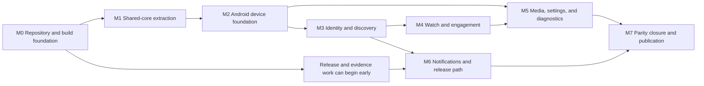

# StreamFusion Mobile implementation roadmap prototype

Status: Awaiting approval in [Approve the StreamFusion Mobile implementation milestone and ticket graph](https://github.com/TheDarkSkyXD/StreamFusion/issues/121)

Source specification: commit `b9d1255`

Machine-readable graph: [implementation-ticket-graph.prototype.json](./implementation-ticket-graph.prototype.json)

## What this prototype decides

This prototype proposes eight GitHub milestones and 59 implementation tickets. It does not create those tickets. The graph becomes the publication source only after the user approves its granularity and blocker edges.

The first 15 tickets are controlled repository and shared-core migration work. The remaining tickets are Android tracer bullets, verification work, or Publisher tasks. A tracer bullet must end in behavior that can be exercised through the real application and indexed in the evidence catalog.

Draft IDs such as `F01` and `W03` are graph identifiers, not GitHub issue numbers.

## Publication model after approval

Approval will create:

- one implementation epic outside the planning-only Wayfinder map;
- eight GitHub milestones matching this document;
- one issue per graph ticket, created in dependency order;
- native GitHub blocking edges matching every `blockedBy` entry;
- sub-issue links from the implementation epic, not from the Wayfinder map;
- `ready-for-agent` on agent-executable tickets and `ready-for-human` on `R01` and `P03`;
- no assignee until a session claims a frontier ticket.

Every published issue will contain its parent epic, user-visible outcome or migration proof, capability IDs, code owners, acceptance criteria, evidence requirements, failure containment, and blockers. Issue bodies will avoid fixed implementation paths so the graph can survive code movement.

## Milestone flow

Milestones communicate review and release gates. Tickets inside them may run concurrently only when their explicit blockers are closed.

## Milestone exits

| Milestone                           | Tickets | Exit condition                                                                                                                                                                                                                             |
| ----------------------------------- | ------: | ------------------------------------------------------------------------------------------------------------------------------------------------------------------------------------------------------------------------------------------ |
| M0 Repository and build foundation  |       5 | Desktop and Worker use one lockfile, the empty Android development APK installs on API 30, the empty Relay passes a deployment dry run, core boundaries reject forbidden imports, and the verifier accepts a valid empty evidence catalog. |
| M1 Shared-core extraction           |      10 | The extraction-complete predicate passes with Desktop behavior unchanged, shared adapter contracts green, and zero compatibility re-exports or boundary exceptions.                                                                        |
| M2 Android device foundation        |       6 | The real Android shell launches, stores and restores encrypted device state, routes Activity links, measures the device, and proves degradation behavior on API 30.                                                                        |
| M3 Identity and discovery           |       8 | Twitch and Kick accounts, relay identity, direct and signed-out reads, Home, Search, Categories, Channel Detail, Following, and Guest Follows work end to end.                                                                             |
| M4 Watch and engagement             |      11 | Live, Video, Clip, chat, moderation, History, Multistream, PiP, playback filtering, and connectivity outcomes have current device and live-Platform evidence.                                                                              |
| M5 Media, settings, and diagnostics |       9 | Media Jobs recover correctly, downloads, recording, and captions meet device limits, and all 17 Settings panels plus all six Diagnostics tabs work.                                                                                        |
| M6 Notifications and release path   |       7 | Direct FCM passes scale and lifecycle tests, the updater validates an exact signed APK, four gates run, signing recovery is current, and promotion produces an immutable Release Set.                                                      |
| M7 Parity closure and publication   |       3 | All 24 capabilities and 40 tab states have fresh evidence, the same candidate passes twice, and the Publisher releases the exact approved APK.                                                                                             |

## M0: repository and build foundation

| ID  | Ticket                                                      | Blocked by | Primary owner | What it delivers                                                                                                                      |
| --- | ----------------------------------------------------------- | ---------- | ------------- | ------------------------------------------------------------------------------------------------------------------------------------- |
| F01 | Unify the repository workspace and lockfile                 | None       | Repository    | One root npm installation graph while Desktop packaging and Worker behavior remain green.                                             |
| F02 | Create the shared-core public boundary                      | F01        | Core          | Explicit core exports, project references, contract testing, and import enforcement before production behavior moves.                 |
| F03 | Create the Android Expo development-client build path       | F01        | Mobile        | Android-only Expo development APKs with a separate development identity and custom native-module support.                             |
| F04 | Create the evidence catalog and verifier foundation         | F01        | Verification  | A versioned capability evidence schema, resumable verifier, retention metadata, and redaction proof.                                  |
| F05 | Create the Integration Relay build and environment boundary | F02        | Relay         | A separate Relay workspace and Cloudflare deployment boundary with shared envelopes, isolated environments, and no product endpoints. |

After `F01`, `F02`, `F03`, and `F04` open. `F05` opens as soon as `F02` closes and may run during shared-core extraction. No Android product behavior starts in this milestone.

## M1: shared-core extraction

| ID  | Ticket                                                      | Blocked by | Primary owner         | What it delivers                                                                                                             |
| --- | ----------------------------------------------------------- | ---------- | --------------------- | ---------------------------------------------------------------------------------------------------------------------------- |
| C01 | Extract Platform identity and reliability foundations       | F02        | Core                  | Platform, ChannelRef, stable identifiers, portable results, errors, retries, and narrow migration re-exports.                |
| C02 | Extract normalized content and chat contracts               | C01        | Core                  | Serialization-safe Stream, Channel, Category, Video, Clip, and chat contracts without provider or IPC leakage.               |
| C03 | Extract discovery rules and use cases                       | C02        | Core                  | Portable search validation, ranking, deduplication, pagination, and progressive discovery behavior.                          |
| C04 | Migrate top-stream discovery through IPlatformReader        | C03        | Core and Desktop      | Desktop Home proves the reader port and explicit composition through one working vertical slice.                             |
| C05 | Migrate Search, Channels, and Categories through core ports | C04        | Core and Desktop      | Desktop discovery callers and both Platform adapters move without behavior change.                                           |
| C06 | Migrate Videos and Clips through core ports                 | C04        | Core and Desktop      | Recorded-content discovery moves while playback and provider transports remain app-owned.                                    |
| C07 | Migrate follows and Guest Follow policy through core        | C05        | Core and Desktop      | Portable follow policy drives Desktop Following while provider writes remain adapter-owned.                                  |
| C08 | Extract OAuth2Session semantics and migrate Desktop auth    | C02        | Core, Desktop, Worker | Shared session behavior with Desktop credential, scheduler, endpoint, and Worker adapters.                                   |
| C09 | Extract chat and Live Notification policy                   | C07, C08   | Core and Desktop      | ChatConnection, normalized events, send eligibility, and alert policy with Desktop sockets and presentation unchanged.       |
| C10 | Close the Desktop migration and open Android feature work   | C06, C09   | Core and Desktop      | All callers use public exports, all migration shims are deleted, Desktop verification passes, and the extraction gate opens. |

This is an expand-and-contract sequence. `C01` expands the system with the new forms. `C04` through `C09` migrate callers in green batches. `C10` contracts the old forms only after every batch passes.

## M2: Android device foundation

| ID  | Ticket                                                   | Blocked by    | Primary owner                  | What it delivers                                                                                                               |
| --- | -------------------------------------------------------- | ------------- | ------------------------------ | ------------------------------------------------------------------------------------------------------------------------------ |
| B01 | Compose the Mobile runtime and enforce its layers        | C10, F03      | Mobile                         | One composition root and enforced UI, transport, domain, adapter, persistence, native, and test boundaries.                    |
| B02 | Deliver the adaptive five-destination Android shell      | B01           | Mobile                         | Search, Following, Watch, Activity, More, independent histories, adaptive rail, Dark Theater primitives, and review selectors. |
| B03 | Deliver encrypted Product and Cache Stores               | B01           | Mobile                         | Product Store, Cache Store, SecureStore, migrations, quarantine, recovery, eviction, and backup exclusion.                     |
| B04 | Deliver Activity, deep links, and lifecycle restoration  | B02, B03      | Mobile and Core                | Durable Activity Items, deduplication, read state, nested routing, and explicit process-death restoration without push.        |
| B05 | Create the typed Android capability-module boundary      | B01           | Mobile Native                  | Small playback, Media Job, caption, diagnostics, and maintenance module contracts with typed failures.                         |
| B06 | Measure Capability Profile and apply Runtime Degradation | B03, B05, F04 | Mobile Native and Verification | Install qualification, device capacity, visible ordered degradation, hysteresis, and resource evidence.                        |

## M3: identity and discovery

| ID  | Ticket                                                       | Blocked by    | Primary owner       | What it delivers                                                                                                             |
| --- | ------------------------------------------------------------ | ------------- | ------------------- | ---------------------------------------------------------------------------------------------------------------------------- |
| D01 | Deliver Installation Identity and signed capability policy   | B03, F04, F05 | Relay and Mobile    | Rotating installation credentials, relay authorization and abuse controls, and signed monotonic policy with safe expiry.     |
| D02 | Connect and maintain a Twitch account                        | B02, B03      | Mobile              | Accessible Device Code login, validation, atomic refresh rotation, scopes, disconnect, and Accounts state.                   |
| D03 | Connect and maintain a Kick account                          | B02, B03      | Mobile and Worker   | System-browser PKCE, verified App Link, exact Worker callback allowlist, refresh, scopes, disconnect, and Accounts state.    |
| D04 | Deliver direct signed-in and relay signed-out Platform reads | D01           | Mobile and Relay    | Normalized adapters, narrow secret-backed reads, TanStack Query state, bounded cache projections, and Platform isolation.    |
| D05 | Deliver Home and Channel Detail                              | B02, D04      | Mobile              | Home plus Channel Home, Videos, and Clips states with real avatars, thumbnails, Platform state, and cache age.               |
| D06 | Deliver unified Search and local history                     | B02, D04      | Mobile              | Bottom search, typed ten-entry history, filters, imagery, and all six Search tab states.                                     |
| D07 | Deliver Categories and Category Detail                       | B02, D04      | Mobile              | Searchable 3:4 category art and Live Streams, Clips, and Videos states with all approved filters.                            |
| D08 | Deliver Following and Guest Follows                          | D02, D03, D04 | Mobile, Core, Relay | Live-first Following, supported imports, Guest Follows, provider-page actions, local search, preferences, and all five tabs. |

`D01`, `D02`, and `D03` can run in parallel after their separate foundation blockers close. `D04` does not wait for account UI because its direct adapters use test credentials and its signed-out path uses the Relay. `D05`, `D06`, and `D07` can then run in parallel.

## M4: Watch and engagement

| ID  | Ticket                                                             | Blocked by    | Primary owner    | What it delivers                                                                                                         |
| --- | ------------------------------------------------------------------ | ------------- | ---------------- | ------------------------------------------------------------------------------------------------------------------------ |
| W01 | Resolve and watch one live Stream                                  | B06, D05      | Mobile Native    | One focused Twitch or Kick HLS session with compatibility policy, fallback, Info, Related, and failure containment.      |
| W02 | Deliver player controls, movable mini-player, and Android PiP      | B04, W01      | Mobile Native    | Controls, quality, fullscreen, orientation, draggable safe regions, one PiP session, and restoration.                    |
| W03 | Watch Videos and Clips                                             | D06, D07, W01 | Mobile Native    | Recorded Watch routes with seeking, progress, Details, Comments ownership, Related, compatibility state, and deep links. |
| W04 | Deliver typed Watch History                                        | W03           | Mobile           | Durable Stream, Video, and Clip history with imagery, progress, resume, replay, local search, and offline use.           |
| W05 | Deliver Twitch foreground chat                                     | D02, W01      | Mobile           | Visible-only EventSub receive, direct Helix send, eligibility, reconnection, deduplication, and gap state.               |
| W06 | Deliver Kick foreground chat through the relay                     | D03, W01      | Relay and Mobile | Verified webhooks, channel-sharded foreground fanout, direct send, reconnection, deduplication, and no chat history.     |
| W07 | Deliver chat cosmetics and replay                                  | W03, W05, W06 | Mobile           | Emotes, badges, paints, bounded caches, synchronized Comments and replay, and visible source gaps.                       |
| W08 | Deliver managed-channel moderation                                 | W05, W06      | Mobile           | Managed channels, contextual actions, and all eight moderation states with scope and Platform support.                   |
| W09 | Deliver capability-aware Multistream                               | W02           | Mobile Native    | Six retained StreamSlots, measured video capacity, one audio owner, focused chat, degradation, and restoration.          |
| W10 | Deliver playback filtering as an isolated compatibility capability | W01           | Mobile Native    | Narrow filtering adapter, signed policy, canary, kill switch, diagnostics, disclosure, and player-only failure.          |
| W11 | Deliver proxy and connectivity behavior                            | B06, D04      | Mobile           | Proxy configuration, connectivity, cancellation, bounded retry, stale-cache state, Platform isolation, and diagnostics.  |

Chat and Multistream can progress independently once single-stream Watch exists. Every Compatibility Integration has its own evidence and disablement edge.

## M5: media, settings, and diagnostics

| ID  | Ticket                                            | Blocked by    | Primary owner | What it delivers                                                                                                           |
| --- | ------------------------------------------------- | ------------- | ------------- | -------------------------------------------------------------------------------------------------------------------------- |
| M01 | Deliver the recoverable Media Job engine          | B04, B05      | Mobile Native | Durable intent, idempotent commands, checkpoints, native generation, foreground-service ownership, recovery, and Activity. |
| M02 | Download and explicitly export Videos and Clips   | M01, W03      | Mobile Native | Contextual download, progress, resume, retry, cancel, app-private completion, and explicit Android export.                 |
| M03 | Record and recover a live Stream                  | M01, W01      | Mobile Native | Segmented recording, visible Stop, four-hour warning, safe cutoff, and playable partial-artifact recovery.                 |
| M04 | Caption the focused Stream locally                | W01           | Mobile Native | One local English caption session, verified model lifecycle, no audio upload, and resource-aware behavior.                 |
| M05 | Deliver appearance and player Settings            | W09           | Mobile        | Appearance, Playback, Player controls, Buffer, and Multiview panels with durable applied choices.                          |
| M06 | Deliver chat and integration Settings             | W07, W08      | Mobile        | Chat, Predictions, Integrations, and API tokens panels with secure values and applied choices.                             |
| M07 | Deliver notification and network Settings         | D08, W10, W11 | Mobile        | Notifications, Ad blocking, and Proxy panels with Product Store authority, denial recovery, and status.                    |
| M08 | Deliver update, support, and maintenance Settings | M01           | Mobile        | Updates, Diagnostics, Logs, Report a bug, About, account maintenance, and scoped local-data actions.                       |
| M09 | Deliver Android Diagnostics and sanitized reports | M08, W10, W11 | Mobile Native | All six Diagnostics tabs, Capability Profile, degradation causes, redacted reports, and safe recovery actions.             |

`M05` through `M08` divide the 17 Settings panels into coherent groups of 5, 4, 3, and 5. The panels ship with real persistence and behavior, not inert placeholders.

## M6: notifications and release path

| ID  | Ticket                                                                   | Blocked by | Primary owner    | What it delivers                                                                                                                             |
| --- | ------------------------------------------------------------------------ | ---------- | ---------------- | -------------------------------------------------------------------------------------------------------------------------------------------- |
| N01 | Register native FCM delivery and present notifications                   | B04, M07   | Mobile and Relay | In-context permission, native token rotation, three channels, safe payloads, Activity reconciliation, and current-data routing.              |
| N02 | Deliver scalable topic and direct-token fanout                           | N01        | Relay            | Versioned projection reconciliation, topics, one-mode events, private direct sends, topic overflow, retries, and token retirement.           |
| N03 | Prove notification scale and lifecycle recovery                          | N02        | Verification     | Repeatable 100,000-recipient dispatch plus simultaneous event, retry, credential, reinstall, ended Stream, offline, and force-stop evidence. |
| R01 | Establish production identity, EAS build authority, and signing recovery | F03, F04   | Publisher        | Production and development identities, StreamFusion Expo ownership, committed versions, controlled build start, backups, and recovery drill. |
| R02 | Deliver the signed GitHub APK updater                                    | M08, R01   | Mobile Native    | Stable-release checks, validated metadata, resumable APK download, digest and signer proof, PackageInstaller handoff, and cleanup.           |
| R03 | Automate the four Android verification gates                             | B02, F04   | Verification     | Change, Main, Candidate, and Public Release gates with emulator, physical, live, accessibility, performance, security, and freshness policy. |
| R04 | Promote one exact APK into an immutable Android Release Set              | R02, R03   | Release          | Protected promotion, EAS provenance, signed manifest, SBOM, matched immutable files, metadata withdrawal, and forward-fix rehearsal.         |

`R01` is a human-owned frontier task once its blockers close. Gate automation starts well before feature completion, then every feature ticket adds its evidence rather than building a second testing path near release.

## M7: parity closure and publication

| ID  | Ticket                                   | Blocked by                       | Primary owner                      | What it delivers                                                                                                                                                     |
| --- | ---------------------------------------- | -------------------------------- | ---------------------------------- | -------------------------------------------------------------------------------------------------------------------------------------------------------------------- |
| P01 | Close every Android parity record        | Every capability delivery ticket | Verification and capability owners | All 24 current capabilities, all 17 Settings panels, and all 40 tab states have current evidence with no blocker, exception, or quarantine.                          |
| P02 | Pass the complete Candidate Gate twice   | P01, R04                         | Verification                       | Two clean runs for the same candidate across five physical roles, emulators, live Platforms, lifecycle, accessibility, performance, security, install, and recovery. |
| P03 | Publish the first Public Android Release | P02                              | Publisher                          | Independent review, capability approvals, Publisher approval, current recovery, exact digest match, and immutable public GitHub release.                             |

## Capability ownership audit

| Desktop capability                   | Delivery owner tickets            |
| ------------------------------------ | --------------------------------- |
| `home-live-discovery`                | C03, C04, C05, D04, D05           |
| `followed-streams-and-sync`          | C07, D04, D08                     |
| `category-discovery`                 | C03, C05, D04, D07                |
| `search`                             | C03, C05, C06, D04, D06           |
| `platform-account-auth`              | C08, D02, D03                     |
| `live-playback`                      | W01                               |
| `vod-and-clip-playback`              | C06, W03                          |
| `player-controls-and-pip`            | W02                               |
| `stream-recording`                   | M01, M03                          |
| `local-captions`                     | M04                               |
| `ad-blocking`                        | W10, M07                          |
| `live-chat`                          | C09, W05, W06                     |
| `emotes-and-cosmetics`               | C09, W07                          |
| `chat-replay`                        | W07                               |
| `moderation`                         | W08                               |
| `multistream`                        | B06, W09, M05                     |
| `watch-history`                      | W04                               |
| `downloads`                          | M01, M02                          |
| `general-chat-and-theme-preferences` | M05, M06, M07, M08                |
| `proxy-and-connectivity`             | W11, M07                          |
| `notifications`                      | C09, B04, D08, M07, N01, N02, N03 |
| `app-updates`                        | M08, R01, R02, R04                |
| `diagnostics-logs-and-bug-reports`   | B06, M08, M09                     |
| `app-shell-and-navigation`           | B02, B04                          |

The final parity owner is `P01` for every row. The tickets above own delivery and evidence generation.

## Screen-state ownership audit

| Review surface  | States | Owner tickets                                         |
| --------------- | -----: | ----------------------------------------------------- |
| Search          |      6 | D06                                                   |
| Following       |      5 | D08                                                   |
| Category Detail |      3 | D07                                                   |
| Channel Detail  |      3 | D05                                                   |
| Watch           |      3 | W01, W05, W06                                         |
| Video or Clip   |      3 | W03, W07                                              |
| Activity        |      3 | B04, M01, N01                                         |
| Moderation      |      8 | W08                                                   |
| Diagnostics     |      6 | M09                                                   |
| Total           |     40 | P01 verifies every state against the exact candidate. |

## Acceptance contract for every published ticket

Every implementation issue must satisfy these rules in addition to its own acceptance criteria:

1. Name each affected Desktop capability ID and update its Android Parity Record.
2. State the owning layer and concrete adapter boundary. UI cannot import providers, persistence, native modules, or relay internals.
3. Finish with a user-visible journey or a deterministic migration proof. Code existence is not completion.
4. Run the Change Gate and index its evidence with source commit, artifact identity, environment, tool version, timestamp, and expiry.
5. Add adapter contract, emulator, physical, live-Platform, accessibility, performance, security, or recovery evidence when the graph requires it.
6. Define failure containment and the safe retry, fallback, disablement, rollback, or forward-fix path.
7. Leave no untracked architecture exception, quarantined required test, or Development Exception.

## Review questions

Before these become real GitHub implementation issues, the user must decide:

1. Is 59 tickets the right granularity for work that must fit one fresh agent context each?
2. Are the blocker edges strict enough without serializing work that can safely run in parallel?
3. Should any named tickets be merged, split, or moved to another milestone?

Approval publishes the graph. It does not start implementation, assign agents, or publish an APK.
