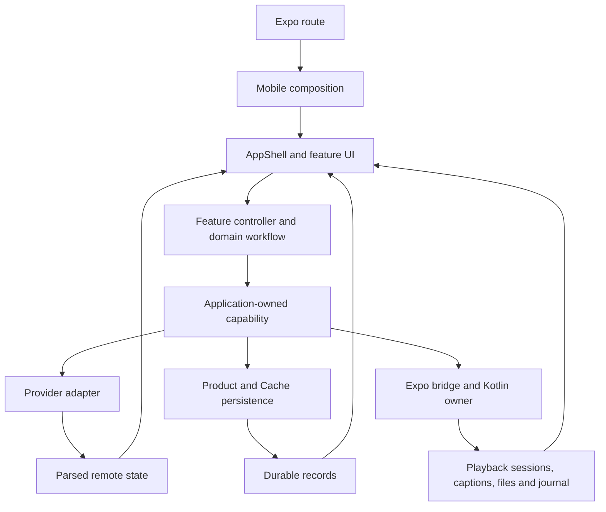

# Mobile UI grounding synthesis

## Overview

This read-only explanation covers the mobile UI at `8ec1636eda26a4c21d2bab593c7b98ad99df8ab6`. The approved capture manifest contains 160 stories at 412 x 892. The three explorer reports identify reachable production owners, fixture-only proposals, and layout differences. They do not establish emulator behavior or pixel parity.

The integration task is to give those approved layouts real state and actions while retaining working playback, authentication, persistence, and provider authorization. Shared controls already exist under `apps/mobile/src/design`. Several production screens still use inline equivalents. Copying whole preview screens would introduce fixture players, invented provider records, and local success notices into working workflows.

## Key concepts

- `AppShell` owns the five destinations, nested navigation, restoration, header, safe areas, and primary navigation. Expo route modules enter `mobile-runtime.tsx`, which constructs implementations and injects them into screens and controllers.
- TanStack Query owns remote request state. Product Store owns durable account records, guest follows, preferences, history, media snapshots, and Activity. Cache Store owns disposable provider results. Zustand owns presentation state. Native Android owns recoverable media files, journal, and foreground work. New UI should project those owners rather than duplicate their state.
- Feature `domain` code owns workflow decisions. `capabilities` defines application-owned ports. Provider and native adapters implement those ports. Persistence implementations belong in `data`. `composition` connects them. Runtime calls reach adapters through injected ports. Source imports must keep domain and capabilities independent of implementations.
- Native contracts provide real playback version 4, media jobs version 3, and captions version 3. Diagnostics version 3 measures resource facts. Maintenance version 1 remains a stub. Measured device facts do not qualify multistream capacity.

## How it works

Discovery and Following select direct Twitch/Kick reads or installation relay reads, hydrate remote content, and preserve guest membership in Product Store. Accounts use real OAuth controller phases, including pending device code, validation, expiry, and refresh. Settings persist through `session.apply`. Approved layouts must preserve those transitions and immediate persistence rather than add preview-local connection or Save behavior.

Watch resolves the selected live, VOD, or clip source and starts a focused native Media3 or Expo session. Quality, volume, seek, playback, fullscreen, mini-player, chat, captions, and media actions already have production paths. `startWatchMediaJob` resolves a real source URI and request headers before submitting the media intent. Diagnostic fixture starters are a separate path. Media workflow applies core commands, calls the native port, reconciles journal and artifacts, and projects Product Store and Activity records.

Moderation is also a real production workflow. `more/moderation` renders `ModWorkspace`; composition supplies authenticated moderation and engagement controllers. Controllers check role, operation scopes, current account generation, and channel revision. Chat handles authenticated send, emotes, reply, and user actions. Twitch broadcaster poll and prediction management exists. Viewer participation and unsupported Kick tools use provider handoff.

The required work falls into two kinds. Existing outcomes need approved component composition. Missing outcomes need an actual port, adapter, state model, and reachable UI before their preview can claim success.

| Area | Required integration and falsifiable checkpoint |
| --- | --- |
| Shell and discovery | Match selected navigation wells, headers, cards, and channel action layout. Mount the existing guest-follow Add form with real mutation and refresh. Implement the two generic search/follow preview routes. A new guest follow must survive restart, and every preview must show its actual channel rather than `SAVED PLACE`. |
| Settings and accounts | Replace equivalent inline controls with shared rows, fields, buttons, and sheets without removing real constraints or services. A preference must survive restart. Account screenshots must correspond to controller phases, and Connect must begin OAuth rather than set a local Boolean. |
| Watch and chat | Replace the bespoke quality/volume modal and inline emote/user controls with shared sheets. Preserve auto-hide, fullscreen insets, seek, focus, and player mount. A quality or volume change must reach the active player. Chat sends must produce transport results. Keyboard opening must keep the composer and sheet actions reachable. |
| Player tools | Speed and video stats lack production contracts. Extend the playback port, TypeScript bridge, Kotlin owner, and host capability result. Recorded-media speed must change observed playback. Stats must come from the current native session, never sample decoder values. |
| Library and Activity | Add stable media display metadata and migration, real search/filters, measured transfer speed and ETA where supported, truthful offline state, and approved rows. Existing snapshots must remain readable. Recovery Keep must produce a playable retained artifact. A duplicate download needs a distinct job and file policy before the dialog can promise a second copy. |
| Captions | Make model management reachable outside Diagnostics. The pinned English model is 39.30 MiB. Progress and Cancel need native events and a cancellation operation if those approved states remain required. Actual captions must follow only the focused session and stop under native resource pressure. |
| Multistream | Render actual player tiles in the approved grid and move Add/audio-owner controls into shared sheets. Preserve add validation, cap, mute-before-unmute, chat identity, removal confirmation, and close-on-exit. Post-start constrained-device recovery needs continuous observation and policy. Admission alone does not prove it. |
| Moderation and engagement | Keep working reads/writes and scope checks. Add live AutoMod feeds, local mod-log/history with coverage, channel tools, panel gateways, and raid pending/cancel state for currently missing screens. Permission failure, disconnection, and successful empty results must remain distinct. Unsupported Kick tools and viewer poll/prediction actions must explain and open a real handoff. |

The 160-story acceptance ledger should record story ID, reachable route, state owner, command, and observed result. Component stories need integration and interaction evidence where applicable. Each screen needs an emulator screenshot paired with its approved capture at the same content viewport and state. Record differences and fixes rather than infer parity from shared tokens or passing tests.

Actual Android proof must use a rebuilt native client for changed native contracts. It must exercise keyboard and safe areas, rotation/fullscreen, background/return, offline files, job recovery, and restart persistence. Provider artwork and live text can differ, but their containers, spacing, typography, and controls still need comparison. Relaunch after installation or native changes. Close the emulator and task-owned runtime processes when testing is idle, as requested. None of those runtime checks occurred during this grounding pass.

## Where things live

- `apps/mobile/app/` enters `apps/mobile/src/composition/mobile-runtime.tsx`.
- `apps/mobile/src/features/shell/components/app-shell.tsx` registers reachable workspaces.
- `apps/mobile/src/features/design-preview/components/` holds approved fixture compositions. `apps/mobile/src/design/` holds reusable production controls.
- `apps/mobile/src/features/watch/`, `chat/`, `multistream/`, `media-jobs/`, `media-library/`, and `activity/` own playback and saved-media workflows.
- `apps/mobile/src/features/discovery/`, `follows/`, `auth/`, `settings/`, and `diagnostics/` own browsing and application services.
- `apps/mobile/src/features/moderation/` and `engagement/` own provider tools. `native-contracts/` owns typed native ports and adapters. `apps/mobile/modules/streamfusion-native-contracts/android/` owns Kotlin implementations.
- `packages/core/src/features/` provides portable contracts and workflows through public subpaths. Feature tests remain with their owners. `apps/mobile/CONTEXT.md` describes state and host boundaries.
- `E:/Codex/artifacts/streamfusion-mobile-mockups-2026-10-05/manifest.json` identifies the 160 capture targets. The sibling grounding reports supply story-level source findings.

## Gotchas

The media report's statement that moderation remains a placeholder is stale. The provider-tools report and exact-base source confirm `ModWorkspace`. The obsolete Storybook moderation placeholder still needs correction. Watch download/recording is not fixture-backed; its separate Diagnostics starters do use fixtures.

Preview navigation says a rail begins at 840 dp, but the code switches at 600 dp. Preview system chrome is synthetic. Normalize Android status and navigation insets before comparisons. Settings and Diagnostics previews also omit production detail, so parity cannot justify dropping working controls.

Kick retention is not a supported provider setting in the inspected path. Desktop retention changes the local StreamFusion mod log. Live provider feeds cover events since connection. They cannot claim complete historical activity. Cancellation after a submitted provider mutation does not undo that mutation.

Expo Go cannot prove native PCM captions, system PiP, custom playlist interception, or SQLCipher behavior. Playback speed and stats need explicit native and fallback capability handling. Desktop implementations provide contract precedent, but mobile must not import privileged desktop code.

Boundary Discipline shaped the integration map by keeping parsing and provider/native failure handling in adapters. Type System Discipline requires operation-specific state and failures rather than fixture success flags. How, Universal Architecture, Technical Writing, and Unslop shaped this explanation. No repository source was changed.
